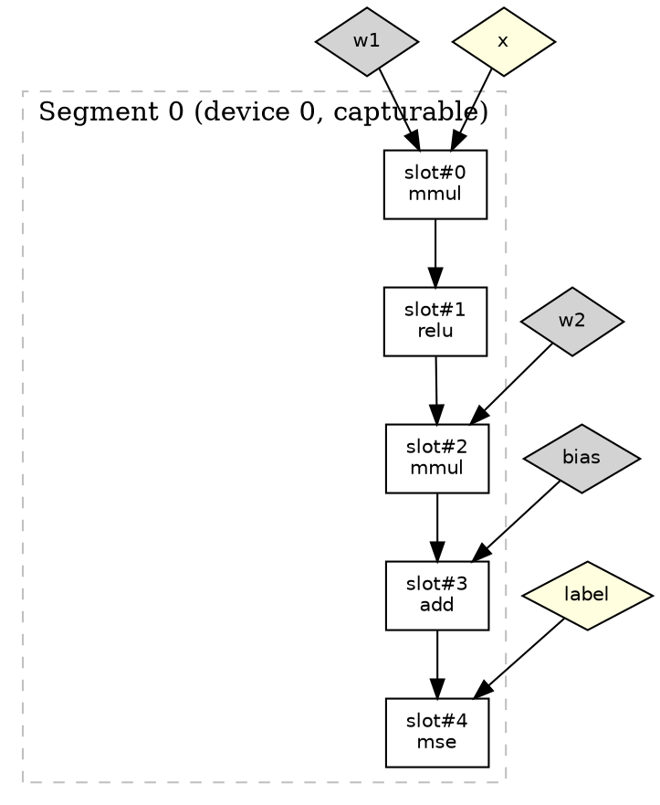

# ADR: DynamicShapePlan (DSP) Execution

## Status

Implemented and actively maintained.

Proposed by: Adam Gibson (January 2025)
Updated by: Runtime maintainers (March 31, 2026)

## Context

In this codebase, **DSP** means **DynamicShapePlan**, not digital signal processing.

SameDiff now has two execution families:

1. Standard interpreted execution (`InferenceSession.executeOperations`)
2. `DynamicShapePlan` (DSP) for graphs whose topology is stable but tensor shapes evolve across calls

The prior static `ExecutionPlan` has been removed. The legacy graph execution infrastructure (`GraphExecutioner`, `GraphHolder`, `ResultWrapper`, `FlowPath`, and all `Logic*` control-flow handler classes) has been deleted and replaced by DSP's segment-driven architecture.

DSP exists to reduce per-step graph overhead for workloads that re-run the same graph many times while shapes change, including:

- autoregressive decode with KV-cache growth,
- variable-length sequence inference,
- repeated inference loops with shape drift,
- training iterations that can reuse graph topology.

## Decision

We standardize on **DynamicShapePlan** as the sole optimized execution architecture for SameDiff.

The design is:

- compile graph wiring once into slot-indexed metadata,
- execute through either a Java executor or a native C++ executor,
- preserve correctness with deterministic fallback to standard execution when DSP is inapplicable or fails.

DSP is not tied to a model family (vision, language, OCR, etc.); it is a general execution strategy for suitable SameDiff graphs.

## Core Concepts: Slots and Segments

### Slots

A **slot** is a per-op descriptor that replaces string-keyed `Map<String, SDValue>` lookups with flat array-indexed access. Each op in the graph becomes exactly one slot. Each slot's outputs get one or more **output slot indices** in a flat `INDArray[]` array shared across the entire plan.

A slot contains:

| Field | Purpose |
|-------|---------|
| `stepIndex` | Position in execution order (0, 1, 2, ...) -- the slot's identity |
| `opName` | Operation name (`"matmul"`, `"add"`, `"relu"`, etc.) |
| `inputSourceIndices` | Wiring array: where each input comes from |
| `inputSourceTypes` | Per-input source type: CONSTANT, VARIABLE, PLACEHOLDER, or OP_OUTPUT |
| `outputSlotIndices` | Which flat indices in the output array this op writes to |
| `iArgs, tArgs, bArgs, dArgs` | Frozen op arguments (dimensions, scalars, booleans, dtypes) |
| `needsZeroedOutput` | Whether the output buffer must be zeroed before execution |
| `isDataDependent` | True for ops with variable-length output (where, unique) |
| `outputShapeDependsOnInputValues` | True for reshape/gather/tile (shape depends on tensor values) |
| `targetDeviceId` | Device placement (-1 = default, 0+ = specific GPU) |

#### Input Wiring Encoding

Each slot's `inputSourceIndices` array encodes where to fetch inputs using a sign convention:

- **`>= 0`**: input comes from a prior slot's output. `inputSourceIndices[i] = 5` means "read `outputSlots[5]`".
- **`< 0`**: input comes from an external input (constant, variable, or placeholder). Decoded as `-(index + 1)`. So `inputSourceIndices[i] = -3` means "read `externalInputs[2]`".

#### Output Slot Numbering

Output slot indices are assigned sequentially across all ops. If an op has multiple outputs (e.g., `split` producing two tensors), it gets multiple consecutive output slot indices:

```
Op#0 [embedding_lookup]  → outputSlotIndices = [0]       (1 output)
Op#1 [split]             → outputSlotIndices = [1, 2]    (2 outputs)
Op#2 [sum]               → outputSlotIndices = [3]       (1 output)
Op#3 [sum]               → outputSlotIndices = [4]       (1 output)

Total: INDArray[5] flat output array
```

#### Worked Example: matmul + add + relu

Given this SameDiff graph:

```java
SDVariable x = sd.placeHolder("x", DataType.FLOAT, 1, 4);
SDVariable w = sd.constant("w", Nd4j.randn(4, 8));
SDVariable b = sd.constant("b", Nd4j.randn(1, 8));
SDVariable mm = sd.mmul("mm", x, w);
SDVariable added = mm.add("added", b);
SDVariable out = sd.nn.relu("out", added, 0);
```

Compilation produces:

```
External Inputs:
  ext#0: "x"  (PLACEHOLDER)
  ext#1: "w"  (CONSTANT)
  ext#2: "b"  (CONSTANT)

Slot#0 [mmul]
  inputSourceIndices: [-1, -2]           → ext#0 (x), ext#1 (w)
  inputSourceTypes:   [PLACEHOLDER, CONSTANT]
  outputSlotIndices:  [0]
  needsZeroedOutput:  false              (fully-writing op)

Slot#1 [add]
  inputSourceIndices: [0, -3]            → slot#0 (mmul output), ext#2 (b)
  inputSourceTypes:   [OP_OUTPUT, CONSTANT]
  outputSlotIndices:  [1]
  needsZeroedOutput:  false

Slot#2 [relu]
  inputSourceIndices: [1]                → slot#1 (add output)
  inputSourceTypes:   [OP_OUTPUT]
  outputSlotIndices:  [2]
  needsZeroedOutput:  false

Output Mapping: "out" → slot#2
Release Schedule:
  After step 1: release slot#0  (mmul output consumed by add, no longer needed)
  After step 2: (slot#2 is a requested output, kept for caller)
```

At execution time, the executor allocates `INDArray[3]` and fills it slot by slot -- no string lookups, no hash maps.

### Segments

A **segment** is a contiguous run of consecutive slots that share the same properties and can be executed together as a unit. Segments are the dispatch granularity for backend compilation.

Segment boundaries are inserted when consecutive slots differ in:

1. **Target device**: slot N is on GPU 0, slot N+1 is on GPU 1.
2. **Capturability**: slot N is capturable (eligible for CUDA graph capture), slot N+1 is not (or vice versa).

A slot is **capturable** if:

- it has no control flow (`controlFlowType == CF_NONE`),
- it is not data-dependent (`isDataDependent == false`),
- its output shape does not depend on input values (`outputShapeDependsOnInputValues == false`).

Non-capturable ops include `where()`, `unique()`, `reshape(dynamicShape)`, `gather(dynamicIndices)`, `concat` along KV cache dimension, and all control-flow ops. These are always executed slot-by-slot.

#### Execution Strategy Per Segment

| Segment type | Strategy |
|-------------|----------|
| Capturable segment | First execution: warm-up slot-by-slot. Second: attempt CUDA graph capture (or Triton/NVRTC/PTX compilation). Third+: replay captured graph or compiled kernel. |
| Non-capturable segment | Always slot-by-slot. Shape re-inferred every step. |

#### Shape Keys and Segment Caching

Each segment has a **shape key** (FNV-1a hash of segment bounds + input shapes/dtypes from external inputs and pre-segment sources). When the shape key matches a previous execution, the cached compiled kernel or captured graph is reused. When it changes (e.g., KV cache length grows), the segment is recompiled or re-captured.

#### Worked Example: Transformer Decoder Layer

Consider a simplified transformer decoder with KV cache concat:

```
Slot#0  [embedding_lookup]    capturable=YES   device=0
Slot#1  [rotary_embedding]    capturable=YES   device=0
Slot#2  [qkv_projection]     capturable=YES   device=0
Slot#3  [concat_past_k]      capturable=NO    device=0   (value-dependent shape)
Slot#4  [concat_past_v]      capturable=NO    device=0   (value-dependent shape)
Slot#5  [attention]           capturable=YES   device=0
Slot#6  [output_projection]  capturable=YES   device=0
Slot#7  [residual_add]       capturable=YES   device=0
```

Segment boundaries occur at capturability transitions:

```
Segment#0: slots [0-2]  capturable=YES
  → embedding_lookup, rotary_embedding, qkv_projection
  → First run: slot-by-slot. Then: CUDA graph capture → replay.

Segment#1: slots [3-4]  capturable=NO
  → concat_past_k, concat_past_v
  → Always slot-by-slot (KV length changes every decode step).

Segment#2: slots [5-7]  capturable=YES
  → attention, output_projection, residual_add
  → First run: slot-by-slot. Then: CUDA graph capture → replay.
```

In a real VLM model (e.g., SmolDocling), there are ~3800 slots grouped into ~40-60 segments. Capturable segments cover ~95% of ops and replay via CUDA graphs at ~20ms/token. Non-capturable segments (KV concat, dynamic reshapes) execute slot-by-slot with minimal overhead because they are small.

#### Multi-GPU Segments

When device placement assigns different slots to different GPUs, additional segment boundaries are inserted:

```
Slot#0-#499:   device=0  capturable=YES  → Segment#0 (GPU 0)
Slot#500-#999: device=1  capturable=YES  → Segment#1 (GPU 1)
```

Each segment's compiled kernel or captured graph runs on its assigned device. Cross-segment data transfers happen at segment boundaries.

#### Release Schedule and Memory

The precomputed `releaseAtStep` schedule tells the executor when to null out output slots:

```
After step 2:  release slot#0    (embedding output consumed, free memory)
After step 4:  release slot#1    (rotary output consumed)
After step 6:  release slot#3,4  (concat outputs consumed by attention)
...
```

This enables eager memory reclamation within segments -- intermediates are freed as soon as their last consumer finishes, not at end-of-graph.

#### Shape Instability Handling

~~Adaptive segment splitting has been removed.~~ Segments with changing shape keys simply recompile via the shape key cache on each execution. The compile-time classification (`VALUE_DEPENDENT_SHAPE_OPS`) already prevents capturable segments from containing ops with unstable output shapes. If a capturable segment's shape key changes, it re-captures or recompiles — no physical splitting needed.

### End-to-End Visualization: SameDiff Graph to Execution

This section traces a single graph through every stage of the DSP pipeline: SameDiff construction, plan compilation, slot wiring, segment grouping, and runtime execution.

#### Stage 1: SameDiff Graph Construction

The user builds a graph using SameDiff's API. Variables are string-named. Ops connect variables by name.

```java
SameDiff sd = SameDiff.create();

// Inputs
SDVariable x     = sd.placeHolder("x", FLOAT, -1, 4);        // batch × 4
SDVariable w1    = sd.constant("w1", Nd4j.randn(4, 8));       // 4 × 8
SDVariable w2    = sd.constant("w2", Nd4j.randn(8, 3));       // 8 × 3
SDVariable bias  = sd.constant("bias", Nd4j.randn(1, 3));     // 1 × 3
SDVariable label = sd.placeHolder("label", FLOAT, -1, 3);     // batch × 3

// Forward pass
SDVariable hidden = sd.mmul("hidden", x, w1);                 // batch × 8
SDVariable act    = sd.nn.relu("act", hidden, 0);             // batch × 8
SDVariable logits = sd.mmul("logits", act, w2);               // batch × 3
SDVariable out    = logits.add("out", bias);                   // batch × 3
SDVariable loss   = sd.loss.meanSquaredError("loss", label, out, null);
```

At this point, the graph is a set of named variables connected by ops. Internally SameDiff stores these as string-keyed maps:

```
Variables (by name):
  "x"      → placeholder [?, 4]
  "w1"     → constant [4, 8]
  "w2"     → constant [8, 3]
  "bias"   → constant [1, 3]
  "label"  → placeholder [?, 3]
  "hidden" → op output (mmul)
  "act"    → op output (relu)
  "logits" → op output (mmul)
  "out"    → op output (add)
  "loss"   → op output (mse)

Ops (execution order from ForwardExecutionDAG):
  mmul(x, w1)           → hidden
  relu(hidden)          → act
  mmul(act, w2)         → logits
  add(logits, bias)     → out
  mse(label, out)       → loss
```

#### Stage 2: DynamicShapePlanCompiler — External Index Assignment

The compiler first separates **external inputs** (constants, variables, placeholders) from **op outputs**. External inputs get sequential indices:

```
External Input Index Assignment:
  ext#0: "w1"     (CONSTANT)     ← constants first
  ext#1: "w2"     (CONSTANT)
  ext#2: "bias"   (CONSTANT)
  ext#3: "x"      (PLACEHOLDER)  ← then placeholders
  ext#4: "label"  (PLACEHOLDER)

externalInputKeys = ["w1", "w2", "bias", "x", "label"]
```

At execution time, the executor populates `INDArray[] externalInputs` with these arrays in this order.

#### Stage 3: DynamicShapePlanCompiler — Slot Creation and Wiring

Each op becomes a slot. Each op output gets a sequential **output slot index** in a flat array. The compiler resolves each input to either a prior output slot (positive) or an external input (negative, encoded as `-(extIdx + 1)`):

```
Output Slot Index Assignment:
  "hidden" → output slot 0    (from mmul op)
  "act"    → output slot 1    (from relu op)
  "logits" → output slot 2    (from mmul op)
  "out"    → output slot 3    (from add op)
  "loss"   → output slot 4    (from mse op)

totalOutputSlots = 5
Runtime array: INDArray[5] outputSlots
```

Now each slot is wired:

```
Slot#0 [mmul] "hidden"
  inputSourceIndices: [-4, -1]
    -4 → -(3+1) → ext#3 = "x"  (PLACEHOLDER)
    -1 → -(0+1) → ext#0 = "w1" (CONSTANT)
  outputSlotIndices:  [0]
  needsZeroedOutput:  false     (mmul is fully-writing)

Slot#1 [relu] "act"
  inputSourceIndices: [0]
     0 → output slot 0 = "hidden" (OP_OUTPUT from Slot#0)
  outputSlotIndices:  [1]
  needsZeroedOutput:  false     (relu is fully-writing)

Slot#2 [mmul] "logits"
  inputSourceIndices: [1, -2]
     1 → output slot 1 = "act"  (OP_OUTPUT from Slot#1)
    -2 → -(1+1) → ext#1 = "w2" (CONSTANT)
  outputSlotIndices:  [2]
  needsZeroedOutput:  false

Slot#3 [add] "out"
  inputSourceIndices: [2, -3]
     2 → output slot 2 = "logits" (OP_OUTPUT from Slot#2)
    -3 → -(2+1) → ext#2 = "bias"  (CONSTANT)
  outputSlotIndices:  [3]
  needsZeroedOutput:  false

Slot#4 [mse] "loss"
  inputSourceIndices: [-5, 3]
    -5 → -(4+1) → ext#4 = "label" (PLACEHOLDER)
     3 → output slot 3 = "out"     (OP_OUTPUT from Slot#3)
  outputSlotIndices:  [4]
  needsZeroedOutput:  false
```

#### Stage 4: Liveness Analysis and Release Schedule

The compiler tracks the **last consumer step** for each output slot:

```
Output slot 0 ("hidden"): last consumed at step 1 (Slot#1 relu)
Output slot 1 ("act"):    last consumed at step 2 (Slot#2 mmul)
Output slot 2 ("logits"): last consumed at step 3 (Slot#3 add)
Output slot 3 ("out"):    last consumed at step 4 (Slot#4 mse)
Output slot 4 ("loss"):   requested output — never released
```

This produces the release schedule:

```
releaseAtStep[0] = []           // after Slot#0: nothing freed yet
releaseAtStep[1] = [0]          // after Slot#1: free "hidden" (slot 0)
releaseAtStep[2] = [1]          // after Slot#2: free "act" (slot 1)
releaseAtStep[3] = [2]          // after Slot#3: free "logits" (slot 2)
releaseAtStep[4] = [3]          // after Slot#4: free "out" (slot 3)
                                // slot 4 ("loss") kept for caller
```

Memory timeline (peak = 2 live slots at any point):

```
Step  Action          Live slots           Memory
 0    alloc slot#0    {0}                  ████
 1    alloc slot#1    {0,1}               ████████  ← peak
      free  slot#0    {1}                  ████
 2    alloc slot#2    {1,2}               ████████  ← peak
      free  slot#1    {2}                  ████
 3    alloc slot#3    {2,3}               ████████  ← peak
      free  slot#2    {3}                  ████
 4    alloc slot#4    {3,4}               ████████  ← peak
      free  slot#3    {4}                  ████
                                           (slot#4 returned to caller)
```

#### Stage 5: Dependency Graph

```
predecessors[0] = []        // Slot#0 has no op predecessors (externals only)
predecessors[1] = [0]       // Slot#1 depends on Slot#0
predecessors[2] = [1]       // Slot#2 depends on Slot#1
predecessors[3] = [2]       // Slot#3 depends on Slot#2
predecessors[4] = [3]       // Slot#4 depends on Slot#3

rootSlots = [0]             // Entry point: Slot#0 (no predecessors)
```

This is a simple linear chain. In a real model with residual connections, the dependency graph would be a DAG with multiple roots and parallel branches.

#### Stage 6: Segment Grouping

All five slots are on the same device and all are capturable (no data-dependent or value-dependent ops), so they form a single segment:

```
Segment#0: slots [0..4], capturable=YES, device=0
  ops: [mmul, relu, mmul, add, mse]
```

**Contrast**: if Slot#2 were a `where()` op (data-dependent, variable-length output), segments would split:

```
Segment#0: slots [0..1], capturable=YES   → CUDA graph capture
Segment#1: slots [2..2], capturable=NO    → always slot-by-slot
Segment#2: slots [3..4], capturable=YES   → CUDA graph capture
```

#### Stage 7: Runtime Execution

At execution time, the `DynamicShapePlanExecutor` runs the plan:

```
Step 1: Populate externalInputs[]
  externalInputs[0] = w1 constant array
  externalInputs[1] = w2 constant array
  externalInputs[2] = bias constant array
  externalInputs[3] = x placeholder (user-provided)
  externalInputs[4] = label placeholder (user-provided)

Step 2: Execute Segment#0 (slots 0-4)

  Execution 1 (warm-up): slot-by-slot
    Slot#0: read externalInputs[3], externalInputs[0] → mmul → outputSlots[0]
    Slot#1: read outputSlots[0] → relu → outputSlots[1]
            release outputSlots[0]
    Slot#2: read outputSlots[1], externalInputs[1] → mmul → outputSlots[2]
            release outputSlots[1]
    Slot#3: read outputSlots[2], externalInputs[2] → add → outputSlots[3]
            release outputSlots[2]
    Slot#4: read externalInputs[4], outputSlots[3] → mse → outputSlots[4]
            release outputSlots[3]

  Execution 2: CUDA graph capture (record all kernel launches)

  Execution 3+: CUDA graph replay (single cudaGraphLaunch, ~20μs)

Step 3: Return outputSlots[4] as "loss"
```

#### Stage 8: PlanIntrospection Output

`PlanIntrospection.formatPlan(plan)` produces:

```
=== DynamicShapePlan ===
Slots: 5, Output slots: 5, External inputs: 5, Requested outputs: 1

--- Slots ---
     0: mmul        inputs:[ext#3:"x"(PH), ext#0:"w1"(CONST)]  → outputs:[0]
     1: relu        inputs:[slot#0(OP)]                         → outputs:[1]
     2: mmul        inputs:[slot#1(OP), ext#1:"w2"(CONST)]      → outputs:[2]
     3: add         inputs:[slot#2(OP), ext#2:"bias"(CONST)]    → outputs:[3]
     4: mse         inputs:[ext#4:"label"(PH), slot#3(OP)]      → outputs:[4]

--- Segments (1) ---
  Segment 0: slots [0..4] (5 ops) device:0 capturable

--- Memory Timeline ---
  Allocations: 5, Releases: 4, Peak live: 2 slots
```

#### Stage 9: Graphviz DOT Output

`PlanIntrospection.toDot(plan)` produces a graph that can be rendered with `dot -Tpng`:



Rendered, this looks like:

```
  ┌──────┐   ┌──────┐
  │  x   │   │  w1  │
  │(PH)  │   │(CONST)│
  └──┬───┘   └──┬───┘
     │          │
     ▼          ▼
  ┌─────────────────┐
  │ slot#0: mmul    │───────────────────────────────┐
  └────────┬────────┘                               │
           ▼                                        │
  ┌─────────────────┐                               │
  │ slot#1: relu    │         ┌──────┐              │ Segment#0
  └────────┬────────┘         │  w2  │              │ (capturable)
           │                  │(CONST)│              │
           ▼                  └──┬───┘              │
  ┌─────────────────┐           │                   │
  │ slot#2: mmul    │◀──────────┘                   │
  └────────┬────────┘                               │
           │            ┌──────┐                    │
           ▼            │ bias │                    │
  ┌─────────────────┐   │(CONST)│                    │
  │ slot#3: add     │◀──┘      │                    │
  └────────┬────────┘                               │
           │            ┌──────┐                    │
           ▼            │label │                    │
  ┌─────────────────┐   │(PH)  │                    │
  │ slot#4: mse     │◀──┘      │                    │
  └────────┬────────┘───────────────────────────────┘
           ▼
       "loss" output
```

#### Multi-Segment Example: Graph with Non-Capturable Op

If slot#2 were a `where()` (data-dependent, variable-length output), the same graph would produce three segments:

```
  ┌──────┐   ┌──────┐
  │  x   │   │  w1  │
  └──┬───┘   └──┬───┘
     ▼          ▼
  ┌─────────────────┐ ─┐
  │ slot#0: mmul    │  │ Segment#0
  └────────┬────────┘  │ capturable=YES
           ▼           │ → CUDA graph
  ┌─────────────────┐  │   capture/replay
  │ slot#1: relu    │  │
  └────────┬────────┘ ─┘
           ▼
  ┌─────────────────┐ ─── Segment#1
  │ slot#2: where   │     capturable=NO
  │  (data-dep)     │     → always slot-by-slot
  └────────┬────────┘ ───
           ▼
  ┌─────────────────┐ ─┐
  │ slot#3: add     │  │ Segment#2
  └────────┬────────┘  │ capturable=YES
           ▼           │ → CUDA graph
  ┌─────────────────┐  │   capture/replay
  │ slot#4: mse     │  │
  └────────┬────────┘ ─┘
           ▼
       "loss" output
```

Segments#0 and #2 capture once, then replay for all subsequent executions (~20μs each). Segment#1 always runs the `where` op individually since its output length varies per execution.

### From Segments to Triton MLIR Kernels

When a capturable segment is dispatched to the Triton backend, it undergoes a further decomposition into **sections**, MLIR code generation, and a multi-phase compilation pipeline down to GPU machine code. This section traces the same example graph through that entire process.

#### Terminology: Segment vs Section vs Sub-Kernel

| Concept | Scope | Created by |
|---------|-------|-----------|
| **Segment** | Contiguous run of slots with same device + capturability | `NativeDynamicShapePlan.buildSegments()` |
| **Section** | Contiguous run of slots within a segment with compatible op types | `TritonIRBuilder.identifySections()` |
| **Sub-kernel** | One or more merged sections compiled into a single GPU kernel | `TritonGraphBackend_compile.cu` |
| **Gap** | Slots between sub-kernels that run via native ops (cuBLAS, cuDNN) | Fallback ranges in `TritonGraphBackend_execute.cu` |

A segment contains sections. Sections are either compiled into sub-kernels or left as gaps. Sub-kernels are the actual GPU functions that get launched.

#### Worked Example: Mixed-Op Segment

Consider a segment with 10 slots covering a transformer sub-layer:

```
Segment#0: slots [0..9], capturable=YES, device=0

  Slot#0  [add]           elementwise
  Slot#1  [relu]          elementwise
  Slot#2  [cast_fp16]     elementwise
  Slot#3  [matmul]        matrix multiply
  Slot#4  [cast_fp32]     elementwise
  Slot#5  [reshape]       shape manipulation
  Slot#6  [gather]        data movement
  Slot#7  [softmax]       normalization
  Slot#8  [mul]           elementwise
  Slot#9  [add]           elementwise
```

#### Stage 1: Section Identification

`TritonIRBuilder.identifySections()` walks the segment and groups consecutive slots by op category. Section breaks occur when:

- the op category changes (elementwise to matmul),
- a shape manipulation op is encountered (always isolated),
- the output element count changes between elementwise ops.

```
Section identification for Segment#0:

  Slot 0 [add]       → ELEMENTWISE  ─┐
  Slot 1 [relu]      → ELEMENTWISE   ├─ Section A: ELEMENTWISE [0-2]
  Slot 2 [cast_fp16] → ELEMENTWISE  ─┘   (same element count, compatible)

  Slot 3 [matmul]    → MATMUL       ─── Section B: MATMUL [3]
                                          (non-elementwise, always own section)

  Slot 4 [cast_fp32] → ELEMENTWISE  ─── Section C: ELEMENTWISE [4]
                                          (element count changed from matmul output)

  Slot 5 [reshape]   → SHAPE_MANIP  ─── Section D: SHAPE_MANIPULATION [5]
                                          (always isolated, always fallback)

  Slot 6 [gather]    → GATHER       ─── Section E: GATHER [6]

  Slot 7 [softmax]   → NORMALIZATION ── Section F: NORMALIZATION [7]
                                          (needs tree reduction, global barrier)

  Slot 8 [mul]       → ELEMENTWISE  ─┐
  Slot 9 [add]       → ELEMENTWISE  ─┘─ Section G: ELEMENTWISE [8-9]
```

Result: 7 sections from 10 slots.

#### Stage 2: Compile/Fallback Decision via SectionTypeConfig

Each section is checked against the `SectionTypeConfig` table. With default settings (`tritonCompileAll=false`), only `compiledByDefault=true` types compile. Everything else falls back to native ops:

```
Section A: ELEMENTWISE [0-2]     compiledByDefault=YES → COMPILE
Section B: MATMUL [3]            compiledByDefault=NO  → FALLBACK (cuBLAS)
Section C: ELEMENTWISE [4]       compiledByDefault=YES → COMPILE
Section D: SHAPE_MANIPULATION [5] alwaysFallback=YES   → FALLBACK (native view)
Section E: GATHER [6]            compiledByDefault=NO  → FALLBACK (native)
Section F: NORMALIZATION [7]     compiledByDefault=NO  → FALLBACK (native)
Section G: ELEMENTWISE [8-9]     compiledByDefault=YES → COMPILE
```

With `tritonCompileAll=true` and `tritonIncludeTypes=REDUCTION,NORMALIZATION,GATHER`:

```
Section A: ELEMENTWISE [0-2]     → COMPILE
Section B: MATMUL [3]            → FALLBACK (cuBLAS faster for M=1 decode)
Section C: ELEMENTWISE [4]       → COMPILE
Section D: SHAPE_MANIPULATION [5] → FALLBACK (always, no GPU kernel needed)
Section E: GATHER [6]            fusionVerified=YES → COMPILE (can merge)
Section F: NORMALIZATION [7]     needsGlobalBarrier=YES → COMPILE (standalone)
Section G: ELEMENTWISE [8-9]     → COMPILE
```

#### Stage 3: Section Merging into Sub-Kernels

Consecutive compilable sections that are not standalone are merged into **mega-kernels**. Sections marked `fusionVerified=true` can merge; others stay standalone:

```
Default mode (only elementwise compiled):
  Sub-kernel 0: Section A [slots 0-2]   (ELEMENTWISE)
  Gap:          [slot 3]                 (matmul via cuBLAS)
  Sub-kernel 1: Section C [slot 4]       (ELEMENTWISE)
  Gap:          [slots 5-7]              (reshape + gather + softmax via native)
  Sub-kernel 2: Section G [slots 8-9]    (ELEMENTWISE)

CompileAll mode with fusion:
  Sub-kernel 0: Section A+C [slots 0-2, 4]  (merged ELEMENTWISE, skip gap at 3)
  Gap:          [slot 3]                      (matmul via cuBLAS)
  Gap:          [slot 5]                      (reshape via native view)
  Sub-kernel 1: Section E [slot 6]            (GATHER, fusionVerified)
  Sub-kernel 2: Section F [slot 7]            (NORMALIZATION, standalone — needs barrier)
  Sub-kernel 3: Section G [slots 8-9]         (ELEMENTWISE)
```

#### Stage 4: MLIR Code Generation (TritonIRBuilder)

For Sub-kernel 0 (Section A: add + relu + cast_fp16), the IR builder generates Triton MLIR.

**Argument layout (3-phase ordering):**

```
Phase 1 — Inputs:
  arg#0: ptr to ext input (add's first operand)
  arg#1: ptr to ext input (add's second operand)

Phase 2 — Outputs:
  arg#2: ptr to output (cast_fp16 result — externally visible)

Phase 3 — Scalars:
  arg#3: n_elements (i32)
```

Intermediate results (add output, relu output) are **not** kernel arguments. They live as SSA values in registers — this is the core fusion benefit.

**Generated TTIR (Triton IR):**

```mlir
module {
  tt.func public @kernel_0_2(
    %arg0: !tt.ptr<f32>,        // input A
    %arg1: !tt.ptr<f32>,        // input B
    %arg2: !tt.ptr<f16>,        // output (fp16)
    %n_elements: i32
  ) {
    // Prologue: compute per-block offsets
    %pid      = tt.get_program_id {axis = 0 : i32} : i32
    %c1024    = arith.constant 1024 : i32
    %base     = arith.muli %pid, %c1024 : i32
    %range    = tt.make_range {end = 1024, start = 0} : tensor<1024xi32>
    %base_s   = tt.splat %base : (i32) -> tensor<1024xi32>
    %offsets  = arith.addi %base_s, %range : tensor<1024xi32>
    %n_splat  = tt.splat %n_elements : (i32) -> tensor<1024xi32>
    %mask     = arith.cmpi slt, %offsets, %n_splat : tensor<1024xi1>

    // Load inputs
    %a_ptr    = tt.splat %arg0 : (! tt.ptr<f32>) -> tensor<1024x!tt.ptr<f32>>
    %a_addrs  = tt.addptr %a_ptr, %offsets : tensor<1024x!tt.ptr<f32>>, tensor<1024xi32>
    %a_vals   = tt.load %a_addrs, %mask : tensor<1024xf32>

    %b_ptr    = tt.splat %arg1 : (!tt.ptr<f32>) -> tensor<1024x!tt.ptr<f32>>
    %b_addrs  = tt.addptr %b_ptr, %offsets : tensor<1024x!tt.ptr<f32>>, tensor<1024xi32>
    %b_vals   = tt.load %b_addrs, %mask : tensor<1024xf32>

    // ---- Slot#0: add ----
    %add_out  = arith.addf %a_vals, %b_vals : tensor<1024xf32>
    //  (result stays in SSA registers — NO global memory store)

    // ---- Slot#1: relu ----
    %zero     = arith.constant dense<0.0> : tensor<1024xf32>
    %relu_out = arith.maximumf %add_out, %zero : tensor<1024xf32>
    //  (result stays in SSA registers — NO global memory store)

    // ---- Slot#2: cast to fp16 ----
    %cast_out = arith.truncf %relu_out : tensor<1024xf32> to tensor<1024xf16>

    // Store final output
    %c_ptr    = tt.splat %arg2 : (!tt.ptr<f16>) -> tensor<1024x!tt.ptr<f16>>
    %c_addrs  = tt.addptr %c_ptr, %offsets : tensor<1024x!tt.ptr<f16>>, tensor<1024xi32>
    tt.store %c_addrs, %cast_out, %mask : tensor<1024xf16>

    tt.return
  }
}
```

The key insight: three ops (add, relu, cast) produce **one load per input and one store for the final output**. Without fusion, this would be three separate kernel launches with three loads and three stores, plus intermediate global memory traffic.

#### Stage 5: MLIR Compilation Pipeline (TritonTargetDispatch)

The generated TTIR passes through a 6-phase pipeline to produce GPU machine code:

```
Phase 1: TTIR Optimization
  │  Inliner, canonicalizer, CSE (common subexpression elimination)
  ▼
Phase 2: TTIR → TTGIR (GPU-specific encoding)
  │  Adds target annotation: "cuda:90" (SM90 / H100)
  │  Tensor layout encoding for GPU memory hierarchy
  ▼
Phase 3: TTGIR Optimization
  │  Memory coalescing, layout conversion, FP32 dot op expansion
  ▼
Phase 4: TTGIR → LLVM MLIR Dialect
  │  Shared memory allocation pass (maps to __shared__ in CUDA)
  │  Thread/warp mapping (program_id → threadIdx/blockIdx)
  │  Backend-specific lowering (NVIDIA: NVVM, AMD: ROCDL)
  ▼
Phase 5: LLVM MLIR → LLVM IR Module
  │  mlir::translateModuleToLLVMIR()
  │  Link libdevice bitcode (math intrinsics: exp, log, sin, cos)
  │  Inline pass for utility functions
  ▼
Phase 6: LLVM IR → PTX Assembly
  │  Target: sm_90 (H100), sm_89 (RTX 4090), etc.
  │  Optimization: CodeGenOpt::Aggressive
  │  Output: PTX text (.version 8.0, .target sm_90)
  ▼
cuModuleLoadDataEx(ptxText)
  │  NVIDIA driver JIT: PTX → SASS (native GPU instructions)
  ▼
CUfunction kernel  (ready for cuLaunchKernel)
```

Architecture-to-PTX version mapping:

| GPU | Compute Capability | PTX Version |
|-----|-------------------|-------------|
| H100 | SM 100 | PTX 86 |
| H100 (SXM) | SM 90 | PTX 80 |
| RTX 4090 | SM 89 | PTX 78 |
| A100 | SM 80 | PTX 70 |
| V100 | SM 70 | PTX 60 |

#### Stage 6: Segment Execution with Gaps

At runtime, the compiled segment executes as an interleaved sequence of Triton sub-kernels and native gap ops:

```
Segment#0 execution (default mode, 3 sub-kernels + 2 gaps):

  ┌─────────────────────────────────────────────────┐
  │              Triton Sub-kernel 0                │
  │         slots [0-2]: add → relu → cast          │
  │    1 kernel launch, 2 loads, 1 store            │
  │    (3 ops fused into registers)                 │
  └──────────────────────┬──────────────────────────┘
                         ▼
  ┌─────────────────────────────────────────────────┐
  │              Gap: Native Fallback               │
  │         slot [3]: matmul via cuBLAS             │
  │    (cuBLAS GEMM, optimized for M=1 decode)     │
  └──────────────────────┬──────────────────────────┘
                         ▼
  ┌─────────────────────────────────────────────────┐
  │              Triton Sub-kernel 1                │
  │         slot [4]: cast_fp32                     │
  │    1 kernel launch, 1 load, 1 store             │
  └──────────────────────┬──────────────────────────┘
                         ▼
  ┌─────────────────────────────────────────────────┐
  │              Gap: Native Fallback               │
  │     slots [5-7]: reshape + gather + softmax     │
  │   reshape = view (no kernel), gather = native,  │
  │   softmax = cuDNN                               │
  └──────────────────────┬──────────────────────────┘
                         ▼
  ┌─────────────────────────────────────────────────┐
  │              Triton Sub-kernel 2                │
  │         slots [8-9]: mul → add                  │
  │    1 kernel launch, 3 loads, 1 store            │
  │    (2 ops fused into registers)                 │
  └─────────────────────────────────────────────────┘
```

Total: 3 Triton kernel launches + 1 cuBLAS call + 1 cuDNN call + 1 view op.
Without Triton: 10 separate kernel launches + 9 intermediate global memory round-trips.

#### Stage 7: Argument Binding and Launch

Each sub-kernel's arguments are resolved from the DSP slot/external arrays and packed for launch:

```
Sub-kernel 0 argument binding:

  Arg mapping (from TritonKernelArg):
    arg#0 → slot -4 (external)  → externalInputs[3]  → x.specialBuffer()
    arg#1 → slot -1 (external)  → externalInputs[0]  → w1.specialBuffer()
    arg#2 → slot  2 (output)    → outputSlots[2]      → allocated FP16 buffer
    arg#3 → n_elements           → 32 (= batch * hidden_dim)

  Indirect mode (>8 args):
    Pack all pointers into int64[] arg table:
      hostPinned[0] = (int64_t) x.specialBuffer()
      hostPinned[1] = (int64_t) w1.specialBuffer()
      hostPinned[2] = (int64_t) outputSlots[2].specialBuffer()
    cudaMemcpyAsync(deviceArgTable, hostPinned, 3 * 8, H2D, stream)
    cuLaunchKernel(kernel, grid, block, [deviceArgTable, n_elements])

  Direct mode (<=8 args):
    cuLaunchKernel(kernel, grid, block,
                   [x_ptr, w1_ptr, out_ptr, n_elements])
```

For CUDA graph capture, the pinned host arg table buffer is **persistent** (not stack-allocated) so that graph replay can re-read it. This prevents the SIGSEGV from reading freed stack memory during `cudaGraphLaunch`.

#### Disk Cache

Compiled PTX is cached to disk to avoid recompilation on subsequent runs:

```
Cache key (FNV-1a hash of):
  startSlot=0, endSlot=2, shapeKey=0xA3F2..., ttirText="module { tt.func ... }",
  numWarps=8, numStages=2, numCTAs=1, target="sm_89"

Cache files:
  ~/.nd4j/triton_cache/ttir_a3f2b1c4.ptx     (compiled PTX, ~500KB)
  ~/.nd4j/triton_cache/ttir_a3f2b1c4.meta     (launch config metadata)
```

On cache hit, the full compilation pipeline (Phases 1-6) is skipped. Only `cuModuleLoadDataEx` is needed to load the cached PTX.

#### Precision Matching

When Triton fuses ops that would normally write FP16 intermediates to global memory, the intermediate stays in FP32 registers. This changes numerical results because FP32 → FP16 truncation between ops is skipped.

To match native per-op precision, the IR builder inserts **truncation emulation** after each fused op whose native output type is narrower than FP32:

```mlir
// After relu (which natively writes FP16):
%relu_f32  = arith.maximumf %add_out, %zero : tensor<1024xf32>
%relu_f16  = arith.truncf %relu_f32 : tensor<1024xf32> to tensor<1024xf16>
%relu_back = arith.extf %relu_f16 : tensor<1024xf16> to tensor<1024xf32>
// Continue fused chain with %relu_back (matches native FP16 rounding)
```

This ensures Triton-compiled output exactly matches the slot-by-slot native execution path, which is validated by the `VERIFY` diagnostic category.

### CPU Graph Backends

On non-CUDA platforms (or when GPU backends are unavailable), DSP segments are compiled and replayed using CPU graph backends. These follow the same segment/cache/fallback model as GPU backends but target CPU-native or accelerator-specific libraries instead of generating GPU kernels.

#### CPU Backend Selection

`getCpuGraphBackend()` selects the highest-priority available backend:

```
AUTO mode tries in order:
  1. MLX           (Apple Silicon — Metal GPU via lazy evaluation)
  2. oneDNN        (Intel x86 — Graph API with auto-fusion)
  3. ACL           (ARM64 — ARM Compute Library NEFunctions)
  4. NNAPI         (Android — hardware accelerators: DSP, GPU, NPU)
  5. ARM Hybrid    (ARM MLIR + Vulkan GPU offload)
  6. MLIR CPU      (universal — MLIR → LLVM JIT)
```

Forced modes (`GEM_MLX`, `GEM_NNAPI`, `GEM_ARM_HYBRID`) bypass the cascade and use the specified backend directly.

#### Common Compilation Flow

All CPU backends follow the same lifecycle, defined in `GraphBackend.h`:

```
canFuseSegment(slots, start, end)      [fast, no state]
  │  Check if backend can handle these ops
  ▼
compileSegment(segment, ...)           [expensive, cached by shapeKey]
  │  Build backend-specific IR from slots
  │  Compile IR (LLVM JIT, oneDNN partition, ACL configure, etc.)
  │  Cache result by SegmentCacheKey{startSlot, endSlot, shapeKey}
  ▼
executeSegment(segment, ...)           [cheap, uses cached result]
  │  Wire NDArray buffers to compiled function inputs/outputs
  │  Execute compiled function
  ▼
invalidateCache()                      [on shape change or plan destruction]
```

The segment cache key is `{startSlot, endSlot, shapeKey}` — the same `SegmentCacheKey` from `GraphBackendCommon.h` used by GPU backends. When shapes change (e.g., KV cache growth), the shape key changes and the backend recompiles.

#### Execution Timing

CPU backends follow the same warm-up pattern as GPU backends:

```
Execution 1 (executionCount == 0):  slot-by-slot warm-up
  → Populates shape cache with actual shapes

Execution 2 (executionCount == 1):  compile segment
  → Backend builds IR from slots + warm-up shapes
  → Compilation audit checks: were all ops compiled?
  → If any op skipped → captureFailed=true → slot-by-slot forever

Execution 3+ (executionCount >= 2): execute compiled graph
  → If shapeKey unchanged: cache hit → fast execution
  → If shapeKey changed: recompile for new shapes
```

#### Backend Comparison

| Backend | IR Type | Platform | Fusion Model | Op Coverage | Key Advantage |
|---------|---------|----------|-------------|-------------|---------------|
| **MLIR CPU** | MLIR → LLVM IR → JIT | Universal | All ops fused into single JIT function | ~100+ ops (all categories) | Comprehensive, portable |
| **oneDNN** | oneDNN Graph API | Intel x86 | Library auto-partitions and fuses | ~30 mapped ops | Intel-optimized, auto-fusion |
| **ACL** | ARM NEFunctions | ARM64 | Activation fusion (matmul+relu) | ~15 mapped ops | Hardware-optimized for ARM |
| **NNAPI** | Android NN Graph | Android | Hardware-accelerated partitions | API-level dependent | DSP/GPU/NPU offload |
| **ARM Hybrid** | MLIR + SPIR-V | ARM + Vulkan | CPU for small ops, GPU for compute | All MLIR ops | Hybrid CPU/GPU |
| **MLX** | MLX lazy arrays | macOS/Apple Si | Metal GPU lazy evaluation | All mapped ops | Apple Silicon optimized |

#### Worked Example: oneDNN Graph Backend

Using the same 10-slot segment from the Triton example:

```
Segment#0: slots [0..9]
  Slot#0  [add]       Slot#5  [reshape]
  Slot#1  [relu]      Slot#6  [gather]
  Slot#2  [cast]      Slot#7  [softmax]
  Slot#3  [matmul]    Slot#8  [mul]
  Slot#4  [cast]      Slot#9  [add]
```

**Step 1: Op mapping.** Each slot's op name maps to a `dnnl::graph::op::kind`:

```
Slot#0  add      → dnnl::graph::op::Add        ✓ mapped
Slot#1  relu     → dnnl::graph::op::ReLU       ✓ mapped
Slot#2  cast     → dnnl::graph::op::TypeCast   ✓ mapped
Slot#3  matmul   → dnnl::graph::op::MatMul     ✓ mapped
Slot#4  cast     → dnnl::graph::op::TypeCast   ✓ mapped
Slot#5  reshape  → dnnl::graph::op::Reshape    ✓ mapped
Slot#6  gather   → (no oneDNN equivalent)      ✗ skipped
Slot#7  softmax  → dnnl::graph::op::SoftMax    ✓ mapped
Slot#8  mul      → dnnl::graph::op::Multiply   ✓ mapped
Slot#9  add      → dnnl::graph::op::Add        ✓ mapped
```

9/10 ops mapped (90% > 50% threshold) → segment accepted.

**Step 2: Build oneDNN graph.** Wire ops via logical tensors:

```
dnnl::graph::graph g(dnnl::engine::kind::cpu);

// Each slot → one graph op, wired by tensor IDs
g.add_op(op::Add(tensor_ext0, tensor_ext1) → tensor_0);      // slot#0
g.add_op(op::ReLU(tensor_0) → tensor_1);                      // slot#1
g.add_op(op::TypeCast(tensor_1) → tensor_2);                  // slot#2
g.add_op(op::MatMul(tensor_2, tensor_ext2) → tensor_3);       // slot#3
g.add_op(op::TypeCast(tensor_3) → tensor_4);                  // slot#4
g.add_op(op::Reshape(tensor_4) → tensor_5);                   // slot#5
// slot#6 (gather) SKIPPED — not in oneDNN vocabulary
g.add_op(op::SoftMax(tensor_6) → tensor_7);                   // slot#7
g.add_op(op::Multiply(tensor_7, tensor_ext3) → tensor_8);     // slot#8
g.add_op(op::Add(tensor_8, tensor_ext4) → tensor_9);          // slot#9

g.finalize();
```

**Step 3: oneDNN auto-partitions.** The library decides fusion boundaries:

```
oneDNN partitioning result:

  Partition 0: [Add → ReLU → TypeCast → MatMul → TypeCast → Reshape]
    slots [0-5], fused into single optimized implementation
    (oneDNN fuses post-ops like ReLU into MatMul automatically)

  Partition 1: [SoftMax → Multiply → Add]
    slots [7-9], fused as softmax + elementwise chain

  Gap: slot [6] (gather) — not in any partition
```

Note: oneDNN decides the fusion boundaries, not DSP. This differs from Triton where DSP's `SectionTypeConfig` controls fusion.

**Step 4: Execute.** Wire NDArray buffers and run:

```
For each partition:
  compiled = partition.compile(engine, inputTensors, outputTensors);
  compiled.execute(stream, inputs, outputs);

For the gap (slot#6 gather):
  Execute via slot-by-slot fallback (native gather kernel)
```

#### Worked Example: MLIR CPU Backend

The MLIR CPU backend takes a different approach — it generates actual machine code via LLVM JIT, similar to Triton but targeting CPU instead of GPU.

For the same elementwise sub-segment [add, relu, cast] (slots 0-2):

**Generated MLIR (CPU dialect):**

```mlir
func.func @fused_kernel(
  %A: memref<?xf32>,         // input A
  %B: memref<?xf32>,         // input B
  %C: memref<?xf16>,         // output (fp16)
  %n: index
) {
  // Single loop over all elements (fused)
  scf.for %i = %c0 to %n step %c1 {
    // Load inputs
    %a_val = memref.load %A[%i] : memref<?xf32>
    %b_val = memref.load %B[%i] : memref<?xf32>

    // Slot#0: add
    %add_out = arith.addf %a_val, %b_val : f32

    // Slot#1: relu (fused, no memory round-trip)
    %zero = arith.constant 0.0 : f32
    %relu_out = arith.maximumf %add_out, %zero : f32

    // Slot#2: cast to fp16 (fused)
    %cast_out = arith.truncf %relu_out : f32 to f16

    // Store output
    memref.store %cast_out, %C[%i] : memref<?xf16>
  }
  return
}
```

This is then lowered through the MLIR pipeline:

```
MLIR (func/scf/arith/memref dialects)
  ↓  affine lowering (loop tiling for L1 cache)
  ↓  vector lowering (auto-vectorize: SSE/AVX/NEON/SVE)
  ↓  LLVM dialect lowering
  ↓  mlir::translateModuleToLLVMIR()
  ↓  LLVM optimization passes (O3)
  ↓  LLVM JIT compilation (ORC JIT)
  ↓
Function pointer (callable, cached by shapeKey)
```

The key difference from Triton: `memref` (CPU memory) instead of `tt.ptr` (GPU global memory), `scf.for` (sequential loop) instead of `tt.get_program_id` (parallel blocks), and LLVM JIT instead of PTX codegen.

#### Worked Example: Apple MLX Backend

On Apple Silicon, the MLX backend builds a lazy computation graph evaluated on Metal GPU:

```cpp
// Build lazy graph from slots 0-2
mx::array a = ndArrayToMlxArray(externalInputs[0]);   // zero-copy if contiguous
mx::array b = ndArrayToMlxArray(externalInputs[1]);

// Slot#0: add (lazy — no computation yet)
mx::array add_out = mx::add(a, b);

// Slot#1: relu (lazy)
mx::array relu_out = mx::maximum(add_out, mx::array(0.0f));

// Slot#2: cast (lazy)
mx::array cast_out = mx::astype(relu_out, mx::float16);

// Force evaluation — Metal GPU executes entire fused graph
mx::eval(cast_out);

// Copy result back to NDArray
mlxArrayToNDArray(cast_out, outputSlots[2]);
```

MLX handles fusion internally via its lazy evaluation engine. The Metal GPU executes the entire graph as a fused operation, similar to how Triton fuses ops into a single GPU kernel but using Apple's Metal Performance Shaders instead of CUDA.

#### Worked Example: NNAPI Backend (Android)

On Android, the NNAPI backend delegates to hardware accelerators:

```
Build NNAPI model:
  ANeuralNetworksModel_addOperand(model, inputA);     // TENSOR_FLOAT32
  ANeuralNetworksModel_addOperand(model, inputB);     // TENSOR_FLOAT32
  ANeuralNetworksModel_addOperand(model, output);     // TENSOR_FLOAT16

  // Slot#0: add
  ANeuralNetworksModel_addOperation(model, ANEURALNETWORKS_ADD,
    [inputA, inputB, fusecode], [intermediate1]);

  // Slot#1: relu (fused into add via ANEURALNETWORKS_FUSED_RELU)
  // (NNAPI supports activation fusion natively)

  // Slot#2: cast
  ANeuralNetworksModel_addOperation(model, ANEURALNETWORKS_CAST,
    [intermediate1], [output]);

  ANeuralNetworksModel_finish(model);

Compile for hardware:
  ANeuralNetworksCompilation_create(model, &compilation);
  ANeuralNetworksCompilation_setPreference(compilation,
    ANEURALNETWORKS_PREFER_SUSTAINED_SPEED);
  ANeuralNetworksCompilation_finish(compilation);

Execute:
  ANeuralNetworksExecution_setInput(execution, 0, inputA_buffer);
  ANeuralNetworksExecution_setInput(execution, 1, inputB_buffer);
  ANeuralNetworksExecution_setOutput(execution, 0, output_buffer);
  ANeuralNetworksExecution_compute(execution);
  // → Runs on Hexagon DSP, Mali GPU, or dedicated NPU
```

NNAPI decides which hardware to use based on the compilation preference and available accelerators. The same compiled model is cached and re-executed on subsequent calls.

#### Worked Example: ARM Hybrid Backend

The ARM Hybrid backend splits work between CPU and GPU:

```
ARM Hybrid dispatch for segment [matmul, relu, add]:

  selectExecPath(matmul) → VULKAN_GPU
    (compute-heavy, large tensor → offload to GPU)

  selectExecPath(relu)   → ARM_CPU
    (small element-wise op → keep on CPU, avoid transfer overhead)

  selectExecPath(add)    → ARM_CPU

Execution:
  1. MLIR → SPIR-V → Vulkan compute shader (matmul)
  2. MLIR → NEON/SVE vectorized code (relu, add)
  3. Vulkan result → CPU memory (implicit sync at segment boundary)
```

The GPU offload threshold (`gpuOffloadThreshold_`, default 65536 elements) controls the split. Compute-heavy ops on large tensors go to the GPU; small element-wise ops stay on CPU to avoid transfer overhead.

#### Backend Dispatch (Non-Cascading)

Each `GraphExecutionMode` is a complete, self-contained execution path. There is **no cascade** between modes — if the selected backend fails, it is a hard error, not a silent fallback. `GEM_AUTO` resolves the best available backend **once** at plan creation time, then executes via that single backend for all subsequent executions.

```
Segment execution:

  executionCount == 0 (warmup)?
  └─ YES → slot-by-slot (populate shapes for compilation)

  After warmup, dispatch based on graphExecutionMode_:
  ├─ GEM_SLOT_BY_SLOT → slot-by-slot (no compilation)
  ├─ GEM_TRITON       → Triton compiled kernel (hard error on failure)
  ├─ GEM_CUDA_GRAPHS  → CUDA graph capture/replay (hard error on failure)
  ├─ GEM_NVRTC_JIT    → NVRTC JIT compiled kernel (hard error on failure)
  ├─ GEM_MLX          → MLX Apple Silicon (hard error on failure)
  ├─ GEM_AUTO         → selected backend (resolved once at plan creation)
  └─ ...              → other backends follow same pattern
```

Backend failure after warmup is a hard error (`KERNEL_FAILURE`). This ensures bugs surface immediately instead of being hidden behind silent fallbacks.

#### Key Differences: GPU vs CPU Backend Compilation

| Aspect | GPU (Triton) | CPU Backends |
|--------|-------------|--------------|
| **Fusion granularity** | Sections (19 typed categories) | Whole-segment or library-decided |
| **Fusion control** | `SectionTypeConfig` table, `fusionVerified` flags | Backend library decides (oneDNN partitions, MLX lazy eval) |
| **Code generation** | MLIR → TTIR → PTX → SASS | MLIR → LLVM JIT (MLIR CPU), or library call (oneDNN/ACL/NNAPI) |
| **Kernel shape** | Parallel blocks (1D/2D/attention grid) | Sequential loops with vectorization (SSE/AVX/NEON/SVE) |
| **Memory model** | `tt.ptr` (GPU global memory) | `memref` (CPU main memory) |
| **Intermediate storage** | SSA registers (GPU RF) | CPU registers + L1 cache |
| **Compilation cost** | High (MLIR pipeline + PTX codegen) | Medium (LLVM JIT) to Low (library configure) |
| **Disk cache** | Yes (PTX + metadata files) | No (in-memory only, recompile per session) |
| **Gap handling** | Gaps execute via cuBLAS/cuDNN | Gaps execute via slot-by-slot native ops |

## Architecture

### 1. Compile Phase (`DynamicShapePlanCompiler` and `NativePlanCompiler`)

Input: `ForwardExecutionDAG` + requested outputs (Java), or `FlatGraph` (native)
Output: `DynamicShapePlan` (Java) or `NativeDynamicShapePlan` (C++)

Compiled plan contents:

- `DynamicShapeSlot[] slots` in execution order
- `int[][] releaseAtStep` (precomputed liveness schedule)
- `String[] externalInputKeys` for constants/variables/placeholders
- output-name to slot-index mapping
- dependency metadata (`predecessors`, `successors`, `rootSlots`) for optional parallel scheduling
- per-slot target device assignment metadata

Input wiring is index-based:

- `>= 0`: input comes from a prior slot output
- `< 0`: input comes from external inputs (`-(index + 1)`)

#### Op Classification at Compile Time

The native plan compiler (`NativePlanCompiler`) classifies ops for optimization:

- **Data-dependent ops** (`where`, `unique`, `non_max_suppression`): produce variable-length output, require zeroed buffers.
- **Fully-writing ops** (matmul, elementwise, activations, reductions, softmax, cast): guaranteed to overwrite all output elements, skip zeroing.
- **Value-dependent shape ops** (reshape, gather, tile, slice): output shape depends on input values, not just shapes.
- **View-capable ops** (reshape, expand_dims, squeeze, permute): share input buffer, skip allocation.

Zeroing policy per slot: view-capable ops skip zeroing; data-dependent ops always zero; fully-writing ops skip zeroing.

#### Control Flow Handling

Control-flow ops (`Switch`, `Merge`, `Enter`, `Exit`, `NextIteration`, `LoopCond`) are supported in the native executor's slot-by-slot path via inline dispatch:

- `CF_SWITCH`: predicate-based routing to output branches
- `CF_MERGE`: select first non-dead input
- `CF_ENTER`/`CF_EXIT`/`CF_LOOP_COND`: forward through scope boundaries
- `CF_NEXT_ITERATION`: loop back to merge slot

Dead propagation marks downstream slots dead when all inputs are dead. Loop iteration limits prevent infinite loops.

Control flow metadata (controlFlowType, loopBackTarget, loopRegionIndex) is included in plan serialization (version 3+).

### 2. Plan Serialization for Native Execution

`DynamicShapePlan.serialize()` emits a compact binary payload consumed by `compileDynamicShapePlan(...)` in native code.

Format: `DSP1` magic, versioned (currently version 4).

Serialized data includes:

- slot metadata (op hash/name, wiring, args, flags, target device),
- control flow metadata (type, loop targets, region index),
- external input names (V4, for native name resolution),
- release schedule,
- requested output slot order.

### 3. Runtime Executors

DSP has two execution engines:

- Java: `DynamicShapePlanExecutor.execute(...)`
- Native: `DynamicShapePlanExecutor.executeNative(...)` -> `NativeDynamicShapePlan`

Native is preferred when enabled and compiled; Java is the fallback and diagnostic baseline.

### 4. Native Execution Engine Decomposition

The native executor (`NativeDynamicShapePlan`) is decomposed into focused compilation units:

| File | Responsibility |
|------|---------------|
| `NativeDynamicShapePlan.cpp` | Core execution loop, shape analysis, segment building |
| `NativeDynamicShapePlan_segments.cpp` | Segment management, CPU backend selection, segment cache keys |
| `NativeDynamicShapePlan_slotexec.cpp` | Per-op slot execution, frozen constant detection, fused chain dispatch, shape caching |
| `NativeDynamicShapePlan_gpubackend.cpp` | GPU backend dispatch, memory failover, Triton/NVRTC/PTX routing |
| `NativeDynamicShapePlan_cuda_stubs.cpp` | CPU-only platform stubs (batch-zero, frozen fast path, device binding) |
| `NativeDynamicShapePlan_cudagraph.cu` | CUDA graph capture/replay, OOM retry |
| `NativeDynamicShapePlan_batchzero.cu` | Batch pre-zeroing kernel for GPU |
| `NativeDynamicShapePlan_cublas.cu` | cuBLAS workspace management during graph capture |

#### Slot Execution Optimizations

The per-slot executor (`executeSlot()`) has multiple fast paths:

1. **Identity ops**: copy input to all outputs (no compute).
2. **Frozen constants**: after warmup, slots whose output never changes across steps are skipped entirely. VALUE_INDEPENDENT_OPS (`shape_of`, `zeros_like`, `ones_like`, `create`) are identified automatically.
3. **Fused chain tail**: skip if part of a fused elementwise chain (output produced by chain head).
4. **Fused chain head**: gather primary + secondary inputs, check broadcast compatibility, call `fusedElementwiseChain()`, register output at all chain slots.
5. **Frozen context**: when shapes are frozen, reuse cached `OpContext` with refreshed variable inputs only.
6. **Normal path**: gather inputs, shape inference (with per-slot shape key cache), allocate outputs, execute op.

Shape keys use FNV-1a hashing of op hash + input shapes/dtypes/ranks. Tiny integer/bool literal values (e.g. KV cache length) are mixed into the hash since they commonly change across decode steps.

### 5. Segment-Driven Backend Dispatch

Slots are grouped into contiguous segments for backend dispatch. Each segment has:

- shape key (FNV-1a hash of slot bounds + input shapes from external and pre-segment sources),
- capturable flag (for CUDA graph capture),
- per-segment compiled kernel cache.

Segment execution — each `GraphExecutionMode` is a complete, non-cascading path:

- **GPU (Triton/NVRTC/PTX)**: Selected GPU compiler backend compiles and executes the segment. On failure → hard error.
- **CUDA graphs**: CUDA graph capture/replay for the segment. On failure → hard error.
- **CPU backends** (MLX/oneDNN/ACL/NNAPI/ARM_HYBRID/MLIR CPU): Selected CPU backend compiles and executes. On failure → hard error.
- **Slot-by-slot**: Each op executed individually (baseline, no compilation).
- **AUTO**: Selects the best available backend ONCE at plan creation time. After selection, behaves like that single mode — no cascade.

Backend failure after warmup is always a hard error. There is no silent fallback from one backend to another.

## Backend and Mode Policy

Graph execution mode is controlled by `GraphExecutionMode` and can be requested via SameDiff or system properties.

Modes (with native codes 0-8):

| Mode | Code | Description |
|------|------|-------------|
| `AUTO` | 0 | Tries GPU JITs first (Triton → NVRTC → PTX), then CUDA graphs, then slot-by-slot. On non-CUDA, tries CPU backends (MLX → oneDNN → ACL → NNAPI → ARM_HYBRID → MLIR), then slot-by-slot. |
| `SLOT_BY_SLOT` | 1 | Baseline, no fusion/capture. |
| `CUDA_GRAPHS` | 2 | Graph capture/replay (or CPU graph backends on non-CUDA). |
| `NVRTC_JIT` | 3 | CUDA C++ JIT compilation via NVRTC. |
| `PTX_JIT` | 4 | PTX assembly JIT. |
| `TRITON` | 5 | Triton MLIR JIT compilation. |
| `MLX` | 6 | Apple Silicon Metal Performance Shaders. |
| `ARM_HYBRID` | 7 | ARM MLIR CPU + Vulkan GPU offload. |
| `NNAPI` | 8 | Android Neural Networks API. |

Triton fallback behavior is explicit:

- if `TRITON` is requested and unavailable,
- and `fallbackToAutoIfTritonUnavailable=true`,
- mode degrades to `AUTO`; otherwise compilation/execution remains strict.

Native execution — no cascading fallback. Each mode is a hard path:

1. Execute via configured mode's backend.
2. Backend failure after warmup → hard error (`KERNEL_FAILURE`). Fix the bug.
3. Only the first execution (warmup) uses slot-by-slot — this populates shapes for compilation.

## Backend Infrastructure

### Shared Abstractions

**`GraphBackendCommon.h`** centralizes types shared across all backends:

- `SegmentCacheKey` / `SegmentCacheHash`: O(1) segment cache lookup by (startSlot, endSlot, shapeKey).
- `ArgMapping`: maps kernel buffer arguments to slot/external indices with input/output tracking.
- `buildArgMappings()`: reconstructs the canonical 3-phase argument ordering for MLIR-based backends:
  - Phase 1: external inputs and pre-segment sources
  - Phase 2: externally visible outputs
  - Phase 3: internal intermediate outputs

**`JitGraphBackendCommon.h/cu`** provides shared infrastructure for NVRTC and PTX backends:

- `JitCompiledKernel`: GPU module, kernel function, arg mapping, compilation audit trail.
- `jitCanFuseSegment()`: checks if a segment has ≥2 fusible ops.
- `jitExecuteSegment()`: builds kernel arguments, launches with grid config.
- `jitInvalidateCache()`: unloads GPU modules and clears cache.

### Triton Compiler Pipeline Decomposition

The Triton backend is decomposed into focused compilation units:

**`TritonGraphBackend` split:**

| File | Responsibility |
|------|---------------|
| `TritonGraphBackend.cpp` | Backend initialization, entry point |
| `TritonGraphBackend_internal.h` | Shared helpers: FNV-1a hashing, device management, slot resolution |
| `TritonGraphBackend_binary.cpp` | Binary loading, PTX inspection, disk cache management |
| `TritonGraphBackend_cache.cpp` | Disk cache I/O, deterministic hash generation, cache validation |
| `TritonGraphBackend_compile.cu` | TTIR → PTX compilation pipeline, MLIR verification, cooperative launch |
| `TritonGraphBackend_execute.cu` | Kernel execution, argument table setup, stream management |
| `TritonGraphBackend_kernel.cu` | Kernel launch logic: phases, cooperative, dynamic grid |

**`TritonIRBuilder` split:**

| File | Responsibility |
|------|---------------|
| `TritonIRBuilder.cpp/.h` | Entry point, builder state |
| `TritonIRBuilder_internal.h` | Shared type system, tensor creation, attention tile config |
| `TritonIRBuilder_analysis.cpp` | Segment profiling, pattern matching, cost analysis |
| `TritonIRBuilder_types.cpp` | MLIR type conversion, type promotion |
| `TritonIRBuilder_emitters.cpp` | IR emission for individual ops |
| `TritonIRBuilder_kernels.cpp` | Kernel section emission (matmul, attention, etc.) |
| `TritonIRBuilder_module.cpp` | MLIR module assembly, function creation |
| `TritonIRBuilder_sections.cpp` | Section compilation decisions |
| `TritonIRBuilder_cuda.cu` | CUDA-specific MLIR lowering |

### Section Type Configuration (`SectionTypeConfig.h`)

All compilation behavior for Triton's 19 kernel section types is centralized in a single configuration table:

```
SectionTypeConfig {
  compiledByDefault   // compiled without compileAll flag
  alwaysFallback      // always use native CUDA (cuBLAS, etc.)
  alwaysStandalone    // always its own kernel (no fusion)
  fusionVerified      // safe for mega-kernel fusion
  needsGlobalBarrier  // cross-section synchronization required
  gridType            // LINEAR_1D, TILED_2D, ATTENTION, CUSTOM
}
```

Key decisions driven by this table:

- `ELEMENTWISE`, `IDENTITY`: compiled by default.
- `GATHER`, `GATHER_ND`, `STACK`: fusion verified, safe for mega-kernels.
- `SPLIT`, `CONCAT`, `CONST_GEN`: fusion NOT verified, always standalone.
- `SHAPE_MANIPULATION`, `CONSTANT_GENERATION`: always fallback to native ops.
- `CONVOLUTION`: always standalone (custom grid config).
- `REDUCTION`, `NORMALIZATION`, `FUSED_ATTENTION`: need global barriers.

This replaces scattered conditional branches across backend code.

## Execution Phase Tracking

Each segment tracks its ACTUAL runtime execution mode via `ExecutionPhase`:

| Phase | Value | Meaning |
|-------|-------|---------|
| `WARMUP` | 0 | First execution — slot-by-slot for shape population |
| `COMPILING` | 1 | Backend is compiling (Triton, NVRTC, CUDA graph capture, oneDNN, etc.) |
| `COMPILED` | 2 | Compiled, first post-compile execution |
| `REPLAYING` | 3 | Steady state — graph replay or compiled kernel reuse |
| `SLOT_BY_SLOT` | 4 | Non-capturable segment — always slot-by-slot |

Unlike `GraphExecutionMode` (the user's PREFERENCE), `ExecutionPhase` tracks what a segment is ACTUALLY doing.

Lifecycle for capturable segments: `WARMUP → COMPILING → COMPILED → REPLAYING`

Non-capturable segments stay at `SLOT_BY_SLOT` always.

The plan-level phase is the MINIMUM across all segment phases — if any segment is still in WARMUP, the plan is in WARMUP.

**Query API**:
- C++: `segment.currentPhase` (per-segment)
- JNI: `getPlanSegmentExecutionPhase(planHandle, segIdx)` → returns `uint8_t` enum value
- Java: `PlanIntrospection.SegmentInfo.getExecutionPhase()` → `ExecutionPhase` enum
- Java: `PlanIntrospection.getPlanPhase(segments)` → min across all segments

## Execution Flow and Fallbacks

### Eligibility in `InferenceSession.output(...)`

DSP fast-path is attempted only when:

- dynamic-shape plan feature is enabled (`org.nd4j.inference.dynamicShapePlan=true`),
- there are no `SDValue` placeholders,
- there are no listeners for that call path.

If DSP fails at runtime, the session:

- closes the failed executor state,
- clears stale native error state,
- falls back to standard execution.

### Plan Availability Rules

DSP compilation is **explicit by default**:

- `SameDiff.dspAutoCompileEnabled` defaults to `false`.
- If no cached plan exists and auto-compile is off, DSP is skipped.
- Users can precompile with `SameDiff.compileDynamicShapePlan(...)`.

Native plan compilation is also explicit by default:

- `SameDiff.dspNativeAutoCompileEnabled` defaults to `false`.
- Users can precompile with `SameDiff.compileNativeDynamicShapePlan(...)`.

## Memory and Lifecycle Model

DSP uses a one-array-per-slot model: each slot has exactly one persistent output array that is reused across executions. Arrays are allocated on first use and persist for the lifetime of the plan.

Key memory mechanisms:

- **One array per slot**: `ExecutionState.slotArrays[]` is the single source of truth. No separate cache, no pending-close, no deferred-close.
- **Ownership tracking**: `ExecutionState.ownership[]` (via `SlotBufferInfo`) drives ALL cleanup decisions — determines whether a slot's array is owned by the plan, is a view, or is an external reference.
- **Protected weight buffers**: Weight DataBuffers are registered and never freed by the plan.
- **Shape cache**: Per-slot cached output shapes, cleared between non-frozen executions.
- **Optional pool trimming**: cadence controlled via `nd4j.dsp.trimInterval`.

GC behavior during DSP execution is suppressed (`setAutoGcWindow(Integer.MAX_VALUE)`) to avoid interference with explicit buffer management.

### Output Zeroing Policy

Buffer zeroing is controlled per-slot at compile time:

- View-capable ops (reshape, expand_dims, squeeze): share input buffer, no zeroing needed.
- Data-dependent ops (where, unique): output length varies at runtime, always zeroed.
- Fully-writing ops (matmul, elementwise, softmax, cast): overwrite all elements, zeroing skipped.
- GPU batch-zero: registered zero-needing buffers are pre-zeroed in a single kernel before segment execution.

## Shape Caching and Frozen Shapes

Per-slot shape caching is part of both Java and native paths.

Default behavior:

- shape caches are cleared per execute when shapes are expected to evolve.

Frozen-shape mode:

- `setShapesFrozen(true)` enables steady-state optimizations,
- skips repeated shape-cache clear work,
- frozen constant detection identifies slots whose output never changes after warmup,
- reduces repeated context/input/output setup (frozen `OpContext` reuse),
- supports zero-copy output reuse patterns in native execution paths.

## Device Placement and Multi-GPU

`DynamicShapePlan.assignDevices()` performs proportional assignment from available memory budgets and accounts for pool reuse.

Important behavior:

- pool-aware budgets: `available = cudaFree + (poolReserved - poolUsed)`,
- non-P2P secondary devices are excluded from compute by default (`nd4j.dsp.nonP2pBudgetFraction` defaults to `0.0`),
- non-P2P devices may still receive memory spillover allocations,
- manual assignment is supported (`assignDeviceToRange`),
- cached plans can be rebalanced (`reassignDevices`),
- parallel groups (ops with identical predecessor sets) are split round-robin across devices.

Parallel worker scheduling exists, but is currently opt-in (`nd4j.dsp.forceParallel=true`) due to known stability caveats documented in executor code; default behavior is conservative sequential scheduling with explicit device migration where needed.

### cuBLAS Workspace for Graph Capture

When using CUDA graph capture with cuBLAS ops:

- Default: no explicit workspace (CUDA 12 relaxed capture handles cuBLAS internal allocations).
- Optional: 256MB workspace via `ND4J_CUBLAS_CAPTURE_WORKSPACE=1` (trades algorithm selection accuracy for explicit control).
- WARNING: explicit workspace causes algorithm selection divergence, potentially producing different FP rounding results.

## Training Support

DSP is not inference-only.

`TrainingSession` has a DSP training path (`nd4j.dsp.training.enabled`, default true) that:

- reuses DSP forward execution,
- extracts losses from DSP results,
- applies updaters post-execution,
- falls back to standard training path on failure.

This path bypasses the inference listener gate that normally suppresses DSP fast-path usage.

## Plan Introspection (`PlanIntrospection`)

A stateless utility class for querying, analyzing, and visualizing plan structure:

- **Input resolution**: `getDecodedInputs()` resolves slot inputs to their source (CONSTANT, VARIABLE, PLACEHOLDER, or OP_OUTPUT) with names.
- **Dependency queries**: `getDependentsOf()`, `getProducersOf()` trace the DAG.
- **Memory timeline**: `getMemoryTimeline()` returns ordered allocate/release events; `computePeakLive()` computes peak memory.
- **Device placement**: `getDevicePlacement()` maps device IDs to assigned slots.
- **Segment analysis**: `getSegments()` identifies contiguous segment boundaries with capturability info.
- **Parallel groups**: `getParallelGroups()` finds slots that can execute concurrently.
- **Formatting**: `formatSlot()`, `formatPlan()`, `formatSegment()` for human-readable output.
- **Graphviz export**: `toDot()` generates DOT graph with slot nodes, external input diamonds, segment clusters, and color coding for data/value dependency and device placement.

## Verification (`DspVerifyUtils`)

GPU verification utilities for debugging DSP correctness:

- **D2H copy**: `dspVerifyCopyValues()` copies device values to host for inspection (disabled during graph capture).
- **Comparison**: `dspCompareHostDevice()` compares host vs device buffer values with detailed diff reports.
- **Logging**: `dspDumpSlotInputs()`, `dspDumpSlotValues()`, `dspLogSlotOutput()` for per-slot state inspection.
- **Address stability**: `dspDumpAddressMap()` and `dspCompareAddressMaps()` detect buffer address changes between CUDA graph capture and replay.

All utilities include CUDA graph capture guards (`tl_graphExecutionActive`) to prevent illegal D2H syncs.

## Operational Controls

Primary controls (non-exhaustive):

- `org.nd4j.inference.dynamicShapePlan`
- `org.nd4j.inference.dynamicShapePlan.shapeOverride`
- `nd4j.dsp.nativeExecutor.enabled`
- `nd4j.dsp.cudaGraphs.enabled`
- `nd4j.dsp.graphExecutionMode`
- `nd4j.dsp.jitMode`
- `nd4j.dsp.training.enabled`
- `nd4j.dsp.nonP2pBudgetFraction`
- `nd4j.dsp.forceParallel`
- `nd4j.dsp.trimInterval`
- `nd4j.dsp.errorCheckInterval`
- `nd4j.dsp.executionTiming`
- `nd4j.dsp.diagnostics`
- `nd4j.dsp.diagnostics.level`
- `nd4j.dsp.diagnostics.file`

Compilation profiles are exposed via `DspCompilationMode` (`REDUCE_OVERHEAD`, `SPLIT_STITCH`, `MAX_AUTOTUNE`) and map to execution-mode plus Triton tuning presets.

## Diagnostics Reporting

DSP includes a central diagnostics reporting system (`DspDiagnostics`) that unifies diagnostic output from all DSP subsystems into a single point of control. Prior to this, diagnostics were scattered across ~400+ C++ `sd_printf` calls and ~80 Java SLF4J calls across 30+ files, each gated by its own flag.

### Architecture

The system is a C++ singleton (`sd::graph::DspDiagnostics`) with a Java JNI wrapper (`org.nd4j.autodiff.samediff.diagnostics.DspDiagnostics`). All events flow into the C++ singleton regardless of whether they originate from native or Java code.

Key design choices:

- **Atomic bitfield fast path** -- `std::atomic<uint32_t>` load + AND is ~1ns when disabled. Zero runtime cost in production.
- **Ring buffer** -- Fixed 64K-entry ring buffer. Old events are overwritten. No unbounded memory growth.
- **Macro gating** -- `DSP_DIAG()` macros do not evaluate format arguments when the category is disabled.

### 12 Diagnostic Categories

| Bit | Category   | What it covers |
|-----|------------|----------------|
| 0   | COMPILE    | Backend compilation (Triton sections, MLIR, NVRTC, PTX, NNAPI, ARM), IR building, module construction, SDZ model loading |
| 1   | JIT        | Kernel generation, PTX/cubin assembly, LLVM IR lowering, libdevice linking, cache hits/misses, TTIR compilation phases |
| 2   | EXECUTE    | Per-step execution flow, segment dispatch, kernel launch, argument binding, gap handling |
| 3   | TIMING     | Detailed timing breakdowns (per-segment, per-op, per-phase, compilation phase elapsed) |
| 4   | MEMORY     | Allocations, OOM, failover, pool state, batch-zero, arg table allocation, global scratch |
| 5   | BACKEND    | Backend selection, device placement, GPU target detection (NVIDIA/AMD/Intel), compute capability |
| 6   | SHAPE      | Shape analysis, static/dynamic, frozen detection, reduction input shapes |
| 7   | SEGMENT    | Segment building, boundaries, capturable analysis, section breakdown dumps, arg mapping |
| 8   | FUSION     | Op fusion, identity elimination, section merging, internal output elimination |
| 9   | VERIFY     | Golden comparison, output validation, correctness |
| 10  | KV_CACHE   | KV cache config, retention, scattering |
| 11  | FALLBACK   | Fallback events, error recovery, degraded paths, unsupported ops, missing SSA values, cooperative launch fallback |

### Configuration

```bash
# Enable specific categories
-Dnd4j.dsp.diagnostics=COMPILE,EXECUTE,TIMING
# Enable all categories
-Dnd4j.dsp.diagnostics=all
# Or via environment variable
ND4J_DSP_DIAGNOSTICS=all

# Detail level: summary (default), detailed (per-step), full (every event to stderr)
-Dnd4j.dsp.diagnostics.level=detailed

# JSON output to file
-Dnd4j.dsp.diagnostics.file=/tmp/dsp-report.json
```

Legacy flags are auto-mapped: `nd4j.dsp.trace` enables EXECUTE, `ND4J_TRITON_VERBOSE` enables COMPILE+JIT+BACKEND, `nd4j.dsp.executionTiming` enables TIMING, `nd4j.dsp.native.dumpOutputs` enables VERIFY.

### Report Output

On plan destruction (or when explicitly requested via JNI), the system generates:

- **Structured text report** (stderr) -- category stats table showing event counts, total/avg/min/max timing per category, plus a list of FALLBACK events.
- **JSON report** (file) -- machine-readable `planInfo`, `categoryStats`, and `events` array.

### Macro Family

C++ code uses macros that compile to nothing under `__CUDA_ARCH__`:

- `DSP_DIAG(CAT, FMT, ...)` -- basic event
- `DSP_DIAG_SLOT(CAT, SLOT, FMT, ...)` -- slot-specific
- `DSP_DIAG_SEG(CAT, SEG, FMT, ...)` -- segment-specific
- `DSP_DIAG_TIMED(CAT, SEG, SLOT, OP, US, FMT, ...)` -- with timing
- `DSP_DIAG_DEV(CAT, DEV, FMT, ...)` -- device-specific
- `DSP_DIAG_ENABLED(CAT)` -- guard for expensive diagnostic computation

Java code uses static methods on `DspDiagnostics`:

- `DspDiagnostics.record(category, message)`
- `DspDiagnostics.recordSlot(category, slotId, opName, message)`
- `DspDiagnostics.recordTimed(category, slotId, segmentId, opName, timingUs, message)`

### Migration Scope

~330 diagnostic `sd_printf` calls across 30+ files have been migrated to `DSP_DIAG()` macros with appropriate category assignments. ~75 `sd_printf` calls remain for genuine fatal errors (CUDA API failures, null pointer dereferences, filesystem I/O errors) that must always print regardless of diagnostics configuration.

#### Instrumented Files by Subsystem

**Triton compiler pipeline** (248 DSP_DIAG calls across 17 files):

| File | DSP_DIAG calls | Categories | What it covers |
|------|---------------|------------|----------------|
| `TritonIRBuilder_module.cu` | 55 | COMPILE, FALLBACK, SHAPE, JIT, FUSION | MLIR module construction, slot wiring, op emission, frozen constants |
| `TritonTargetDispatch.cu` | 54 | BACKEND, COMPILE, JIT, EXECUTE, FALLBACK | GPU target detection, TTIR/TTGIR/LLVM compilation phases, libdevice linking, module loading |
| `TritonGraphBackend_compile.cu` | 27 | COMPILE, FUSION, BACKEND | Segment compilation, adaptive packing, multi-threaded compile workers |
| `TritonGraphBackend_kernel.cu` | 22 | EXECUTE, MEMORY, FALLBACK, COMPILE | Kernel argument setup, arg table allocation, cooperative sync, launch |
| `TritonGraphBackend_binary.cu` | 19 | COMPILE, JIT | IR build, MLIR verification, TTIR-to-PTX compilation, cache integration, cooperative launch |
| `TritonGraphBackend_execute.cu` | 16 | EXECUTE, FALLBACK, VERIFY | Segment execution, golden comparison, gap handling, stream sync |
| `NvrtcKernelCache.cu` | 11 | COMPILE, EXECUTE | NVRTC program creation, compilation, PTX loading, kernel launch |
| `TritonIRBuilder_analysis.cpp` | 8 | JIT | Section feasibility analysis, op classification |
| `TritonIRBuilder_sections.cu` | 8 | SEGMENT | Section boundary analysis, arg mapping dumps |
| `NvrtcGraphBackend.cu` | 6 | COMPILE | CUDA source generation, NVRTC compilation, module loading |
| `TritonIRBuilder_emitters.cpp` | 5 | FALLBACK | Unsupported binary/unary/comparison/logical ops |
| `PtxGraphBackend.cu` | 5 | COMPILE, JIT | PTX generation, module loading, kernel param limits |
| `TritonGraphBackend_cache.cpp` | 3 | JIT | Disk cache hits, stores, stale detection |
| `JitGraphBackendCommon.cu` | 3 | EXECUTE | Shared JIT segment execution, arg binding, launch |
| `TritonIRBuilder_kernels.cpp` | 3 | JIT | Kernel data structure building |
| `TritonGraphBackend.cpp` | 2 | COMPILE | Backend initialization |
| `TritonIRBuilder.cu` | 1 | JIT | IR builder entry point |

**DSP execution engine** (~80 DSP_DIAG calls across 7 files):

| File | Categories | What it covers |
|------|------------|----------------|
| `NativeDynamicShapePlan.cpp` | SHAPE, SEGMENT, EXECUTE, TIMING, BACKEND, KV_CACHE, FUSION, COMPILE | Shape analysis, segment building, execution flow, compilation audit |
| `NativeDynamicShapePlan_cudagraph.cu` | EXECUTE, COMPILE, MEMORY, FALLBACK, JIT, TIMING | CUDA graph capture, OOM retry, JIT compile/launch |
| `NativeDynamicShapePlan_segments.cpp` | BACKEND, SEGMENT, COMPILE, MEMORY, EXECUTE | Backend selection, segment building, OOM handling |
| `NativeDynamicShapePlan_slotexec.cpp` | SHAPE, MEMORY | Frozen constant detection, max-allocation tracking |
| `NativeDynamicShapePlan_gpubackend.cpp` | BACKEND, MEMORY, FALLBACK, COMPILE, EXECUTE | GPU backend dispatch, memory failover |
| `NativeDynamicShapePlan_batchzero.cu` | MEMORY | Batch-zero registration, collection, launch |
| `NativeDynamicShapePlan_cuda.cu` | COMPILE, FALLBACK | Capture audit summaries |

**Other backends** (~15 DSP_DIAG calls across 5 files):

| File | Categories | What it covers |
|------|------------|----------------|
| `CpuIRBuilder.cpp` | COMPILE, FALLBACK | CPU IR compilation |
| `MlirCpuGraphBackend.cpp` | COMPILE | MLIR CPU backend |
| `NnapiGraphBackend.cpp` | BACKEND, COMPILE | NNAPI delegation |
| `ArmHybridGraphBackend.cpp` | BACKEND, FALLBACK, COMPILE | ARM hybrid dispatch |
| `SdzReader.cpp` | COMPILE | SDZ model archive parsing, ZIP extraction |

**JNI bridge and Java layer** (~7 DSP_DIAG/record calls):

| File | Categories | What it covers |
|------|------------|----------------|
| `NativeOps_dsp.cpp` | COMPILE, BACKEND | Plan compilation summary, model loading, execution mode |
| `DynamicShapePlanExecutor.java` | COMPILE, BACKEND, FALLBACK | Native plan compilation, mode resolution, failure recovery |

The compilation and capture audit functions (`printCompilationAudit`, `printCaptureAudit`) also record summaries into the diagnostics system.

## Removed Legacy Infrastructure

The following classes have been deleted as DSP now provides all graph execution capabilities:

- `GraphExecutioner` / `GraphHolder` / `ResultWrapper` / `FlowPath` -- static graph execution orchestrator and supporting types.
- `LogicConditional`, `LogicEnter`, `LogicExecutor`, `LogicExit`, `LogicExpose`, `LogicLoopCond`, `LogicMerge`, `LogicNextIteration`, `LogicReturn`, `LogicScope`, `LogicSwitch`, `LogicWhile` (12 header + 12 impl files) -- declarative control-flow handler classes.
- `GraphProfilingHelper` -- replaced by `DspDiagnostics` with structured category-based reporting.
- `NativeGraphExecutioner` (Java) -- superseded by `DynamicShapePlanExecutor`.

Control flow that was handled by `Logic*` classes is now handled inline in `NativeDynamicShapePlan_segments.cpp`'s `executeSegmentSlotBySlot()` via direct dispatch on control-flow type codes.

## Recent Optimizations (March 2026)

### Consolidated Arg Table for Graph Replay

**Problem**: Graph replay bypassed `TritonGraphBackend::executeSegment`, causing each sub-kernel to perform its own individual H2D arg table memcpy. For a SmolDocling model, this meant ~79,000 per-kernel memcpy calls per step — a catastrophic bottleneck.

**Solution**: A new `copyConsolidatedArgTableToDevice()` method is called after `refreshArgTablesForReplay()`. All sub-kernel arg tables are packed into a single consolidated host buffer and copied to the device in one H2D transfer.

```
Before: ~79,000 individual H2D memcpy per step (one per sub-kernel)
After:  ~50 consolidated H2D copies per step (-99.9%)
```

**Performance impact** (SmolDocling, RTX 4090):
- 500 tokens: 18.06 → 30.64 tok/s (+70%)
- Step 3 latency: 8803ms → ~20ms (-99.8%)
- Steady state: 45-55 → 52-56 tok/s

Additionally, a **fast-replay path** (`argTableStable`) detects when arg table pointers are unchanged since the last refresh. When stable, it skips the refresh and external input sync entirely — only the D2D capture buffer copies and graph launch are needed. Stability is tracked in `refreshArgTablesForReplay()` and invalidated at all 8 `replayHandle.reset()` points.

**Configuration**: `ND4J_TRITON_CONSOLIDATED_ARG_TABLE` (default: false)

**Files**: `NativeDynamicShapePlan_gpubackend.cpp`, `TritonGraphBackend.h`, `TritonGraphBackend_kernel.cu`

### Symbolic Shape Ranges & Dynamic Recompilation

**Problem**: In autoregressive decode, the KV cache grows by 1 token per step, changing shapes every step. Without mitigation, this forces segment recompilation at every step.

**Solution**: Symbolic shape keys abstract over observed shape ranges. During a configurable warmup period, the system observes actual shapes. After warmup, it establishes ranges and generates symbolic keys that remain stable across steps within the observed bounds.

- **Warmup-Based Ranging**: Observe shapes for N steps before establishing range
- **Deferred Shape Freezing**: Shapes frozen after recompilation, not before
- **Stable Keys**: Symbolic keys prevent recompilation when dimensions change within bounds

**Configuration**:
- `ND4J_DSP_SYMBOLIC_SHAPES` (default: true)
- `ND4J_DSP_SYMBOLIC_SHAPE_WARMUP` (default: 2 steps)

### Triton Disk Cache Persistence (Shape Freezing)

**Problem**: Triton disk cache missed on the second process run because shapes were frozen AFTER plan cache clear. The new plan had `shapesFrozen_=false`, producing different shape keys on each run.

**Solution**: Freeze shapes IMMEDIATELY after DSP plan recompilation, ensuring stable shape keys that match across process restarts.

**Performance impact** (second run, SmolDocling):
- Step 2: 8803ms → 493ms (18x faster, disk cache hit instead of full recompile)
- Step 3+: 52-62 tok/s steady state

**Configuration**:
- `ND4J_TRITON_CACHE_ENABLED` (default: true)
- `ND4J_TRITON_CACHE_DIR` (runtime cache location, default: `~/.nd4j/triton_cache/`)

### DSP Optimization Passes

#### Batch-Zero Kernel

Replaces per-slot `cudaMemsetAsync` calls with a single batch kernel that zeros all registered buffers in one launch. This is particularly valuable during CUDA graph capture where minimizing kernel launches reduces capture overhead.

**Configuration**:
- `ND4J_DSP_BATCH_ZERO` (default: false)
- `ND4J_DSP_BATCH_ZERO_GAP_ONLY` (default: true — only zero gap slot outputs)
- `ND4J_DSP_BATCH_ZERO_KERNEL` (default: false — use kernel vs cudaMemsetAsync)

**Files**: `NativeDynamicShapePlan_batchzero.cu`

#### Batched GEMM

Groups consecutive same-shape matmul slots into single `cublasGemmBatchedEx` calls, reducing kernel launch overhead for repeated GEMMs in multi-head attention patterns.

**Configuration**: `ND4J_DSP_BATCHED_GEMM` (default: false)

### cuBLAS Lt Infrastructure

Thread-local `cublasLtHandle_t` management with algorithm caching for optimized GEMM on large output projections (e.g., vocabulary logits `[1, K] × [K, 49280]`).

**Architecture**:
- **Per-device Lt handles**: Thread-local `cublasLtHandle_t` in `CublasHelper`
- **Algorithm cache**: `LtMatmulCacheKey` by `{deviceId, M, N, K, dtypeA, dtypeB, dtypeC, transA, transB}` → compiled `cublasLtMatmulAlgo_t` + workspace size
- **Narrow fast path**: `tryLtMatmul()` in `MmulHelper.cu`, gated for M=1 decode with large N, FP32 output, FP16 inputs
- **Capture-safe cast reuse**: Thread-local maps (`tl_captureCastReuseA/B`) prevent redundant H2D copies during CUDA graph capture

**Files**: `MmulHelper.cu`, `cublasHelper.cu`, `cublasHelper.h`

### TF32 Math Mode for cuBLAS

Enables TF32 tensor core math on Ampere+ (sm_80+) GPUs for significant speedup on FP32 GEMMs. TF32 uses 10-bit mantissa (vs FP32's 23-bit) for 3-8x throughput improvement on tensor cores.

**Configuration**: `ND4J_CUBLAS_TF32_ENABLED` (default: auto-detected based on SM capability)

**Java interface**: `Environment.cublasTf32Enabled()` / `CudaEnvironment`

**Files**: `cublasHelper.cu`, `Environment.h`, `CudaEnvironment.java`

### CUDA Graph Capture Pool

Routes capture-time buffer allocations through `CudaMemoryPool` instead of raw `cudaMalloc`, providing pre-allocated workspace for graph capture operations and avoiding allocation failures during the capture window.

**Configuration**:
- `ND4J_DSP_CAPTURE_POOL_ENABLED` (default: true)
- `ND4J_DSP_CAPTURE_POOL_MAX_BYTES` (default: 1GB)

### Updated Operational Controls

New controls added since the last ADR update:

| Property | Default | Purpose |
|----------|---------|---------|
| `ND4J_TRITON_CONSOLIDATED_ARG_TABLE` | false | Enable consolidated arg table H2D for graph replay |
| `ND4J_DSP_SYMBOLIC_SHAPES` | true | Symbolic shape keys to reduce recompilation |
| `ND4J_DSP_SYMBOLIC_SHAPE_WARMUP` | 2 | Steps before establishing symbolic ranges |
| `ND4J_TRITON_CACHE_ENABLED` | true | Persist compiled PTX to disk |
| `ND4J_TRITON_CACHE_DIR` | `~/.nd4j/triton_cache/` | Disk cache location |
| `ND4J_DSP_BATCH_ZERO` | false | Batch pre-zeroing kernel |
| `ND4J_DSP_BATCHED_GEMM` | false | Group same-shape matmuls into batched GEMM |
| `ND4J_DSP_CAPTURE_POOL_ENABLED` | true | Capture pool via CudaMemoryPool |
| `ND4J_DSP_CAPTURE_POOL_MAX_BYTES` | 1GB | Capture pool size limit |
| `ND4J_CUBLAS_TF32_ENABLED` | auto | TF32 tensor core math |
| `ND4J_TRITON_SECTION_FUSION` | true | Enable section fusion scoring |
| `ND4J_TRITON_FUSION_SCORING` | true | Cost-model-based fusion decisions |
| `ND4J_TRITON_FUSION_MIN_SCORE` | 5.0 | Minimum fusion benefit score |
| `ND4J_TRITON_FUSE_ATTENTION_NEIGHBORHOODS` | true | Fuse sections adjacent to attention ops |
| `ND4J_TRITON_NUM_WARPS` | auto | Override Triton warp count |
| `ND4J_TRITON_NUM_STAGES` | auto | Override Triton pipeline stages |
| `ND4J_TRITON_FORCE_RECAPTURE` | false | Force CUDA graph re-capture every step |
| `ND4J_TRITON_CAPTURE_MIN_EXEC` | 2 | Execution count before graph capture |
| `ND4J_TRITON_VERIFY_KERNELS` | false | Run Triton + native, compare outputs |

## Consequences

### Benefits

- Removes repeated string-keyed graph bookkeeping from hot execution loops.
- Supports dynamic-shape workloads without static-plan recompilation every step.
- Provides native single-call execution path with backend policy control.
- Strict backend commitment — hard errors surface bugs immediately instead of hiding them behind cascades.
- Supports both inference and training-session integration.
- Centralized section type configuration eliminates scattered conditional branches.
- Decomposed compilation units enable independent development and testing of backend stages.
- Plan introspection and Graphviz export enable debugging without printf.
- Structured diagnostics with 12 categories replace ad-hoc logging.
- Consolidated arg table reduces graph replay overhead by 99.9% (79k → ~50 memcpy per step).
- Symbolic shape ranges eliminate per-step recompilation for autoregressive decode.
- Disk cache persistence eliminates multi-second recompilation on process restart.
- TF32 math mode provides 3-8x throughput improvement on Ampere+ tensor cores.
- cuBLAS Lt algorithm caching optimizes large output projections (vocabulary logits).

### Tradeoffs

- Multiple execution modes and flags increase operational complexity.
- Native and Java paths both require maintenance to preserve parity.
- Parallel multi-device execution is intentionally gated due to current stability risk.
- Section fusion requires per-type verification before enabling (`fusionVerified` flag).

## Non-Goals

- Forcing DSP usage for every SameDiff execution path.
- Guaranteeing one backend mode is available on every build target.

## Validation and Coverage

The current test surface includes:

- correctness parity tests (`TestDSPExecutionCorrectness`)
- control flow tests (`TestDSPControlFlow`)
- training-path coverage (`DSPTrainingTest`)
- device placement and cross-device behavior (`TestDSPDevicePlacement`, `TestCrossDeviceDSPExecution`)
- memory and stall behavior probes (`DSPMemoryAndStallTest`)
- plan introspection tests (`PlanIntrospectionTest`)
- KV scatter batched tests (`KvScatterBatchedTest`)
- Triton backend tests (`TritonGraphBackendTest`)

## References

### Core DSP

- `nd4j/nd4j-backends/nd4j-api-parent/nd4j-api/src/main/java/org/nd4j/autodiff/samediff/execution/DynamicShapePlan.java`
- `nd4j/nd4j-backends/nd4j-api-parent/nd4j-api/src/main/java/org/nd4j/autodiff/samediff/execution/DynamicShapePlanCompiler.java`
- `nd4j/nd4j-backends/nd4j-api-parent/nd4j-api/src/main/java/org/nd4j/autodiff/samediff/execution/DynamicShapePlanExecutor.java`
- `nd4j/nd4j-backends/nd4j-api-parent/nd4j-api/src/main/java/org/nd4j/autodiff/samediff/execution/DynamicShapeSlot.java`
- `nd4j/nd4j-backends/nd4j-api-parent/nd4j-api/src/main/java/org/nd4j/autodiff/samediff/execution/GraphExecutionMode.java`
- `nd4j/nd4j-backends/nd4j-api-parent/nd4j-api/src/main/java/org/nd4j/autodiff/samediff/execution/PlanIntrospection.java`
- `nd4j/nd4j-backends/nd4j-api-parent/nd4j-api/src/main/java/org/nd4j/autodiff/samediff/internal/InferenceSession.java`
- `nd4j/nd4j-backends/nd4j-api-parent/nd4j-api/src/main/java/org/nd4j/autodiff/samediff/internal/TrainingSession.java`
- `libnd4j/include/graph/NativeDynamicShapePlan.h`
- `libnd4j/include/graph/impl/NativeDynamicShapePlan.cpp`
- `libnd4j/include/graph/impl/NativeDynamicShapePlan_segments.cpp`
- `libnd4j/include/graph/impl/NativeDynamicShapePlan_slotexec.cpp`
- `libnd4j/include/graph/impl/NativeDynamicShapePlan_gpubackend.cpp`
- `libnd4j/include/graph/impl/NativeDynamicShapePlan_cuda_stubs.cpp`
- `libnd4j/include/graph/impl/NativeDynamicShapePlan_cudagraph.cu`
- `libnd4j/include/graph/impl/NativeDynamicShapePlan_cublas.cu`
- `libnd4j/include/graph/impl/NativeDynamicShapePlan_cuda.cu`
- `libnd4j/include/graph/impl/NativeDynamicShapePlan_batchzero.cu`
- `libnd4j/include/graph/impl/NativePlanCompiler.cpp`
- `libnd4j/include/graph/impl/FusionPass.cpp`

### Shared Backend Infrastructure

- `libnd4j/include/graph/GraphBackendCommon.h`
- `libnd4j/include/graph/gpu/JitGraphBackendCommon.h`
- `libnd4j/include/graph/gpu/JitGraphBackendCommon.cu`
- `libnd4j/include/graph/gpu/SectionTypeConfig.h`

### Verification and Introspection

- `libnd4j/include/graph/DspVerifyUtils.h`
- `libnd4j/include/graph/DspDiagnostics.h`
- `libnd4j/include/graph/impl/DspDiagnostics.cpp`
- `nd4j/nd4j-backends/nd4j-api-parent/nd4j-api/src/main/java/org/nd4j/autodiff/samediff/diagnostics/DspDiagnostics.java`
- `nd4j/nd4j-common/src/main/java/org/nd4j/common/config/ND4JSystemProperties.java`

### Triton Compiler Pipeline

- `libnd4j/include/graph/gpu/TritonGraphBackend.cpp`
- `libnd4j/include/graph/gpu/TritonGraphBackend_internal.h`
- `libnd4j/include/graph/gpu/TritonGraphBackend_binary.cpp`
- `libnd4j/include/graph/gpu/TritonGraphBackend_cache.cpp`
- `libnd4j/include/graph/gpu/TritonGraphBackend_compile.cu`
- `libnd4j/include/graph/gpu/TritonGraphBackend_execute.cu`
- `libnd4j/include/graph/gpu/TritonGraphBackend_kernel.cu`
- `libnd4j/include/graph/gpu/TritonTargetDispatch.cpp`
- `libnd4j/include/graph/gpu/TritonIRBuilder.cpp`
- `libnd4j/include/graph/gpu/TritonIRBuilder.h`
- `libnd4j/include/graph/gpu/TritonIRBuilder_internal.h`
- `libnd4j/include/graph/gpu/TritonIRBuilder_analysis.cpp`
- `libnd4j/include/graph/gpu/TritonIRBuilder_types.cpp`
- `libnd4j/include/graph/gpu/TritonIRBuilder_emitters.cpp`
- `libnd4j/include/graph/gpu/TritonIRBuilder_kernels.cpp`
- `libnd4j/include/graph/gpu/TritonIRBuilder_module.cpp`
- `libnd4j/include/graph/gpu/TritonIRBuilder_sections.cpp`
- `libnd4j/include/graph/gpu/TritonIRBuilder_cuda.cu`

### Other GPU Backends

- `libnd4j/include/graph/gpu/NvrtcGraphBackend.cu`
- `libnd4j/include/graph/gpu/NvrtcKernelCache.cu`
- `libnd4j/include/graph/gpu/PtxGraphBackend.cu`

### CPU and Alternative Backends

- `libnd4j/include/graph/cpu/CpuIRBuilder.cpp`
- `libnd4j/include/graph/cpu/CpuIRBuilder.h`
- `libnd4j/include/graph/cpu/MlirCpuGraphBackend.cpp`
- `libnd4j/include/graph/cpu/MlirCpuGraphBackend.h`
- `libnd4j/include/graph/cpu/OneDnnGraphBackend.cpp`
- `libnd4j/include/graph/cpu/OneDnnGraphBackend.h`
- `libnd4j/include/graph/cpu/NnapiGraphBackend.cpp`
- `libnd4j/include/graph/cpu/NnapiGraphBackend.h`
- `libnd4j/include/graph/cpu/ArmHybridGraphBackend.cpp`
- `libnd4j/include/graph/cpu/ArmHybridGraphBackend.h`
- `libnd4j/include/graph/cpu/AclGraphBackend.cpp`
- `libnd4j/include/graph/cpu/AclGraphBackend.h`
- `libnd4j/include/graph/cpu/MlxGraphBackend.cpp`
- `libnd4j/include/graph/cpu/MlxGraphBackend.h`
- `libnd4j/include/graph/cpu/MlxIRBuilder.cpp`

### Model Loading

- `libnd4j/include/graph/impl/SdzReader.cpp`
- `libnd4j/include/graph/impl/SdnbReader.cpp`

### C Runtime SDK

- `libnd4j/include/dsp/runtime/dsp_runtime_c.h`
- `libnd4j/include/legacy/impl/DspRuntimeC.cpp`

### Related ADRs

- [ADR 0048 - Improved SameDiff Execution Framework](./0048%20-%20Improved%20SameDiff%20Execution%20Framework.md)
- [ADR 0073 - DSP Self-Contained Runtime SDK and SDZ Deployment](./0073%20-%20DSP%20Self-Contained%20Runtime%20SDK%20and%20SDZ%20Deployment.md)
- [ADR 0074 - SDX Runtime Serving Protocol (REST + gRPC)](./0074%20-%20SDX%20Runtime%20Serving%20Protocol%20(REST%20+%20gRPC).md)
