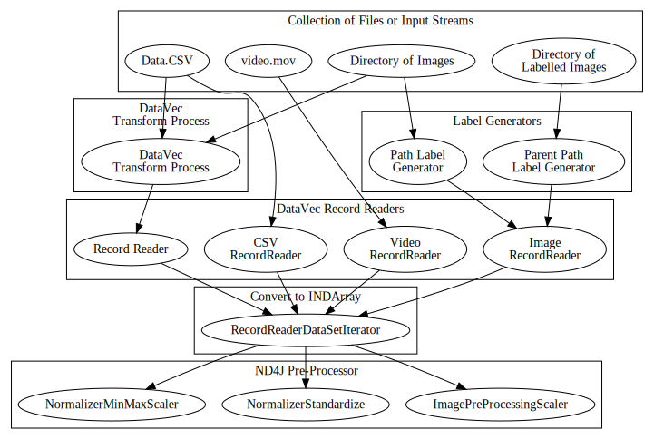

# DeepLearning4J: ETL Users Guide

Data can come from many sources, Log files, text documents, tabular data, images and video are some examples. The end goal for each source is to convert the data into a collection of numerical values in a MultiDimensional Array. 

Data may also need to be transformed, scaled, converted, joined, split into training and testing datasets, shuffled and more. 

This Page covers the available tools and using them. 

* Record Readers 
* Normalizers
* Transform

## Diagram of available ETL paths




## Record Readers

<!-- put border on the table -->
<style>
table
{border:1px solid black;
}
td
{border:1px solid black;
}
th
{border:1px solid black;
}

</style>


Record Readers are part of the DataVec library that we built to manage ETL processes. 

Available RecordReaders

<!-- table generated with http://www.tablesgenerator.com/markdown_tables from CSV export of google sheets -->

| Name                           | Summary                                                                                                                                                                                                                                                                                                                                                                                                                                                                                                                                                                                                                                                                                                                                                                                                                      | Uses                                                      |
|--------------------------------|------------------------------------------------------------------------------------------------------------------------------------------------------------------------------------------------------------------------------------------------------------------------------------------------------------------------------------------------------------------------------------------------------------------------------------------------------------------------------------------------------------------------------------------------------------------------------------------------------------------------------------------------------------------------------------------------------------------------------------------------------------------------------------------------------------------------------|-----------------------------------------------------------|
| BaseImageRecordReader          | Base class for the image record reader                                                                                                                                                                                                                                                                                                                                                                                                                                                                                                                                                                                                                                                                                                                                                                                       | Image Data                                                |
| CodecRecordReader              | Codec record reader for parsing: H.264 ( AVC ) Main profile decoder MP3 decoder/encoder Apple ProRes decoder and encoder AAC encoder H264 Baseline profile encoder Matroska ( MKV ) demuxer and muxer MP4 ( ISO BMF, QuickTime ) demuxer/muxer and tools MPEG 1/2 decoder ( supports interlace ) MPEG PS/TS demuxer Java player applet VP8 encoder MXF demuxer Credit to jcodec for the underlying parser                                                                                                                                                                                                                                                                                                                                                                                                                    | Video                                                     |
| CollectionRecordReader         | Collection record reader. Mainly used for testing.                                                                                                                                                                                                                                                                                                                                                                                                                                                                                                                                                                                                                                                                                                                                                                           | Testing                                                   |
| CollectionSequenceRecordReader | Collection record reader for sequences. Mainly used for testing.                                                                                                                                                                                                                                                                                                                                                                                                                                                                                                                                                                                                                                                                                                                                                             | Sequence Data                                             |
| ComposableRecordReader         | RecordReader for each pipeline. Individual record is a concatenation of the two collections. Create a recordreader that takes recordreaders and iterates over them and concatenates them hasNext would be the & of all the recordreaders concatenation would be next & addAll on the collection return one record                                                                                                                                                                                                                                                                                                                                                                                                                                                                                                            | Merged data                                               |
| CSVNLinesSequenceRecordReader  | A CSV Sequence record reader where:(a) all time series are in a single file(b) each time series is of the same length (specified in constructor)(c) no delimiter is used between time seriesFor example, with nLinesPerSequence=10, lines 0 to 9 are the first time series, 10 to 19 are the second, and so on.                                                                                                                                                                                                                                                                                                                                                                                                                                                                                                              | Tabular Sequence Data                                     |
| CSVRecordReader                | Simple csv record reader                                                                                                                                                                                                                                                                                                                                                                                                                                                                                                                                                                                                                                                                                                                                                                                                     | Tabular Data                                              |
| CSVSequenceRecordReader        | CSV Sequence Record Reader This reader is indended to read sequences of data in CSV format, where each sequence is defined in its own file (and there are multiple files) Each line in the file represents one time step                                                                                                                                                                                                                                                                                                                                                                                                                                                                                                                                                                                                     | Tabular Sequence Data                                     |
| FileRecordReader               | File reader/writer                                                                                                                                                                                                                                                                                                                                                                                                                                                                                                                                                                                                                                                                                                                                                                                                           | Files                                                     |
| ImageRecordReader              | Image record reader. Reads a local file system and parses images of a given height and width. All images are rescaled and converted to the given height, width, and number of channels. Also appends the label if specified (one of k encoding based on the directory structure where each subdir of the root is an indexed label)                                                                                                                                                                                                                                                                                                                                                                                                                                                                                           | Image Data                                                |
| JacksonRecordReader            | Support for JSON, XML and YAML: one record per file only, via Jackson ObjectMapper:                                                                                                                                                                                                                                                                                                                                                                                                                                                                                                                                                                                                                                                                                                                                          | JSON,XML, YAML                                            |
| LibSvmRecordReader             | Record Reader for SVM(Support Vector Machines) content.                                                                                                                                                                                                                                                                                                                                                                                                                                                                                                                                                                                                                                                                                                                                                                      | LibSVM content                                            |
| LineRecordReader               | Reads files line by line                                                                                                                                                                                                                                                                                                                                                                                                                                                                                                                                                                                                                                                                                                                                                                                                     | Text                                                      |
| ListStringRecordReader         | Iterates through a list of strings return a record. Only accepts an @link {ListStringInputSplit} as input.                                                                                                                                                                                                                                                                                                                                                                                                                                                                                                                                                                                                                                                                                                                   | Text                                                      |
| MatlabRecordReader             | Matlab record reader                                                                                                                                                                                                                                                                                                                                                                                                                                                                                                                                                                                                                                                                                                                                                                                                         | Matlab                                                    |
| RegexLineRecordReader          | RegexLineRecordReader: Read a file, one line at a time, and split it into fields using a regex. Specifically, we are using Pattern and Matcher.To load an entire file using a Example: Data in format "2016-01-01 23:59:59.001 1 DEBUG First entry message!"using regex String "(\\d{4}-\\d{2}-\\d{2} \\d{2}:\\d{2}:\\d{2}\\.\\d{3}) (\\d+) ([A-Z]+) (.*)"would be split into 4 Text writables: ["2016-01-01 23:59:59.001", "1", "DEBUG", "First entry message!"]                                                                                                                                                                                                                                                                                                                                                            | Text with Regex                                           |
| RegexSequenceRecordReader      | RegexSequenceRecordReader: Read an entire file (as a sequence), one line at a time and split each line into fields using a regex. Specifically, we are using Pattern and Matcher to do the splitting into groups Example: Data in format "2016-01-01 23:59:59.001 1 DEBUG First entry message!"using regex String "(\\d{4}-\\d{2}-\\d{2} \\d{2}:\\d{2}:\\d{2}\\.\\d{3}) (\\d+) ([A-Z]+) (.*)"would be split into 4 Text writables: ["2016-01-01 23:59:59.001", "1", "DEBUG", "First entry message!"]Note: RegexSequenceRecordReader supports multiple error handling modes, via RegexSequenceRecordReader.LineErrorHandling. Invalid lines that don't match the provided regex can result in an exception (FailOnInvalid), can be skipped silently (SkipInvalid), or skip invalid but log a warning (SkipInvalidWithWarning) | Text Sequence Data Regex                                  |
| SequenceRecordReader           | A sequence of records. sequenceRecord() is used locally. sequenceRecord(URI uri, DataInputStream dataInputStream) is used for spark etc.                                                                                                                                                                                                                                                                                                                                                                                                                                                                                                                                                                                                                                                                                     | Sequence Data                                             |
| SVMLightRecordReader           | Adapted from the weka svmlight reader June 2015 - adapted to understand HDFS-style block splits                                                                                                                                                                                                                                                                                                                                                                                                                                                                                                                                                                                                                                                                                                                              | SVMLight                                                  |
| TfidfRecordReader              | TFIDF record reader (wraps a tfidf vectorizer for delivering labels and conforming to the record reader interface)                                                                                                                                                                                                                                                                                                                                                                                                                                                                                                                                                                                                                                                                                                           | NLP processing, Term Frequency Inverse Document Frequency |
| VideoRecordReader              | A video is just a moving window of pictures. It should be processed as such. This iterates over a root folder and returns a                                                                                                                                                                                                                                                                                                                                                                                                                                                                                                                                                                                                                                                                                                  | Video                                                     |
| WavFileRecordReader            | Wav file loader                                                                                                                                                                                                                                                                                                                                                                                                                                                                                                                                                                                                                                                                                                                                                                                                              | Audio                                                     |


--------------------

<!-- End Table -->

## Image Basics

When reading images for a Neural Network at some point all the imagedata must be scaled to the same dimensions. The initial scaling of images is handled by the ImageRecordReader. 

For loading a collection of records for training, testing or inference. For grayscale images set chanels to 1. 

```
ImageRecordReader recordReader = new ImageRecordReader(height,width,channels);
```

Loading a single image for inference. 

```
NativeImageLoader loader = new NativeImageLoader(height, width, channels); \\ load and scale
INDArray image = loader.asMatrix(file); \\ create INDarray
INDArray output = model.output(image);   \\ get model prediction for image
```

## Image Data Augmentation

With Image data you can generate additional training data by transforming, sampling or cropping the data to generate additional useful inputs.


## Applying Labels

Labels may be part of the record in the case of a CSV file. CSVRecordReader allows you to specify the field that is the label. To convert text labels to numeric use a datavec transform process. Labels may need to be generated based on the file path, examples would be a collection of directories with images where the directory name determines the label. Or a directory where the filename determines the label. 

[ParentPathLabelGenerator](http://github.com/deeplearning4j/DataVec/blob/master/datavec-api/src/main/java/org/datavec/api/io/labels/ParentPathLabelGenerator.java) and [PathLabelGenerator](https://github.com/deeplearning4j/DataVec/blob/master/datavec-api/src/main/java/org/datavec/api/io/labels/PathLabelGenerator.java) are the two classes used to add labels using DataVec. 

Example of applying labels to images based on parent directory name. 

```
ParentPathLabelGenerator labelMaker = new ParentPathLabelGenerator();

ImageRecordReader recordReader = new ImageRecordReader(height, width, channels, labelMaker);
```


## Image Transform

Images are read in as array of pixel values. Pixel values are often 8 bit so an image of a 2 pixels one black and one white would become the array [0,255] . Although it is possible for a Neural Network to train on the data as is, it is better to center the values around 0, we can scale them to values between -1 and 1, or subtract the mean to shift the values to have a 0 center. 

Also image training data can be augmented by rotating sampling, or applying skew to the image. 

Available Image Transforms

| Transfrom Name           | Transform Details                                                                 |
|--------------------------|-----------------------------------------------------------------------------------|
| BaseImageTransform       | Base Class                                                                        |
| ColorConversionTransform | Color conversion transform using CVT (cvtcolor)                                   |
| CropImageTransform       | Crops images deterministically or randomly                                        |
| EqualizeHistTransform    | Used to improve the contrast of an image                                          |
| FilterImageTransform     | Filters images using FFmpeg (libavfilter)                                         |
| FlipImageTransform       | Flips images deterministically or randomly                                        |
| ImageTransform           | Base Class                                                                        |
| MultiImageTransform      | Apply multiple transforms                                                         |
| ResizeImageTransform     | Resize image transform is suited to force the same image size for whole pipeline. |
| RotateImageTransform     | Rotates image deterministically or randomly                                       |
| ScaleImageTransform      | Scales images deterministically or randomly                                       |
| ShowImageTransform       | Shows images on the screen, for visualization only, does not transform            |
| WarpImageTransform.      | Warps the perspective of images deterministically or randomly                     |


## Data Transforms

As Data is ingested through DataVec you can apply a Transform Process with a collection of steps to transform the data. 

Here is what is currently available 


| Transform Name                        | Transform Details                                                                   |
|---------------------------------------|-------------------------------------------------------------------------------------|
| BaseColumnsMathOpTransform            | Base class for multiple column math operations.                                     |
| BaseColumnTransform                   | "Map the values in a single column to new values. For example: string -> string  or empty -> x type transforms for a single column" |
| BaseDoubleTransform                   | Base Class                                                                          |
| BaseIntegerTransform                  | "Abstract integer transformation (single column)                                    |
| "                                     |                                                                                     |
| BaseStringTransform                   | Abstract String column transform                                                    |
| BaseTransform                         | "BaseTransform: an abstact transform class                                          |
| CategoricalToIntegerTransform         | Transform  Categorical to Integer                                                   |
| CategoricalToOneHotTransform          | Transform  Categorical to one-hot                                                   |
| ConditionalCopyValueTransform         | "Replace the value in a specified column with a new value taken from another column, if a condition is satisfied/true."               |
| ConditionalReplaceValueTransform      | Conditional replace based on condition                                              |
| DeriveColumnsFromTimeTransform        | Transform Process                                                                   |
| DoubleColumnsMathOpTransform          | "Add a new double column, calculated from one or more other columns."               |
| DoubleMathOpTransform                 | Double mathematical operation                                                       |
| DuplicateColumnsTransform             | Duplicate one or more columns.                                                      |
| IntegerColumnsMathOpTransform         | "Add a new integer column, calculated from one or more other columns"               |
| IntegerMathOpTransform                | Integer mathematical operation                                                      |
| IntegerToCategoricalTransform         | Convert an integer column to a categorical column                                   |
| Log2Normalizer                        | Normalize by taking scale * log2((in-columnMin)/(mean-columnMin) + 1)               |
| LongColumnsMathOpTransform            | "Add a new long column          ,calculated from one or more other columns."        |
| LongMathOpTransform                   | in-place operation of the long column value and an long scalar.                     |
| MapAllStringsExceptListTransform      | List to exclude from Map                                                            |
| MinMaxNormalizer                      | Normalizer to map (min to max) -> (newMin-to newMax) linearly.                      |
| ReduceSequenceByWindowTransform       | "Apply window across sequence   ,apply reduce across window"                        |
| RemoveAllColumnsExceptForTransform    | Retain specified columns                                                            |
| RemoveColumnsTransform                | Remove specified columns                                                            |
| RemoveWhiteSpaceTransform             | Strip white space                                                                   |
| RenameColumnsTransform                | Rename Columns                                                                      |
| ReorderColumnsTransform               | Re-order columns                                                                    |
| ReplaceEmptyIntegerWithValueTransform | Replace empty Integer with specified value                                          |
| ReplaceEmptyStringTransform           | Replace empty String with specified value                                           |
| ReplaceInvalidWithIntegerTransform    | Replace Invalid value with Integer                                                  |
| StandardizeNormalizer                 | "Normalize using (x-mean)/stdev. Also known as a standard score, standardization etc." |
| StringListToCategoricalSetTransform   | String to Category list                                                             |
| StringMapTransform                    | String to map                                                                       |
| StringToCategoricalTransform          | String to Cetegorical                                                               |
| StringToTimeTransform                 | Generate numeric time from String                                                   |
| SubtractMeanNormalizer                | Subtract mean                                                                       |
| TimeMathOpTransform                   | Time conversions                                                                    |


## Scaling and Normalizing 

From the Record Reader data travels typically to a dataset Iterator that prepares the data for the Neural Net. At this point the data is an INDarray and is no longer an iterator over a Sequence of Records. There are tools to transform and scale at this stage as well. At this point the data is an INDarray so the tools described here are part of ND4j and the documentation is [here])http://nd4j.org/doc/org/nd4j/linalg/dataset/api/preprocessor/DataNormalization.html)

Example code

```
	DataNormalization scaler = new ImagePreProcessingScaler(0,1);
    scaler.fit(dataIter);
    dataIter.setPreProcessor(scaler);
```

### Available ND4j Pre-Processors


| ND4J DataSet PreProcessors | Use                                                                                                                                           |
|----------------------------|-----------------------------------------------------------------------------------------------------------------------------------------------|
| ImagePreProcessingScaler   | Applies min max scaling Can take a range . Pixel values can be scaled from 0->255 to minRange->maxRange default minRange = 0 and maxRange = 1 |
| NormalizerMinMaxScaler     | Applies min max scaling Can take a range X -> (X - min/(max-min)) * (given_max - given_min) + given_mi                                        |
| NormalizerStandardize      | Standard scaler calculates a moving column wise variance and mean                                                                             |


		


## Image Transformations with JavaCV, OpenCV and ffmpeg Filters


ffmpeg and OpenCV provide open source libraries for filtering and transforming images and video. Access to ffmpeg filters in versions 7.2 and above is available by adding the following to your pom.xml file, replacing the version with the current version. 

```
<dependency> <groupId>org.bytedeco</groupId> <artifactId>javacv-platform</artifactId> <version>1.3</version> </dependency>
```

Documentation
* [JavaCV](https://github.com/bytedeco/javacv)
* [OpenCV](http://opencv.org/)
* [ffmpeg](http://ffmpeg.org/)


## Natural Language Processing

DeepLearning4J has tools for NLP. See [this page](https://deeplearning4j.org/bagofwords-tf-idf)


## Sequence Data

Recurrent Neural Networks are useful for analyzing sequence or time series data. DataVec provides the CSVSequenceReader class for reading Sequence Data from files. A good example is the UCISequenceClassificationExample. 

The data is split into testing and training sets so the code creates a seperate iterator for each. 

In this data set there are 6 possible labels. For each file of data in the features directory there is a corresponding file in the labels directory. The label files have a single entry while the feature files have the sequence of activity recorded at that device. 

```
private static File baseDir = new File("src/main/resources/uci/");
private static File baseTrainDir = new File(baseDir, "train");
private static File featuresDirTrain = new File(baseTrainDir, "features");
private static File labelsDirTrain = new File(baseTrainDir, "labels");
private static File baseTestDir = new File(baseDir, "test");
private static File featuresDirTest = new File(baseTestDir, "features");
private static File labelsDirTest = new File(baseTestDir, "labels");

```

NumberedFileInputFormat uses String.Format to extract the index from the filename. 
The data directory contains files 0.csv->449.csv

Here is the code to read the feature and the labels. 

```
SequenceRecordReader trainFeatures = new CSVSequenceRecordReader();
        trainFeatures.initialize(new NumberedFileInputSplit(featuresDirTrain.getAbsolutePath() + "/%d.csv", 0, 449));
        SequenceRecordReader trainLabels = new CSVSequenceRecordReader();
        trainLabels.initialize(new NumberedFileInputSplit(labelsDirTrain.getAbsolutePath() + "/%d.csv", 0, 449));
```

## Ingesting Image Data to feed to a pre-trained model

NativeImageLoader allows the reading of an image and conversion to an INDArray. Note when importing images you will need to size and scale them in the same manner as they where sized, scaled and normalized when the network was trained. 

### Diagram of Single Image Path


