# Car Detection For Autonomous Vehicles With Deep Learning

In this post, we are going to build a real-time video object detection application in Java for car detection, a key component in autonomous driving systems. In a previous post, we were able to build an image classifier (cats vs. dogs); now, now we are going to detect the object (i.e. cars, pedestrians) and additionally mark them with bounding boxes (rectangles). Feel free to download code or run the application with your own videos (short live example).

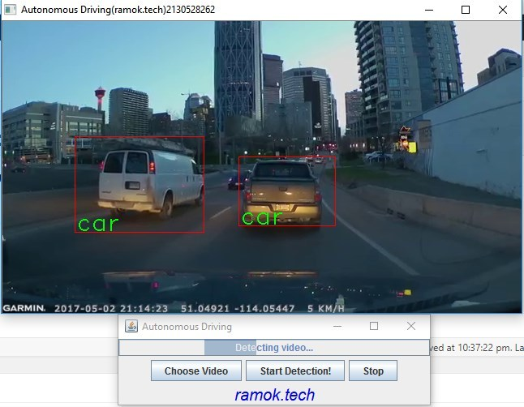


## Object Detection Nature

### Object Classification

First, we have the problem of object classification, in which we have an image and want to know if this image contains any of particular categories, i.e. the image contains a car vs. the image doesn’t contain a car.

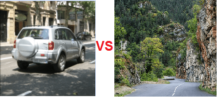

We saw how to build an image classifier in a previous post using existing architecture like VGG-16 and transfer learning.

### Object Localization

Now that we can say with high confidence whether an image has a particular object, we face the challenge of localizing the object's position in the image. Usually, this is done by marking the object with a rectangle or bounding box.

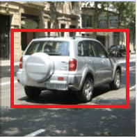

Beside image classification, we additionally need to specify the position of the object in the image. This is done by defining a bounding box.

A bounding box is usually represented by the center (bx , by) , rectangle height (bh), and rectangle width (bw ).


Now, we need to define these four variables in our training data for each of the objects in the images. Additionally, the network will output not only the probability for the image class number (i.e. 20% cat [1], 70% dog [2], 10% tiger [3]) but also the four variables above defining the bounding box of the object.

Just by providing bounding box points (center, width, height), our model outputs/predicts more information by giving us more detail view of the image contents.

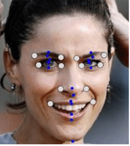

It will not be hard to imagine that putting more points in the image training data can provide us even more insight into the image. For example, putting points on the human face (i.e. mouth, eyes) can tell us the person is smiling, crying, etc.

### Object Detection

We can go even a step further by localizing not only one object but rather multiple objects in the image. This leads us to object detection.

Although the structure does not change that much, the problem here becomes a bit harder because we need more data preparation (multiple bounding boxes). In principle, we just divide the image into smaller rectangles and for each rectangle, we have the same additional five variables we already saw — Pc, (bx , by) , bh , bw — and the normal prediction probabilities (20% cat [1], 70% dog [2]). We will see more details on this later but for now, let's say the structure is the same as object localization with the difference being that we have multiple of that structure.

### Sliding Window Solution

This is a quite an intuitive solution that you can come up by yourself. The idea is that instead of using general car images, we crop as much as possible so the image contains only the car.

We train a convolution neural network similar to VGG-16 or any other deep network with the cropped images.

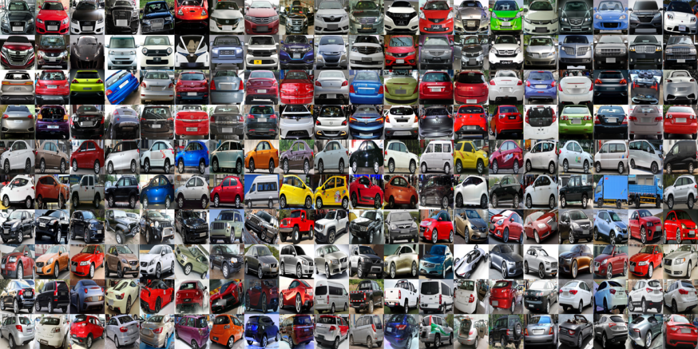
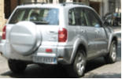

This works quite well — but the model was trained to detect images that have only cars, so it will have troubles with real images since they contain more than just a car (i.e. trees, people, signs).

Also, the size of real images is way bigger.

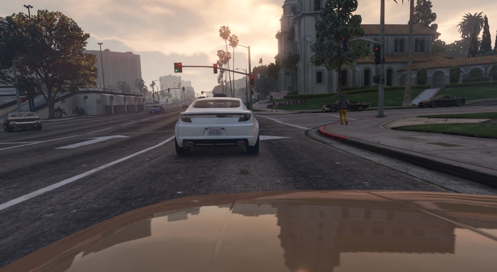

To overcome these problems, we can analyze only a small part of the image and try to figure out if that part has a car. More precisely, we can scan the image with a sliding rectangle window and each time, let our model predict if there is a car in it. 

To summarize, we use a normal convolution neural network (VGG-16) to train the model with cropped images of different sizes and then use rectangles to scan the images for the objects (cars). As we can see, by using different sizes of rectangles, we can figure out different shapes and positions of cars.

This algorithm is not that complex, and it works. But it has two downsides.

The first is performance. We need to ask the model for a prediction a lot of times. Each time a rectangle moves, we need to execute the model in order to get a prediction — and we need to do it all over again for different rectangle sizes, as well. Maybe one way to address performance is to increase the stride of rectangles (bigger steps) but then, we may fail to detect some of the objects. In the past, models were mostly linear and had features designed by hand, so prediction was not that expensive. Therefore, this algorithm used to do just fine. Nowadays, network sizes (138 million parameters for VGG-16), this algorithm is slow and it's almost not useful for real-time video object detection like autonomous driving.

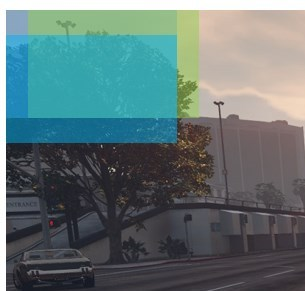

Another way to see why the algorithm is not very efficient is to notice how, when moving the rectangle (right and down), a lot of shared pixels are not being reused but instead are re-calculated all over again. In the next, section we will see a state-of-the-art technique overcoming this problem by using convolution.

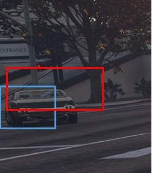

Even with different bounding box sizes, we may fail to precisely mark the object with a bounding box. The model may not output very accurate bounding boxes; for example, the box may include only a part of the object. The next sections will explore the YOLO (you only look once) algorithm, which solves this problem for us.

## Convolutional Sliding Window Solution

We saw how the sliding window has performance problems due to the fact that it doesn’t reuse many already-computed values. Each time the window was moved, we had to execute all the models (million of parameters) for all pixels in order to get a prediction. In reality, most of the computation could be reused by introducing convolution.

### Turn Fully Connected Layers Into Convolution

We saw in previous post that in the end, image classification architectures — regardless with their size and configuration — feed a fully connected neural network with different numbers of layers and output several predictions depending on classes.

For simplicity, we will take a smaller network model as an example, but the same logic is valid for any convolutional network (VGG-16, AlexNet).


For a more detailed explanation of convolution and this intuition, check out one of my previous posts. This simple network takes as input a colored image (RGB) of size 32 X 32 X 3. It uses the same convolution (this convolution leaves first two dimensions, width X height, unchanged) 3 X 3 X 64 to get an output of 32 X 32 X 64 (notice that the third dimension is the same as convolution matrix 64, usually increased from input). It uses a max pooling layer to reduce width and height and leaves the third dimension unchanged (16 X 16X 64). After that, we feed a fully connected neural network with two hidden layers with 256 and 128 neurons each. In the end, we output probabilities (usually using soft-max) for five classes.

Let's see how we can replace fully connected layers with convolution layers while leaving the mathematical effect the same (linear function of the input 16 X 16 X 64).

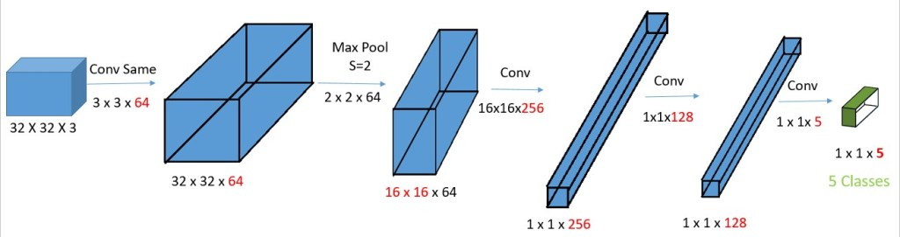

We just replaced fully connected layers with convolution filters. In reality, the 16 X 16 X 256 convolution filter is a 16 X 16 X 64 X 256 matrix (multiple filters) because the third dimension is always the same as the input third dimension. For simplicity, we refer to it as 16 x 16 x 256. This means that actually, this is equivalent to a fully connected layer because every element of output 1 X 1 X 256 is a linear function of every element of the input 16 X 16 X 64.

The reason why we bothered to convert fully connected (FC) layers to convolution layers is because this will give us more flexibility in the way output is reproduced. With FC, you will always have the same output size, which is number of classes.

Convolution Sliding Window
To see the idea behind replacing FC with convolution filter, we will need to take in input image that is bigger than the original one of 32 X 32 X 3. Let's take an input image of 36 X 36 X 3:


This image has four columns and four rows (with green 36 X 36) — more than the original image (blue 32 X 32). If we use sliding window with stride=2 and FC, then we need to move the original image size nine times to cover everything (three moves shown with black rectangle). Therefore, execute the model nine times, as well.

Let's try now to apply this new bigger matrix as input to our new model with convolution layers only.

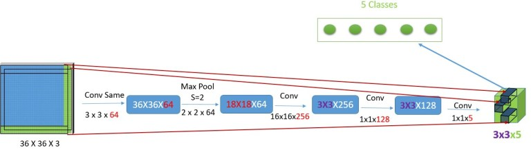

As we can see, the output changed from 1 X 1 X 5 to 3 X 3 X 5, compared to FC, where the output will always be 1 X 1 X 5. Recall that we had to move the sliding window nine times to cover all images — wait, isn’t that equal to 3X3? Indeed, those 3X3 cells each represent the sliding window's 1 X 1 X 5 class probability prediction results!

This is a really state-of-the-art technique, as we were able, just in one pass, to get all nine results immediately without needing to execute model with millions of parameters several times.

## YOLO (You Only Look Once)


Although we already addressed the performance problem by introducing the convolution sliding window, our model still may not output very accurate bounding boxes — even with several bounding boxes sizes. Let's see how YOLO solves that problem, as well.

First, we normally go on each image and mark the objects that we want to detect. Each object is marked by a bounding box with four variables — remember center of the object (bx , by), rectangle height (bh), rectangle width (bw). After that, each image is split into a smaller number of rectangles (boxes) — usually, 19 X 19 rectangles, but here, for simplicity, it's 8 X 9.

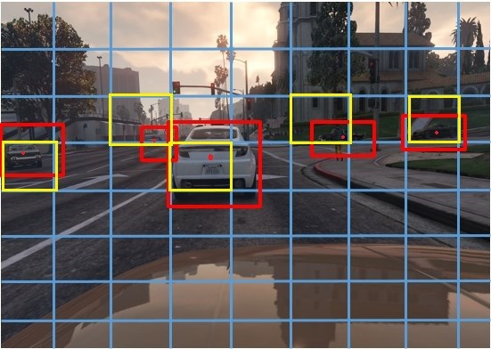

The bounding box (red) and the object can be part of several boxes (blue), so we assign the object and the bounding box only to the box owning the center of the object (yellow boxes). We train our model with four additional variables (besides telling the object is a car; bx, by, bh, and bw) and assign those to the box owning the center (bx, by). After the neural network is trained with this labeled data, we let the model predict the four variables (besides what object is), values, or bounding boxes.

Instead of scanning with predefined bounding box sizes and trying to fit the object, we let the model learn how to mark objects with bounding boxes; therefore, the bounding boxes now are flexible (are learned). This way, the accuracy of the bounding boxes is much higher and flexible.

Let's see how we can represent the output now that we have additional four variables (bx, by, bh, bw) besides classes like 1-car, 2-pedestrian. In reality, another variable is also added, Pc, which simply tells if the image has any of the objects that we want to detect at all.

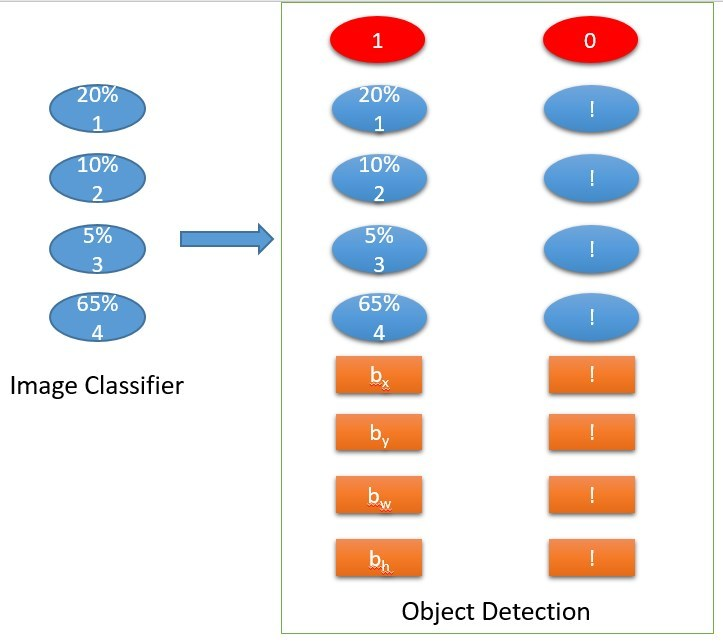

* Pc =1(red) means that there is at least one of the objects, so it's worth looking at probabilities and bounding box.
* Pc =0(red) means that the image has none of the objects we want, so we don't care about probabilities or bounding box.

### Bounding Box Specification

We need to label our training data in some specific way for the YOLO algorithm to work correctly. YOLO V2 format requires bounding box dimensions bx, by and bh, bw to be relative to the original image width and height. Let's suppose we have an image 300 X 400 and the bounding box dimensions are Bwidth =30, Bheight=15, Bx=150, By=80. This has to be transformed to
Bw=30/300, Bh=15/400, Bx=150/300, By=80/400.

This post shows how to label data using BBox Label Tool with less pain. The tool labels bounding boxes a bit differently (gives up left point and lower-right point) from YOLO V2 format, but converting is fairly straight-forward task.

Aside from how YOLO requires the labeling of training data, internally, the prediction is done a bit differently.

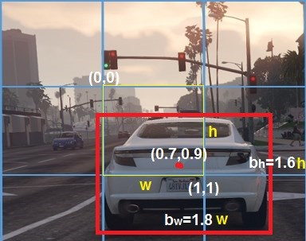

A predicted bounding box by YOLO is defined relative to the box that owns the center of the object (yellow). The upper-left corner of the box starts from (0,0) and the bottom right, (1,1). The center (bx , by) is for sure on range 0-1 (the Sigmoid function makes sure) since the point is inside the box. bh, bw are calculated in proportion to w and h values (yellow) of the box so values can be greater than 1 (exponential used for positive values). In the picture, we see that the width bw of the bounding box is almost 1.8x the size of the box width w. Similarly, bh is approximately 1.6x the size of box height h.

After prediction, we see how much the predicted box intersects with the real bounding box labeled at the beginning. Basically, we try to maximize the intersection between them, so ideally, the predicted bounding box is fully intersecting the labeled bounding box.

In principle, that’s it! You provide more specialized labeled data with bounding boxes (bx, by, bh, bw), split the image, and assign to the box containing the center (responsible for detecting the object), train with the convolution sliding window network, and predict the object and its position.

### Two More Problems

Although we are not going to give a very detailed explanation in this post, in reality, there are yet two more small problems to solve:


First, even if in the training time, the object is assigned to one box (the one containing the object center), at test time (when predicting), several boxes (yellow) may think they have the center of the object (with red), therefore defining their own bounding boxes for same object. This is solved with the non-max suppression algorithm. Currently, Deeplearning4j does not provide an implementation, so please find on GitHub a simple implementation (removeObjectsIntersectingWithMax). What it does is first choose as prediction the box with maximum Pc probability (it has not only 1 or 0 values, but rather can be in the 0-1 range). Then, every box that intersects above a certain threshold with that box is removed. It starts the same logic again until there are no more bounding boxes left.

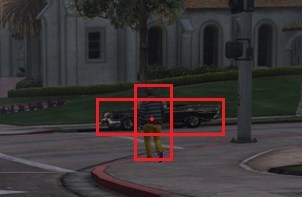

Second, since we are predicting multiple objects (cars, pedestrians, traffic lights, etc.) it may happen that the center of two or more objects is one box. These cases are solved by introducing anchor boxes. With anchor boxes, we choose several shapes of bounding boxes and we find more used for the object we want to detect. The YOLO V2 paper does this with the k-means algorithm, but it can be done also manually. After that, we modify the output to contain the same structure we saw previously (Pc, bx, by, bh, bw, C1, C2…) but for each of the chosen anchor boxes shapes. So, we may have something like this now:

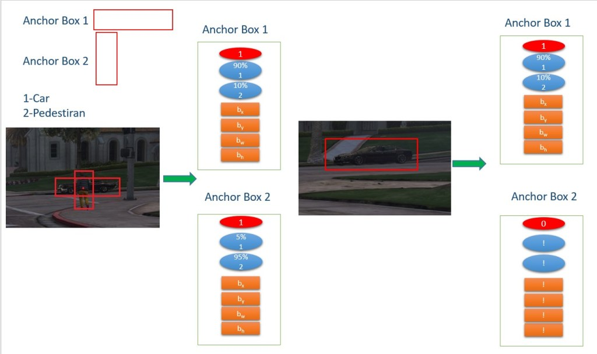

## Application

Training deep networks takes a lot of effort and requires significat data and processing power. So as we did in the previous post, we will use transfer learning. This time, we are not going to modify the architecture and train with different data but rather use the network directly.

We are going to use Tiny YOLO; citing from site:

Tiny YOLO is based off of the Darknet reference network and is much faster but less accurate than the normal YOLO model. To use the version trained on VOC:

```
wget https://pjreddie.com/media/files/tiny-yolo-voc.weights
./darknet detector test cfg/voc.data cfg/tiny-yolo-voc.cfg tiny-yolo-voc.weights data/dog.jpg
```

Which, OK, it’s not perfect, but boy, it sure is fast. On GPU it runs at >200 FPS.

The currently release version of Deeplearning4j 0.9.1 does not offer TinyYOLO, but the 0.9.2-SNAPSHOT does. So first, we need to tell Maven to load SNAPSHOT:

```
<repositories>
    <repository>
        <id>a</id>
        <url>http://repo1.maven.org/maven2/</url>
    </repository>
    <repository>
        <id>snapshots-repo</id>
        <url>https://oss.sonatype.org/content/repositories/snapshots</url>
        <releases>
            <enabled>false</enabled>
        </releases>
        <snapshots>
            <enabled>true</enabled>
            <updatePolicy>daily</updatePolicy>
        </snapshots>
    </repository>
</repositories>
<dependencies>
    <dependency>
        <groupId>org.deeplearning4j</groupId>
        <artifactId>deeplearning4j-core</artifactId>
        <version>${deeplearning4j}</version>
    </dependency>
    <dependency>
        <groupId>org.nd4j</groupId>
        <artifactId>nd4j-native-platform</artifactId>
        <version>${deeplearning4j}</version>
    </dependency>
```

Then, we are ready to load the model with fairly short code:

```
private TinyYoloPrediction() {
    try {
        preTrained = (ComputationGraph) new TinyYOLO().initPretrained();
        prepareLabels();
    } catch (IOException e) {
        throw new RuntimeException(e);
    }
}
```

`prepareLabels` is just using labels from the dataset PASCAL VOC that used to train the model. Feel free to run preTrained.summary() to see model architecture details.

The video frames are captures using JavaCV with CarVideoDetection:

```
FFmpegFrameGrabber grabber;
grabber = new FFmpegFrameGrabber(f);
grabber.start();
while (!stop) {
    videoFrame[0] = grabber.grab();
    if (videoFrame[0] == null) {
        stop();
        break;
    }
    v[0] = new OpenCVFrameConverter.ToMat().convert(videoFrame[0]);
    if (v[0] == null) {
        continue;
    }
    if (winname == null) {
        winname = AUTONOMOUS_DRIVING_RAMOK_TECH + ThreadLocalRandom.current().nextInt();
    }
    if (thread == null) {
        thread = new Thread(() -> {
            while (videoFrame[0] != null && !stop) {
                try {
                    TinyYoloPrediction.getINSTANCE().markWithBoundingBox(v[0], videoFrame[0].imageWidth, videoFrame[0].imageHeight, true, winname);
                } catch (java.lang.Exception e) {
                    throw new RuntimeException(e);
                }
            }
        });
        thread.start();
    }
    TinyYoloPrediction.getINSTANCE().markWithBoundingBox(v[0], videoFrame[0].imageWidth, videoFrame[0].imageHeight, false, winname);
    imshow(winname, v[0]);
    
```

So what the code is doing is getting frames from the video and passing to the TinyYOLO pre-trained model. From there, the image frame is first scaled to 416 X 416 X 3 (RGB) and then is given to TinyYOLO for predicting and marking the bounding boxes:

```

public void markWithBoundingBox(Mat file, int imageWidth, int imageHeight, boolean newBoundingBOx,String winName) throws Exception {
    int width = 416;
    int height = 416;
    int gridWidth = 13;
    int gridHeight = 13;
    double detectionThreshold = 0.5;
    Yolo2OutputLayer outputLayer = (Yolo2OutputLayer) preTrained.getOutputLayer(0);
   
        INDArray indArray = prepareImage(file, width, height);
        INDArray results = preTrained.outputSingle(indArray);
        predictedObjects = outputLayer.getPredictedObjects(results, detectionThreshold);
        System.out.println("results = " + predictedObjects);
        markWithBoundingBox(file, gridWidth, gridHeight, imageWidth, imageHeight);
    imshow(winName, file);
}
```

After the prediction, we should have ready the predicted values of bounding box dimensions. We have implemented non-max suppression (removeObjectsIntersectingWithMax) because, as we mentioned, YOLO, at testing time, predicts more than one bounding box per object. Rather than using bx , by, bh, and bw, we will use topLeft and bottomRight points. gridWidth and gridHeight are the number of the small boxes we split our image into, which, in our case, is 13X13. w,h are original image frame dimensions.

After that, using another thread (beside the one playing the video), we update the video to have the rectangle and the label for the object it was detected.

The prediction is really fast (real-time) considering that is run on CPU; on GPUs, we will have even better real-time detection.

### Running Application

The application can be downloaded and executed without any knowledge of Java, though Java does have to be installed on your computer. Feel to try with your own videos.

It is possible to run the from the source by simply executing the RUN class. Or, if you do not want to open it with IDE, just run `mvn clean install exec:java`.

After running the application, you should be able to see the below view:


