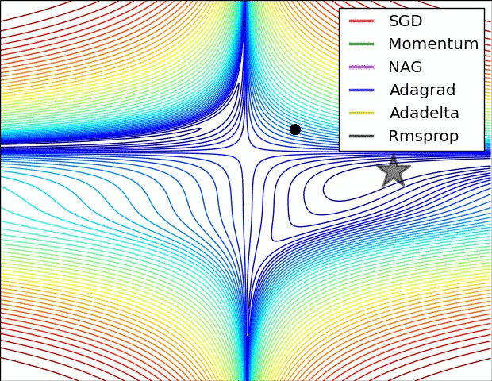
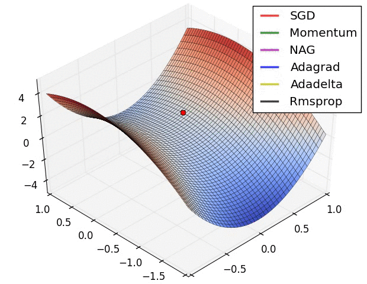

# Building Neural Networks with DeepLearning4J

Contents

* [MultiLayer Network and Computation Graph](#multilayer)
* [Configuration](#configuration)
* [Configuration Details](#configurationdetails)
* [Attaching a UI to your Network](#ui)


## <a name="multilayer">MultiLayerNetwork and Computationgraph</a>

Deeplearning4J has two classes for building and training Neural Networks: `MultiLayerNetwork` and `ComputationGraph`. 

### MultiLayerNetwork

`MultiLayerNetwork` configures a neural network with multiple layers in a stack, usually ending in an output layer. 

`MultiLayerNetwork` is trainable via backpropagation, with optional pretraining, depending on the type of layers it contains.

### ComputationGraph

`ComputationGraph` is for neural networks with a more complex connection architecture. `ComputationGraph` allows for an arbitrary directed acyclic graph connection structure between layers. A `ComputationGraph` may also have an arbitrary number of inputs and outputs.

## <a name="configuration">Configuration</a>

To use either `MultiLayerNetwork` or `ComputationGraph`, you typically start with the `Configuration` classes for each. 

Both configuration classes provide a convenient builder architecture. 

### ComputationGraph Configuration

Here is a configuration of a recurrent neural network taken, from our examples. 

```
ComputationGraphConfiguration configuration = new NeuralNetConfiguration.Builder()
   	.weightInit(WeightInit.XAVIER)
	.learningRate(0.5)
	.updater(Updater.RMSPROP)
	.optimizationAlgo(OptimizationAlgorithm.STOCHASTIC_GRADIENT_DESCENT).iterations(nIterations)
	.seed(seed)
	.graphBuilder()
	.addInputs("additionIn", "sumOut")
	.setInputTypes(InputType.recurrent(FEATURE_VEC_SIZE), InputType.recurrent(FEATURE_VEC_SIZE))
	.addLayer("encoder", new GravesLSTM.Builder().nIn(FEATURE_VEC_SIZE).nOut(numHiddenNodes).activation("softsign").build(),"additionIn")
	.addVertex("lastTimeStep", new LastTimeStepVertex("additionIn"), "encoder")
	.addVertex("duplicateTimeStep", new DuplicateToTimeSeriesVertex("sumOut"), "lastTimeStep")
	.addLayer("decoder", new GravesLSTM.Builder().nIn(FEATURE_VEC_SIZE+numHiddenNodes).nOut(numHiddenNodes).activation("softsign").build(), "sumOut","duplicateTimeStep")
	.addLayer("output", new RnnOutputLayer.Builder().nIn(numHiddenNodes).nOut(FEATURE_VEC_SIZE).activation("softmax").lossFunction(LossFunctions.LossFunction.MCXENT).build(), "decoder")
	.setOutputs("output")
	.pretrain(false).backprop(true)
	.build();				

```

### MultiLayerNetwork Configuration

Here is a configuration of a simple FeedForward Network also from our examples. 

```
MultiLayerConfiguration conf = new NeuralNetConfiguration.Builder()
	.seed(seed)
    .iterations(iterations)
	 .activation("tanh")
	 .weightInit(WeightInit.XAVIER)
	 .learningRate(0.1)
	 .regularization(true).l2(1e-4)
	 .list()
	 .layer(0, new DenseLayer.Builder().nIn(numInputs).nOut(3)
	     .build())
	 .layer(1, new DenseLayer.Builder().nIn(3).nOut(3)
	     .build())
	 .layer(2, new OutputLayer.Builder(LossFunctions.LossFunction.NEGATIVELOGLIKELIHOOD)
	     .activation("softmax")
	     .nIn(3).nOut(outputNum).build())
	 .backprop(true).pretrain(false)
	 .build();					
```

## <a name="configurationdetails">Configuration Details</a>

### Random Seeds and Repeatability

With both network configuration methods, it is typical to set a random seed to initialize the network's weights. Hard coding the random seed allows for repeatable results, because they start learning from the same random initialization.

### Iterations

An iteration is simply one update of the neural net model’s parameters, or weights. 

That is not to be confused with an "epoch", which is one complete training pass through the dataset. 

Many iterations may occur before an epoch is completed. Epoch and iteration are only synonymous if you update your parameters once after each pass through the whole dataset; if you update using mini-batches, or subsets of your total training set, then iteration and epoch will mean different things. Say your data has two minibatches: A and B. `.numIterations(3)` performs training like AAABBB, while three epochs looks like ABABAB.

### Activation Functions

The activation function determines what output a node will generate based upon its input. Sigmoid activation functions have been widely used, though ReLU is currently very popular. In DeepLearnging4j, the activation function is set at the layer level and applies to all neurons in that layer.

Configuring an activation function:

```
layer(2, new OutputLayer.Builder(LossFunctions.LossFunction.NEGATIVELOGLIKELIHOOD).activation(Activation.SOFTMAX)
``` 

### Output Layer Activation

The activation function of the output layer determines the output. The question you are asking your network determines the choice of your output layer activation function. 

Some examples: 

* To generate Binary(0,1) output, use a sigmoid activation function on the output layer. The output will be between 0 and 1, and should be treated as a probability that the input belongs to either 0 or 1. 

* To generate output of categorical Targets (1 of C coding), use the Softmax Activation Function for the  output layer. The number of output nodes to equal number of classes beig categorized. Treat output as the probability of an instance of data belonging to each category. 

* To generate Continuous-Valued (bounded range) values, use Sigmoid or Tanh Activation (with scaled range of outputs to range of targets).

* To generate positive (no known upper bound) output, use Activation Functions in the ReLU family, Softplus Activation Function (or use logarithmic normalization to transform to unbounded continuous).

* To generate continuous-valued (unbounded) output, use a Linear Activation Function (equates to no activation function).

### Supported Activation Functions

DeepLearning4J supports the following Activation functions

* CUBE
* ELU
* HARDSIGMOID
* HARDTANH
* IDENTITY
* LEAKYRELU
* RATIONALTANH
* RELU
* RRELU
* SIGMOID
* SOFTMAX
* SOFTPLUS
* SOFTSIGN
* TANH

### Custom Activation Functions

DeepLearning4J supports custom activation functions. 

### Weight Initialization

At startup the weights of the Neural Network are randomly initialized. Randomization is important, if the weights of two neurons are identical then they will never be able to diverge and learn different features. Xavier Initialization is widely used and is described in our [glossary](https://deeplearning4j.org/glossary.html#xavier).

### Learning Rate

Learning Rate determines how big of a step is taken towards less error as the net's weights are updated. Too big of a learning rate may make the error fluctuate widely and cause the net to fail to converge. Too small of a Learning rate, and the network will take an overly long time to train. A high learning rate that is working well initially often has to be adjusted to a lower rate as the model trains and approaches the error minimum. Adaptive updaters such as ADAM or AdaGrad are used to deal with the need to adjust the learning speed. 

### Backpropagation

Most effective methods for training Neural networks use backpropagation or some variant. 

### Pretrain

For unsupervised training for specialty networks like Restricted Boltzmann Machines and Autoencoders, it may be useful to set pretrain to `true`. For other networks, it should be set to `false`. 

### Regularization 

Regularization is way to fight the tendency of neural networks to overfit the training data. Overfitting is when the network learns to be very accurate on the training data but fails to generalize well and performs poorly on the test data. 

Deeplearning4J supports both L1 and L2 Regularization.  

### Adding Layers

To add a layer to your configuration, use `addLayer` for `ComputationGraph` and `.layer` for `MultiLayerNetwork`. Activation functions are set per layer. Loss Function is only set for the output Layer. 

### Updaters

DL4J support the following Updaters

* ADADELTA
* ADAGRAD
* ADAM
* NESTEROVS
* NONE
* RMSPROP
* SGD
* CONJUGATE GRADIENT
* HESSIAN FREE
* LBFGS
* LINE GRADIENT DESCENT

The JavaDoc for updaters is part of the DeepLearning4J JavaDoc and is available [here.](https://deeplearning4j.org/doc/org/deeplearning4j/nn/conf/Updater.html)

### Animation of Updaters 

Thanks to Alec Radford for allowing us to use these animations.

#### Updater progress on complex error surface


<br />
<br />

#### Updater progress on a less complex error surface



### Listeners 

Listeners that gather statistics or report progress can be attached. Here is a code example of applying a Listener to a model, note that you can provide setListeners multiple Listeners. 

```
model.setListeners(new ScoreIterationListener(100));
```

One example use of a listener is to print out accuracy to the console as the network trains. Another example is to deliver statistics to the user interface. 

```

UIServer uiServer = UIServer.getInstance();
        StatsStorage statsStorage = new InMemoryStatsStorage();
        model.setListeners(new StatsListener(statsStorage),new ScoreIterationListener(1));
        uiServer.attach(statsStorage);
		
```

#### CollectScoresIterationListener	

`CollectScoresIterationListener` simply stores the model scores internally (along with the iteration) every 1 or N iterations (this is configurable).

#### ComposableIterationListener	

A group of listeners.

### ParamAndGradientIterationListener	

An iteration listener that provides details on parameters and gradients at each iteration during traning.

### PerformanceListener	

Simple IterationListener that tracks time spend on training per iteration.


## <a name="ui"> Attaching a UI to a Neural Network</a>

A browser-based user interface is available. The server will be available on the machine running the Java code on port 9000. In order to use it, you create an instance of `UIServer`. Create a StatsStorage Listener for the neural network and attach the Stats Listener to the UI Server. Here is the code to do that: 

```
UIServer uiServer = UIServer.getInstance();
StatsStorage statsStorage = new InMemoryStatsStorage();
model.setListeners(new StatsListener(statsStorage),new ScoreIterationListener(1));
uiServer.attach(statsStorage);

```
