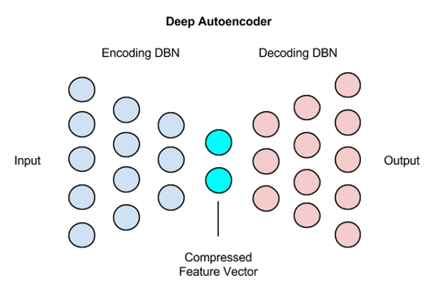

# 深度自动编码器

深度自动编码器由两个对称的[深度置信网络](./deepbeliefnetwork.html)组成，其中一个深度置信网络通常有四到五个浅层，构成负责编码的部分，另一个四到五层的网络则是解码部分。

这些层都是[受限玻尔兹曼机](./restrictedboltzmannmachine.html)（RBM），即构成深度置信网络的基本单元，它们有一些特殊之处，我们将在下文中介绍。以下是简化的深度自动编码器架构示意图，下文会作具体说明。

 

处理基准数据集[MNIST](http://yann.lecun.com/exdb/mnist/)时，深度自动编码器会在每个RBM之后使用二进制变换。深度自动编码器还可以用于包含实数数据的其他类型的数据集，此时编码器中的RBM可以改用高斯修正变换。 

### 编码

让我们用以下的示例来描绘一个编码器的大致结构：
    
     784 (输入) ----> 1000 ----> 500 ----> 250 ----> 100 -----> 30

假设进入网络的输入是784个像素（MNIST数据集中28 x 28像素的图像），那么深度自动编码器的第一层应当有1000个参数，即相对较大。 

这可能会显得有违常理，因为参数多于输入往往会导致神经网络过拟合。 

在这个例子当中， 增加参数从某种意义上来看也就是增加输入本身的特征，而这将使经过自动编码的数据最终能被解码。 

其原因在于每个层中用于变换的sigmoid置信单元的表示能力。sigmoid置信单元无法表示与实数数据等量的信息和差异，而补偿方法之一就是扩张第一个层。 

各个层将分别有1000、500、250、100个节点，直至网络最终生成一个30个数值长的向量。这一30个数值的向量是深度自动编码器负责预定型的前半部分的最后一层，由一个普通的RBM生成，而不是一个通常会出现在深度置信网络末端的Softmax或逻辑回归分类输出层。 

### 解码

这30个数值是28 x 28像素图像被编码后的版本。深度自动编码器的后半部分会学习如何解码这一压缩后的向量，将其作为输入一步步还原。

深度自动编码器的解码部分是一个前馈网络，它的各个层分别有100、250、500和1000个节点。 
层的权重以随机方式初始化。 

		784 (输出) <---- 1000 <---- 500 <---- 250 <---- 30

深度自动编码器的解码部分即是学习重构图像的部分，它用一个会进行反向传播的前馈网络来学习。此处的反向传播通过重构熵实现。

### 定型细节

在解码器的反向传播阶段，学习速率应当降低，减慢速度：大约取在1e-3和1e-6之间，具体取决于处理的是二进制数据还是连续数据（分别对应区间的两端）。

## 应用案例

### 图像搜索

如上文所述，深度自动编码器可以将图像压缩为30个数值的向量。 

因此图像搜索的过程就变成：上传图像，搜索引擎将图像压缩为30个数值，然后将这个向量与索引中的所有其他向量进行比较。 

包含相似数值的向量将被返回，再转换为与之匹配的图像，成为搜索查询的结果。 

### 数据压缩

图像压缩更广泛的应用是数据压缩。正如Geoff Hinton在[这篇论文](https://www.cs.utoronto.ca/~rsalakhu/papers/semantic_final.pdf)中所述，深度自动编码器可用于语义哈希。

### 主题建模和信息检索（IR）

深度自动编码器可用于主题建模，即以统计学方式对分布于一个文档集合中的抽象主题建模。 

这是沃森等问答系统的一个重要环节。

简而言之，集合中的每篇文档会被转换为一个词袋（即一组词数），而这些词数会被缩放为0到1之间的小数，可以视之为词在文档中出现的概率。 

缩放后的词数被输入由受限玻尔兹曼机堆叠构成的深度置信网络，而受限玻尔兹曼机本身就是一种前馈式反向传播自动编码器。这些深度置信网络（DBN）通过一系列sigmoid变换将文档映射至特征空间，从而把每篇文档压缩为10个数值。 

每篇文档的数值组，即向量会被引入同一个向量空间，测量它到其他各个文档向量的距离。彼此接近的文档向量大致上可以归为同一个主题。 

例如，一篇文档可能是“问题”，而其他的文档可能是“回答”，软件可以通过在向量空间中测量距离来完成这样的匹配。 

## 代码示例

深度自动编码器可以通过拓展Deeplearning4j的[MultiLayerNetwork类](https://github.com/deeplearning4j/deeplearning4j/blob/3e934e0128e443a0e187f5aea7a3b8677d9a6568/deeplearning4j-core/src/main/java/org/deeplearning4j/nn/multilayer/MultiLayerNetwork.java)来构建。

代码大致如下：

        final int numRows = 28;
        final int numColumns = 28;
        int seed = 123;
        int numSamples = MnistDataFetcher.NUM_EXAMPLES;
        int batchSize = 1000;
        int iterations = 1;
        int listenerFreq = iterations/5;

        log.info("Load data....");
        DataSetIterator iter = new MnistDataSetIterator(batchSize,numSamples,true);

        log.info("Build model....");
        MultiLayerConfiguration conf = new NeuralNetConfiguration.Builder()
                .seed(seed)
                .iterations(iterations)
                .optimizationAlgo(OptimizationAlgorithm.STOCHASTIC_GRADIENT_DESCENT)
                .list(10)
                .layer(0, new RBM.Builder().nIn(numRows * numColumns).nOut(1000).lossFunction(LossFunctions.LossFunction.RMSE_XENT).build())
                .layer(1, new RBM.Builder().nIn(1000).nOut(500).lossFunction(LossFunctions.LossFunction.RMSE_XENT).build())
                .layer(2, new RBM.Builder().nIn(500).nOut(250).lossFunction(LossFunctions.LossFunction.RMSE_XENT).build())
                .layer(3, new RBM.Builder().nIn(250).nOut(100).lossFunction(LossFunctions.LossFunction.RMSE_XENT).build())
                .layer(4, new RBM.Builder().nIn(100).nOut(30).lossFunction(LossFunctions.LossFunction.RMSE_XENT).build()) 
                
                //编码停止
                .layer(5, new RBM.Builder().nIn(30).nOut(100).lossFunction(LossFunctions.LossFunction.RMSE_XENT).build()) 	
                
                //解码开始
                .layer(6, new RBM.Builder().nIn(100).nOut(250).lossFunction(LossFunctions.LossFunction.RMSE_XENT).build())
                .layer(7, new RBM.Builder().nIn(250).nOut(500).lossFunction(LossFunctions.LossFunction.RMSE_XENT).build())
                .layer(8, new RBM.Builder().nIn(500).nOut(1000).lossFunction(LossFunctions.LossFunction.RMSE_XENT).build())
                .layer(9, new OutputLayer.Builder(LossFunctions.LossFunction.RMSE_XENT).nIn(1000).nOut(numRows*numColumns).build())
                .pretrain(true).backprop(true)
                .build();

         MultiLayerNetwork model = new MultiLayerNetwork(conf);
         model.init();

         model.setListeners(Arrays.asList((IterationListener) new ScoreIterationListener(listenerFreq)));

         log.info("Train model....");
         while(iter.hasNext()) {
            DataSet next = iter.next();
            model.fit(new DataSet(next.getFeatureMatrix(),next.getFeatureMatrix()));

如需构建深度自动编码器，请确保您已安装[Deeplearning4j及其示例](https://github.com/deeplearning4j/dl4j-examples/tree/master/dl4j-examples/src/main/java/org/deeplearning4j/examples/unsupervised/deepbelief)的最新版本。

如有关于深度自动编码器的问题，请在[Gitter](https://gitter.im/deeplearning4j/deeplearning4j)与我们联系。 
