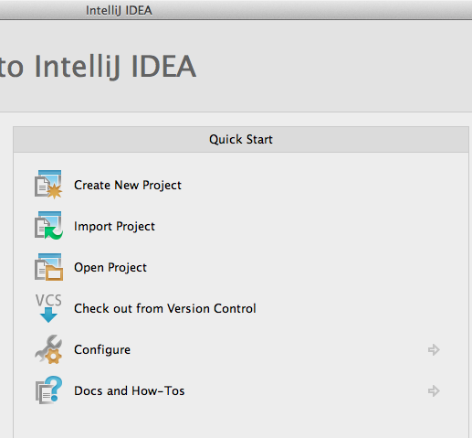

# 在OSX上进行安装

* 如需运行示例，请参阅[快速入门指南](./quickstart.html)。

* DeepLearning4J需要[Java 7](http://www.oracle.com/technetwork/java/javase/downloads/jdk7-downloads-1880260.html)或以上的版本。

* CPU操作依赖于Jblas，所以需要BLAS的原生绑定。这在OSX系统上已经安装。 

* 您可以从源代码或Maven中央仓库安装DL4J。以下是从**源代码**安装的操作指南。 

         git clone https://github.com/agibsonccc/java-deeplearning
         cd java-deeplearning

### IntelliJ

* 下载Java IDE工具IntelliJ来使用DL4J代码。[免费的社区版本](http://www.jetbrains.com/idea/download/)可在此处下载：

         http://www.jetbrains.com/idea/download/

* 解压缩下载文件，移动至应用文件夹，打开该应用。打开后，系统可能会提示您安装Java SE 6运行时。请按提示进行安装。 

* 打开IntelliJ时，您必须选择创建或打开一个项目。在菜单中选择“Open Project（打开项目）”，然后选中Deeplearning4j的工作目录。此处的目录为“java-deeplearning”。点击打开按钮，打开该文件夹。（系统处理所有的依赖项需要一些时间，在此期间无法运行示例。）

 

* 确保Maven 2 Integration插件已安装。在Mac环境下，选择Preferences（偏好设置），然后点击Plugins（插件）。（Linux环境下，插件选项可以在Settings中找到。）然后选择“Browse Repositories（浏览库）”，搜索“Maven 2 Integration”。安装该插件，重启IntelliJ。重启后应会返回java-deeplearning项目。 

* 进入示例文件夹－java-deeplearning/deeplearning4j-examples/src/main/java/org/deeplearning4j/example/－随后右击您感兴趣的数据集（大多数用户从MNIST数据集入门）。该目录下有一系列用于处理MNIST的网络。右击RBMMnistExample。在出现的菜单中找到绿色箭头，选择“Run（运行）”。 

* 屏幕顶端会出现警告消息。如果IntelliJ提示您添加SDK，请选择JDK。

### Maven

* 如需检查系统中是否已安装Maven，请在终端/cmd中键入以下命令：

         mvn --version

* 如果您已安装Maven，系统会显示其版本和安装路径。在Windows系统的PC上，文件路径为：

         c:\Programs\maven\bin\..

* 如果您尚未安装Maven，可以按Maven的[“入门指南”](https://maven.apache.org/guides/getting-started/maven-in-five-minutes.html)进行安装。最后请运行以下命令：

         mvn clean install -DskipTests

* 运行“mvn clean”之后，一个名为“deeplearning4j-dist-bin.tar.gz”的tar压缩文件会被安装到本地文件夹中（即jar文件所在的位置，也是编译发生的位置）：

		*/java-deeplearning/deeplearning4j-distribution/target
	
* 将以下内容加入您的项目对象模型（POM）文件（POM.xml文件位于指定位置的根目录下）：

         <repositories>
             <repository>
                 <id>snapshots-repo</id>
                 <url>https://oss.sonatype.org/content/repositories/snapshots</url>
                 <releases><enabled>false</enabled></releases>
                 <snapshots><enabled>true</enabled></snapshots>
             </repository>
         </repositories>

* 所有的依赖项都应当添加在“dependencyManagement”和“dependencies”标签对内。将以下依赖项加入POM文件：

         <dependency>
			<groupId>org.deeplearning4j</groupId>
			<artifactId>deeplearning4j-core</artifactId>
			<version>0.0.3.2-SNAPSHOT</version>
		 </dependency>

* 多线程/聚类支持所需的依赖项：

         <dependency>
			<groupId>org.deeplearning4j</groupId>
			<artifactId>deeplearning4j-scaleout-akka</artifactId>
			<version>0.0.3.2-SNAPSHOT</version>
         </dependency>

* 自然语言处理（NLP）所需的依赖项：
         
         <dependency>
            <groupId>org.deeplearning4j</groupId>
            <artifactId>deeplearning4j-scaleout-akka-word2vec</artifactId>
            <version>0.0.3.2-SNAPSHOT</version>
         </dependency>

* 如需在本地安装GPU线性代数运算所需的Jcublas，请先输入以下命令：

		git clone git@github.com:MysterionRise/mavenized-jcuda.git
		cd mavenized-jcuda && mvn clean install -DskipTests

  然后将linear-algebra-jcublas加入POM：

           <dependency>
             <groupId>org.deeplearning4j</groupId>
             <artifactId>linear-algebra-jcublas</artifactId>
             <version>0.0.3.2-SNAPSHOT</version>
           </dependency>

**后续步骤**：您可以参阅[**MNIST教程**](./rbm-mnist-tutorial.html)，再[运行一些示例](./quickstart.html)。 

如果您已熟悉深度学习的工作原理，也明确了需要借助深度学习达成的目的，那么请直接阅读有关[自定义数据集](./customdatasets.html)的内容。

如需深入探究，请访问我们的[Github代码库](https://github.com/agibsonccc/java-deeplearning)，或者通过[Maven](http://maven.apache.org/download.cgi)访问核心库。
