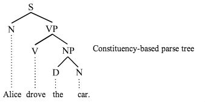

# 递归神经张量网络

*N.B.DL4J目前尚不支持RNTN。请先访问[此页](./quickstart.html)探究其他神经网络。*

递归神经张量网络（RNTN）是适合用于自然语言处理的神经网络。RNTN呈树状结构，在每个节点上都有一个神经网络。您可以用RNTN来进行边界切分，判定词组属于正面还是负面，也可以对整个句子进行这些操作。 

RNTN用词向量作为特征以及顺序分类的基础。词向量组成子短语（subphrase），子短语再组成句子，如此就可以按情感或其他指标来对句子进行分类。 

递归神经张量网络需要[Word2vec](http://deeplearning4j.org/cn/word2vec.html)等外部组件，Word2vec的说明见下文。为了用神经网络分析文本，可以将词语表示为参数的连续向量。词向量不仅包含一个词本身的信息，也包含与之相关的词语的信息，亦即词的上下文、用法及其他语义信息。Deeplearning4j可实现Word2Vec，但目前还不能实现递归神经张量网络。 

### Word2Vec

建立RNTN的第一步是词语向量化，可以通过Word2Vec算法完成。Word2Vec将语料库中的词语转换为向量，然后可以在一个向量空间中测量这些词向量之间的余弦距离，亦即词语之间是否具有相似性。

Word2Vec是独立于NLP之外的加工管道，它所创建的查找表将为之后的语句处理提供词向量。 

### NLP

与此同时，自然语言处理（NLP）数据加工管道将会摄取句子，进行分词并标记词例的词性。 

递归神经张量网络采用语法成分解析来梳理句子结构，将句子划分为比词语更长一些的子短语，例如名词短语（NP）或动词短语（VP）。这一过程依赖于机器学习，可以推动相关词语及短语的语言学新发现。解析过程生成句子结构的树形图。 

这些树形图随后会被二叉化，便于数学运算。树形图的二叉化即确保每个父节点都有左右两个子叶（如下所示）。

句子的树形图为上下颠倒的结构，根在顶端，叶在底部，如下图所示：

 

整个句子位于树的根部（顶端）；每个词是一片叶子（底部）。  

最后，树形图中的词可以用Word2Vec提供的词向量来替代。下文将结合代码片段介绍如何用神经网络组合词向量。

<!--### RNTN初始化

RNTN类对象的实例化方法很简单：

).-->

### 总结

1. [[Word2vec](http://deeplearning4j.org/cn/word2vec.html)数据加工管道] 语料库词语的向量化
2. [NLP数据加工管道] 句子的分词
3. [NLP数据加工管道] 词例的词性标记
4. [NLP数据加工管道] 解析句子中的子短语成分
5. [NLP数据加工管道] 树形图二叉化 
6. [NLP数据加工管道 + Word2Vec数据加工管道] 用神经网络组合词向量
7. [NLP数据加工管道 + Word2Vec数据加工管道] 执行任务（例如语句情感分类）

### 扩展阅读

[Recursive Deep Models for Semantic Compositionality over a Sentiment Treebank](http://nlp.stanford.edu/~socherr/EMNLP2013_RNTN.pdf)（用深度递归模型处理情感分析树库的语义组合）；Richard Socher、Alex Perelygin、Jean Y. Wu、Jason Chuang、
Christopher D. Manning、Andrew Y. Ng和Christopher Potts；2013；斯坦福大学。
