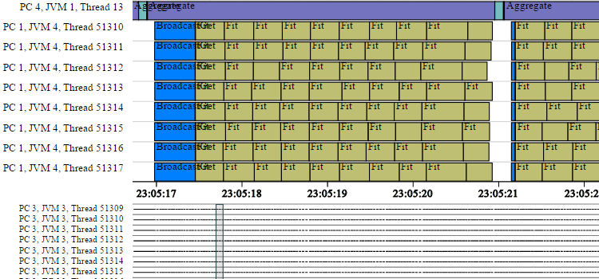
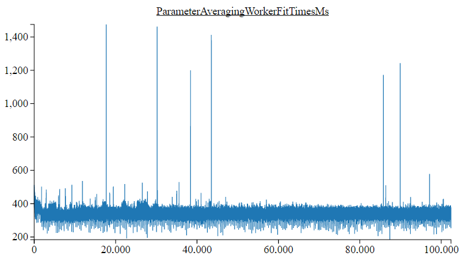

# 基于Spark的Deeplearning4j

深度学习的计算强度较高，所以对于规模非常大的数据集而言，速度很重要。您可以采用速度更快的硬件、优化的代码以及某种形式的并行来处理问题。

数据并行指切分大规模的数据集，然后将分片交给不同的神经网络，而每个网络可能都在各自不同的处理器核上运行。Deeplearning4j依靠Spark来实现数据并行，以并行方式定型模型，对这些模型产生的参数进行[迭代式平均化](./iterativereduce.html)，得到一个中央模型。（[如Jeff Dean等人在这篇论文中所述](https://static.googleusercontent.com/media/research.google.com/en//archive/large_deep_networks_nips2012.pdf)，模型并行可以让多个模型分别负责大型数据集中的不同部分而无需平均化。）

**目录**

* [概述](#overview)
* [基于Spark的DL4J如何进行分布式的网络定型](#how)
* [最简示例](#minimal)
* [配置TrainingMaster](#configuring)
* [在Spark上定型所需的依赖项](#dependencies)
* [Spark示例库](#examples)
* [在YARN上为Spark配置内存](#memoryyarn)
    * [Deeplearning4j（以及ND4J）的内存管理方式](#memory1)
    * [YARN的内存管理方式](#memory2)
    * [在YARN上为基于Spark的Deeplearning4j定型配置内存](#memoryyarn)
* [用Spark本地性配置来改善定型表现](#locality)
* [性能调试和定型表现信息收集](#sparkstats)
    * [调试收集表现信息时出现的“NTP服务器查询错误”](#sparkstatsntp)
* [缓存/持久化RDD<DataSets>和RDD<INDArrays>](#caching)
* [Kryo序列化与Deeplearning4j并用](#kryo)
* [在亚马逊Elastic MapReduce上使用英特尔MKL和Deeplearning4j](#mklemr)

## <a name="overview">概述</a>

Deeplearning4j支持在Spark集群上定型神经网络，以便加快网络定型速度。

DL4J定义了两个与MultiLayerNetwork和ComputationGraph相似的类，用于在Spark上定型神经网络：

- SparkDl4jMultiLayer，MultiLayerNetwork的包装类
- SparkComputationGraph，ComputationGraph的包装类

此二者均是标准单机类的包装类，所以不论是标准定型还是分布式定型，网络配置的过程（即创建一个MultiLayerConfiguration或ComputationGraphConfiguration）都是完全相同的。但是，基于Spark的分布式定型与本地定型有两个区别：数据的加载方式和定型的设置方式（需要一些额外的集群专用配置）。

在Spark集群上（使用spark-submit）进行网络定型的典型工作流程如下所示。

1. 创建网络定型类。这通常需要用到下列代码：
    * 指定网络配置（MultiLayerConfiguration或ComputationGraphConfiguration），与单机定型一样
    * 创建一个TrainingMaster实例，指定分布式定型的实际开展方式（下文详述）
    * 用网络配置和TrainingMaster对象创建SparkDl4jMultiLayer或SparkComputationGraph实例
    * 加载定型数据。有几种不同的数据加载方式，各有利弊；详情将在后续的文档中提供
    * 对SparkDl4jMultiLayer或SparkComputationGraph实例调用适当的```fit```方法
    * 保存或使用已定型的网络（已定型的MultiLayerNetwork或ComputationGraph实例）
2. 打包jar文件，准备用Spark submit提交
    * 如果您在使用maven，方法之一是运行“mvn package -DskipTests”
3. 以适合您的集群的启动配置调用Spark submit


**注**：对于单机定型，Spark本地*可以*和DL4J一同使用，不过我们不推荐这种方式（因为Spark的同步和序列化开销）。您可以考虑以下的方法：

* 单CPU/GPU系统可用标准的MultiLayerNetwork或ComputationGraph来定型
* 多CPU/GPU系统可采用[ParallelWrapper](https://github.com/deeplearning4j/deeplearning4j/blob/master/deeplearning4j-core/src/main/java/org/deeplearning4j/parallelism/ParallelWrapper.java)。上述方法在功能上与运行Spark的本地模式相同，但开销更低（因而可以产生更好的定型表现）。

## <a name="how">基于Spark的DL4J如何进行分布式的网络定型</a>

DL4J的当前版本用一种参数平均化的流程来定型网络。未来版本可能会加入其他的分布式网络定型方法。


从概念上看，采用参数平均化方法的网络定型流程很简单：

1. 主节点（Spark驱动）以初始的网络配置及参数开始运行
2. 数据按TrainingMaster的配置被切分为一定数量的子集。
3. 对数据分片进行迭代。对于每个分片的定型数据：
    * 将配置、参数（以及动量/rmsprop/adagrad更新器状态，如适用）从主节点分发至各个工作节点
    * 每个工作节点用数据分片中相应的一部分来定型
    * 将参数（以及更新器状态，如适用）平均化，并将平均化结果返回至主节点
4. 定型完毕，主节点得到已定型网络的一份副本

举例而言，下图显示了有五个工作节点（W1、……、W5）的参数平均化流程，参数平均化频率为1。
和线下定型一样，定型数据集被切分为多个子集（在非分布式学习中一般称为微批次）；先后用各个数据分片进行定型，每个工作节点分到数据分片的一个子集。在实际操作中，分片的数量会依据定型配置（取决于工作节点数量、平均化频率和工作节点的微批次大小－参见配置段落）自动决定。


## <a name="minimal">最简示例</a>

本段介绍在Spark上定型网络所需的最基本要素。
有关各种数据加载方法的详情即将推出。

```java
JavaSparkContent sc = ...;
JavaRDD<DataSet> trainingData = ...;
MultiLayerConfiguration networkConfig = ...;

//创建TrainingMaster实例
int examplesPerDataSetObject = 1;
TrainingMaster trainingMaster = new ParameterAveragingTrainingMaster.Builder(examplesPerDataSetObject)
        .(other configuration options)
        .build();

//创建SparkDl4jMultiLayer实例
SparkDl4jMultiLayer sparkNetwork = new SparkDl4jMultiLayer(sc, networkConfig, trainingMaster);

//用定型数据训练网络：
sparkNetwork.fit(trainingData);
```

## <a name="configuring">配置TrainingMaster</a>

DL4J中的TrainingMaster抽象类（接口）可以提供不同的定型实现，与SparkDl4jMultiLayer和SparkComputationGraph配合使用。

目前DL4J提供一种实现：ParameterAveragingTrainingMaster。它用于实现上文图中所示的参数平均化流程，
可以用构建器（builder）模式来创建：

```java
    TrainingMaster tm = new ParameterAveragingTrainingMaster.Builder(int dataSetObjectSize)
            ...(此处插入配置)
            .build();
```

ParameterAveragingTrainingMaster定义了一系列配置选项，用于控制定型的执行方式：

* **dataSetObjectSize**：必需选项。在builder构造函数中指定。该项的值指定每个DataSet对象中有多少个样例。总体上的规则是：
    * 如果定型使用的是经过预处理的DataSet对象， 该项的值应等于已预处理的DataSets对象的大小
    * 如果定型直接使用字符串（例如CSV数据通过一些步骤转换为一个```RDD<DataSet>```），那么该项的值通常为1
* **batchSizePerWorker**：该项目控制每个工作节点的微批次大小。这与单机定型中的微批次大小设定相仿。换言之，这是每个工作节点中每次参数更新所使用的样例数量。
* **averagingFrequency**：该项目控制参数平均化和再分发的频率，按大小等于batchSizePerWorker的微批次的数量计算。总体上的规则是：
    * 平均化周期太短（例如averagingFrequency=1）可能效率不佳（相对于计算量而言，网络通讯和初始化开销太多）
    * 平均化周期太长（例如averagingFrequency=200）可能会导致表现不佳（不同工作节点实例的参数可能出现很大差异）
    * 通常将平均化周期设在5～10个微批次的范围内比较保险。
* **workerPrefetchNumBatches**：Spark工作节点能够以异步方式预抓取一定数量的微批次（DataSet对象），从而避免数据加载时的等待。
    * 将该项的值设置为0会禁用预提取。
    * 比较合理的默认值通常是2。过高的值在许多情况下并无帮助（但会使用更多的内存）
* **saveUpdater**：在DL4J中，动量、RMSProp和AdaGrad等定型方法称为“更新器”。大多数更新器都有内部历史记录或状态。
    * 如果saveUpdater设为真：更新器的状态（在每个工作节点中）将会被平均化并和参数一起返回至主节点；当前的更新器状态也会从主节点分发至工作节点。这会增加额外的时间和网络流量，但有可能改善定型结果。
    * 如果saveUpdater设为假：更新器状态（在每个工作节点中）会被放弃，然后各个工作节点的更新器会被重置/重新初始化。
* **rddTrainingApproach**：从0.6.0版开始，DL4J提供两种用```RDD<DataSet>```或```RDD<MultiDataSet>```定型的方法，分别是```RDDTrainingApproach.Export```（导出式）和```RDDTrainingApproach.Direct```（直接式）
    * 导出式：（默认）先将```RDD<DataSet>```以分批次和序列化的形式保存至磁盘。执行器随后会按要求异步加载DataSet对象。这种方法的效果好于直接式方法，尤其是对大型数据集和多个epoch而言。如此可以避免直接式方法的切分和重分区开销，使用的内存也更少。临时文件可以用```TrainingMaster.deleteTempFiles()```来删除
    * 直接式：这是DL4J早先版本的运作方法。对于内存可以完全容纳的小型数据集，这种方法可以带来较好的表现。
* **exportDirectory**：仅用于导出式方法（上一种方法）。该项目控制临时数据文件的存储位置。默认：使用```{hadoop.tmp.dir}/dl4j/```目录，其中```{hadoop.tmp.dir}```是Hadoop临时目录属性值。
* **storageLevel**：仅适用于（a）直接式定型方法，以及（b）用```RDD<DataSet>```或```RDD<MultiDataSet>```数据定型时。这是DL4J持久化RDD的存储级别。默认：StorageLevel.MEMORY_ONLY_SER.
* **storageLevelStreams**：仅在采用```fitPaths(RDD<String>)```方法时适用。这是DL4J在持久化```RDD<String>```时所用的存储级别。默认：StorageLevel.MEMORY_ONLY。该默认值几乎适用于所有的情形。
* **repartition**：决定数据应在何时重分区的配置设定。ParameterAveragingTrainingMaster会进行mapParititons操作；因此分区数量（以及每个分区中的值）对于集群的妥善利用有着重大意义。但是，重分区不是一项无开销的操作，因为一部分数据必须在整个网络中进行复制。具体有以下几种选项：
    * Always：默认选项，亦即始终对数据进行重分区，确保分区数量正确。推荐采用该选项，尤其是使用RDDTrainingApproach.Export（0.6.0版开始为默认）或```fitPaths(RDD<String>)```时
    * Never：从不对数据进行重分区，无论分区如何失衡。
    * NumPartitionsWorkersDiffers：只有在分区数量和工作节点数量（处理器核总数）不同的时候才进行重分区。请注意，即使分区数量等于处理器核的总数，也无法保证每个分区内的DataSet对象数量正确：有些分区可能会比其他分区大很多或小很多。
* **repartitionStrategy**：重分区的策略
    * Balanced：（默认）这是DL4J自定义的一项重分区策略。与SparkDefault选项相比，这种策略会尝试确保分区之间更加平衡（就对象数量而言）。但在实际操作中，执行平衡策略需要额外的计数操作；在某些情况下（特别是小型网络或每个微批次计算量较少的网络），其效益可能无法超过改善重分区所需的额外开销。推荐采用该选项，尤其是使用RDDTrainingApproach.Export（0.5.1版开始为默认）或```fitPaths(RDD<String>)```时
    * SparkDefault：这是Spark所用的标准重分区策略。这种策略基本上就是将初始RDD中的每个对象单独地随机映射至N个RDD中的一个。因此，分区的平衡性可能不是最理想；由此造成的问题对比较小的RDD而言可能尤其严重，比如用于已预处理的DataSet对象和高频率平均化的小型RDD（原因就是随机采样差异）。


## <a name="dependencies">在Spark上定型所需的依赖项</a>

若要在Spark上运行DL4J，您需要安装deeplearning4j-spark依赖项：

```
        <dependency>
        <groupId>org.deeplearning4j</groupId>
        <artifactId>dl4j-spark_${scala.binary.version}</artifactId>
        <version>${dl4j.version}</version>
        </dependency>
```

请注意，```${scala.binary.version}```是一项Maven属性，取值为```2.10```或```2.11```，应当与您所使用的Spark版本相匹配。


## <a name="examples">Spark示例库</a>

[Deeplearning4j示例库](https://github.com/deeplearning4j/dl4j-examples) （[旧的示例见此处](https://github.com/deeplearning4j/dl4j-spark-cdh5-examples)）中包含一些Spark示例。


## <a name="memoryyarn">在YARN上为Spark配置内存</a>

Apache Hadoop YARN是Hadoop集群常用的资源管理器（[Apache Mesos](http://mesos.apache.org/)是另一种选择）。
用Spark submit向一个集群提交一项任务的时候，必须指定几个配置选项，比如执行器数量、每个执行器的处理器核数量，以及每个执行器的内存。

为了让基于Spark的DL4J定型取得最理想的表现（同时避免超出内存限制），还需要进行一些额外的内存配置。本段将解释其必要性，并介绍实际的操作方法。

### <a name="memory1">Deeplearning4j（以及ND4J）的内存管理方式</a>

Deeplearning4j建立在数值计算库ND4J的基础之上。DL4J中的神经网络实现是用ND4J中的矩阵和向量化运算构建的。

ND4J的设计要素之一是利用了堆外内存管理。这意味着ND4J分配给INDArrays的内存不在JVM堆之内（与标准的Java对象不同），而是属于JVM之外的单独的内存池。这种内存管理是用[JavaCPP](https://github.com/bytedeco/javacpp)来实现的。

堆外内存管理有一系列好处。
最主要的是，它让高性能的原生（C++）代码可以被高效地用于数值运算（使用OpenBLAS和英特尔MKL等BLAS库，以及C++库[Libnd4j](https://github.com/deeplearning4j/libnd4j)）。堆外内存管理对于用CUDA进行高效的GPU运算也是必需的。如果分配了JVM堆内的内存（与其他JVM BLAS实现相同），就必须首先将数据从JVM复制出来，进行运算，再将结果复制回去——这样会增加每次运算所需的内存和时间开销。相比之下，ND4J在数值运算过程中只需要使用指针传递，完全避免了数据复制的问题。

此处的重点在于，堆内（JVM）内存和堆外（ND4J/JavaCPP）内存是两个相互独立的内存池，大小可以分别设置；在默认情况下，JavaCPP允许的堆外内存分配大小等于Runtime.maxMemory()的设置（参见[代码](https://github.com/bytedeco/javacpp/blob/master/src/main/java/org/bytedeco/javacpp/Pointer.java))——这一默认设置与JVM用于配置Java内存的'Xmx’内存设置大小相等。

如需手动控制JavaCPP所能分配的堆外内存上限，可以设置```org.bytedeco.javacpp.maxbytes```系统属性。对于在本地运行的单一JVM，我们会用```-Dorg.bytedeco.javacpp.maxbytes=1073741824```来将堆外内存分配限制在1GB以内。后面的段落将会介绍如何在YARN上为Spark进行这项配置。


### <a name="memory2">YARN的内存管理方式</a>

如上文所述，YARN是一种集群资源管理器。在向一个由YARN管理的集群提交一项计算任务（比如DL4J Spark网络定型）时，YARN会负责管理有限资源池（内存、CPU核）的分配，决定如何将资源分配给您的任务（以及所有其他任务）。有关YARN和资源分配的更多细节，请参阅[这篇文章](http://blog.cloudera.com/blog/2015/09/untangling-apache-hadoop-yarn-part-1/)和[这篇文章](http://blog.cloudera.com/blog/2015/03/how-to-tune-your-apache-spark-jobs-part-2/)。


与我们的应用情形相关的要点如下：

* YARN任务在容器（container）内运行，每个容器有固定的内存量
* 分配给一个YARN容器的内存量包括堆内内存总量（即JVM内存大小）和用户请求的堆外内存（YARN称之为“额外内存开销（memory overhead）”）
* 如果一项任务所需的内存超出了可以分配给容器的总量，YARN有可能会“杀死”（kill）容器和其中运行的执行器。具体行为取决于YARN的配置。
* 程序超出容器内存限制通常是因为堆外内存；堆内（JVM）内存的上限会通过Spark submit设置成固定的启动参数。


有两项关键的配置选项可以控制YARN分配给容器的内存量。

1. ```spark.executor.memory```: 这是标准的JVM内存分配，与单一JVM的Xmx设置相同。
2. ```spark.yarn.executor.memoryOverhead```: 这是分配给容器的“额外”内存量。这部分内存不是分配给JVM的，因此可以供利用堆外内存的代码使用（包括ND4J/JavaCPP）。

在默认情况下，```spark.yarn.executor.memoryOverhead```设置等于执行器内存的10%，下限为384MB。
更多详情请参阅[Apache Spark的YARN文档](http://spark.apache.org/docs/latest/running-on-yarn.html)。

由于ND4J会使用大量堆外内存，在Spark上定型时通常有必要提高额外内存开销的设置。


### <a name="memory3">在YARN上为基于Spark的Deeplearning4j定型配置内存</a>

根据上一段的主要内容，在通过YARN运行基于Spark的分布式神经网络定型时，必须要做以下几件事：

1. 用```spark.executor.memory```指定执行器JVM内存量
2. 用```spark.yarn.executor.memoryOverhead```指定YARN容器的额外内存开销
3. 用```org.bytedeco.javacpp.maxbytes```系统属性告诉ND4J/JavaCPP可以使用的堆外内存量

在设置这些值的时候，有几点需要注意。
首先，```spark.executor.memory```与```spark.yarn.executor.memoryOverhead```之和必须小于YARN所能分配给一个容器的内存量上限。通常这一上限可以在YARN配置或YARN资源管理器网页UI中找到。如果超过这一上限，YARN可能会拒绝您的任务。

其次，```org.bytedeco.javacpp.maxbytes```的值务必要小于```spark.yarn.executor.memoryOverhead```。上文曾提到，默认的memoryOverhead设置是执行器内存的10%——这是因为JVM自身（以及其他的库）也可能需要一些堆外内存。因此，我们不能让JavaCPP用完所有的非JVM内存。  

第三，由于DL4J/ND4J使用堆外内存来处理数据、参数和激活函数，所以分配给JVM（即executor.memory）的内存量可以比其他状况少一些。当然，我们还需要足够的JVM内存来满足Spark自身（以及我们使用的其他库）的需求，所以也不能减少得太多。

下面来看示例。假设我们在运行Spark定型，想要以如下方式配置内存：

* 4个执行器，每个有8个核
* YARN可分配给容器的内存上限：11GB
* JVM（执行器和驱动）内存：4GB
* ND4J/JavaCPP堆外内存（执行器和驱动）：5GB
* 额外的堆外内存：1GB

总计堆外内存为5+1=6GB；总内存（JVM + 堆外/额外开销）为4+6=10GB，小于YARN的分配上限11GB。注意JavaCPP的内存是以比特为单位指定的，5GB是5,368,709,120比特；YARN的额外内存开销以MB为单位指定，6GB是6,144MB。

Spark submit参数的指定方式如下：

```
--class my.class.name.here --num-executors 4 --executor-cores 8 --executor-memory 4G --driver-memory 4G --conf "spark.executor.extraJavaOptions=-Dorg.bytedeco.javacpp.maxbytes=5368709120" --conf "spark.driver.extraJavaOptions=-Dorg.bytedeco.javacpp.maxbytes=5368709120" --conf spark.yarn.executor.memoryOverhead=6144
```

## <a name="locality">用Spark本地性配置来改善定型表现</a>

Spark的本地性（locality）设置是一项可选配置，有助于提高定型表现。

总结：为Spark submit配置添加```--conf spark.locality.wait=0```会让网络的定型操作提早开始，有可能缩短定型时间。

### 为什么Spark本地性配置可以改善定型表现

Spark有一系列配置选项，用于决定如何控制执行。其中一个重要的部分是有关于本地性的设置。
简而言之，本地性就是指数据相对于其处理地点的位置。假设有一个空闲的执行器，但数据必须跨网络复制才能处理。Spark必须决定是应该执行网络传输，还是应该等待可以在本地访问数据的执行器变为空闲状态。在默认情况下，Spark不会立即将数据跨网络传输至空闲的执行器，而是会稍作等待。这样的默认行为或许适用于其他任务，但在用Deeplearning4j定型神经网络时，这种方式不利于集群利用率的最大化。

深度学习的计算强度大，因此每个输入的DataSet对象的计算量都相对较高。此外，在Spark定型过程中，DL4J会确保每个执行器恰好进行一个任务（分区）。所以，更好的方式始终是立即将数据传输至空闲的执行器，而非等待另一个执行器变为空闲状态。计算时间会超过任何网络传输时间。
让Spark采用这种做法的方式是为Spark submit配置添加```--conf spark.locality.wait=0```。

更多详情请参阅[Spark调试指南－数据本地性](http://spark.apache.org/docs/latest/tuning.html#data-locality)和[Spark配置指南](http://spark.apache.org/docs/1.6.2/configuration.html#scheduling)。

## <a name="sparkstats">性能调试和定型表现信息收集</a>

Deeplearning4j的Spark定型实现能够收集表现信息（例如创建初始网络、接收广播数据、进行网络定型操作等所需的时间）。
这样的信息可以用于识别和调试在Spark上定型Deeplearning4j网络时出现的任何表现问题。

收集和导出表现信息的代码如下：

```
    SparkDl4jMultiLayer sparkNet = new SparkDl4jMultiLayer(...);
    sparkNet.setCollectTrainingStats(true);     //启用收集
    sparkNet.fit(trainData);    //以常规方式定型网络

    SparkTrainingStats stats = sparkNet.getSparkTrainingStats();    //获取收集到的统计信息
    StatsUtils.exportStatsAsHtml(stats, "SparkStats.html", sc);     //导出至独立的HTML文件
```

请注意，截止到Deeplearning4j的0.6.0版，当前的HTML渲染实现还无法很好地适应大量的统计信息，即大型集群或长期运行的任务。我们正在处理这一问题，未来发布的版本将有所改善。

时间线信息可以通过Spark定型统计信息收集功能获得：



图表之一（工作节点fit(DataSet)时间）可以通过Spark Stats获得




### <a name="sparkstatsntp">调试收集表现信息时出现的“NTP服务器查询错误”</a>

在默认情况下，Spark定型表现统计依赖一项网络时间协议（NTP）实现来确保所有计算机的事件时间戳保持一致，
否则就无法保证每个工作节点的时钟都是准确的——时钟可能出现任意/未知的误差。如果没有NTP实现，就不可能准确地描绘时间线信息（如上文的时间线图所示）。

有可能会出现```NTPTimeSource: Error querying NTP server, attempt 1 of 10```这样的错误信息。有时这些错误是暂时的（之后重试可能会恢复正常），可以忽略。
但是，如果Spark集群中有一个或多个工作节点无法访问互联网（更具体而言，是无法访问NTP服务器），那么所有重试可能都会出现错误。

有两种解决办法：

1. 不使用```sparkNet.setCollectTrainingStats(true)```——这项功能是可选的（不是定型必需的功能），默认情况下是禁用的
2. 将系统的时间来源设置为本地计算机时钟，而非NTP服务器（但是注意这有可能导致时间线信息变得很不准确）。

如果要用系统时钟作为时间来源，可以将以下代码添加至Spark submit：
```
--conf spark.driver.extraJavaOptions=-Dorg.deeplearning4j.spark.time.TimeSource=org.deeplearning4j.spark.time.SystemClockTimeSource
--conf spark.executor.extraJavaOptions=-Dorg.deeplearning4j.spark.time.TimeSource=org.deeplearning4j.spark.time.SystemClockTimeSource
```


## <a name="caching">缓存/持久化RDD<DataSets>和RDD<INDArrays></a>

Spark在处理包含大型堆外组件的Java对象，比如Deeplearning4j中使用的DataSet和INDArray对象时，有一些特殊问题需要注意。本段将介绍与这些对象的缓存/持久化相关的问题。

需要了解的要点包括：

* ```MEMORY_ONLY```和```MEMORY_AND_DISK```持久化在使用堆外内存时可能出现问题，因为Spark无法很好地估计RDD中对象的大小。这可能会造成内存不足的问题。
* 若要持久化```RDD<DataSet>```或```RDD<INDArray>```以供重复使用，请采用```MEMORY_ONLY_SER```或```MEMORY_AND_DISK_SER```
* 从Deeplearning4j 0.5.1版开始，在默认情况下，定型数据（```RDD<DataSet>```）将首先被导出至磁盘（这会改善表现，尤其是对较大的定型集而言）；不必用手动方式持久化/缓存定型数据RDD，也不建议这样操作。（这一行为可以用rddTrainingApproach配置选项来配置）。

### 为什么推荐使用MEMORY_ONLY_SER或MEMORY_AND_DISK_SER

Apache Spark提高性能的方式之一是允许用户将数据缓存至内存。可以用```RDD.cache()```或```RDD.persist(StorageLevel.MEMORY_ONLY())```将数据内容以反序列化（即标准的Java对象）形式存储在内存中。
其基本原理很简单：RDD持久化后，就可以从内存（或者磁盘，取决于具体配置）中调出重复使用，而无需重新计算。但是，内存可能无法完全容纳较大的RDD。在这种情况下，RDD的一些部分必须重新计算或从磁盘中加载，具体取决于持久化时所用的存储级别。此外，为了避免使用过多的内存，Spark会在需要时删除RDD的一些部分（块）。

Spark中可用的主要存储级别如下所列。具体说明参见[Spark编程指南](https://spark.apache.org/docs/1.6.2/programming-guide.html#rdd-persistence)。

* MEMORY_ONLY
* MEMORY_AND_DISK
* MEMORY_ONLY_SER
* MEMORY_AND_DISK_SER
* DISK_ONLY

Spark的问题在于它处理内存的方式。具体来说，Spark在删除RDD的一部分（一块）时，会根据对块的大小的估计来进行判断。而Spark估计块的大小的方式取决于持久化级别。对于```MEMORY_ONLY```和```MEMORY_AND_DISK```持久化，估计的方式是遍历Java对象图，即读取一个对象中的字段，以递归方式估计对象大小。但是，这一过程并不会考虑Deeplearning4j或ND4J所使用的堆外内存。对于DataSets和INDArrays这样的对象（几乎完全存储在堆外）而言，Spark的这种估计方法会大大低估它们的真实大小。此外，Spark在决定保留或删除块的时候只会考虑堆内内存的使用量。在使用```MEMORY_ONLY```和```MEMORY_AND_DISK```持久化的情况下，由于DataSet和INDArray对象的堆内内存用量很小，Spark会保留过多的这两种对象，导致堆外内存用尽，造成内存不足的问题。

但在```MEMORY_ONLY_SER```和```MEMORY_AND_DISK_SER```级别的持久化中，Spark会以序列化形式将块存储在Java堆内。Spark可以准确估计以序列化形式存储的对象大小（序列化对象没有堆外内存部分），因此Spark会在需要时删除一些块，避免出现内存不足的问题。


## <a name="kryo">Kryo序列化与Deeplearning4j并用</a>

Kryo是经常与Apache Spark配合使用的序列化库，据称能通过减少对象序列化所需的时间来提高性能。
但是，Kryo无法很好地适应ND4J的堆外数据结构。若要在Apache Spark上同时使用ND4J和Kryo序列化，就必须对Spark进行一些额外的配置设置。
如果Kryo的配置不正确，某些INDArray可能会出现NullPointerExceptions，原因是错误的序列化。

若要使用Kryo，可以添加合适的[nd4j-kryo依赖项](http://search.maven.org/#search%7Cga%7C1%7Cnd4j-kryo)，并将Spark配置设为使用Nd4j Kryo Registrator，方法如下：

```
    SparkConf conf = new SparkConf();
    conf.set("spark.serializer", "org.apache.spark.serializer.KryoSerializer");
    conf.set("spark.kryo.registrator", "org.nd4j.Nd4jRegistrator");
```

请注意，在使用Deeplearning4j的SparkDl4jMultiLayer或SparkComputationGraph类时，如果Kryo配置不正确，会记录一次警报。

## <a name="mklemr">在亚马逊Elastic MapReduce上使用英特尔MKL和Deeplearning4j</a>

Maven中央仓库上发布的DL4J版本采用的是OpenBLAS。因此本段不适用于选择了Maven中央仓库提供的Deeplearning4j的用户。

对于用英特尔MKL作为BLAS库从源码构建的DL4J，还需要一些额外的配置才能在亚马逊Elastic MapReduce上正常运行。
在EMR中创建一个集群时，若要使用英特尔MKL，就必须提供一些额外的配置。

依次进入Create Cluster（创建集群） -> Advanced Options（高级选项） -> Edit Software Settings（编辑软件设置），然后添加以下代码：

```
[
    {
        "Classification": "hadoop-env",
        "Configurations": [
            {
                "Classification": "export",
                "Configurations": [],
                "Properties": {
                    "MKL_THREADING_LAYER": "GNU",
                    "LD_PRELOAD": "/usr/lib64/libgomp.so.1"
                }
            }
        ],
        "Properties": {}
    }
]
```


## 相关资源

* [Deeplearning4j示例库](https://github.com/deeplearning4j/dl4j-examples)
* ND4S：[为Scala编写的N维数组](https://github.com/deeplearning4j/nd4s)
* [ND4J、Scala和科学计算](http://nd4j.org/scala.html)
* [迭代式归纳简介](./iterativereduce)
