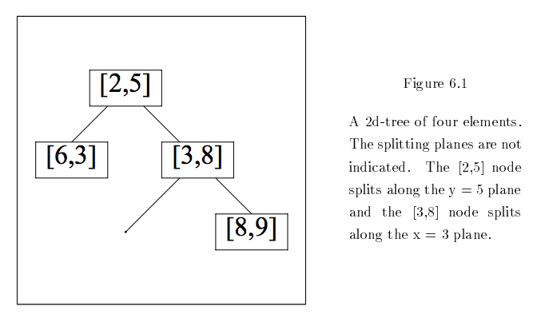
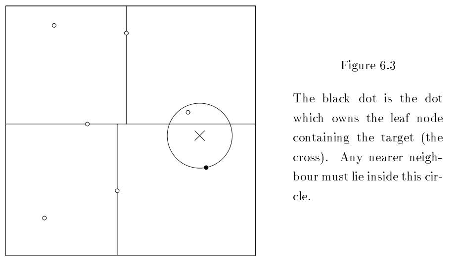
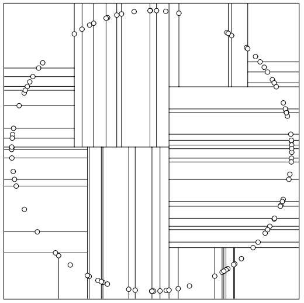

# 机器学习：应用案例

目录

* <a href="#visualization">可视化</a>
* <a href="#k-means">K－均值聚类</a>
* <a href="#transfer">迁移学习</a>
* <a href="#knn">K－最近邻</a>
* <a href="#vp">VP树</a>

深度神经网络习得的特征可以用于分类、聚类与回归。 

神经网络实际上就是非线性的通用拟合器。神经网络通过预训练或者反向传播来学习重构数据，进而捕获“良好”的特征。采用反向传播进行学习的网络借助任意损失函数来将输入映射至输出。

神经网络习得的特征可以输入任何其他类型的算法，包括用于将输入分组的传统机器学习算法、softmax/逻辑回归分类算法、预测某项值的简单回归算法等。 

所以您可以把神经网络视为能与其他函数组合的特征提取器模块。例如，您可以让一个卷积神经网络通过有监督训练学习ImageNet的图像特征，然后再将神经网络习得的激活值/特征输入另一个算法，让这个算法学习如何将图像分组。

神经网络捕获的特征有以下几种应用方式：

## <a name="visualization">可视化</a>

**[t-分布领域嵌入算法（t-SNE）](https://en.wikipedia.org/wiki/T-distributed_stochastic_neighbor_embedding)**是一种用于将高维度数据转换为二维或三维数据的算法，降维后的数据可用散点图来表示。t-SNE用于寻找数据中的潜在趋势。Deeplearning4j中的一部分可视化依靠t-SNE来实现。t-SNE是一种展示网络习得特征的最终状态的有趣方法。更多信息及相关下载请参见[t-SNE主页](https://lvdmaaten.github.io/tsne/)。

**渲染**－Deeplearning4j采用视觉渲染这一近似准确的示意性方法来监测神经网络的学习状况。也就是说，我们用渲染图像来排除问题。渲染图像可以帮助将激活值随时间推移的变化情况可视化，而激活值的变化情况正是监测神经网络学习内容与学习量的一项指标。 

## <a name="k-means">K－均值聚类</a>

K－均值算法用于对激活值进行自动标记；标记的依据是激活值在向量空间内与其他输入的原始距离。K－均值算法没有目标或损失函数，而是会选择所谓的*质心（centroid）*。算法通过反复计算所有数据点的平均值来选取质心，  根据新数据到给定质心的距离来对新数据进行分类。每个质心都与一项标签相关联。这种算法是无监督学习（不采用损失函数的学习）的一个例子。 

## <a name="transfer">迁移学习</a>

迁移学习将一个神经网络的激活值用作另一算法或分类器的特征。例如，您可以先用ImageNet数据集训练一个卷积网络模型，然后再将全新的图像经由这个卷积网络模型输入另一算法，比如K－最近邻算法。迁移学习的严格定义就是：用一个数据集训练模型后，再将模型应用与另一问题的算法。 

## <a name="knn">K－最近邻</a>

Mike Depies在[这篇教程](https://depiesml.wordpress.com/2015/09/03/learn-by-implementation-k-nearest-neighbor/)中介绍了如何将Deeplearning4j与K－最近邻算法结合起来。

K－最近邻算法用于分类和回归，其核心是一个K-d树。[K-d树](https://en.wikipedia.org/wiki/K-d_tree)是一种用于存放k维空间的样本点有限集合的数据结构。K-d树将任意维度的空间划分为树的形状，也可称为*制高点树（VP树）*。K-d树用树形结构对空间进行细分，让您可以利用树来定位，寻找距离最近的点。输入数据会被赋予最近点的相关标签。 

将输入和训练样例变为向量。训练向量可以组织成二叉树的形式，如下图所示：

 

如果在二维平面中将这些节点可视化，在每个分叉处划分空间，那么K-d树的形状会如下图所示：

 

现在假设您将一项新的输入X置于K-d树划分出的某一空间范围中。如此便可识别出该空间在树上的父节点和子节点空间。随后以X为圆心，以该空间至其子节点的距离为半径作一个圆。只有在圆内的其他节点才可能距离更近。 

 

最后，K-d树甚至可以用来进行艺术创作：

 

*（特别感谢[CMU的Andrew Moore](http://www.autonlab.org/autonweb/14665/version/2/part/5/data/moore-tutorial.pdf?branch=main&language=en)提供高质量示意图。）*

### <a name="vp">VP树</a>

K－最近邻算法的基本实现是VP树，我们的实现方法见[此处](https://github.com/deeplearning4j/deeplearning4j/blob/master/deeplearning4j-core/src/main/java/org/deeplearning4j/clustering/vptree/VPTree.java#L59-59)。

### 其他资源

* [深度神经网络简介](./neuralnet-overview.html)
* [MNIST基础教程](./mnist-for-beginners.html)
* [Deeplearning4j快速入门示例](./quickstart.html)
* [ND4J：面向JVM的Numpy](http://nd4j.org)
