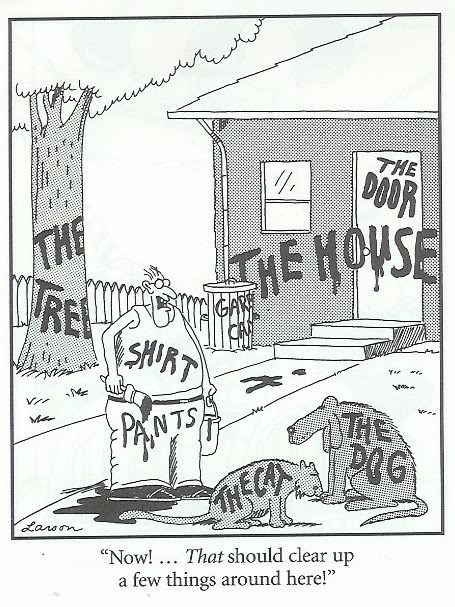

# 何时选择深度学习

深度学习与机器学习和其他优化算法之间是怎样的关系？深度学习可以解决哪些类型的问题？在选择用于解决数据问题的工具时，您应当首先考虑这两个问题。 

深度学习与机器学习是近义词，机器学习的范围更广，而深度学习是机器学习中较为先进的一个具体领域。从技术层面上看，深度学习一词囊括了多种神经网络，它们都具备三个或更多的层，即有至少一个隐藏层，以及可见的输入和输出层。 

那么深度学习究竟有哪些能力，又有哪些限制呢？深度学习可以识别模式并进行分类。换言之，神经网络可以告诉计算机它看到的、听到的是什么，或者接收到的数字流是什么。

人类不假思索就能做到这件非常基本的事情，但对于计算机来说，这是极其复杂的任务，只有进行大量运算之后才能完成。面对一组像素时，没有一台计算机能自然而然地体会到房子、树和猫之间的区别。而深度学习就是下图中拿着油漆刷子的人。 

### 先决条件和考量因素

深度学习需要大量数据才能顺利运作。所以您首先要有大量的数据。（与一般的机器学习相比，深度学习在处理**非结构化数据**方面独具优势。深度学习算法不需要对所有数据都进行标记就能识别模式。）

下一步则需要明确您想要解答的问题。所要处理的是哪种类型的非结构化数据？是需要标记的图像吗？是需要识别姓名的语音？是需要与书面文本相匹配的言语段落？是包含多个需要分析的物体的视频？还是需要按情感或具体内容来进行分组的文本？以上都是深度学习可以帮助解决的实际问题。如果您的课题在此之列，那么下一步应当[选择合适的算法](./neuralnetworktable.html)。 

简言之：研究课题是否需要在海量输入中识别某种对象或现象？在进行判定之前是否需要分离出某些特定事件？如果对这两个问题回答“是”，那么您就有可能选择深度学习。 

### 相似与不同

举例来说，深度学习算法可以分析图像之间的相似性，从而找出同一个人脸部的所有照片，然后显示在Facebook的某个页面上。反过来，深度学习算法也可以分析图像之间的差异，然后依据面容来辨别夜里出现在你家门口的是否是陌生人。深度学习算法可以将相似的对象分组，也可以指明不同的对象。

指明差异也称为**异常检测**。由于深度学习最善于处理文本、声音和图像等非结构化媒体，我们就举一个异常视觉信号的例子。 

医生每天都会靠检查CT扫描图片来寻找肿瘤——有时他们能发现肿瘤，有时却不能。医院存有大量标记出癌症病灶的图像，同时也有大量图像中的病灶未能被检测出来。此时就可以用到深度学习网络，将已标记的数据作为训练数据集，在训练之后对尚未标记的图像进行分类。 

输入了足够多的已标记癌症诊断图后，深度学习网络能学会如何辨识更细微的模式，而医生们几乎无法察觉到这样的细节。 

想象深度学习可以以同样的准确率来分析视频、声音、文本和时间序列数据，识别人脸、言语、相似的文档和股票价格变动中的信号。深度学习算法或许能在机场航站楼中发现可疑人物，或者辨别出诈骗电话中的潜在声音信号失真。

对于时间序列数据和声音而言，深度学习算法能够分析出一种模式的开头并填充剩下的部分，无论需要补充的是一个完整的单词，还是市场的下一次波动。深度学习算法不计较模式是像人脸那样完全存在于当下，还是像口头说出的一句话那样部分存在于未来。 

### 提取特征

与此前所有的神经网络以及其他机器学习算法相比，深度学习的主要优势之一是能够以训练集中有限的特征为基础来推断出新的特征。也就是说，深度学习会寻找并发现和已知特征相关联的其他特征。它能发现在噪声中识别出信号的新方法。 

由于深度学习无需明确编程指示就能捕获特征，数据科学家有时可以依靠这类神经网络将工作周期缩短数月之多，而处理的特征集合的复杂度也要高于普通的机器学习工具。 

### 缺少对于特征的内省

尽管您可以对神经网络进行故障调试，但您无法将判定结果直接反向映射至某个具体的特征，这与随机森林的决策树不同。 

深度学习无法告诉您得出某一特定结论的原因。模型中的隐藏网络会根据训练集中人工标记的特征进行推断，自行捕获新的特征，而这些特征可能并未命名。 

在普通机器学习领域，特征由工程师人工创建，他们确切知道这些特征将对算法的最终判定结果起到多大贡献。 

深度学习不具备对于特征的内省能力。如果您需要区分欺诈和非欺诈行为，这一点就很重要，因为结论必须有记录在案的合理依据。假如老板问为什么要把某个客户的订单判定为欺诈，“我不知道”这样的回答显然不靠谱。

### 神经网络的优势

* 神经网络是最先进的文本处理算法：当前许多需要分析的数据都包含大量文本，而神经网络在自然语言处理领域占据着主导地位。神经网络还可以提供灵活的建模选项，同时尽可能地减少特征工程。相比之下，一部分替代方案的训练复杂度更高或一样高，例如条件随机场或生成模型，而另一部分替代方案在文本处理方面存在严重限制，例如随机森林。

* 神经网络是最先进的图像处理算法：卷积网络等当代深度学习框架将是有史以来处理此类数据的最佳选项（甚至可能是唯一可行的选项）。 

* 神经网络的大数据扩展过程比随机森林或图像模型等替代方案更为自然。

* 神经网络可以利用未标记的数据：深度学习提供各类帮助我们更好地利用未标记数据的方法。随机森林等其他方法不能如此轻而易举地使用未标记数据。

* 神经网络可以用于多重任务学习：很容易训练一个神经网络同时对多个目标进行预测。这常常能提高性能表现。在其他算法模式下开展多重任务学习，要么限制大得多（例如线性模型），要么操作更困难（例如随机森林）。

* 神经网络的学习内容是可用于其他任务的转换后的数据表示形式：神经网络通过明确指示学习原始数据的转换形式（在隐藏层内），而转换后的数据可以改变目的，用于其他任务。
