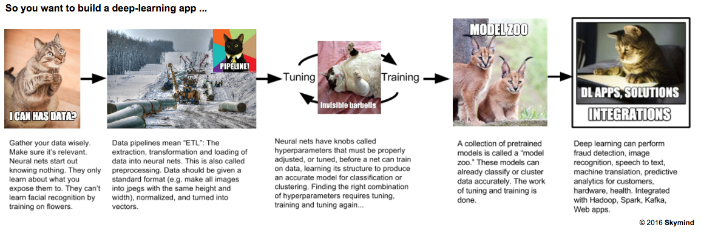

# The Data You Need For Deep Learning

The minimum requirements to successfully apply deep learning depends on the problem you’re trying to solve. In contrast to static, 
benchmark datasets like MNIST and CIFAR-10, real-world data is messy, varied and evolving, and that is the data practical deep learning 
solutions must deal with. 

 

## Types of Data

Deep learning can be applied to any data type. The data types you work with, and the data you gather, will depend on the problem you’re 
trying to solve. 

1. **Sound** (Voice Recognition)
2. **Text** (Classifying Reviews)
3. **Images** (Computer Vision)
4. **Time Series** (Sensor Data, Web Activity)
5. **Video** (Motion Detection)

## Use Cases

Deep learning can solve almost any problem of machine perception, including classifying data , clustering it, or making predictions about
it.

* Classification: This image represents a horse; this email looks like spam; this transaction is fraudulent
* Clustering: These two sounds are similar. This document is probably what user X is looking for
* Predictions: Given their web lob activity, Customer A looks like they are going to stop using your service

Deep learning is best applied to unstructured data like images, video, sound or text. An image is just a blob of pixels, a message is 
just a blob of text. This data is not organized in a typical, relational database by rows and columns. That makes it more difficult to 
specify its features manually. 

Common use cases for deep learning include sentiment analysis, classifying images, predictive analytics, recommendation systems, anomaly 
detection and more. 

If you are not sure whether deep learning makes sense for your use case, please [get in touch](https://skymind.io/contact).

## Data Attributes

For deep learning to succeed, your data needs to have certain characteristics.

### Relevancy

The data you use to train your neural net must be directly relevant to your problem; that is, it must resemble as much as possible the 
real-world data you hope to process. Neural networks are born as blank slates, and they only learn what you teach them. If you want them 
to solve a problem involving certain kinds of data, like CCTV video, then you have to train them on CCTV video, or something similar to 
it. The training data should resemble the real-world data that they will classify in production.

### Proper Classification

If a client wants to build a deep-learning solution that classifies data, then they need to have a labeled dataset. That is, someone 
needs to apply labels to the raw data: “This image is a flower, that image is a panda.” With time and tuning, this training dataset can 
teach a neural network to classify new images it has not seen before.

### Formatting

Neural networks eat vectors of data and spit out decisions about those vectors. All data needs to be vectorized, and the vectors should 
be the same length when they enter the neural net. To get vectors of the same length, it's helpful to have, say, images of the same size 
(the same height and width). So sometimes you need to resize the images. This is called data pre-processing. We provide a tool called 
[DataVec](http://deeplearning4j.org/datavec) for that.

### Accessibility

The data needs to be stored in a place that's easy to work with. A local file system, or HDFS (the Hadoop file system), or an S3 bucket 
on AWS, for example. If the data is stored in many different databases that are unconnected, you will have to build data pipelines. 
Building data pipelines and performing preprocessing can account for at least half the time you spend building deep-learning solutions. 

## Minimum Data Requirement

The minimums vary with the complexity of the problem, but 100,000 instances in total, across all categories, is a good place to start.

If you have labeled data (i.e. categories A, B, C and D), it’s preferable to have an evenly balanced dataset with 25,000 instances of 
each label; that is, 25,000 instances of A, 25,000 instances of B and so forth.

## Next Steps

If you’re wondering whether a deep learning solution can be built for your organization, please go through [this 
checklist](http://deeplearning4j.org/questions) or [get in touch](https://skymind.io/contact). These are the things you need to consider 
when deploying a deep learning solution to production. 
