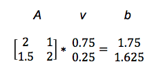

# Building a Go-playing bot with Eclipse Deeplearning4j

As long as there have been computers, programmers have been interested in artificial intelligence (or "AI"): implementing human-like behavior on a computer. Games have long been a popular subject for AI researchers. During the personal computer era, AIs have overtaken humans at checkers, backgammon, chess, and almost all classic board games. But the ancient strategy game Go remained stubbornly out of reach for computers for decades. Then in 2016, Google DeepMind's AlphaGo AI challenged 14-time world champion Lee Sedol and won four out of five games. The next revision of AlphaGo was completely out of reach for human players: it won 60 straight games, taking down just about every notable Go player in the process.

AlphaGo's breakthrough was enhancing classical AI algorithms with machine learning. More specifically, it used modern techniques known as deep learning -- algorithms that can organize raw data into useful layers of abstraction. These techniques are not limited to games at all. You will also find deep learning in applications for identifying images, understanding speech, translating natural languages, and guiding robots.

[Eclipse Deeplearning4J](https://projects.eclipse.org/projects/technology.deeplearning4j) (DL4J) is a powerful, general-purpose deep learning framework for the JVM with which you can build many interesting applications. In this article you will learn how to design a deep learning model for the game of Go that can predict the next move in any given board situation. This model is powered by records of Go games played by professional players. In the end, we will embed this model into a full-blown application that you can play against yourself in your browser!

## Overview

At the end of this article you will know quite a bit about the following topics:

* Understanding the fundamentals of how you can use machine learning, and deep learning in particular, for an interesting problem domain like Go.
* Playing the game of Go at a beginner level.
* Getting a glimpse at what neural networks are and how deep networks can be used for predicting Go moves.
* Understanding what it takes to build and deploy a Go bot.
* Building a deep learning model for Go move prediction with Eclipse DL4J.
* Running a deep learning bot with docker that you can play against.

Many of these topics we can barely scratch the surface of in this article. There's a whole lot more to explore and learn in deep learning and AI. However, many of the techniques that run the strongest Go AIs out there carry over to other applications -- and truly understanding them can be your gateway into more advanced AI topics.

If we've caught your attention and you want to learn more about this fascinating topic, go ahead and check out our new book [Deep Learning and the Game of Go](https://www.manning.com/books/deep-learning-and-the-game-of-go) (Manning).

Readers of this newsletter get a 40% discount off of all formats when using the following code: "smpumperla40". Code for the book and other useful material is freely available in the following [GitHub repository](https://github.com/maxpumperla/deep_learning_and_the_game_of_go). The book itself is written with Python and does not use Eclipse DL4J, but in this article we tackle some aspects covered in detail in the book with Java and DL4J.



## Machine learning and deep learning

Consider the task of identifying a photo of a friend. This is effortless for most people, even if the photo is badly lit, your friend got a haircut or is wearing a new shirt. But suppose you wanted to program a computer to do the same thing. Where would you even begin? This is the kind of problem that machine learning can solve.

### Traditional programming versus machine learning

Traditionally, computer programming is about applying clear rules to structured data. A human developer programs a computer to execute a set of instructions on data and outputs the desired result. Think of a tax form: every box has a well-defined meaning, and there are detailed rules about how to make various calculations from them. Depending on where you live, these rules may be extremely complicated. It's easy for people to make a mistake here, but this is exactly the kind of task that computer programs excel at.

In contrast to the traditional programming paradigm, machine learning is a family of techniques for inferring a program or algorithm from example data, rather than implementing it directly. So, with machine learning, we still feed our computer data, but instead of imposing instructions and expecting output, we provide the expected output and let the machine find an algorithm by itself.


To build a computer program that can identify who's in a photo, we can apply an algorithm that analyzes a large collection of images of your friends and generates a function that matches them. If we do this correctly, the generated function will also match new photos that we've never seen before. Of course, it will have no knowledge of its purpose; all it can do is identify things that are similar to the original images we fed it.

In this situation, we call the images we provide the machine training data and the names of the people on the picture labels. Once we have trained an algorithm for our purpose, we can use it to predict labels on new data to test it. Figure <<figure-ml-schema>> displays this example alongside a schema of the machine learning paradigm.


Machine learning comes in when rules aren't clear; it can solve problems of the "I'll know it when I see it" variety. Instead of programming the function directly, we provide data that indicates what the function should do and then methodically generate a function that matches our data.

In practice, you usually combine machine learning with traditional programming to build a useful application. For our face detection app, we have to instruct the computer on how to find, load, and transform the example images before we can apply a machine learning algorithm. Beyond that, we might use hand-rolled heuristics to separate headshots from photos of sunsets and latte art; then we can apply machine learning to put names to faces. Often a mixture of traditional programming techniques and advanced machine learning algorithms will be superior to either one alone.

### Deep learning

This article is made up of sentences. The sentences are made of words, the words are made of letters, the letters are made up of lines and curve, and ultimately those lines and curves are made up of tiny tinted pixels. When teaching a child to read, we start with the smallest parts and work our way up: first letters, then words, then sentences, and finally complete books. (Normally children learn to recognize lines and curves on their own.) This kind of hierarchy is the natural way for people to learn complex concepts. At each level, we ignore some detail and the concepts become more abstract.

Deep learning applies the same idea to machine learning. Deep learning is a subfield of machine learning that uses a specific family of models: sequences of simple functions chained together. These chains of functions are known as neural networks because they were loosely inspired by the structure of natural brains. The core idea of deep learning is that these sequences of functions can analyze a complex concept as a hierarchy of simpler ones. The first layer of a deep model can learn to take raw data and organize it in basic ways -- like grouping dots into lines. Each successive layer organizes the previous layer into more advanced and abstract concepts.

The amazing thing about deep learning is that you do not need to know what the intermediate concepts are in advance. If you select a model with enough layers, and provide enough training data, the training process will gradually organize the raw data into increasingly high-level concepts. But how does the training algorithm know what concepts to use? It doesn't really; it just organizes the input in any way that helps it match the training examples better. So there is no guarantee this representation matches the way humans would think about the data.


## A lightning introducing to the Game of Go

The rules of Go are famously simple. In short, two players alternate placing black and white stones on a board, starting with the black player. The goal is to surround as much of the board as possible with your own stones. Although the rules are simple, Go strategy has endless depth, and we don't even attempt to cover it here.

### The board

A Go board is a square grid. Stones go on the intersections, not inside the squares. The standard board is 19×19, but sometimes players use a smaller board for a quick game. The most popular smaller options are 9×9 and 13×13 boards.

 
BOARD

Placing and capturing stones
One player plays with black stones and the other plays with white stones. The two players alternate placing stones on the board, starting with the black player. Stones don't move once they are on the board, although they can be captured and removed entirely. To capture your opponent's stones, you must completely surround them with your own. Here's how that works.

Stones of the same color that are touching are considered connected together. For the purposes of connection, we only consider straight up, down, left, or right; diagonals don't count. Any empty point touching a connected group is called a liberty of that group. Every group needs at least one liberty to stay on the board. So you can capture your opponent's stones by filling their liberties.


STONES

When you place a stone in the last liberty of an opponent's group, that group is captured and removed from the board. The newly empty points are then available for either player to play on (so long as the move is legal). On the flip side, you may not play a stone that would have zero liberties, unless you are completing a capture.


TWO GROUPS OF STONES

There's an interesting consequence of the capturing rules. If a group of stones has two completely separate internal liberties, it can never be captured. See the figure above: black can't play at A, because that black stone would have no liberties. Nor can black play at B. So black has no way to fill the last two liberties of the white group. These internal liberties are called eyes. In contrast, black can play at C to capture five white stones. That white group has only one eye and is doomed to get captured at some point.

Although it's not explicitly part of the rules, the idea that a group with two eyes can't be captured is the most basic part of Go strategy. In fact, this is the only strategy we will specifically code into our bot's logic. All the more advanced Go strategies will be inferred through machine learning.

### Ending the game and counting

Either player may pass any turn instead of placing a stone. When both players pass consecutive turns, the game is over. Before scoring, the players identify any dead stones: stones that have no chance of making two eyes or connecting up to friendly stones. Dead stones are treated exactly the same as captures when scoring the game. If there's a disagreement, the players can resolve it by resuming play. But this is very rare: if the status of any group is unclear, players will usually try to resolve it before passing.

The goal of the game is to surround a larger section of the board than your opponent. There are two ways to add up the score, but they nearly always give the same result.

The most common counting method is territory scoring. In this case, you get one point for every point on the board that is completely surrounded by your own stones, plus one point for every opponent's stone that you captured. The player with more points in the winner.

Here's a full 9x9 game with explanations that illustrate all these concepts in a concrete example. Use the arrows below the Go board to navigate through the moves.


BLANK BOARD

If you want to play a game yourself, you can do this right now. Below is a playable demo of a 5x5 Go bot that we built and deployed for you.


INTERACTIVE

## Deep learning and the game of Go

### What machine learning can do for you in Go

Whether you're programming a computer to play Go or tic-tac-toe, most board game AIs share a similar overall structure. Depending on the game, the best solutions may involve game-specific logic, machine learning, or both. Let's have a look at a few tasks you can hope to achieve when attempting to solve board games with a computer:

Selecting moves in the early game: many systems use an opening book, that is a database of opening sequences taken from expert human games.

Searching game states: from the current board state, look ahead and try to evaluate what the outcome might be. Humans mostly use intuition for that, but computers are much stronger at brute forcing computation-heavy solutions. A smart application of these first two points essentially beat Chess world champion Garry Kasparov back in 1997.

Reducing the number of moves to consider: In Go there are around 250 valid moves per turn. This means looking ahead just four moves requires evaluating nearly 4 billion positions. Employing smart heuristics to limit which moves to consider and which to discard immediately might help immensely.

Evaluating game states: If you could perfectly judge how likely a board situation is to win in the end, you'd have a winning strategy: pick the move that maximizes the likelihood of winning the game. Of course, this is a very difficult problem and we can be happy to find good approximations of these values.

In Go, rules-based approaches to move selection turn out to be mediocre at this task: it's extremely difficult to write out rules that reliably identify the most important area of the board. But deep learning is perfectly suited to the problem -- we can apply it to train a computer to imitate a human Go player. Searching and evaluating game states are tasks that deep learning algorithms can be particularly strong at and for the remainder of this article we will focus on predicting expert Go moves.

### Building blocks for a deep learning Go bot

We start with a large collection of game records between strong human players; online gaming servers are a great resource here. Then we replay all the games on a computer, extracting each board position and the following move. That's our training set. With a suitably deep neural network, it's possible to predict the human move with better than 50% accuracy. You can build a bot that just plays the predicted human move, and it's already a credible opponent. Schematically, the application we're trying to build looks as follows:


OVERVIEW

On a high level, to build a deep-learning-Go-move-prediction application, you need to address the following tasks:

Downloading and processing Go data: You can download expert Go data from various Go servers, like KGS. Most of the time this data comes in a specific, text-based format called Smart Go Format (SGF). You need to read game information from such files, for instance how many moves there are, what the current board state or next move is.
Encoding Go data: Next, the Go board information has to be encoded in a machine-readable way, so that we can feed it into a neural network. The last figure illustrates a simple example of such an encoder, in which black stones are assigned a 1, white stones a -1 and empty points a 0. There are many more sophisticated ways to encode Go games, but this is a good first attempt.
Building and training a deep learning model with Go data: We then need to build a neural network into which we can feed the encoded Go data. Specifically, we will build a network, to which we show the current board situation and let it predict the next move. This prediction can be compared to the actual outcome (the next move from data). From this comparison, the network will infer how to adapt its parameters to get better at this task -- no explicit programming needed.
Serving the trained model: Finally, once the model has been built and trained, we need to expose it somewhere for humans or other computers to play against. For humans, a graphical interface is convenient. For bots, you will have to comply with an exchange format like the Go Text Protocol (GTP). At the end of this article, you will run a Go bot served over HTTP with docker.
Explaining all these points in detail in an article is a bit too much, but at least we can show you how to do the third step, namely setting up and training a neural network with DL4J.

## Building and training a deep learning model for Go with Eclipse Deeplearning4J

Deeplearning4J is an open-source deep learning framework at the core of a suite of other powerful machine learning tools for the JVM. Perhaps most notably ND4J provides fast and versatile n-dimensional arrays, which can be used as the foundation for all sorts of numerical computing on the JVM.

To build a deep neural network with Deeplearning4J for Go move prediction, we proceed in five steps: loading data, processing data, building a model, training the model and evaluating it - a typical procedure for machine learning applications. We've published the code for this section in the following

GitHub repo, with instructions to run it with maven or docker.

### Loading data

As a first step you need to load data into ND4J arrays. Features and labels for this example have been created and stored for you already, in two separate files. You can load each with a single line of code:

```
INDArray features = Nd4j.createFromNpyFile(new ClassPathResource("features_3000.npy").getFile());
INDArray labels = Nd4j.createFromNpyFile(new ClassPathResource("labels_3000.npy").getFile());
```

### Processing data

Next, you build a so-called DataSet from features and labels, a core ND4J abstraction. Using this DataSet, you can split data into 90% training and 10% test data randomly:

```
        DataSet allData = new DataSet(features, labels);
        SplitTestAndTrain testAndTrain = allData.splitTestAndTrain(0.9);
        DataSet trainingData = testAndTrain.getTrain();
        DataSet testData = testAndTrain.getTest();
 ```
 
### Building a model

With data processed and ready to go, you can now turn to building the actual model that we'll feed the data into. In DL4J you do this by creating a model configuration, a so-called MultiLayerConfiguration. This configuration is built up modularly using a builder pattern, adding properties of the network one by one. Essentially, a neural network configuration consists of general properties for setup and learning and a list of layers. When we feed data into the network, data passes through the network sequentially, layer by layer, until we reach an output or prediction. The following code sets up a neural network tailored towards Go move prediction:

```

    int size = 19;
        int featurePlanes = 11;
        int boardSize = 19 * 19;
        int randomSeed = 1337;

        MultiLayerConfiguration conf = new NeuralNetConfiguration.Builder()
                .seed(randomSeed)
                .learningRate(.1)
                .weightInit(WeightInit.XAVIER)
                .optimizationAlgo(OptimizationAlgorithm.STOCHASTIC_GRADIENT_DESCENT)
                .updater(Updater.ADAGRAD)
                .list()
                .layer(0, new ConvolutionLayer.Builder(3, 3)
                        .nIn(featurePlanes).stride(1, 1).nOut(50).activation(Activation.RELU).build())
                .layer(1, new SubsamplingLayer.Builder(SubsamplingLayer.PoolingType.MAX)
                        .kernelSize(2, 2).stride(1, 1).build())
                .layer(2, new ConvolutionLayer.Builder(3, 3)
                        .stride(1, 1).nOut(20).activation(Activation.RELU).build())
                .layer(3, new SubsamplingLayer.Builder(SubsamplingLayer.PoolingType.MAX)
                        .kernelSize(2, 2).stride(1, 1).build())
                .layer(4, new DenseLayer.Builder().activation(Activation.RELU)
                        .nOut(500).build())
                .layer(5, new OutputLayer.Builder(LossFunctions.LossFunction.NEGATIVELOGLIKELIHOOD)
                        .nOut(boardSize).activation(Activation.SOFTMAX).build())
                .setInputType(InputType.convolutional(size, size, featurePlanes))
                .backprop(true).pretrain(false).build();
```

We can't go into details about the individual parts of this model, but note that on a high level it consists of six layers, two convolutional layers, two subsampling layers, a dense layer and an output layer. These layers map our input data to a vector of length 19 times 19, corresponding to the number of possible moves on a 19 by 19 Go board. Convolutional and subsampling layers are often used together and are very good at detecting features in spatial data, such as images, videos, or Go boards.

### Training the model

To train our model, you first need to create a MultiLayerNetwork from the above configuration, initialize it and then fit or train it on the training data:

```
        MultiLayerNetwork model = new MultiLayerNetwork(conf);
        model.init();
        model.setListeners(new ScoreIterationListener(10));
        model.fit(trainingData);
```

### Evaluating the model

The last step is to evaluate your model on test data and check the results:

```
        Evaluation eval = new Evaluation(19 * 19);
        INDArray output = model.output(testData.getFeatureMatrix());
        eval.eval(testData.getLabels(), output);
        log.info(eval.stats());
```

If you run this yourself, don't be surprised by the relatively poor results of this little experiment. We only use 3000 moves to train the network for a complex game that has about 200 moves per game. So the data we're using is way too small to expect this network to learn to accurately predict next moves. However, the network we chose, trained on a data set consisting of a few hundred thousand games worth of moves, will play Go at an intermediate amateur level. Not bad for just a few lines of code.

## Running an end-to-end deep learning bot

Finally, if you want to run an end-to-end go bot locally on your machine, you can do this quite easily with docker. When pulling the following image from Docker Hub, you have access to all the bots we currently have built for the book:

```
docker pull maxpumperla/dlgo
docker run maxpumperla/dlgo
```

Running these two lines will start up a Python web server that serves several Go bots. For instance, you can play against a 9x9 bot trained with so-called policy gradients, a more advanced deep learning technique, by navigating to the following site in your browser:
```
127.0.0.1:5000/static/play_pg_99.html
```

##Conclusion

We've covered a lot of ground in this article and hope we have sparked your interest in both the field of deep learning and the game of Go. If you want to learn more, check out the following resources:

[Deep Learning: A Practitioner's Approach](https://www.amazon.com/Deep-Learning-Practitioners-Josh-Patterson/dp/1491914254/) This book shows you how to get started with deep learning in a very pragmatic way, giving you an in-depth introduction to Eclipse DL4J and its ecosystem. If you know Java, but are new to deep learning, this might be a very interesting read, and the first four chapters are [freely available](http://go.pardot.com/l/456082/2017-11-29/dtc682).

[Deep Learning and the Game of Go](https://www.manning.com/books/deep-learning-and-the-game-of-go) In this book, you learn all about deep learning as it can be applied in the running example of mastering computer Go. This article contains an excerpt of the first two chapters that are [freely available](https://livebook.manning.com/#!/book/deep-learning-and-the-game-of-go/chapter-1). The online version of the book is packed with interactive tutorials and demos, a few of which you've seen here. Notably, apart from knowing Python at an intermediate level, it does not make any assumptions about your knowledge of machine learning. So, if you're new to this and want an introduction to deep learning by example, this book might be for you (make sure to use "smpumperla40" to save 40%).
