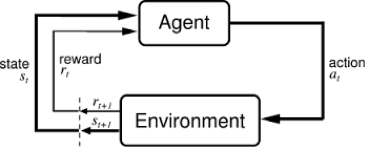
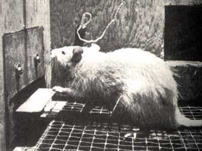
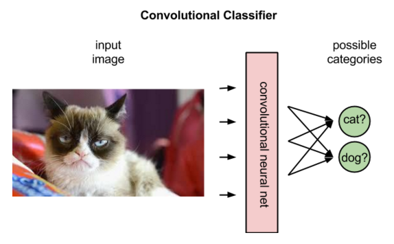
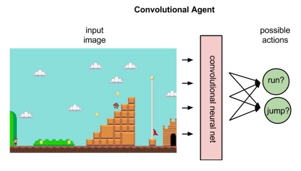

# A Beginner's Guide to Deep Reinforcement Learning 

```
When it is not in our power to determine what is true, we ought to act in accordance with what is most probable. - Descartes
```
Contents

* <a href="#define">Reinforcement Learning Definitions</a>
* <a href="#neural">Neural Networks and Deep Reinforcement Learning</a>
* <a href="#code">Just Show Me the Code</a>
* <a href="#reading">Further Reading</a>

While neural networks are responsible for recent breakthroughs in problems like computer vision, machine translation and time series prediction – they can also combine with reinforcement learning algorithms to create something astounding like [AlphaGo](https://deepmind.com/blog/alphago-zero-learning-scratch/). 

Reinforcement learning refers to goal-oriented algorithms, which learn how to attain a complex objective (goal) or maximize along a particular dimension over many steps; for example, maximize the points won in a game over many moves.  They can start from a blank slate, and under the right conditions they achieve superhuman performance. Like a child incentivized by spankings and candy, these algorithms are penalized when they make the wrong decisions and rewarded when they make the right ones -- this is reinforcement.

Reinforcement algorithms that incorporate deep learning can beat world champions at the [game of Go](https://deeplearning4j.org/deep-learning-and-the-game-of-go#) as well as human experts playing numerous [Atari video games](https://www.cs.toronto.edu/~vmnih/docs/dqn.pdf). While that may sound trivial, it’s a vast improvement over their previous accomplishments, and the state of the art is progressing rapidly. 

Two reinforcement learning algorithms - Deep-Q learning and A3C - have been implemented in a Deeplearning4j library called [RL4J](https://github.com/deeplearning4j/rl4j). It can [already play Doom](https://www.youtube.com/watch?v=Pgktl6PWa-o).

Reinforcement learning solves the difficult problem of correlating immediate actions with the delayed returns they produce. Like humans, reinforcement learning algorithms sometimes have to wait a while to see the fruit of their decisions. They operate in a delayed return environment, where it can be difficult to understand which action leads to which outcome over many time steps. 

Reinforcement learning algorithms can be expected to perform better and better in more ambiguous, real-life environments while choosing from an arbitrary number of possible actions, rather than from the limited options of a video game. That is, with time we expect them to be valuable to achieve goals in the real world. 

<p align="center">
<a href="https://docs.skymind.ai/docs" type="button" class="btn btn-lg btn-success" onClick="ga('send', 'event', ‘quickstart', 'click');">GET STARTED WITH REINFORCEMENT LEARNING</a>
</p>

## <a name="define">Reinforcement Learning Definitions</a>

Reinforcement learning can be understand using the concepts of agents, environments, states, actions and rewards, all of which we’ll explain below. Capital letters tend to denote sets of things, and lower-case letters denote a specific instance of that thing; e.g. `A` is all possible actions, while `a` is a specific action contained in the set. 

* Agent: An **agent** takes actions; for example, a drone making a delivery, or Super Mario navigating a video game. The algorithm is the agent. In life, the agent is you.<sup>[1](#one)</sup>  
* Action (A): `A` is the set of all possible moves the agent can make. An **action** is almost self-explanatory, but it should be noted that agents choose among a list of possible actions. In video games, the list might include running right or left, jumping high or low, crouching or standing still. In the stock markets, the list might include buying, selling or holding any one of an array of securities and their derivatives. When handling aerial drones, alternatives would include many different velocities and accelerations in 3D space. 
* Environment: The world through which the agent moves. The environment takes the agent's current state and action as input, and returns as output the agent's reward and next state. If you are the agent, the environment could be the laws of physics and the rules of society that process your actions and determine the consequences of them.
* State (S): A **state** is the concrete and immediate situation in which the agent finds itself; i.e. a specific place and moment, an instantaneous configuration that puts the agent in relation to other significant things such as tools, obstacles, enemies or prizes. It is the current situation returned by the environment. Were you ever in the wrong place at the wrong time? That's a state. 
* Reward (R): A **reward** is the feedback by which we measure the success or failure of an agent’s actions. For example, in a video game, when Mario touches a coin, he wins points. From any given state, an agent sends output in the form of actions to the environment, and the environment returns the agent’s new state (which resulted from acting on the previous state) as well as rewards, if there are any. Rewards can be immediate or delayed. They effectively evaluate the agent's action. 
* Policy (π): The policy is the strategy that the agent employs to determine the next action based on the current state.
* Value (V): The expected long-term return with discount, as opposed to the short-term reward R. `Vπ(s)` is defined as the expected long-term return of the current state under policy π.
* Q-value or action-value (Q): Q-value is similar to Value, except that it takes an extra parameter, the current action a. `Qπ(s, a)` refers to the long-term return of the current state s, taking action a under policy π. 

So environments are functions that transform an action taken in the current state into the next state and a reward; agents are functions that transform the new state and reward into the next action. We can know the agent's function, but we cannot know the function of the environment. It is a black box where we only see the inputs and outputs. Reinforcement learning represents an agent's attempt to approximate the environment's function, such that we can send actions into the black-box environment that maximize the rewards it spits out. 



In the feedback loop above, the subscripts denote the time steps `t` and `t+1`, each of which refer to different states: the state at moment `t`, and the state at moment `t+1`. Unlike other forms of machine learning – such as supervised and unsupervised learning -- reinforcement learning can only be thought about sequentially in terms of state-action pairs that occur one after the other. 

Reinforcement learning judges actions by the results they produce. It is goal oriented, and its aim is to learn sequences of actions that will lead an agent to achieve its goal. 

* In video games, the goal is to finish the game with the most points, so each additional point obtained throughout the game will affect the agent’s subsequent behavior; i.e. the agent may learn that it should shoot battleships, touch coins or dodge meteors to maximize its score. 
* In the real world, the goal might be for a robot to travel from point A to point B, and every inch the robot is able to move closer to point B could be counted like points. 

Reinforcement learning differs from both supervised and unsupervised learning by how it interprets inputs. We can illustrate their difference by describing what they learn about a "thing." 

* Unsupervised learning: That thing is like this other thing. (The algorithms learn similarities w/o names, and by extension they can spot the inverse and perform anomaly detection by recognizing what is unusual or dissimilar)
* Supervised learning: That thing is a “double bacon cheese burger”. (Labels, putting names to faces...) These algorithms learn the correlations between data instances and their labels; that is, they require a labelled dataset. Those labels are used to "supervise" and correct the algorithm as it makes wrong guesses when predicting labels. 
* Reinforcement learning: Eat that thing because it tastes good and will keep you alive. (Actions based on short- and long-term rewards.) Reinforcement learning can be thought of as supervised learning in an environment of sparse feedback. 

<iframe width="420" height="315" src="https://www.youtube.com/embed/-uXVu0l8guo" frameborder="0" allowfullscreen></iframe>

One way to imagine an autonomous reinforcement learning agent would be as a blind person attempting to navigate the world with only their ears and a white cane. Agents have small windows that allow them to perceive their environment, and those windows may not even be the most appropriate way for them to perceive what's around them. 

(In fact, deciding *which types* of input and feedback your agent should pay attention to is a hard problem to solve. This is known as domain selection. Algorithms that are learning how to play video games can mostly ignore this problem, since the environment is man-made and strictly limited. Thus, video games provide the sterile environment of the lab, where ideas about reinforcement learning can be tested. Domain selection requires human decisions, usually based on knowledge or theories about the problem to be solved; e.g. selecting the domain of input for an algorithm in a self-driving car might include choosing to include radar sensors in addition to cameras and GPS data.)



The goal of reinforcement learning is to pick the best known action for any given state, which means the actions have to be ranked, and assigned values relative to one another. Since those actions are state-dependent, what we are really gauging is the value of state-action pairs; i.e. an action taken from a certain state, something you did somewhere. Here are a few examples to demonstrate that the value and meaning of an action is contingent upon the state in which it is taken:

* If the action is marrying someone, then marrying a 35-year-old when you’re 18 probably means something different than marrying a 35-year-old when you’re 90, and those two outcomes probably have different motivations and lead to different outcomes. 

* If the action is yelling "Fire!", then performing the action a crowded theater should mean something different from performing the action next to a squad of men with rifles. We can’t predict an action’s outcome without knowing the context.

We map state-action pairs to the values we expect them to produce with the Q function, described above. The Q function takes as its input an agent’s state and action, and maps them to probable rewards. 

Reinforcement learning is the process of running the agent through sequences of state-action pairs, observing the rewards that result, and adapting the predictions of the Q function to those rewards until it accurately predicts the best path for the agent to take. That prediction is known as a policy. 

Reinforcement learning is an attempt to model a complex probability distribution of rewards in relation to a very large number of state-action pairs. This is one reason reinforcement learning is paired with, say, a [Markov decision process](./markovchainmontecarlo), a method to sample from a complex distribution to infer its properties. It closely resembles the problem that inspired [Stan Ulam to invent the Monte Carlo method](http://permalink.lanl.gov/object/tr?what=info:lanl-repo/lareport/LA-UR-88-9068); namely, trying to infer the chances that a given hand of solitaire will turn out successful.

Any statistical approach is essentially a confession of ignorance. The immense complexity of some phenomena (biological, political, sociological, or related to board games) make it impossible to reason from first principles. The only way to study them is through statistics, measuring superficial events and attempting to establish correlations between them, even when we do not understand the mechanism by which they relate. Reinforcement learning, like deep neural networks, is one such strategy, relying on sampling to extract information from data.  

Reinforcement learning is iterative. In its most interesting applications, it doesn’t begin by knowing which rewards state-action pairs will produce. It learns those relations by running through states again and again, like athletes or musicians iterate through states in an attempt to improve their performance.

You could say that reinforcement learning algorithms have a different relationship to time than humans do. We are able to run the algorithms through the same states over and over again while experimenting with different actions, until we can infer which actions are best from which states. Effectively, we give algorithms their very own [Groundhog Day](http://www.imdb.com/title/tt0107048/), where they start out as dumb jerks and slowly get wise. 

Since humans never experience Groundhog Day outside the movie, reinforcement learning algorithms have the potential to learn more, and better, than humans. You could say that the true advantage of these algorithms over humans stems not so much from their inherent nature, but from their ability to live in parallel on many chips at once, to train night and day without fatigue, and therefore to learn more. An algorithm trained on the game of Go, such as AlphaGo, will have played many more games of Go than any human could hope to complete in 100 lifetimes.<sup>[2](#two)</sup> 

## <a name="neural">Neural Networks and Deep Reinforcement Learning</a>

Where do neural networks fit in? Neural networks are the agent that learns to map state-action pairs to rewards. Like all neural networks, they use coefficients to approximate the function relating inputs to outputs, and their learning consists to finding the right coefficients, or weights, by iteratively adjusting those weights along gradients that promise less error.  

In reinforcement learning, convolutional networks can be used to recognize an agent’s state; e.g. the screen that Mario is on, or the terrain before a drone. That is, they perform their typical task of image recognition. 

But convolutional networks derive different interpretations from images in reinforcement learning than in supervised learning. In supervised learning, the network applies a label to an image; that is, it matches names to pixels. 



In fact, it will rank the labels that best fit the image in terms of their probabilities. Shown an image of a donkey, it might decide the picture is 80% likely to be a donkey, 50% likely to be a horse, and 30% likely to be a dog. 

In reinforcement learning, given an image that represents a state, a convolutional net can rank the actions possible to perform in that state; for example, it might predict that running right will return 5 points, jumping 7, and running left none. 



Having assigned values to the expected rewards, the Q function simply selects the state-action pair with the highest so-called Q value. 

At the beginning of reinforcement learning, the neural network coefficients may be initialized stochastically, or randomly. Using feedback from the environment, the neural net can use the difference between its expected reward and the ground-truth reward to adjust its weights and improve its interpretation of state-action pairs. 

This feedback loop is analogous to the backpropagation of error in supervised learning. However, supervised learning begins with knowledge of the ground-truth labels the neural network is trying to predict. Its goal is to create a model that maps different images to their respective names. 

Reinforcement learning relies on the environment to send it a scalar number in response to each new action. The rewards returned by the environment can be varied, delayed or affected by unknown variables, introducing noise to the feedback loop. 

This leads us to a more complete expression of the Q function, which takes into account not only the immediate rewards produced by an action, but also the delayed rewards that may be returned several time steps deeper in the sequence.

Like human beings, the Q function is recursive. Just as calling the wetware method human() contains within it another method human(), of which we are all the fruit, calling the Q function on a given state-action pair requires us to call a nested Q function to predict the value of the next state, which in turn depends on the Q function of the state after that, and so forth. 

## <a name="code">Just Show Me the Code</a>

[RL4J examples are available here](https://github.com/deeplearning4j/dl4j-examples/tree/master/rl4j-examples).

```
package org.deeplearning4j.examples.rl4j;

import java.io.IOException;
import org.deeplearning4j.rl4j.learning.HistoryProcessor;
import org.deeplearning4j.rl4j.learning.async.a3c.discrete.A3CDiscrete;
import org.deeplearning4j.rl4j.learning.async.a3c.discrete.A3CDiscreteConv;
import org.deeplearning4j.rl4j.mdp.ale.ALEMDP;
import org.deeplearning4j.rl4j.network.ac.ActorCriticFactoryCompGraphStdConv;
import org.deeplearning4j.rl4j.util.DataManager;

/**
 * @author saudet
 *
 * Main example for A3C with The Arcade Learning Environment (ALE)
 *
 */
public class A3CALE {

    public static HistoryProcessor.Configuration ALE_HP =
            new HistoryProcessor.Configuration(
                    4,       //History length
                    84,      //resize width
                    110,     //resize height
                    84,      //crop width
                    84,      //crop height
                    0,       //cropping x offset
                    0,       //cropping y offset
                    4        //skip mod (one frame is picked every x
            );

    public static A3CDiscrete.A3CConfiguration ALE_A3C =
            new A3CDiscrete.A3CConfiguration(
                    123,            //Random seed
                    10000,          //Max step By epoch
                    8000000,        //Max step
                    8,              //Number of threads
                    32,             //t_max
                    500,            //num step noop warmup
                    0.1,            //reward scaling
                    0.99,           //gamma
                    10.0            //td-error clipping
            );

    public static final ActorCriticFactoryCompGraphStdConv.Configuration ALE_NET_A3C =
            new ActorCriticFactoryCompGraphStdConv.Configuration(
                    0.00025, //learning rate
                    0.000,   //l2 regularization
                    null, null, false
            );

    public static void main(String[] args) throws IOException {

        //record the training data in rl4j-data in a new folder
        DataManager manager = new DataManager(true);

        //setup the emulation environment through ALE, you will need a ROM file
        ALEMDP mdp = null;
        try {
            mdp = new ALEMDP("pong.bin");
        } catch (UnsatisfiedLinkError e) {
            System.out.println("To run this example, uncomment the \"ale-platform\" dependency in the pom.xml file.");
        }

        //setup the training
        A3CDiscreteConv<ALEMDP.GameScreen> a3c = new A3CDiscreteConv(mdp, ALE_NET_A3C, ALE_HP, ALE_A3C, manager);

        //start the training
        a3c.train();

        //save the model at the end
        a3c.getPolicy().save("ale-a3c.model");

        //close the ALE env
        mdp.close();
    }
}

```

### <a name="beginner">Other Deep Learning Tutorials</a>
* [LSTMs and Recurrent Networks](./lstm)
* [Introduction to Deep Neural Networks](./neuralnet-overview)
* [Convolutional Networks](./convolutionalnets)
* [Restricted Boltzmann Machines](./restrictedboltzmannmachine)
* [Eigenvectors, Covariance, PCA and Entropy](./eigenvector)
* [Deeplearning4j Quickstart Examples](./quickstart)
* [ND4J: A Tensor Library for the JVM](http://nd4j.org)
* [MNIST for Beginners](./mnist-for-beginners.html)
* [Glossary of Deep-Learning and Neural-Net Terms](./glossary.html)
* [Generative Adversarial Networks (GANs)](./generative-adversarial-network)
* [Word2vec and Natural-Language Processing](./word2vec.html)

<a name="one">1)</a> *It might be helpful to imagine a reinforcement learning algorithm in action, to paint it visually. Let's say the algorithm is learning to play the video game Super Mario. It's trying to get Mario through the game and acquire the most points. To do that, we can spin up lots of different Marios in parallel and run them through the space of all possible game states. It's as though you have 1,000 Marios all tunnelling through a mountain, and as they dig (e.g. as they decide again and again which action to take to affect the game environment), their tunnels branch like the intricate and fractal twigs of a tree. The Marios' experience-tunnels are corridors of light cutting through the mountain. And as in life itself, one successful action may precede another in a larger decision flow, propelling the winning Marios onward. You might also imagine that in front of each Mario is a heat map tracking the rewards they can associate with state-action pairs. (Imagine each state-action pair as have its own screen overlayed with heat from yellow to red. The many screens are assembled in a grid, like you might see in front of a Wall St. trader with many monitors. One might be "jump harder from this state", another might be "run faster in this state" and so on and so forth.) Since some state-action pairs lead to significantly more reward than others, and different kinds of actions such as jumping, squatting or running can be taken, the probability distribution of reward over actions is not a bel curve but instead complex, which is why [Markov and Monte Carlo techniques](./markovchainmontecarlo) are used to explore it. That is, while it is difficult to describe the reward distribution in a formula, it can be sampled. Because the algorithm starts ignorant and many of the paths through the game-state space are unexplored, the heat maps will reflect their lack of experience; i.e. there could be blank holes in the heatmap of the rewards they imagine, or they might just start with some default assumptions about rewards that will be adjusted with experience. The Marios are essentially reward-seeking missiles, and the more times they run through the game, the more accurate their heatmap of potential future reward becomes. Those heatmaps are basically probability distributions of reward over the state-action pairs possible from the Mario's current state.*

<a name="two">2)</a> *The correct analogy may actually be that a learning algorithm is like a species. Each simulation the algorithm runs as it learns could be considered an individual of the species. Just as knowledge from the algorithm's runs through the game is collected in the algorithm's model of the world, the individual humans of any group will report back via language, allowing the collective's model of the world, embodied in its texts, records and oral traditions, to become more intelligent (At least in the ideal case. The subversion and noise introduced into our collective models is a topic for another post, and probably for another website entirely.). This puts a finer point on why the contest between algorithms and individual humans, even when the humans are world champions, is unfair. We are pitting a civilization that has accumulated the wisdom of 10,000 lives against a single sack of flesh.*

## <a name="reading">Further Reading</a>

* [RL4J: Reinforcement Learning in Java](https://github.com/deeplearning4j/rl4j)
* Richard S. Sutton and Andrew G. Barto's [Reinforcement Learning: An Introduction](http://incompleteideas.net/sutton/book/the-book-2nd.html)
* Andrej Karpathy's [ConvNetJS Deep Q Learning Demo](https://cs.stanford.edu/people/karpathy/convnetjs/demo/rldemo.html)
* [Brown-UMBC Reinforcement Learning and Planning (BURLAP)](http://burlap.cs.brown.edu/)(Apache 2.0 Licensed as of June 2016)
* [Glossary of Terms in Reinforcement Learning](http://www-anw.cs.umass.edu/rlr/terms.html)
* [Reinforcement Learning and DQN, learning to play from pixels](https://rubenfiszel.github.io/posts/rl4j/2016-08-24-Reinforcement-Learning-and-DQN.html)
* Video: [Richard Sutton on Temporal Difference Learning](https://www.youtube.com/watch?v=EeMCEQa85tw)
* [A Brief Survey of Deep Reinforcement Learning](https://arxiv.org/pdf/1708.05866.pdf)

## Theory

### Lectures
 - [UCL] [COMPM050/COMPGI13 Reinforcement Learning](http://www0.cs.ucl.ac.uk/staff/d.silver/web/Teaching.html) by David Silver
 - [UC Berkeley] CS188 Artificial Intelligence by Pieter Abbeel
   - [Lecture 8: Markov Decision Processes 1](https://www.youtube.com/watch?v=i0o-ui1N35U)
   - [Lecture 9: Markov Decision Processes 2](https://www.youtube.com/watch?v=Csiiv6WGzKM)
   - [Lecture 10: Reinforcement Learning 1](https://www.youtube.com/watch?v=ifma8G7LegE)
   - [Lecture 11: Reinforcement Learning 2](https://www.youtube.com/watch?v=Si1_YTw960c)
 - [Udacity (Georgia Tech.)] [CS7642 Reinforcement Learning](https://classroom.udacity.com/courses/ud600)
 - [Stanford] [CS229 Machine Learning - Lecture 16: Reinforcement Learning](https://www.youtube.com/watch?v=RtxI449ZjSc&feature=relmfu) by Andrew Ng
 - [UC Berkeley] [Deep RL Bootcamp](https://sites.google.com/view/deep-rl-bootcamp/lectures)
 - [UC Berkeley] [CS294 Deep Reinforcement Learning](http://rll.berkeley.edu/deeprlcourse/) by John Schulman and Pieter Abbeel
 - [CMU] [10703: Deep Reinforcement Learning and Control, Spring 2017](https://katefvision.github.io/)
 - [MIT] [6.S094: Deep Learning for Self-Driving Cars](http://selfdrivingcars.mit.edu/)
   - [Lecture 2: Deep Reinforcement Learning for Motion Planning](https://www.youtube.com/watch?v=QDzM8r3WgBw&list=PLrAXtmErZgOeiKm4sgNOknGvNjby9efdf)


### Books
 - Richard Sutton and Andrew Barto, Reinforcement Learning: An Introduction (1st Edition, 1998) [[Book]](http://incompleteideas.net/book/ebook/the-book.html) [[Code]](http://incompleteideas.net/book/code/code.html)
 - Richard Sutton and Andrew Barto, Reinforcement Learning: An Introduction (2nd Edition, in progress, 2018) [[Book]](http://incompleteideas.net/book/bookdraft2018jan1.pdf) [[Code]](https://github.com/ShangtongZhang/reinforcement-learning-an-introduction)
 - Csaba Szepesvari, Algorithms for Reinforcement Learning [[Book]](http://www.ualberta.ca/~szepesva/papers/RLAlgsInMDPs.pdf)
 - David Poole and Alan Mackworth, Artificial Intelligence: Foundations of Computational Agents [[Book Chapter]](http://artint.info/html/ArtInt_262.html)
 - Dimitri P. Bertsekas and John N. Tsitsiklis, Neuro-Dynamic Programming [[Book (Amazon)]](http://www.amazon.com/Neuro-Dynamic-Programming-Optimization-Neural-Computation/dp/1886529108/ref=sr_1_3?s=books&ie=UTF8&qid=1442461075&sr=1-3&refinements=p_27%3AJohn+N.+Tsitsiklis+Dimitri+P.+Bertsekas) [[Summary]](http://www.mit.edu/~dimitrib/NDP_Encycl.pdf)
 - Mykel J. Kochenderfer, Decision Making Under Uncertainty: Theory and Application [[Book (Amazon)]](http://www.amazon.com/Decision-Making-Under-Uncertainty-Application/dp/0262029251/ref=sr_1_1?ie=UTF8&qid=1441126550&sr=8-1&keywords=kochenderfer&pebp=1441126551594&perid=1Y6RG2EGRD26659CJHH9)

### Survey Papers
 - Leslie Pack Kaelbling, Michael L. Littman, Andrew W. Moore, Reinforcement Learning: A Survey, JAIR, 1996. [[Paper]](https://www.jair.org/media/301/live-301-1562-jair.pdf)
 - S. S. Keerthi and B. Ravindran, A Tutorial Survey of Reinforcement Learning, Sadhana, 1994. [[Paper]](http://www.cse.iitm.ac.in/~ravi/papers/keerthi.rl-survey.pdf)
 - Matthew E. Taylor, Peter Stone, Transfer Learning for Reinforcement Learning Domains: A Survey, JMLR, 2009. [[Paper]](http://machinelearning.wustl.edu/mlpapers/paper_files/jmlr10_taylor09a.pdf)
 - Jens Kober, J. Andrew Bagnell, Jan Peters, Reinforcement Learning in Robotics, A Survey, IJRR, 2013. [[Paper]](http://www.ias.tu-darmstadt.de/uploads/Publications/Kober_IJRR_2013.pdf)
 - Michael L. Littman, "Reinforcement learning improves behaviour from evaluative feedback." Nature 521.7553 (2015): 445-451. [[Paper]](http://www.nature.com/nature/journal/v521/n7553/full/nature14540.html)
 - Marc P. Deisenroth, Gerhard Neumann, Jan Peter, A Survey on Policy Search for Robotics, Foundations and Trends in Robotics, 2014. [[Book]](https://spiral.imperial.ac.uk:8443/bitstream/10044/1/12051/7/fnt_corrected_2014-8-22.pdf)

### Papers / Thesis
Foundational Papers
 - Marvin Minsky, Steps toward Artificial Intelligence, Proceedings of the IRE, 1961. [[Paper]](http://staffweb.worc.ac.uk/DrC/Courses%202010-11/Comp%203104/Tutor%20Inputs/Session%209%20Prep/Reading%20material/Minsky60steps.pdf) (discusses issues in RL such as the "credit assignment problem")
 - Ian H. Witten, An Adaptive Optimal Controller for Discrete-Time Markov Environments, Information and Control, 1977. [[Paper]](http://www.cs.waikato.ac.nz/~ihw/papers/77-IHW-AdaptiveController.pdf) (earliest publication on temporal-difference (TD) learning rule)
  
**Methods**
 - Dynamic Programming (DP):
   - Christopher J. C. H. Watkins, Learning from Delayed Rewards, Ph.D. Thesis, Cambridge University, 1989. [[Thesis]](https://www.cs.rhul.ac.uk/home/chrisw/new_thesis.pdf)
 - Monte Carlo:
   - Andrew Barto, Michael Duff, Monte Carlo Inversion and Reinforcement Learning, NIPS, 1994. [[Paper]](http://papers.nips.cc/paper/865-monte-carlo-matrix-inversion-and-reinforcement-learning.pdf)
   - Satinder P. Singh, Richard S. Sutton, Reinforcement Learning with Replacing Eligibility Traces, Machine Learning, 1996. [[Paper]](http://www-all.cs.umass.edu/pubs/1995_96/singh_s_ML96.pdf)
 - Temporal-Difference:
   - Richard S. Sutton, Learning to predict by the methods of temporal differences. Machine Learning 3: 9-44, 1988. [[Paper]](http://webdocs.cs.ualberta.ca/~sutton/papers/sutton-88-with-erratum.pdf)
 - Q-Learning (Off-policy TD algorithm):
   - Chris Watkins, Learning from Delayed Rewards, Cambridge, 1989. [[Thesis]](http://www.cs.rhul.ac.uk/home/chrisw/thesis.html)
 - Sarsa (On-policy TD algorithm):
   - G.A. Rummery, M. Niranjan, On-line Q-learning using connectionist systems, Technical Report, Cambridge Univ., 1994. [[Report]](https://www.google.com/url?sa=t&rct=j&q=&esrc=s&source=web&cd=3&ved=0CDIQFjACahUKEwj2lMm5wZDIAhUHkg0KHa6kAVM&url=ftp%3A%2F%2Fmi.eng.cam.ac.uk%2Fpub%2Freports%2Fauto-pdf%2Frummery_tr166.pdf&usg=AFQjCNHz6IrgcaaO5lzC7t8oEIBY9epozg&sig2=sa-emPme1m5Jav7YmaXsNQ&cad=rja)
   - Richard S. Sutton, Generalization in Reinforcement Learning: Successful examples using sparse coding, NIPS, 1996. [[Paper]](http://webdocs.cs.ualberta.ca/~sutton/papers/sutton-96.pdf)
 - R-Learning (learning of relative values)
   - Andrew Schwartz, A Reinforcement Learning Method for Maximizing Undiscounted Rewards, ICML, 1993. [[Paper-Google Scholar]](https://scholar.google.com/scholar?q=reinforcement+learning+method+for+maximizing+undiscounted+rewards&hl=en&as_sdt=0&as_vis=1&oi=scholart&sa=X&ved=0CBsQgQMwAGoVChMIho6p_MOQyAIVwh0eCh3XWAwM)
 - Function Approximation methods (Least-Square Temporal Difference, Least-Square Policy Iteration)
   - Steven J. Bradtke, Andrew G. Barto, Linear Least-Squares Algorithms for Temporal Difference Learning, Machine Learning, 1996. [[Paper]](http://www-anw.cs.umass.edu/pubs/1995_96/bradtke_b_ML96.pdf)
   - Michail G. Lagoudakis, Ronald Parr, Model-Free Least Squares Policy Iteration, NIPS, 2001. [[Paper]](http://www.cs.duke.edu/research/AI/LSPI/nips01.pdf) [[Code]](http://www.cs.duke.edu/research/AI/LSPI/)
 - Policy Search / Policy Gradient
   - Richard Sutton, David McAllester, Satinder Singh, Yishay Mansour, Policy Gradient Methods for Reinforcement Learning with Function Approximation, NIPS, 1999. [[Paper]](http://papers.nips.cc/paper/1713-policy-gradient-methods-for-reinforcement-learning-with-function-approximation.pdf)
   - Jan Peters, Sethu Vijayakumar, Stefan Schaal, Natural Actor-Critic, ECML, 2005. [[Paper]](https://homes.cs.washington.edu/~todorov/courses/amath579/reading/NaturalActorCritic.pdf)
   - Jens Kober, Jan Peters, Policy Search for Motor Primitives in Robotics, NIPS, 2009. [[Paper]](http://papers.nips.cc/paper/3545-policy-search-for-motor-primitives-in-robotics.pdf)
   - Jan Peters, Katharina Mulling, Yasemin Altun, Relative Entropy Policy Search, AAAI, 2010. [[Paper]](http://www.kyb.tue.mpg.de/fileadmin/user_upload/files/publications/attachments/AAAI-2010-Peters_6439%5b0%5d.pdf)
   - Freek Stulp, Olivier Sigaud, Path Integral Policy Improvement with Covariance Matrix Adaptation, ICML, 2012. [[Paper]](http://arxiv.org/pdf/1206.4621v1.pdf)
   - Nate Kohl, Peter Stone, Policy Gradient Reinforcement Learning for Fast Quadrupedal Locomotion, ICRA, 2004. [[Paper]](http://www.cs.utexas.edu/~pstone/Papers/bib2html-links/icra04.pdf)
   - Marc Deisenroth, Carl Rasmussen, PILCO: A Model-Based and Data-Efficient Approach to Policy Search, ICML, 2011. [[Paper]](http://mlg.eng.cam.ac.uk/pub/pdf/DeiRas11.pdf)
   - Scott Kuindersma, Roderic Grupen, Andrew Barto, Learning Dynamic Arm Motions for Postural Recovery, Humanoids, 2011. [[Paper]](http://www-all.cs.umass.edu/pubs/2011/kuindersma_g_b_11.pdf)
   - Konstantinos Chatzilygeroudis, Roberto Rama, Rituraj Kaushik, Dorian Goepp, Vassilis Vassiliades, Jean-Baptiste Mouret, Black-Box Data-efficient Policy Search for Robotics, IROS, 2017. [[Paper](https://arxiv.org/abs/1703.07261)]
 - Hierarchical RL
   - Richard Sutton, Doina Precup, Satinder Singh, Between MDPs and Semi-MDPs: A Framework for Temporal Abstraction in Reinforcement Learning, Artificial Intelligence, 1999. [[Paper]](https://webdocs.cs.ualberta.ca/~sutton/papers/SPS-aij.pdf)
   - George Konidaris, Andrew Barto, Building Portable Options: Skill Transfer in Reinforcement Learning, IJCAI, 2007. [[Paper]](http://www-anw.cs.umass.edu/pubs/2007/konidaris_b_IJCAI07.pdf)
 - Deep Learning + Reinforcement Learning (A sample of recent works on DL+RL)
   - V. Mnih, et. al., Human-level Control through Deep Reinforcement Learning, Nature, 2015. [[Paper]](http://www.readcube.com/articles/10.1038%2Fnature14236?shared_access_token=Lo_2hFdW4MuqEcF3CVBZm9RgN0jAjWel9jnR3ZoTv0P5kedCCNjz3FJ2FhQCgXkApOr3ZSsJAldp-tw3IWgTseRnLpAc9xQq-vTA2Z5Ji9lg16_WvCy4SaOgpK5XXA6ecqo8d8J7l4EJsdjwai53GqKt-7JuioG0r3iV67MQIro74l6IxvmcVNKBgOwiMGi8U0izJStLpmQp6Vmi_8Lw_A%3D%3D)
   - Xiaoxiao Guo, Satinder Singh, Honglak Lee, Richard Lewis, Xiaoshi Wang, Deep Learning for Real-Time Atari Game Play Using Offline Monte-Carlo Tree Search Planning, NIPS, 2014. [[Paper]](http://papers.nips.cc/paper/5421-deep-learning-for-real-time-atari-game-play-using-offline-monte-carlo-tree-search-planning.pdf)
   - Sergey Levine, Chelsea Finn, Trevor Darrel, Pieter Abbeel, End-to-End Training of Deep Visuomotor Policies. ArXiv, 16 Oct 2015. [[ArXiv]](http://arxiv.org/pdf/1504.00702v3.pdf)
   - Tom Schaul, John Quan, Ioannis Antonoglou, David Silver, Prioritized Experience Replay, ArXiv, 18 Nov 2015. [[ArXiv]](http://arxiv.org/pdf/1511.05952v2.pdf)
   - Hado van Hasselt, Arthur Guez, David Silver, Deep Reinforcement Learning with Double Q-Learning, ArXiv, 22 Sep 2015. [[ArXiv]](http://arxiv.org/abs/1509.06461)
   - Volodymyr Mnih, Adrià Puigdomènech Badia, Mehdi Mirza, Alex Graves, Timothy P. Lillicrap, Tim Harley, David Silver, Koray Kavukcuoglu, Asynchronous Methods for Deep Reinforcement Learning, ArXiv, 4 Feb 2016. [[ArXiv]](https://arxiv.org/abs/1602.01783)
    

## Applications
### Game Playing
Traditional Games
  - Backgammon - "TD-Gammon" game play using TD(λ) (Tesauro, ACM 1995) [[Paper]](http://www.bkgm.com/articles/tesauro/tdl.html)
  - Chess - "KnightCap" program using TD(λ) (Baxter, arXiv 1999) [[arXiv]](http://arxiv.org/pdf/cs/9901002v1.pdf)
  - Chess - Giraffe: Using deep reinforcement learning to play chess (Lai, arXiv 2015) [[arXiv]](http://arxiv.org/pdf/1509.01549v2.pdf)

Computer Games
  - Human-level Control through Deep Reinforcement Learning (Mnih, Nature 2015) [[Paper]](http://www.readcube.com/articles/10.1038%2Fnature14236?shared_access_token=Lo_2hFdW4MuqEcF3CVBZm9RgN0jAjWel9jnR3ZoTv0P5kedCCNjz3FJ2FhQCgXkApOr3ZSsJAldp-tw3IWgTseRnLpAc9xQq-vTA2Z5Ji9lg16_WvCy4SaOgpK5XXA6ecqo8d8J7l4EJsdjwai53GqKt-7JuioG0r3iV67MQIro74l6IxvmcVNKBgOwiMGi8U0izJStLpmQp6Vmi_8Lw_A%3D%3D) [[Code]](https://sites.google.com/a/deepmind.com/dqn/) [[Video]](https://www.youtube.com/watch?v=iqXKQf2BOSE)
  - [Flappy Bird Reinforcement Learning](https://github.com/SarvagyaVaish/FlappyBirdRL) [[Video]](https://www.youtube.com/watch?v=xM62SpKAZHU)
  - MarI/O - learning to play Mario with evolutionary reinforcement learning using artificial neural networks (Stanley, Evolutionary Computation 2002) [[Paper]](http://nn.cs.utexas.edu/downloads/papers/stanley.ec02.pdf) [[Video]](https://www.youtube.com/watch?v=qv6UVOQ0F44)

### Robotics
  - Policy Gradient Reinforcement Learning for Fast Quadrupedal Locomotion (Kohl, ICRA 2004) [[Paper]](http://www.cs.utexas.edu/~pstone/Papers/bib2html-links/icra04.pdf)
  - Robot Motor SKill Coordination with EM-based Reinforcement Learning (Kormushev, IROS 2010) [[Paper]](http://kormushev.com/papers/Kormushev-IROS2010.pdf) [[Video]](https://www.youtube.com/watch?v=W_gxLKSsSIE)
  - Generalized Model Learning for Reinforcement Learning on a Humanoid Robot (Hester, ICRA 2010) [[Paper]](https://ccc.inaoep.mx/~mdprl/documentos/Hester_2010.pdf) [[Video]](https://www.youtube.com/watch?v=mRpX9DFCdwI&list=PL5nBAYUyJTrM48dViibyi68urttMlUv7e&index=12)
  - Autonomous Skill Acquisition on a Mobile Manipulator (Konidaris, AAAI 2011) [[Paper]](http://lis.csail.mit.edu/pubs/konidaris-aaai11b.pdf) [[Video]](https://www.youtube.com/watch?v=yUICAkSQTZY)
  - PILCO: A Model-Based and Data-Efficient Approach to Policy Search (Deisenroth, ICML 2011) [[Paper]](http://mlg.eng.cam.ac.uk/pub/pdf/DeiRas11.pdf)
  - Incremental Semantically Grounded Learning from Demonstration (Niekum, RSS 2013) [[Paper]](http://people.cs.umass.edu/~sniekum/pubs/NiekumRSS2013.pdf)
  - Efficient Reinforcement Learning for Robots using Informative Simulated Priors (Cutler, ICRA 2015) [[Paper]](http://markjcutler.com/papers/Cutler15_ICRA.pdf) [[Video]](https://www.youtube.com/watch?v=kKClFx6l1HY)
  - Robots that can adapt like animals (Cully, Nature 2015) [[Paper](https://arxiv.org/abs/1407.3501)] [[Video](https://www.youtube.com/watch?v=T-c17RKh3uE)] [[Code](https://github.com/resibots/cully_2015_nature)]
  - Black-Box Data-efficient Policy Search for Robotics (Chatzilygeroudis, IROS 2017) [[Paper](https://arxiv.org/abs/1703.07261)] [[Video](https://www.youtube.com/watch?v=kTEyYiIFGPM)] [[Code](https://github.com/resibots/blackdrops)]


### Control
  - An Application of Reinforcement Learning to Aerobatic Helicopter Flight (Abbeel, NIPS 2006) [[Paper]](http://heli.stanford.edu/papers/nips06-aerobatichelicopter.pdf) [[Video]](https://www.youtube.com/watch?v=VCdxqn0fcnE)
  - Autonomous helicopter control using Reinforcement Learning Policy Search Methods (Bagnell, ICRA 2001) [[Paper]](http://repository.cmu.edu/cgi/viewcontent.cgi?article=1082&context=robotics)

### Operations Research
  - Scaling Average-reward Reinforcement Learning for Product Delivery (Proper, AAAI 2004) [[Paper]](http://web.engr.oregonstate.edu/~proper/AAAI04SProper.pdf)
  - Cross Channel Optimized Marketing by Reinforcement Learning (Abe, KDD 2004) [[Paper]](http://www.research.ibm.com/people/n/nabe/kdd04AVAS.pdf)

### Human Computer Interaction
  - Optimizing Dialogue Management with Reinforcement Learning: Experiments with the NJFun System (Singh, JAIR 2002) [[Paper]](http://web.eecs.umich.edu/~baveja/Papers/RLDSjair.pdf)


## Tutorials / Websites
  - Mance Harmon and Stephanie Harmon, [Reinforcement Learning: A Tutorial](http://old.nbu.bg/cogs/events/2000/Readings/Petrov/rltutorial.pdf)
  - C. Igel, M.A. Riedmiller, et al., Reinforcement Learning in a Nutshell, ESANN, 2007. [[Paper]](http://image.diku.dk/igel/paper/RLiaN.pdf)
  - UNSW - [Reinforcement Learning](http://www.cse.unsw.edu.au/~cs9417ml/RL1/index.html)
   - [Introduction](http://www.cse.unsw.edu.au/~cs9417ml/RL1/introduction.html)
   - [TD-Learning](http://www.cse.unsw.edu.au/~cs9417ml/RL1/tdlearning.html)
   - [Q-Learning and SARSA](http://www.cse.unsw.edu.au/~cs9417ml/RL1/algorithms.html)
   - [Applet for "Cat and Mouse" Game](http://www.cse.unsw.edu.au/~cs9417ml/RL1/applet.html)
  - [ROS Reinforcement Learning Tutorial](http://wiki.ros.org/reinforcement_learning/Tutorials/Reinforcement%20Learning%20Tutorial)
  - [POMDP for Dummies](http://cs.brown.edu/research/ai/pomdp/tutorial/index.html)
  - Scholarpedia articles on:
   - [Reinforcement Learning](http://www.scholarpedia.org/article/Reinforcement_learning)
   - [Temporal Difference Learning](http://www.scholarpedia.org/article/Temporal_difference_learning)
  - Repository with useful [MATLAB Software, presentations, and demo videos](http://busoniu.net/repository.php)
  - [Bibliography on Reinforcement Learning](http://liinwww.ira.uka.de/bibliography/Neural/reinforcement.learning.html)
  - UC Berkeley - CS 294: Deep Reinforcement Learning, Fall 2015 (John Schulman, Pieter Abbeel) [[Class Website]](http://rll.berkeley.edu/deeprlcourse/)
  - [Blog posts on Reinforcement Learning, Parts 1-4](https://studywolf.wordpress.com/2012/11/25/reinforcement-learning-q-learning-and-exploration/) by Travis DeWolf
  - [The Arcade Learning Environment](http://www.arcadelearningenvironment.org/) - Atari 2600 games environment for developing AI agents
  - [Deep Reinforcement Learning: Pong from Pixels](http://karpathy.github.io/2016/05/31/rl/) by Andrej Karpathy
  - [Demystifying Deep Reinforcement Learning](https://www.nervanasys.com/demystifying-deep-reinforcement-learning/) 
  - [Let’s make a DQN](https://jaromiru.com/2016/09/27/lets-make-a-dqn-theory/) 
  - [Simple Reinforcement Learning with Tensorflow, Parts 0-8](https://medium.com/emergent-future/simple-reinforcement-learning-with-tensorflow-part-0-q-learning-with-tables-and-neural-networks-d195264329d0#.78km20i8r) by Arthur Juliani
  - [Practical_RL](https://github.com/yandexdataschool/Practical_RL) - github-based course in reinforcement learning in the wild (lectures, coding labs, projects)


## Online Demos
 - [Real-world demonstrations of Reinforcement Learning](http://www.dcsc.tudelft.nl/~robotics/media.html)
 - [Deep Q-Learning Demo](http://cs.stanford.edu/people/karpathy/convnetjs/demo/rldemo.html) - A deep Q learning demonstration using ConvNetJS
 - [Deep Q-Learning with Tensor Flow](https://github.com/nivwusquorum/tensorflow-deepq) - A deep Q learning demonstration using Google Tensorflow
 - [Reinforcement Learning Demo](http://cs.stanford.edu/people/karpathy/reinforcejs/) - A reinforcement learning demo using reinforcejs by Andrej Karpathy
