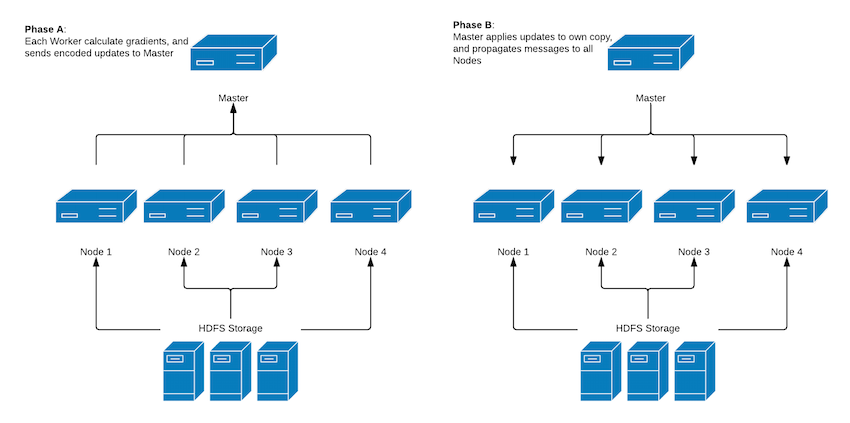

# Distributed Training: Gradients Sharing

As of release 0.9.1 (or the 0.9.2-SNAPSHOT), DeepLearning4j supports distributed training in the Apache Spark environment and [Aeron](https://github.com/real-logic/Aeron) for high performance inter-node communication outside of Spark.

The idea is relatively simple: individual workers calculate gradients on their DataSets. 

Before gradients are applied to the network weights, they are accumulated in an intermediate storage mechanism (one for each machine). 

After aggregation, updated values above some configurable threshold are propagated across the network as a sparse binary array. 

Values below the threshold are stored and added to future updates, hence they are not lost, but merely delayed in their communication. 

This thresholding approach reduces the network communication requirements by many orders of magnitude compared to a 
naive approach of sending the entire dense update, or parameter vector, while maintaining high accuracy. 

For more details on the thresholding approach, see [Strom, 2015 - Scalable Distributed DNN Training using Commodity GPU Cloud Computing](http://nikkostrom.com/publications/interspeech2015/strom_interspeech2015.pdf) and [Distributed Deep Learning, Part 1: An Introduction to Distributed Training of Neural Networks](http://engineering.skymind.io/distributed-deep-learning-part-1-an-introduction-to-distributed-training-of-neural-networks).
 


Note  that using Spark entails overhead. In order to determine whether Spark will help you or not, consider using the [Performance Listener](https://github.com/deeplearning4j/deeplearning4j/blob/master/deeplearning4j-nn/src/main/java/org/deeplearning4j/optimize/listeners/PerformanceListener.java) and look at the millisecond iteration time.
If it's <= 150ms, Spark may not be worth it.

## Setting up Your Cluster

All you need to run training is a Spark 1.x/2.x cluster and at least one open UDP port (both inbound/outbound).

### Cluster Setup

As mentioned above, DeepLearning4j supports both Spark 1.x and Spark 2.x clusters. However, this particular implementation also requires Java 8+ to run. If your cluster is running Java 7, you'll either have to upgrade or use our [Parameters Averaging training mode](https://deeplearning4j.org/spark).

### Network Environment

Gradients sharing relies heavily on the UDP protocol for communication between the Master and the Nodes during training. If you're running your cluster in a cloud environment like AWS or Azure, you need to allow one UDP port for Inbound/Outbound connections and you need to specify that port in the `VoidConfiguration.unicastPort(int)` bean that is passed to `SharedTrainingMaster` constructor. 

Another option to keep in mind is that in case of YARN use (or any other resource manager that handles Spark networking), you'll have to specify the network mask of the network that'll be used for UDP communications. That could be done using something like this: `VoidConfiguration.setNetworkMask("10.1.1.0/24")`.

A option of last resort for IP address selection is the `DL4J_VOID_IP` environment variable. Set that variable on each node you're running, with local IP address to be used for comms.

### Dependencies

Here's the template for the only required dependency:

```
<dependency>
    <groupId>org.deeplearning4j</groupId>
    <artifactId>dl4j-spark-parameterserver_${scala.binary.version}</artifactId>
    <version>${dl4j.spark.version}</version>
</dependency>
```

For example:  

```
<dependency>
    <groupId>org.deeplearning4j</groupId>
    <artifactId>dl4j-spark-parameterserver_2.11</artifactId>
    <version>0.9.1_spark_2</version>
</dependency>
```

### Example Configuration:

Below is a snippet from an example project taken from [our examples repo on Github](https://github.com/deeplearning4j/dl4j-examples/blob/master/dl4j-spark-examples/dl4j-spark/src/main/java/org/deeplearning4j/mlp/MnistMLPDistributedExample.java)  

```
SparkConf sparkConf = new SparkConf();
sparkConf.setAppName("DL4J Spark Example");
JavaSparkContext sc = new JavaSparkContext(sparkConf);

MultiLayerConfiguration conf = new NeuralNetConfiguration.Builder()
            .seed(12345)
            .optimizationAlgo(OptimizationAlgorithm.STOCHASTIC_GRADIENT_DESCENT)
            .iterations(1)
            ...
            .build();

/*
    This is a ParameterServer configuration bean. The only option you'll really ever use is .unicastPort(int) 
*/
VoidConfiguration voidConfiguration = VoidConfiguration.builder()
            .unicastPort(40123)
            .build();

/*
    SharedTrainingMaster is the basement of distributed training. Tt holds all logic required for training 
*/
TrainingMaster tm = new SharedTrainingMaster.Builder(voidConfiguration,batchSizePerWorker)
            .updatesThreshold(1e-3)
            .rddTrainingApproach(RDDTrainingApproach.Export)
            .batchSizePerWorker(batchSizePerWorker)
            .workersPerNode(4)
            .build();

//Create the Spark network
SparkDl4jMultiLayer sparkNet = new SparkDl4jMultiLayer(sc, conf, tm);

//Execute training:
for (int i = 0; i < numEpochs; i++) {
    sparkNet.fit(trainData);
    log.info("Completed Epoch {}", i);
}
```
**_PLEASE NOTE_**: This configuration assumes that you have UDP port 40123 open on ALL nodes within your cluster.


# Effective Scalability

Network IO has its own price, and this algorithm does some IO as well. Additional overhead to training time can be calculated as `updates encoding time + message serialization time + updates application from other workers`.

The longer the original iteration time, the less relative impact will come from sharing, and the better hypothetical scalability you will get.

Here's a simple form that'll help you with scalability expectations:


# Performance Hints

### Executors, Cores, Parallelism

By design, Spark allows you to configure the number of executors and cores per executor for your task. Imagine you have a cluster of 18 nodes with 32 cores in each node.

In this case, your `--num-executors` value will be 18 and the recommended `--executor-cores` value will be somewhere between 2 and 32. This option will basically define how many partitions your RDD will be split into.

Plus, you can manually set the specific number of DL4J workers that'll be used on each node. This can be done via the  `SharedTrainingMaster.Builder().workersPerNode(int)` method. 
  
If your nodes are GPU-powered, it's usually a very good idea to set `workersPerNode(int)` to the number of GPUs per box or to keep its default value for auto-tuning.

### Encoding Threshold

A higher threshold value gives you more sparse updates which will boost network IO performance, but it might (and probably will) affect the learning performance of your neural network.

A lower threshold value will give you more dense updates so each individual updates message will become larger. This will degrade network IO performance. Individual "best threshold value" is impossible to predict since it may vary for different architectures, but a default value of `1e-3` is a good value to start with.

### Network Latency vs Bandwidth

The rule of thumb is simple here: the faster your network, the better your performance. A 1GBe network should be considered the absolute minimum, but a 10GBe will perform better due to lower latency.

Of course, performance depends on the network size and the amount of computation. Larger networks require greater bandwidth but also require more time per iteration (hence possibly leaving more time for asynchronous communication).

### UDP Unicast vs UDP Broadcast

To ensure maximum compatibility (for example, with cloud computing environments such as AWS and Azure, which do not support multicast), only UDP unicast is currently utilized in DL4J. 

UDP Broadcast transfers should be faster, but for training performance, the difference should not be noticeable (except perhaps for very small workloads). 

By design, each worker sends 1 updates message per iteration and this won’t change regardless of UDP transport type. Since message retransmission in UDP Unicast transport is handled by the Master node (which typically has low utilization) and since  message passing is asynchronous, we simply require that update communication time is less than network iteration time for performance - which is usually the case.

### Multi-GPU Environments
The best results are to be expected on boxes where PCIe/NVLink P2P connectivity between devices is available. However, everything will still work fine even without P2P. Just "a bit" slower. :)
