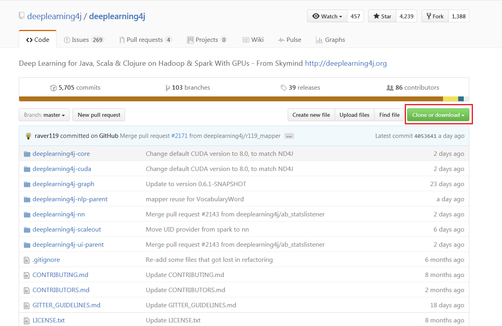
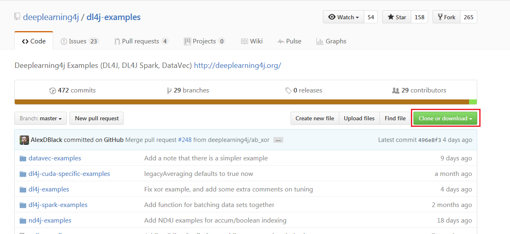
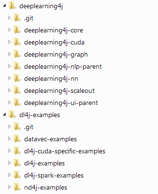
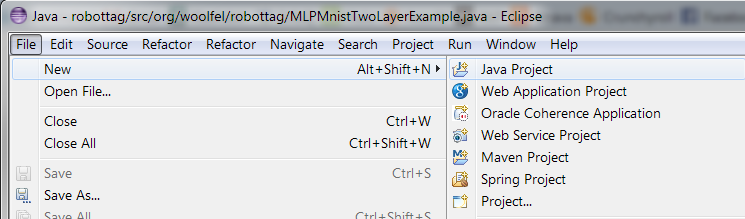
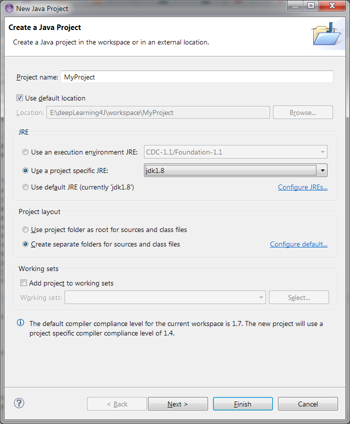
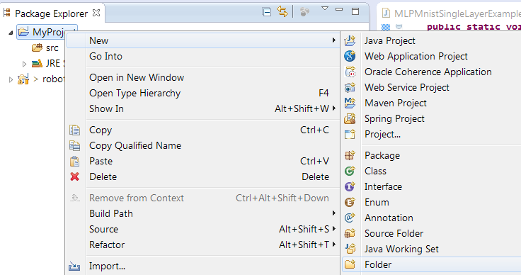
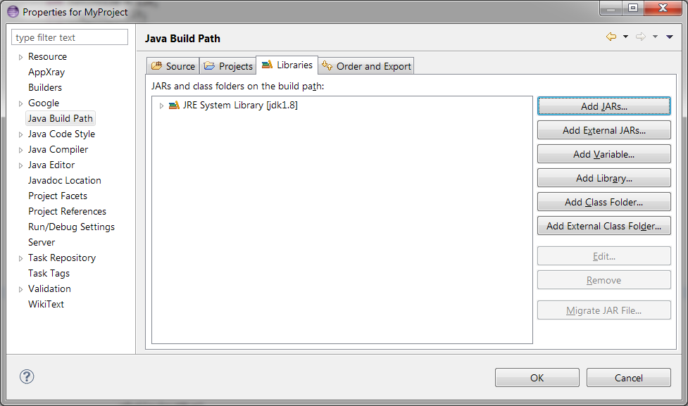
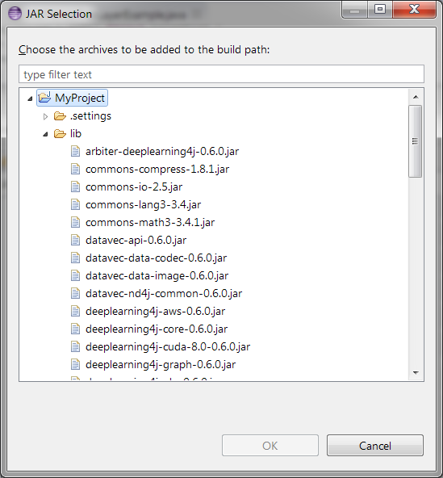

<!-- Begin Inspectlet Embed Code -->
<script type="text/javascript" id="inspectletjs">
window.__insp = window.__insp || [];
__insp.push(['wid', 1755897264]);
(function() {
function ldinsp(){if(typeof window.__inspld != "undefined") return; window.__inspld = 1; var insp = document.createElement('script'); insp.type = 'text/javascript'; insp.async = true; insp.id = "inspsync"; insp.src = ('https:' == document.location.protocol ? 'https' : 'http') + '://cdn.inspectlet.com/inspectlet.js'; var x = document.getElementsByTagName('script')[0]; x.parentNode.insertBefore(insp, x); };
setTimeout(ldinsp, 500); document.readyState != "complete" ? (window.attachEvent ? window.attachEvent('onload', ldinsp) : window.addEventListener('load', ldinsp, false)) : ldinsp();
})();
</script>
<!-- End Inspectlet Embed Code -->

Eclipse Quick Start
=================

This is a step-by-step tutorial for those who prefer Eclipse IDE without using Maven. It is intended for those familiar with Eclipse and have a recent version installed.

## Links

http://www.eclipse.org/downloads/
http://www.oracle.com/technetwork/java/javase/downloads/index.html
http://commons.apache.org/
https://github.com/deeplearning4j/deeplearning4j 
https://github.com/deeplearning4j/dl4j-examples

## Prerequisites

* [Java (developer version)](#Java) 1.7 or later (**Only 64-Bit versions supported**)
* Eclipse 4.3 or newer
* Basic understanding of Java language
* GIT client - optional

If you don't have Eclipse or JDK1.7 installed, please do that before proceeding.

### <a name="GetDL4J">Getting Deep Learning 4 Java</a>

The first step is to download DeepLearning4J and the examples. If you have an existing Github account with github client installed, use the GIT instructions. If you're new to GIT and don't have access to Github client due to corporate firewalls and restrictions, use without GIT instructions.

#### <a name="WithGIT">With GIT</a>

1. Start GIT shell
2. Change to the folder where you want to clone DL4J
3. Run "git clone https://github.com/deeplearning4j/deeplearning4j [local name]" - replace the last parameter with the name of the folder you would like on your system. Note that if you've already forked the project on Github, replace the url with the URL of your fork.
4. Run "git clone https://github.com/deeplearning4j/dl4j-examples [local name]" - replace the last parameter with the name of the folder you would like on your system.

#### <a name="WithOutGIT">Without GIT</a>

1. Open a browser
2. Go to https://github.com/deeplearning4j/deeplearning4j
3. Click "clone or download" and select "download zip"

4. Go to https://github.com/deeplearning4j/dl4j-examples
5. Click "clone or download" and select "download zip"

6. Unzip both files to a folder. I recommend having both folders at the same level. A picture of the folder layout shows what it would look like.



## <a name="libraries">Getting the libraries used by DL4J</a>

Similar to other popular open source projects written in Java, DL4J uses third party libraries. I've created a github project with all the necessary jars for 0.6.x release. If you're using a newer release, most of the third party jar files should be similar. This tutorial won't dive deep into third party libraries, that is for a future tutorial.

Here is a list of the jars and a short description.

  * arbiter-deeplearning4j-0.6.0.jar - contains common DL4J classes
  * commons-compress-1.8.1.jar - apache commons lib for compression utilities
  * commons-io-2.5 - apache commons lib for input/output utilities
  * commons-lang3-3.4.jar - apache commons lib for language utilities
  * commons-math3-3.4.jar - apache commons math libs
  * datavec-api-0.6.0.jar - DL4J lib for converting data into common vector format
  * datavec-data-codec-0.6.0.jar - DL4J lib for codec (codec stands for code and decode)
  * datavec-data-image-0.6.0.jar - DL4J lib for image data
  * datavec-nd4j-common-0.6.0.jar - DL4J data lib that handles ND4J integration
  * deeplearning4j-aws-0.6.0.jar - Amazon AWS lib
  * deeplearning4j-core-0.6.0.jar - the core classes for DL4J
  * deeplearning4j-cuda-8.0-0.6.0.jar - CUDA related classes for DL4J
  * deeplearning4j-graph-0.6.0.jar - classes for handling graphs
  * deeplearning4j-nlp-0.6.0.jar - classes for natural language parsing
  * deeplearning4j-nlp-uima-0.6.0.jar - framework for unstructured information management
  * deeplearning4j-nn-0.6.0.jar - neural net related classes
  * deeplearning4j-ui-0.6.0.jar - user interface related classes
  * deeplearning4j-ui-components-0.6.0.jar - components related to user interface
  * ffmpeg-3.0.2-1.2.jar - java library that uses ffmpeg library
  * ffmpeg-3.0.2-1.2-windows-x86_64.jar - windows specific libraries for ffmpeg
  * guava-10.0.jar - google guava lib is a collection of useful utilities
  * jackson-annotations-2.5.1.jar - popular JSON processing library
  * jackson-databind-2.3.1.jar - databinding classes for jackson
  * jackson-dataformat-yaml-2.5.1.jar - classes for pasing YAML format
  * jackson-datatype-guava-2.5.1.jar - classes related to guava
  * jackson-dataype-jdk7-2.5.1.jar - classes related to JDK1.7
  * jackson-datatype-joda-2.4.4.jar - classes related to Joda time date library
  * jackson-jaxrs-json-provider-2.5.1.jar - support for JAXRS specification
  * javacpp-1.2.4.jar - library for connecting Java to C++ stuff
  * javacv-1.2.jar - java library for Open Computer Vision
  * javassist-3.19.0-GA.jar - java library for bytecode manipulation
  * jfreechart-1.0.13.jar - jfreechart is a java charting framework
  * leptonica-1.73-1.2.jar - image processing library
  * leptonica-1.73-1.2-windows-x86_64.jar - windows specific libraries for calling native code
  * nd4j-api-0.6.0 - NDJ4 is a scientific library for java
  * nd4j-buffer-0.6.0.jar - jars related to buffers
  * nd4j-common-0.6.0.jar - common classes for ND4J
  * nd4j-context-0.6.0.jar - ND4J context classes
  * nd4j-cuda-7.5-0.6.0.jar - CUDA 7.5 common classes
  * nd4j-cuda-7.5-0.6.0-windows-x86_64.jar - windows specific classes for CUDA
  * nd4j-jackson-0.6.0.jar - jackson related classes for nd4j
  * nd4j-native-0.6.0.jar - common classes for using CPU for image processing
  * nd4j-native-0.6.0-windows-x86_64.jar - windows specific classes
  * nd4j-native-api - API for ND4J
  * nd4j-native-platform-0.6.0.jar - classes for handling platform specific calls
  * opencv-3.1.0-1.2.jar - OpenCV related java classes that expose opencv calls
  * opencv-3.1.0-1.2-windows-x86_64.jar - windows specific classes for opencv
  * reflections-0.9.10.jar - reflection utilities
  * slf4j-api-1.7.2.jar - SLF4J logging API


## <a name="newProject">Creating a new Eclipse Project</a>
Now that you have the source code for DL4J, DL4j examples and the robottag project, you're ready to create a new project. I'm going to assume you have used Eclipse before, but just in case you haven't here are the step-by-step instructions. Feel free to skip ahead.

1. Start Eclipse

2. Click File

3. Select New -> Java Project



4. Give the project a name. I am using MyProject in the example, change it to what you want 


5. Click "Use project specific JRE"

6. Select Java 8

7. Click Finish and eclipse will create the project

8. Select the project and right click

9. Select New -> folder to add a folder for the JAR libraries


10. Enter "lib" for the name of the folder and click Finish


11. Using windows explorer, copy all of the jar files from robottag/lib/ folder and paste them into the new lib folder

12. Select your project, right click and select Refresh. You can also use the short-cut key F5 to refresh

13. Right click on the project and select Properties. We will add the JAR libraries to the project


14. Select Java build path


15. Click Libraries tab


16. Click Add Libraries

17. Select all of the jars in the lib folder that doesn't have CUDA in the file name. If you have a NVidia video card and want to use CUDA, also add the CUDA jar files


## Next Steps

1. Join us on Gitter. We have three big community channels.
  * [DL4J Live Chat](https://gitter.im/deeplearning4j/deeplearning4j) is the main channel for all things DL4J. Most people hang out here.
  * [Tunning Help](https://gitter.im/deeplearning4j/deeplearning4j/tuninghelp) is for people just getting started with neural networks. Beginners please visit us here!
  * [Early Adopters](https://gitter.im/deeplearning4j/deeplearning4j/earlyadopters) is for those who are helping us vet and improve the next release. WARNING: This is for more experienced folks. 
2. Read the [introduction to deep neural networks](./neuralnet-overview) or [one of our detailed tutorials](./tutorials). 
3. Check out the more detailed [Comprehensive Setup Guide](./gettingstarted).
4. Browse the [DL4J documentation](./documentation).


### Troubleshooting

**Q:** I'm using a 64-Bit Java on Windows and still get the `no jnind4j in java.library.path` error

**A:** You may have incompatible DLLs on your PATH. To tell DL4J to ignore those, you have to add the following as a VM parameter (Run -> Edit Configurations -> VM Options in IntelliJ):

```
-Djava.library.path=""
```
