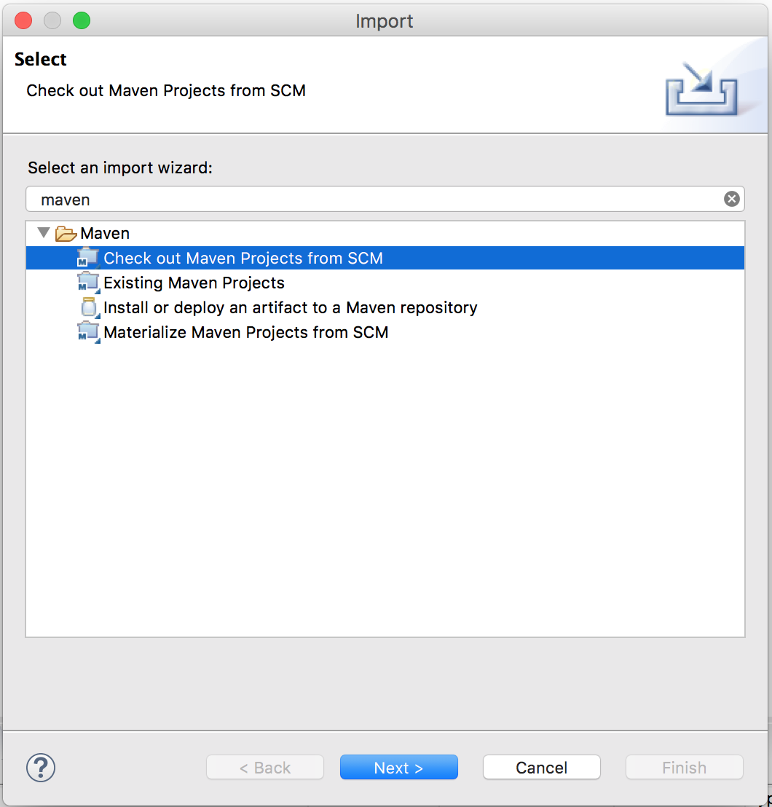
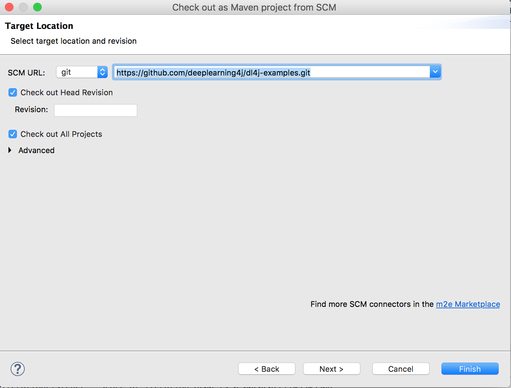
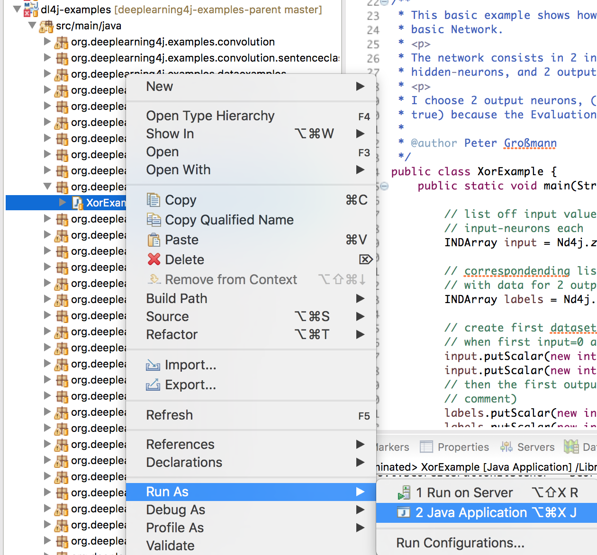
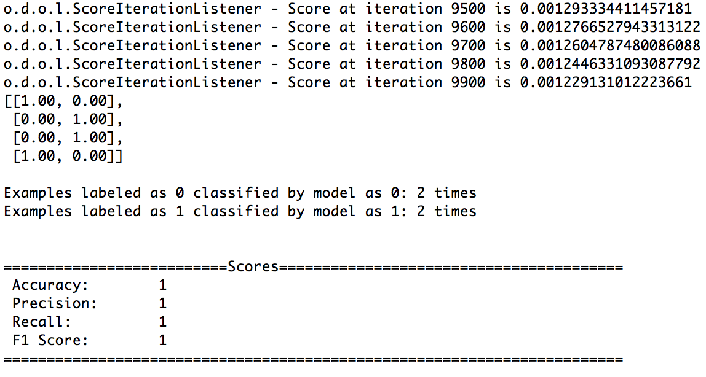

# Gu&iacute;a completa de configuraci&oacute;n de DL4J

Esta p&aacute;gina se apoya en las instrucciones de la [gu&iacute;a de inicio r&aacute;pido](./quickstart), y provee detalles adicionales y algunos pasos para la resoluci&oacute;n de problemas. En serio, vaya y lea esa p&aacute;gina antes de comenzar con &eacute;sta. Esa es la manera de empezar con DL4J.

Es una instalaci&oacute;n en m&uacute;ltiples pasos. Le recomendamos altamente unirse a nuestro [chat en vivo de Gitter](https://gitter.im/deeplearning4j/deeplearning4j) si tiene preguntas o sugerencias, de esa manera podremos ayudarle. Si se siente anti social o abiertamente independente, todav&iacute;a est&aacute; invitado a fisgonear y aprender. Adem&aacute;s, si eres completamente nuevo en deep learning, tenemos [un itinerario de qu&eacute; aprender cuando est&aacute;s empezando](../deeplearningforbeginners.html).

Despu&eacute;s de seguir los pasos en la [gu&iacute;a de inicio r&aacute;pido](./quickstart), por favor lee lo siguiente:

1. <a href="#walk">Repaso detallado</a>
2. <a href="#eclipse">Ejemplos de DL4J en Eclipse</a>
3. <a href="#trouble">Resoluci&oacute;n de problemas</a>
4. <a href="#results">Resultados Reproducibles</a>
5. <a href="#scala">Versi&oacute;n Scala</a>
6. <a href="#native">Optimizaciones de CPU/GPU</a>
7. <a href="#next">Siguientes Pasos</a>


## <a name="walk">Ejemplos de DL4J: Un Repaso Detallado</a>

Esta secci&oacute;n da una versi&oacute;n m&aacute;s completa de los pasos de la [gu&iacute;a r&aacute;pido](./quickstart)

* Escriba lo siguiente en la l&iacute;nea de comando para ver si tiene Git instalado.

		git --version 

* Si no lo tiene, instale [git](https://git-scm.herokuapp.com/book/en/v2/Getting-Started-Installing-Git). 
* Adem&aacute;s, configure una [cuenta de Github](https://github.com/join) y descargue GitHub para [Mac](https://mac.github.com/) o [Windows](https://windows.github.com/). 
* En Windows, encuentre "Git Bash" en el Men&uacute; de Inicio y &aacute;bralo. El terminal de Git Bash deber&iacute;a parecerse al cmd.exe.
* `cd` al directorio donde quiera poner los ejemplos de DL4J. Quiz&aacute; quiera crear un directorio nuevo con `mkdir dl4j-examples` y entonces `cd` en &eacute;l. Entonces ejecute:

    `git clone https://github.com/deeplearning4j/dl4j-examples`
	
* Aseg&uacute;rese que los ficheros fueron descargados introduciendo `ls`. 
* Ahora abra IntelliJ. 
* Pulse en el men&uacute; "Fichero", y entonces en "Importar Proyecto" o "Nuevo Proyecto Desde Fuentes Existentes". Esto le mostrar&aacute; un men&uacute; de ficheros locales. 
* Seleccione el directorio que contiene los ejemplos de DL4J. 
* En la siguiente ventana, se le presentar&aacute; la opci&oacute;n para las herramientas de construcci&oacute;n. Seleccione Maven. 
* Marque la selecci&oacute;n para "B&uacute;squeda de proyectos recursiva" y "Importar proyectos de Maven autom&aacute;ticamente" y pulse "Siguiente." 
* Aseg&uacute;rese de que su JDK/SDK est&aacute; configurado, y si no, pulse en el signo m&aacute;s en la parte de abajo de la ventan de SDK para a&ntilde;adirlo. 
* Entonces contin&uacute;e pulsando hasta que sea preguntado por el nombre de proyecto. El nombre por defecto del proyecto deber&iacute;a valer, as&iacute; que pulse "Finalizar".

## <a name="eclipse">Ejemplos de DL4J en Eclipse</a> 

En IntelliJ, es suficiente con importar los ejemplos como se describe en la gu&iacute;a de inicio r&aacute;pido. Para poder usar el ejemplo en Eclipse, se requiere de un paso adicional.

Despu&eacute;s de un `git clone`, ejecute el siguiente comando desde la l&iacute;nea de comandos:

      mvn eclipse:eclipse 

Esto crear&aacute; un proyecto de Eclipse que podr&aacute; importar.

Despu&eacute;s de muchos a&ntilde;os usando Eclipse, le recomendamos IntelliJ, que tiene un interfaz similar. La arquitectura monol&amp;iacute;tica de Eclipse tiene tendencia a causar errores extra&ntilde;os en nuestro c&oacute;digo y en el de los dem&aacute;s.

Si usa Eclipse, necesitar&aacute; instalar el plugin de Maven para Eclipse: [eclipse.org/m2e/](https://eclipse.org/m2e/).

Michael Depies ha escrito una gu&iacute;a para [instalar Deeplearning4j en Eclipse](https://depiesml.wordpress.com/2015/08/26/dl4j-gettingstarted/).

## <a name="eclipse_mvn_scm_checkout">Usando los ejemplos de DL4J en Eclipse con un checkout directo desde GIT mediante el plugin de Maven</a> 

Si quiere s&oacute;lamente ejecutar los ejemplos dentro de Eclipse sin utilizar la l&iacute;nea de comandos puede tambi&eacute;n hacer un checkout directo del proyecto desde la Herramienta de Control de Versiones (SCM en ingl&eacute;s) integrada en Eclipse:

* En un espacio de trabajo vac&iacute;o, importe mediante "Checkout proyecto Maven desde SCM" y pulse "Siguiente"

* Pegue la url del repositorio de git: https://github.com/deeplearning4j/dl4j-examples.git (En el caso de que no vea "git" en el desplegable y pulse en el enlace "Encontrar m&aacute;s conectores en el m2e Marketplace" en la parte de abajo, a la derecha del di&aacute;logo

* Pulse en Finalizar (..y espere, tomar&aacute; algo de tiempo)

Puede aparecer algunos errores en el validador del pom.xml, ign&oacute;relos por el momento.

&iexcl;Pru&eacute;belo!

Busque el fichero llamado XorExample.java en el paquete org.deeplearning4j.examples.feedforward.xor en la carpeta src/main/java del proyecto dl4j-examples. Pulse con el bot&oacute;n derecho y "Ejecutar como Aplicaci&oacute;n Java"


Deber&iacute;a ver una salida como esta:


&iexcl;Enhorabuena, puede empezar a codificar!


## Repositorio de modelos

A partir de la versi&oacute;n 0.9.0 (or 0.8.1-SNAPSHOT), Deeplearning4j tiene un nuevo repositorio nativo de modelos que puede ser accedido e instanciado directamente desde DL4J. Ya pasaron los tiempos de copiar la configuraci&oacute;n de los modelos desde Github. El repositorio de modelos tambi&eacute;n incluye pesos pre entrenados para diferentes datasets que son descargados autom&aacute;ticamente y comprobados por integridad.

Configurar un modelo pre entrenado con pesos ajustados para ImageNet es tan f&aacute;cil como:

```
ZooModel zooModel = new VGG16();
ComputationGraph pretrainedNet = zooModel.initPretrained(PretrainedType.IMAGENET);
```

Aprenda m&aacute;s sobre el nuevo repositorio [aqu&iacute;](../model-zoo)
Learn more about the new zoo [here](/model-zoo).


## <a name="trouble">Resoluci&oacute;n de problemas</a>

* Por favor, si&eacute;ntase libre de preguntar sobre mensajes de error en nuestro [chat en vivo de Gitter](https://gitter.im/deeplearning4j/deeplearning4j). Cuando publique alguna pregunta, por favor tenga la siguiente informaci&oacute;n disponible (&iexcl;eso acelerar&aacute; realmente las cosas!):

      * Sistema Operativo (Windows, OSX, Linux) y versi&oacute;n 
      * Versi&oacute;n de Java (7, 8) : escriba java -version en su terminal/CMD
      * Versi&oacute;n de Maven : escriba mvn --version en su terminal/CMD
      * Volcado de pila: Por favor copie el c&oacute;digo de en Gist y comparta con nosotros el enlace: https://gist.github.com/
* Si ten&iacute;a anteriormente instalado DL4J y ahora ve ejemplos arrojando errores, por favor actualize sus librer&iacute;as. Con Maven, solamente actualize las versiones en su fichero POM.xml para ajustarse a las &uacute;ltimas versiones en [Maven Central](https://search.maven.org/#search%7Cga%7C1%7Cdeeplearning4j). Con c&oacute;digo, puede ejecutar un `git clone` sobre [ND4J](http://nd4j.org/getstarted.html), datavec y DL4J y un `mvn clean install -DskipTests=true -Dmaven.javadoc.skip=true` dentro de los tres directorios, en ese orden. 

**nota** Cuando construya o reconstruya desde los fuentes por favor vea [Building Locally](../buildinglocally) para las instrucciones completas. 

* Cuando ejecute un ejemplo, puede obtener un [valor-F](../glossary.html#f1) bajo, que es la probabilidad de que la clasifici&oacute;n de la red sea exacta. En este caso, un valor-F bajo no indica un rendimiento pobre, porque los ejemplos est&aacute;n entrenados con un conjunto peque&ntilde;o de datos. Los damos con un conjunto peque&ntilde;o de datos para que puedan ejecutarse r&aacute;pidamente. Como los conjuntos peque&ntilde;os de datos son menos representativos que unos grandes, los resultados que producen pueden variar grandemente. Por ejemplo, en los datos del ejemplo min&uacute;sculo, el valor-F de nuestra red de deep-belief actualmente var&iacute;a entre 0.32 y 1.0. 
* Deeplearning4j incluye una **functi&oacute;n de autocompletado**. Si no est&aacute; seguro de qu&eacute; comandos est&aacute;n disponibles, pulse cualquier tecla y un desplegable como este aparecer&aacute;:

* Aqu&iacute; est&aacute; el **Javadoc** para todas [las clases y m&eacute;todos de Deeplearning4j](http://deeplearning4j.org/doc/).
* Seg&uacute;n va creciendo el c&oacute;digo base, instalar desde los fuentes requiere m&aacute;s memoria. Si se encuentra con un `error de Permgen` durante la construcci&oacute;n de DL4J, puede necesitar a&ntilde;adir m&aacute;s **heap space**. Para hacerlo, necesitar&aacute; encontrar y modificar su fichero oculto `.bash_profile` file, que a&ntilde;ade las variables de entorno abash. Par ver esas variables, introduzca `env` en a l&iacute;nea de comandos. Para a&ntilde;adir m&aacute;s heap space, instroduzca este comando en la consola:
		echo "export MAVEN_OPTS="-Xmx512m -XX:MaxPermSize=512m"" > ~/.bash_profile
* Versiones antiguas de Maven, como la 3.0.4, son susceptibles de lanzar excepciones como NoSuchMethodError. Esto puede arreglarse actualizando al &uacute;ltima versi&oacute;n de Maven, que es actualmente la 3.3.x. Para comprobar su versi&oacute;n de Maven, introduzca `mvn -v` en la l&iacute;nea de comandos.
* Despu&eacute;s de que instale Maven, puede recibir un mensaje como este: `mvn  no se reconoce como un comando interno o externo, programa o archivo por lotes ejecutable.` Esto significa que necesita Maven en su [variable PATH](https://www.java.com/en/download/help/path.xml), que puede cambiar como cualquier otra variable de entorno.  
* si ve el error `Invalid JDK version in profile 'java8-and-higher': Unbounded range: [1.8, for project com.github.jai-imageio:jai-imageio-core com.github.jai-imageio:jai-imageio-core:jar:1.3.0`, puede tener un problema con Maven. Por favor actualize a la versi&oacute;n 3.3.x.
* Para compilar algunas dependencias de ND4J, necesita installar algunas **herramientas de desarrollo** de C y C++. [Por favor vea nuestra gu&iacute;a de ND4J](http://nd4j.org/getstarted.html#devtools).
* La ruta incluida para [Java CPP](https://github.com/bytedeco/javacpp) no siempre funciona en **Windows**. Una soluci&oacute;n es coger los fcheros de cabeceras del directorio include de Visual Studio, y ponerlas en el directorio include del Java Run-Time Environment (JRE), donde Java est&eacute; instalado. Esto afectar&aacute; a ficheros como standardio.h. M&aacute;s informaci&oacute;n est&aacute; disponible [aqu&iacute;](http://nd4j.org/getstarted.html#windows). 
* Las instrucciones para la monitorizaci&oacute;n de sus GPUs est&aacute; [aqu&iacute;](http://nd4j.org/getstarted.html#gpu).
* One major reason to use Java is its pre-baked diagnostics in the **[JVisualVM](https://docs.oracle.com/javase/8/docs/technotes/tools/unix/jvisualvm.html)**. If you have Java installed, just enter `jvisualvm` in your command line and you'll get visuals on your CPU, Heap, PermGen, Classes and Threads. One useful view: Click on the `Sampler` tab on the upper right, and then select the CPU or Memory button for visuals. 

* Algunos de los problemas encontrados usando DL4J pueden ser debidos a la falta de familiaridad con las ideas y t&eacute;cnicas del machine learning. Recomendamos encarecidamente a los usuarios de Deeplearning4j confiar en recursos m&aacute;s all&aacute; de esta p&aacute;gina web para comprender los fundamentos. Hemos incluido una lista de recursos educativos de machine y deep learning en [esta p&aacute;gina](../deeplearningpapers.html). Mientras que nosotros hemos documentado parcialmente DL4J, partes del c&oacute;digo permanecen en un puro, lenguaje espec&iacute;fico del dominio del for deep learning.
* Cuando use `deeplearning4j-nlp` desde una aplicaci&oacute;n **Clojure** y construya un uberjar con Leiningen, es necesario especificar lo siguiente en el `project.clj` de tal manera que los ficheros de recursos `reference.conf` son juntados apropiadamente. `:uberjar-merge-with {#"\.properties$" [slurp str spit] "reference.conf" [slurp str spit]}`. Note que la primera entrada en el mapa de los ficheros .properties es habitualmente la de por defecto). Si no se hace, se lanzar&aacute; la siguiente excepci&oacute;n cuando trate de ejecutar uberjar resultante: `Exception in thread "main" com.typesafe.config.ConfigException$Missing: No configuration setting found for key 'akka.version'`.
* El soporte para flotantes est&aacute; lleno de fallos en OSX. Si ve NANs donde esperaba n&uacute;meros ejecutando nuestros ejemplos, cambie el tipo de dato a `double`.
* Hay un error en el fork-join de Java 7. Actualizar a Java 8 lo soluciona. Si obtiene un error de OutofMemory similar a este, fork join es el problema: `java.util.concurrent.ExecutionException: java.lang.OutOfMemoryError`
.... `java.util.concurrent.ForkJoinTask.getThrowableException(ForkJoinTask.java:536)`

### Entornos Gestionados

Si est&aacute; trabajando en un entorno gestionado como like Databricks, Domino o Sense.io, tendr&aacute; que hacer un paso adicional. Despu&eacute;s de que haya seguido la configuraci&oacute;n local anterior, solamente ejecute 

		mvn clean package

en la l&iacute;nea de comandos desde dentro del directorios de ejemplos. Entonces puede subir el fichero JAR al entorno gestionado que haya seleccionado.

### <a name="results">Resultados Reproducibles</a>

Los pesos de las redes neuronales se inicializan aleatoriamente, lo que significa que el modelo comienza el aprendizaje desde diferente punto en el espacio de pesos cada vez, lo que puede llevar a un &oacute;ptimo local diferente. Los usuarios que busquen resultados reproducibles necesitar&aacute;n utilizar los mismos pesos aleatorios, que deber&aacute;n inicializar antes de que el modelo sea creado. Pueden reinicializarse con los mismos pesos aleatorios usando el siguiente m&eacute;todo:

``` java
	long seed = 6;
      MultiLayerConfiguration conf = new NeuralNetConfiguration.Builder()
            .seed(seed)
```

### <a name='scala'>Scala</a> 

Nuestra [versi&oacute;n de Scala](https://github.com/deeplearning4j/Scalnet) est&aacute; aqu&iacute;. Es una migraci&oacute;n de keras a scala (el trabajo est&aacute; en progreso).
      

## Avanzado: Usando la L&iacute;nea de Comandos en AWS

Si instala Deeplearning4j en un servidor AWS sobre Linux OS, quiz&aacute; quiera utilizar la l&iacute;nea de comandos para ejecutar sus primeros ejemplos, 
, m&aacute;s que depender de un IDE. En ese caso, ejecute los *git clone* y *mvn clean install* acorde a las instrucciones anteriores. Con las instalaciones completadas, puede ejecutar un ejemplo real con una l&iacute;nea de c&oacute;digo desde la l&iacute;nea de comandos. La l&iacute;nea puede variar dependiendo de la versi&oacute;n de repositorio y el ejemplo espec&iacute;fico que elija. 

Aqu&iacute; tiene una plantilla:

    java -cp target/nameofjar.jar fully.qualified.class.name

Y este es un ejemplo concreto, para mostrarle aproximadamente c&oacute;mo deber&iacute;a ser su comando:

    java -cp target/dl4j-examples.jar org.deeplearning4j.MLPBackpropIrisExample

Esto es, hay dos comodines que cambiar&aacute;n seg&uacute;n vayamos actualizando y avance a trav&eacute;s de los ejemplos:

    java -cp target/*.jar org.deeplearning4j.*

Para hacer cambios en los ejemplos desde la l&iacute;nea de comandos y ejecutar el fichero modificado, podr&iacute;a por ejemplo, afinar *MLPBackpropIrisExample* en *src/main/java/org/deeplearning4j/multilayer* y entonces hacer maven-build de los ejemplos de nuevo. 

### <a name="native">Optimizaciones nativas de CPU y GPU</a>

Para hacer un mejor uso de su hardware vea esta p&aacute;gina para optimizaciones de CPU.

<a href="../native">Optimizaciones nativas de CPU para DeepLearning4J y ND4J</a>

Para hacer un mejor uso de sus GPUs, vea esta p&aacute;gina para configurar nuestra librer&iacute;a de procesamiento de datos ND4J para GPUs.

<a href="http://nd4j.org/gpu_native_backends.html">Backend nativo de GPU para ND4J</a>


### <a name="next">Siguientes pasos: Ejemplo IRIS y Construyendo Redes Neuronales</a>

Para empezar a construir redes neuronales, compruebe el [Resumen de Redes Neuronales](../neuralnet-overview.html) para m&aacute;s informaci&oacute;n.

&Eacute;chele un vistazo al [tutorial de MNIST](./mnist-for-beginners.html) para ponerse en marcha r&aacute;pidamente, y compruebe nuestra gu&iacute;a para [m&aacute;quinas de Boltzmann restringidas](./restrictedboltzmannmachine.html) (restricted Boltzmann machines en ingl&eacute;s) para comprender los mecanismos b&aacute;sicos de las *redes de creencia profunda* (deep-belief networks en ingl&eacute;s).

Sigua las instrucciones de [Primeros pasos con ND4J](http://nd4j.org/getstarted.html) para empezar un nuevo proyecto e incluya las [dependencias POM](http://nd4j.org/dependencies.html) necesarias. 
