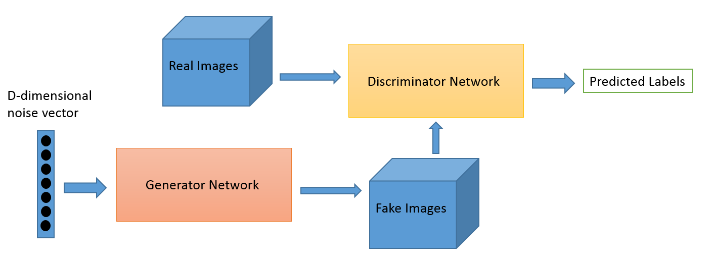

# A Beginner's Guide to Generative Adversarial Networks (GANs)

Generative adversarial networks (GANs) are deep neural net architectures comprised of two nets, pitting one against the other (thus the "adversarial"). 

[GANs were introduced in a paper](https://arxiv.org/abs/1406.2661) by Ian Goodfellow and other researchers at the University of Montreal, including Yoshua Bengio, in 2014. Referring to GANs, Facebook's AI research director Yann LeCun [called adversarial training](https://www.quora.com/What-are-some-recent-and-potentially-upcoming-breakthroughs-in-deep-learning) "the most interesting idea in the last 10 years in ML."

GANs' potential is huge, because they can learn to mimic any distribution of data. That is, GANs can be taught to create worlds eerily similar to our own in any domain: images, music, speech, prose. They are robot artists in a sense, and their [output is impressive](https://www.nytimes.com/2017/08/14/arts/design/google-how-ai-creates-new-music-and-new-artists-project-magenta.html) -- poignant even. 

## Generative vs. Discriminative Algorithms

To understand GANs, you should know how generative algorithms work, and for that, contrasting them with discriminative algorithms is instructive. Discriminative algorithms try to classify input data; that is, given the features of a data instance, they predict a label or category to which that data belongs. 

For example, given all the words in an email, a discriminative algorithm could predict whether the message is `spam` or `not_spam`. `spam` is one of the labels, and the bag of words gathered from the email are the features that constitute the input data. When this problem is expressed mathematically, the label is called `y` and the features are called `x`. The formulation `p(y|x)` is used to mean "the probability of y given x", which in this case would translate to "the probability that an email is spam given the words it contains."

So discriminative algorithms map features to labels. They are concerned solely with that correlation. One way to think about generative algorithms is that they do the opposite. Instead of predicting a label given certain features, they attempt to predict features given a certain label. 

The question a generative algorithm tries to answer is: Assuming this email is spam, how likely are these features? While discriminative models care about the relation between `y` and `x`, generative models care about "how you get x." They allow you to capture `p(x|y)`, the probability of `x` given `y`, or the probability of features given a class. (That said, generative algorithms can also be used as classifiers. It just so happens that they can do more than categorize input data.)

Another way to think about it is to distinguish discriminative from generative like this:

* Discriminative models learn the boundary between classes
* Generative models model the distribution of individual classes

## How GANs Work

One neural network, called the *generator*, generates new data instances, while the other, the *discriminator*, evaluates them for authenticity; i.e. the discriminator decides whether each instance of data it reviews belongs to the actual training dataset or not. 

Let's say we're trying to do something more banal than mimic the Mona Lisa. We're going to generate hand-written numerals like those found in the MNIST dataset, which is taken from the real world. The goal of the discriminator, when shown an instance from the true MNIST dataset, is to recognize them as authentic.

Meanwhile, the generator is creating new images that it passes to the discriminator. It does so in the hopes that they, too, will be deemed authentic, even though they are fake. The goal of the generator is to generate passable hand-written digits, to lie without being caught. The goal of the discriminator is to identify images coming from the generator as fake. 

Here are the steps a GAN takes:

* The generator takes in random numbers and returns an image. 
* This generated image is fed into the discriminator alongside a stream of images taken from the actual dataset. 
* The discriminator takes in both real and fake images and returns probabilities, a number between 0 and 1, with 1 representing a prediction of authenticity and 0 representing fake. 

So you have a double feedback loop:

* The discriminator is in a feedback loop with the ground truth of the images, which we know. 
* The generator is in a feedback loop with the discriminator.

Credit: O'Reilly

You can think of a GAN as the combination of a counterfeiter and a cop in a game of cat and mouse, where the counterfeiter is learning to pass false notes, and the cop is learning to detect them. Both are dynamic; i.e. the cop is in training, too (maybe the central bank is flagging bills that slipped through), and each side comes to learn the other's methods in a constant escalation. 

The discriminator network is a standard convolutional network that can categorize the images fed to it, a binomial classifier labeling images as real or fake. The generator is an inverse convolutional network, in a sense: While a standard convolutional classifier takes an image and downsamples it to produce a probability, the generator takes a vector of random noise and upsamples it to an image. The first throws away data through downsampling techniques like maxpooling, and the second generates new data. 

Both nets are trying to optimize a different and opposing objective function, or loss function, in a zero-zum game. This is essentially an [actor-critic model](https://arxiv.org/abs/1610.01945). As the discriminator changes its behavior, so does the generator, and vice versa. Their losses push against each other. 

If you want to learn more about generating images, Brandon Amos wrote a great post about [interpreting images as samples from a probability distribution](http://bamos.github.io/2016/08/09/deep-completion/#step-1-interpreting-images-as-samples-from-a-probability-distribution). 

## GANs, Autoencoders and VAEs

It may be useful to compare generative adversarial networks to other neural networks, such as autoencoders and variational autoencoders. 

Autoencoders *encode* input data as vectors. They create a hidden, or compressed, representation of the raw data. They are useful in dimensionality reduction; that is, the vector serving as a hidden representation compresses the raw data into a smaller number of salient dimensions. Autoencoders can be paired with a so-called decoder, which allows you to reconstruct input data based on its hidden representation, much as you would with a [restricted Boltzmann machine](./restrictedboltzmannmachine). 

[Credit: Keras blog](https://blog.keras.io/building-autoencoders-in-keras.html)

Variational autoencoders are generative algorithm that add an additional constraint to encoding the input data, namely that the hidden representations are normalized. Variational autoencoders are capable of both compressing data like an autoencoder and synthesizing data like a GAN. However, while GANs generate data in fine, granular detail, images generated by VAEs tend to be more blurred. Deeplearning4j's examples include both [autoencoders and variational autoencoders](https://github.com/deeplearning4j/dl4j-examples/tree/master/dl4j-examples/src/main/java/org/deeplearning4j/examples/unsupervised).

You can bucket generative algorithms into one of three types:

* Given a label, they predict the associated features (Naive Bayes)
* Given a hidden representation, they predict the associated features (VAE, GAN)
* Given some of the features, they predict the rest (inpainting, imputation)

## Tips in Training a GAN

When you train the discriminator, hold the generator values constant; and when you train the generator, hold the discriminator constant. Each should train against a static adversary. For example, this gives the generator a better read on the gradient it must learn by.

By the same token, pretraining the discriminator against MNIST before you start training the generator will establish a clearer gradient.

Each side of the GAN can overpower the other. If the discriminator is too good, it will return values so close to 0 or 1 that the generator will struggle to read the gradient. If the generator is too good, it will persistently exploit weaknesses in the discriminator that lead to false negatives. This may be mitigated by the nets' respective learning rates. 

GANs take a long time to train. On a single GPU a GAN might take hours, and on a single CPU more than a day. While difficult to tune and therefore to use, GANs have stimulated a lot of [interesting research and writing](https://blog.openai.com/generative-models/). 

**Note:** Deeplearning4j's latest release on Maven does not include GANs, but it will soon be possible to build and use them via auto-differentiation and model import from Keras and Tensorflow, all of which are currently available in the master repository on Github.

## Resources for Generative Networks

* ["Generative Learning algorithms" - Andrew Ng's Stanford notes](http://cs229.stanford.edu/notes/cs229-notes2.pdf)
* [On Discriminative vs. Generative classifiers: A comparison of logistic regression and naive Bayes, by Andrew Ng and Michael I. Jordan](http://papers.nips.cc/paper/2020-on-discriminative-vs-generative-classifiers-a-comparison-of-logistic-regression-and-naive-bayes.pdf) 
* [The Math Behind Generative Adversarial Networks](https://lilianweng.github.io/lil-log/2017/08/20/from-GAN-to-WGAN.html)

### <a name="beginner">Other Machine Learning Tutorials</a>
* [Introduction to Neural Networks](./neuralnet-overview)
* [Recurrent Networks and LSTMs](./lstm)
* [Word2Vec: Neural Embeddings for Java](./word2vec)
* [Restricted Boltzmann Machines](./restrictedboltzmannmachine)
* [Eigenvectors, Covariance, PCA and Entropy](./eigenvector)
* [Neural Networks & Regression](./logistic-regression)
* [Convolutional Networks (CNNs)](./convolutionalnets)
* [Generative Adversarial Networks (GANs)](./generative-adversarial-network)
* [Inference: Machine Learning Model Server](./machine-learning-modelserver)

## GAN Use Cases

* [Text to Image Generation](https://arxiv.org/abs/1605.05396)
* [Image to Image Translation](https://arxiv.org/abs/1611.07004)
* [Increasing Image Resolution](https://arxiv.org/abs/1609.04802)
* [Predicting Next Video Frame]( https://arxiv.org/abs/1511.06380)

## Notable Papers on GANs

* [Generative Adversarial Nets] [[Paper]](https://arxiv.org/abs/1406.2661)
[[Code]](https://github.com/goodfeli/adversarial)(Ian Goodfellow's breakthrough paper)

### Unclassified Papers & Resources

* [GAN Hacks: How to Train a GAN? Tips and tricks to make GANs work](https://github.com/soumith/ganhacks)

* Deep Generative Image Models using a Laplacian Pyramid of Adversarial Networks] [[Paper]](https://arxiv.org/abs/1506.05751)[[Code]](https://github.com/facebook/eyescream)

* [Adversarial Autoencoders] [[Paper]](http://arxiv.org/abs/1511.05644)[[Code]](https://github.com/musyoku/adversarial-autoencoder)

* [Generating Images with Perceptual Similarity Metrics based on Deep Networks] [[Paper]](https://arxiv.org/pdf/1602.02644v2.pdf)

* [Generating images with recurrent adversarial networks] [[Paper]](https://arxiv.org/abs/1602.05110)[[Code]](https://github.com/ofirnachum/sequence_gan)

* [Generative Visual Manipulation on the Natural Image Manifold] [[Paper]](https://people.eecs.berkeley.edu/~junyanz/projects/gvm/eccv16_gvm.pdf)[[Code]](https://github.com/junyanz/iGAN)

* [Learning What and Where to Draw] [[Paper]](http://www.scottreed.info/files/nips2016.pdf)[[Code]](https://github.com/reedscot/nips2016)

* [Adversarial Training for Sketch Retrieval] [[Paper]](http://link.springer.com/chapter/10.1007/978-3-319-46604-0_55)

* [Generative Image Modeling using Style and Structure Adversarial Networks] [[Paper]](https://arxiv.org/pdf/1603.05631.pdf)[[Code]](https://github.com/xiaolonw/ss-gan)

* [Generative Adversarial Networks as Variational Training of Energy Based Models] [[Paper]](http://www.mathpubs.com/detail/1611.01799v1/Generative-Adversarial-Networks-as-Variational-Training-of-Energy-Based-Models)(ICLR 2017)

* [Synthesizing the preferred inputs for neurons in neural networks via deep generator networks] [[Paper]](https://arxiv.org/pdf/1605.09304v5.pdf)[[Code]](https://github.com/Evolving-AI-Lab/synthesizing)

* [SalGAN: Visual Saliency Prediction with Generative Adversarial Networks] [[Paper]](https://arxiv.org/abs/1701.01081)[[Code]](https://github.com/imatge-upc/saliency-salgan-2017)

* [Adversarial Feature Learning] [[Paper]](https://arxiv.org/abs/1605.09782)

### Generating High-Quality Images

* [Unsupervised Representation Learning with Deep Convolutional Generative Adversarial Networks] [[Paper]](https://arxiv.org/abs/1511.06434)[[Code]](https://github.com/jacobgil/keras-dcgan)(Gan with convolutional networks)(ICLR)

* [Generative Adversarial Text to Image Synthesis] [[Paper]](https://arxiv.org/abs/1605.05396)[[Code]](https://github.com/reedscot/icml2016)[[Code]](https://github.com/paarthneekhara/text-to-image)

* [Improved Techniques for Training GANs] [[Paper]](https://arxiv.org/abs/1606.03498)[[Code]](https://github.com/openai/improved-gan)(Goodfellow's paper)

* [Plug & Play Generative Networks: Conditional Iterative Generation of Images in Latent Space] [[Paper]](https://arxiv.org/abs/1612.00005v1)[[Code]](https://github.com/Evolving-AI-Lab/ppgn)

* [StackGAN: Text to Photo-realistic Image Synthesis with Stacked Generative Adversarial Networks] [[Paper]](https://arxiv.org/pdf/1612.03242v1.pdf)[[Code]](https://github.com/hanzhanggit/StackGAN)

* [Improved Training of Wasserstein GANs] [[Paper]](https://arxiv.org/abs/1704.00028)[[Code]](https://github.com/igul222/improved_wgan_training)

* [Boundary Equibilibrium Generative Adversarial Networks Implementation in Tensorflow] [[Paper]](https://arxiv.org/abs/1703.10717)[[Code]](https://github.com/artcg/BEGAN)

* [Progressive Growing of GANs for Improved Quality, Stability, and Variation ] [[Paper]](http://research.nvidia.com/publication/2017-10_Progressive-Growing-of)[[Code]](https://github.com/tkarras/progressive_growing_of_gans)

### Semi-supervised learning

* [Adversarial Training Methods for Semi-Supervised Text Classification] [[Paper]](https://arxiv.org/abs/1605.07725)[[Note]](https://github.com/dennybritz/deeplearning-papernotes/blob/master/notes/adversarial-text-classification.md)( Ian Goodfellow Paper)

* [Improved Techniques for Training GANs] [[Paper]](https://arxiv.org/abs/1606.03498)[[Code]](https://github.com/openai/improved-gan)(Goodfellow's paper)

* [Unsupervised and Semi-supervised Learning with Categorical Generative Adversarial Networks] [[Paper]](https://arxiv.org/abs/1511.06390)(ICLR)

* [Semi-Supervised QA with Generative Domain-Adaptive Nets] [[Paper]](https://arxiv.org/abs/1702.02206)(ACL 2017)

### Ensembles

* [AdaGAN: Boosting Generative Models] [[Paper]](https://arxiv.org/abs/1701.02386)[[Code]]（Google Brain）

### Clustering

* [Unsupervised and Semi-supervised Learning with Categorical Generative Adversarial Networks] [[Paper]](https://arxiv.org/abs/1511.06390)(ICLR)

### Image blending

* [GP-GAN: Towards Realistic High-Resolution Image Blending] [[Paper]](https://arxiv.org/abs/1703.07195)[[Code]](https://github.com/wuhuikai/GP-GAN)

### Image Inpainting

* [Semantic Image Inpainting with Perceptual and Contextual Losses] [[Paper]](https://arxiv.org/abs/1607.07539)[[Code]](https://github.com/bamos/dcgan-completion.tensorflow)(CVPR 2017)

* [Context Encoders: Feature Learning by Inpainting] [[Paper]](https://arxiv.org/abs/1604.07379)[[Code]](https://github.com/jazzsaxmafia/Inpainting)

* [Semi-Supervised Learning with Context-Conditional Generative Adversarial Networks] [[Paper]](https://arxiv.org/abs/1611.06430v1)

* [Generative face completion] [[Paper]](https://drive.google.com/file/d/0B8_MZ8a8aoSeenVrYkpCdnFRVms/edit)[[Code]](https://github.com/Yijunmaverick/GenerativeFaceCompletion)(CVPR2017)

* [Globally and Locally Consistent Image Completion] [[MainPAGE]](http://hi.cs.waseda.ac.jp/~iizuka/projects/completion/en/)(SIGGRAPH 2017)

### Joint Probability

* [Adversarially Learned Inference][[Paper]](https://arxiv.org/abs/1606.00704)[[Code]](https://github.com/IshmaelBelghazi/ALI)

### Super-Resolution

* [Image super-resolution through deep learning ][[Code]](https://github.com/david-gpu/srez)(Just for face dataset)

* [Photo-Realistic Single Image Super-Resolution Using a Generative Adversarial Network] [[Paper]](https://arxiv.org/abs/1609.04802)[[Code]](https://github.com/leehomyc/Photo-Realistic-Super-Resoluton)（Using Deep residual network）

* [EnhanceGAN] [Docs](https://medium.com/@richardherbert/faces-from-noise-super-enhancing-8x8-images-with-enhancegan-ebda015bb5e0#.io6pskvin)[[Code]]

### De-occlusion

* [Robust LSTM-Autoencoders for Face De-Occlusion in the Wild] [[Paper]](https://arxiv.org/abs/1612.08534)

### Semantic Segmentation

* [Adversarial Deep Structural Networks for Mammographic Mass Segmentation] [[Paper]](https://arxiv.org/abs/1612.05970)[[Code]](https://github.com/wentaozhu/adversarial-deep-structural-networks)

* [Semantic Segmentation using Adversarial Networks] [[Paper]](https://arxiv.org/abs/1611.08408)（Soumith's paper）

### Object Detection

* [Perceptual generative adversarial networks for small object detection] [[Paper]](https://arxiv.org/abs/1706.05274v2)(CVPR 2017)

* [A-Fast-RCNN: Hard Positive Generation via Adversary for Object Detection] [[Paper]](http://abhinavsh.info/papers/pdfs/adversarial_object_detection.pdf)[[Code]](https://github.com/xiaolonw/adversarial-frcnn)(CVPR2017)

### RNN-GANs

* [C-RNN-GAN: Continuous recurrent neural networks with adversarial training] [[Paper]](https://arxiv.org/abs/1611.09904)[[Code]](https://github.com/olofmogren/c-rnn-gan)

### Conditional Adversarial Nets

* [Conditional Generative Adversarial Nets] [[Paper]](https://arxiv.org/abs/1411.1784)[[Code]](https://github.com/zhangqianhui/Conditional-Gans)

* [InfoGAN: Interpretable Representation Learning by Information Maximizing Generative Adversarial Nets] [[Paper]](https://arxiv.org/abs/1606.03657)[[Code]](https://github.com/buriburisuri/supervised_infogan)[[Code]](https://github.com/openai/InfoGAN)

* [Conditional Image Synthesis With Auxiliary Classifier GANs] [[Paper]](https://arxiv.org/abs/1610.09585)[[Code]](https://github.com/buriburisuri/ac-gan)(GoogleBrain ICLR 2017)

* [Pixel-Level Domain Transfer] [[Paper]](https://arxiv.org/pdf/1603.07442v2.pdf)[[Code]](https://github.com/fxia22/pldtgan)

* [Invertible Conditional GANs for image editing] [[Paper]](https://arxiv.org/abs/1611.06355)[[Code]](https://github.com/Guim3/IcGAN)

* [Plug & Play Generative Networks: Conditional Iterative Generation of Images in Latent Space] [[Paper]](https://arxiv.org/abs/1612.00005v1)[[Code]](https://github.com/Evolving-AI-Lab/ppgn)

* [StackGAN: Text to Photo-realistic Image Synthesis with Stacked Generative Adversarial Networks] [[Paper]](https://arxiv.org/pdf/1612.03242v1.pdf)[[Code]](https://github.com/hanzhanggit/StackGAN)

* [MaskGAN: Better Text Generation via Filling in the ______](https://arxiv.org/abs/1801.07736) Goodfellow et al

### Video Prediction & Generation

* [Deep multi-scale video prediction beyond mean square error] [[Paper]](https://arxiv.org/abs/1511.05440)[[Code]](https://github.com/dyelax/Adversarial_Video_Generation)(Yann LeCun's paper)

* [Generating Videos with Scene Dynamics] [[Paper]](https://arxiv.org/abs/1609.02612)[[Web]](http://web.mit.edu/vondrick/tinyvideo/)[[Code]](https://github.com/cvondrick/videogan)

* [MoCoGAN: Decomposing Motion and Content for Video Generation] [[Paper]](https://arxiv.org/abs/1707.04993)

### Texture Synthesis & Style Transfer

* [Precomputed real-time texture synthesis with markovian generative adversarial networks] [[Paper]](https://arxiv.org/abs/1604.04382)[[Code]](https://github.com/chuanli11/MGANs)(ECCV 2016)

### Image Translation 

* [Unsupervised cross-domain image generation] [[Paper]](https://arxiv.org/abs/1611.02200)[[Code]](https://github.com/yunjey/domain-transfer-network)

* [Image-to-image translation using conditional adversarial nets] [[Paper]](https://arxiv.org/pdf/1611.07004v1.pdf)[[Code]](https://github.com/phillipi/pix2pix)[[Code]](https://github.com/yenchenlin/pix2pix-tensorflow)

* [Learning to Discover Cross-Domain Relations with Generative Adversarial Networks] [[Paper]](https://arxiv.org/abs/1703.05192)[[Code]](https://github.com/carpedm20/DiscoGAN-pytorch)

* [Unpaired Image-to-Image Translation using Cycle-Consistent Adversarial Networks] [[Paper]](https://junyanz.github.io/CycleGAN/)[[Code]](https://github.com/junyanz/CycleGAN)

* [CoGAN: Coupled Generative Adversarial Networks] [[Paper]](https://arxiv.org/abs/1606.07536)[[Code]](https://github.com/andrewliao11/CoGAN-tensorflow)(NIPS 2016)

* [Unsupervised Image-to-Image Translation with Generative Adversarial Networks] [[Paper]](https://arxiv.org/pdf/1701.02676.pdf)

* [Unsupervised Image-to-Image Translation Networks] [[Paper]](https://arxiv.org/abs/1703.00848)

* [Triangle Generative Adversarial Networks] [[Paper]](https://arxiv.org/abs/1709.06548)

### GAN Theory

* [Energy-based generative adversarial network] [[Paper]](https://arxiv.org/pdf/1609.03126v2.pdf)[[Code]](https://github.com/buriburisuri/ebgan)(Lecun paper)

* [Improved Techniques for Training GANs] [[Paper]](https://arxiv.org/abs/1606.03498)[[Code]](https://github.com/openai/improved-gan)(Goodfellow's paper)

* [Mode Regularized Generative Adversarial Networks] [[Paper]](https://openreview.net/pdf?id=HJKkY35le)(Yoshua Bengio , ICLR 2017)

* [Improving Generative Adversarial Networks with Denoising Feature Matching] [[Paper]](https://openreview.net/pdf?id=S1X7nhsxl)[[Code]](https://github.com/hvy/chainer-gan-denoising-feature-matching)(Yoshua Bengio , ICLR 2017)

* [Sampling Generative Networks] [[Paper]](https://arxiv.org/abs/1609.04468)[[Code]](https://github.com/dribnet/plat)

* [How to train Gans] [[Docu]](https://github.com/soumith/ganhacks#authors)

* [Towards Principled Methods for Training Generative Adversarial Networks] [[Paper]](http://openreview.net/forum?id=Hk4_qw5xe)(ICLR 2017)

* [Unrolled Generative Adversarial Networks] [[Paper]](https://arxiv.org/abs/1611.02163)[[Code]](https://github.com/poolio/unrolled_gan)(ICLR 2017)

* [Least Squares Generative Adversarial Networks] [[Paper]](https://arxiv.org/abs/1611.04076)[[Code]](https://github.com/pfnet-research/chainer-LSGAN)(ICCV 2017)

* [Wasserstein GAN] [[Paper]](https://arxiv.org/abs/1701.07875)[[Code]](https://github.com/martinarjovsky/WassersteinGAN)

* [Improved Training of Wasserstein GANs] [[Paper]](https://arxiv.org/abs/1704.00028)[[Code]](https://github.com/igul222/improved_wgan_training)(The improve of wgan)

* [Towards Principled Methods for Training Generative Adversarial Networks] [[Paper]](https://arxiv.org/abs/1701.04862)

* [Generalization and Equilibrium in Generative Adversarial Nets] [[Paper]](https://arxiv.org/abs/1703.00573)（ICML 2017）

### 3-Dimensional GANs

* [Learning a Probabilistic Latent Space of Object Shapes via 3D Generative-Adversarial Modeling] [[Paper]](https://arxiv.org/abs/1610.07584)[[Web]](http://3dgan.csail.mit.edu/)[[Code]](https://github.com/zck119/3dgan-release)(2016 NIPS)

* [Transformation-Grounded Image Generation Network for Novel 3D View Synthesis] [[Web]](http://www.cs.unc.edu/%7Eeunbyung/tvsn/)(CVPR 2017)

### Music

* [MidiNet: A Convolutional Generative Adversarial Network for Symbolic-domain Music Generation using 1D and 2D Conditions] [[Paper]](https://arxiv.org/abs/1703.10847)[[HOMEPAGE]](https://richardyang40148.github.io/TheBlog/midinet_arxiv_demo.html)

### Face Generation & Editing

* [Autoencoding beyond pixels using a learned similarity metric] [[Paper]](https://arxiv.org/abs/1512.09300)[[Code]](https://github.com/andersbll/autoencoding_beyond_pixels)[[Tensorflow code]](https://github.com/zhangqianhui/vae-gan-tensorflow)

* [Coupled Generative Adversarial Networks] [[Paper]](http://mingyuliu.net/)[[Caffe Code]](https://github.com/mingyuliutw/CoGAN)[[Tensorflow Code]](https://github.com/andrewliao11/CoGAN-tensorflow)（NIPS）

* [Invertible Conditional GANs for image editing] [[Paper]](https://drive.google.com/file/d/0B48XS5sLi1OlRkRIbkZWUmdoQmM/view)[[Code]](https://github.com/Guim3/IcGAN)

* [Learning Residual Images for Face Attribute Manipulation] [[Paper]](https://arxiv.org/abs/1612.05363)[[Code]](https://github.com/Zhongdao/FaceAttributeManipulation)(CVPR 2017)

* [Neural Photo Editing with Introspective Adversarial Networks] [[Paper]](https://arxiv.org/abs/1609.07093)[[Code]](https://github.com/ajbrock/Neural-Photo-Editor)(ICLR 2017)

* [Neural Face Editing with Intrinsic Image Disentangling] [[Paper]](https://arxiv.org/abs/1704.04131)(CVPR 2017)

* [GeneGAN: Learning Object Transfiguration and Attribute Subspace from Unpaired Data ] [[Paper]](https://arxiv.org/abs/1705.04932)(BMVC 2017)[[Code]](https://github.com/Prinsphield/GeneGAN)

* [Beyond Face Rotation: Global and Local Perception GAN for Photorealistic and Identity Preserving Frontal View Synthesis] [[Paper]](https://arxiv.org/abs/1704.04086)(ICCV 2017)

### For Discrete Distributions

* [Maximum-Likelihood Augmented Discrete Generative Adversarial Networks] [[Paper]](https://arxiv.org/abs/1702.07983v1)

* [Boundary-Seeking Generative Adversarial Networks] [[Paper]](https://arxiv.org/abs/1702.08431)

* [GANS for Sequences of Discrete Elements with the Gumbel-softmax Distribution] [[Paper]](https://arxiv.org/abs/1611.04051)

### Improving Classification & Recognition

* [Generative OpenMax for Multi-Class Open Set Classification] [[Paper]](https://arxiv.org/pdf/1707.07418.pdf)(BMVC 2017)

* [Controllable Invariance through Adversarial Feature Learning] [[Paper]](https://arxiv.org/abs/1705.11122)[[Code]](https://github.com/github-pengge/adversarial_invariance_feature_learning)(NIPS 2017)

* [Unlabeled Samples Generated by GAN Improve the Person Re-identification Baseline in vitro] [[Paper]](https://arxiv.org/abs/1701.07717)[[Code]](https://github.com/layumi/Person-reID_GAN) (ICCV2017)

* [Learning from Simulated and Unsupervised Images through Adversarial Training] [[Paper]](https://arxiv.org/abs/1612.07828)[[Code]](https://github.com/carpedm20/simulated-unsupervised-tensorflow)（Apple paper, CVPR 2017 Best Paper）

### Projects

* [cleverhans] [[Code]](https://github.com/openai/cleverhans)(A library for benchmarking vulnerability to adversarial examples)

* [reset-cppn-gan-tensorflow] [[Code]](https://github.com/hardmaru/resnet-cppn-gan-tensorflow)(Using Residual Generative Adversarial Networks and Variational Auto-encoder techniques to produce high-resolution images)

* [HyperGAN] [[Code]](https://github.com/255bits/HyperGAN)(Open source GAN focused on scale and usability)

### Tutorials

* [1] [Ian Goodfellow's GAN Slides](http://www.iangoodfellow.com/slides/2016-12-04-NIPS.pdf) (NIPS Goodfellow Slides)[[Chinese Trans]](http://c.m.163.com/news/a/C7UE2MLT0511AQHO.html?spss=newsapp&spsw=1)[details](https://arxiv.org/pdf/1701.00160v1.pdf)

* [2] [PDF](https://drive.google.com/file/d/0BxKBnD5y2M8NbzBUbXRwUDBZOVU/view)(NIPS Lecun Slides)

* [3] [ICCV 2017 Tutorial About GANS](https://sites.google.com/view/iccv-2017-gans/schedule)
