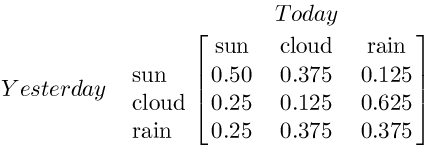

# Deep Learning for Graph Data

Graphs are data structures that can be ingested by various algorithms, notably neural nets, learning to perform tasks such as classification, clustering and regression. 

TL;DR: here's one way to make graph data ingestable for the algorithms: 

```
Data (graph, words) -> Real number vector -> Deep neural network
```

Algorithms can “embed” each node of a graph into a real vector (similar to the embedding a [word](./word2vec)). The result will be vector representation of each node in the graph with some information preserved. Once you have the real number vector, you can feed it to the neural network.

## Difficulties of Graph Data: Size and Structure

Applying neural networks and other machine-learning techniques to graph data can de difficult. 

The first question to answer is: What kind of graph are you dealing with?

Let's say you have a finite state machine, where each state is a node in the graph. You can give each state node a unique ID, maybe a number. Then you give all the rows the names of the states, and you give all the columns the same names, so that the matrix contains an element for every state to intersect with every other state. Then you could mark those elements with a 1 or 0 to indicate whether the two states were connected in the graph, or even use weighted nodes (a continuous number) to indicate the likelihood of a transition from one state to the next. (The transition matrix below represents a finite state machine for the weather.) 



That seems simple enough, but many graphs, like social network graphs with billions of nodes (where each member is a node and each connection to another member is an edge), are simply too large to be computed. **Size** is one problem that graphs present as a data structure. In other words, you can't efficiently store a large social network in a tensor. They don't compute.

Neural nets do well on vectors and tensors; data types like images (which have structure embedded in them via pixel proximity -- they have fixed size and spatiality); and sequences such as text and time series (which display structure in one direction, forward in time). 

Graphs have an **arbitrary structure**: they are collections of things without a location in space, or with an arbitrary location. They have no proper beginning and no end, and two nodes connected to each other are not necessarily "close". 

You usually don't feed whole graphs into neural networks, for example. They would have to be the same shape and size, and you'd have to line up your graph nodes with your network's input nodes. But the whole point of graph-structured input is to not know or have that order. There's no first, there's no last. 


The second question when dealing with graphs is: What kind of question are you trying to answer by applying machine learning to them? In social networks, you're usually trying to make a decision about what kind person you're looking at, represented by the node, or what kind of friends and interactions does that person have. So you're making predictions about the node itself or the edges. 

<p align="center">
<a href="https://docs.skymind.ai/docs/welcome" type="button" class="btn btn-lg btn-success" onClick="ga('send', 'event', ‘quickstart', 'click');">GET STARTED WITH DEEP LEARNING</a>
</p>

Since that's the case, you can address the uncomputable size of a Facebook-scale graph by looking at a node and its neighbors maybe 1-3 degrees away; i.e. a subgraph. The immediate neighborhood of the node, taking `k` steps down the graph in all directions, probably captures most of the information you care about. You're filtering out the giant graph's overwhelming size.

## Traversing and Representing the Graph

Let's say you decide to give each node an arbitrary representation vector, like a low-dimensional word embedding, each node's vector being the same length. The next step would be to traverse the graph, and that traversal could be represented by arranging the node vectors next to each other in a matrix. You could then feed that matrix representing the graph to a recurrent neural net. That's basically DeepWalk (see below), which treats truncated random walks across a large graph as sentences. 

If you turn each node into an embedding, much like word2vec does with words, then you can force a neural net model to learn representations for each node, which can then be helpful in making downstream predictions about them. (How close is this node to other things we care about?)

Another more recent approach is a *graph convolutional network*, which very similar to convolutional networks: it passes a node filter over a graph much as you would pass a convolutional filter over an image, registering each time it sees a certain kind of node. The readings taken by the filters are stacked and passed to a maxpooling layer, which discards all but the strongest signal, before we return to a filter-passing convolutional layer.  

One interesting aspect of graph is so-called side information, or the attributes and features associated with each node. For example, each node could have an image associated to it, in which case an algorithm attempting to make a decision about that graph might have a CNN subroutine embedded in it for those image nodes. Or the side data could be text, and the graph could be a tree (the leaves are words, intermediate nodes are phrases combining the words) over which we run a recursive neural net, an algorithm popolarized by Richard Socher. 

Finally, you can compute derivative functions such as graph Lapalians from the tensors that represent the graphs, much like you might perform an eigen analysis on a tensor. These functions will tell you things about the graph that may help you classify or cluster it. (See below for more information.)  

## Types of Graphs

There are many problems beyond just social networks where it's helpful to think of things as a graph.<sup>[1](#one)</sup>   

* A molecule is a graph of atoms
* A thought is a graph of synaptic firings (edges) between neurons (nodes)
* The Web is a graph of hyperlinks
* [A video game is a graph of states connected by actions that lead from one state to the next](./deepreinforcementlearning)
* A [neural network](./neuralnet-overview) is a graph ... that makes predictions about other graphs

Any ontology or knowledge graph charts the interrelationship of entities (combining [symbolic reasoning](./symbolicreasoning) with the graph structure):
* Taxonomies of animal species
* Diseases that share etiologies and symptoms
* Medications that share ingredients

### <a name="beginner">Other Deep-learning Tutorials</a>

* [Introduction to Neural Networks](./neuralnet-overview)
* [Beginner's Guide to Reinforcement Learning](./reinforcementlearning)
* [Convolutional Networks (CNNs)](./convolutionalnets)
* [Generative Adversarial Networks (GANs)](./generative-adversarial-network)
* [LSTMs and Recurrent Networks](./lstm)
* [Word2Vec: Neural Embeddings for Java](./word2vec)
* [Combining Symbolic Learning & Deep Learning](./deepsymboliclearning)
* [Restricted Boltzmann Machines](./restrictedboltzmannmachine)
* [Eigenvectors, Covariance, PCA and Entropy](./eigenvector)
* [Neural Networks & Regression](./logistic-regression)
* [Open Datasets for Machine Learning](./opendata)
* [Inference: Machine Learning Model Server](./machine-learning-modelserver)

## <a name="footnote">Footnotes</a>

<a name="one">1)</a> *In a weird meta way it's just graphs all the way down, [not turtles](https://en.wikipedia.org/wiki/Turtles_all_the_way_down). A human scientist whose head is full of firing synapses (graph) is both embedded in a larger social network (graph) and engaged in constructing ontologies of knowledge (graph) and making predictions about data with neural nets (graph).*

## Further Resources on Graph Data and Deep Learning

Below are a few papers discussing how neural nets can be applied to data in graphs. 

[Representation Learning on Graphs: Methods and Applications](https://cs.stanford.edu/people/jure/pubs/graphrepresentation-ieee17.pdf) (2017)
by William Hamilton, Rex Ying and Jure Leskovec

*Machine learning on graphs is an important and ubiquitous task with applications ranging from drug design to friendship recommendation in social networks. The primary challenge in this domain is finding a way to represent, or encode, graph structure so that it can be easily exploited by machine learning models. Traditionally, machine learning approaches relied on user-defined heuristics to extract features encoding structural information about a graph (e.g., degree statistics or kernel functions). However, recent years have seen a surge in approaches that automatically learn to encode graph structure into low-dimensional embeddings, using techniques based on deep learning and nonlinear dimensionality reduction. Here we provide a conceptual review of key advancements in this area of representation learning on graphs, including matrix factorization-based methods, random-walk based algorithms, and graph convolutional networks. We review methods to embed individual nodes as well as approaches to embed entire (sub)graphs. In doing so, we develop a unified framework to describe these recent approaches, and we highlight a number of important applications and directions for future work.*

[A Short Tutorial on Graph Laplacians, Laplacian Embedding, and Spectral Clustering](https://csustan.csustan.edu/~tom/Clustering/GraphLaplacian-tutorial.pdf)
by Radu Horaud

[Community Detection with Graph Neural Networks](https://arxiv.org/abs/1705.08415) (2017)
by Joan Bruna and Xiang Li

*We study data-driven methods for community detection in graphs. This estimation problem is typically formulated in terms of the spectrum of certain operators, as well as via posterior inference under certain probabilistic graphical models. Focusing on random graph families such as the Stochastic Block Model, recent research has unified these two approaches, and identified both statistical and computational signal-to-noise detection thresholds.* 

*We embed the resulting class of algorithms within a generic family of graph neural networks and show that they can reach those detection thresholds in a purely data-driven manner, without access to the underlying generative models and with no parameter assumptions. The resulting model is also tested on real datasets, requiring less computational steps and performing significantly better than rigid parametric models.*

[DeepWalk: Online Learning of Social Representations](https://arxiv.org/abs/1403.6652) (2014)
by Bryan Perozzi, Rami Al-Rfou and Steven Skiena

*We present DeepWalk, a novel approach for learning latent representations of vertices in a network. These latent representations encode social relations in a continuous vector space, which is easily exploited by statistical models. DeepWalk generalizes recent advancements in language modeling and unsupervised feature learning (or deep learning) from sequences of words to graphs. DeepWalk uses local information obtained from truncated random walks to learn latent representations by treating walks as the equivalent of sentences. We demonstrate DeepWalk's latent representations on several multi-label network classification tasks for social networks such as BlogCatalog, Flickr, and YouTube. Our results show that DeepWalk outperforms challenging baselines which are allowed a global view of the network, especially in the presence of missing information. DeepWalk's representations can provide F1 scores up to 10% higher than competing methods when labeled data is sparse. In some experiments, DeepWalk's representations are able to outperform all baseline methods while using 60% less training data. DeepWalk is also scalable. It is an online learning algorithm which builds useful incremental results, and is trivially parallelizable. These qualities make it suitable for a broad class of real world applications such as network classification, and anomaly detection.*

[DeepWalk is implemented in Deeplearning4j](https://github.com/deeplearning4j/deeplearning4j/blob/1f8af820c29cc5567a2c5eaa290f094c4d1492a7/deeplearning4j-graph/src/main/java/org/deeplearning4j/graph/models/deepwalk/DeepWalk.java).

[Deep Neural Networks for Learning Graph Representations](https://pdfs.semanticscholar.org/1a37/f07606d60df365d74752857e8ce909f700b3.pdf) (2016)
by Shaosheng Cao, Wei Lu and Qiongkai Xu

*In this paper, we propose a novel model for learning graph representations, which generates a low-dimensional vector
representation for each vertex by capturing the graph structural information. Different from other previous research efforts,
we adopt a random surfing model to capture graph structural information directly, instead of using the samplingbased
method for generating linear sequences proposed by Perozzi et al. (2014). The advantages of our approach will
be illustrated from both theorical and empirical perspectives. We also give a new perspective for the matrix factorization
method proposed by Levy and Goldberg (2014), in which the pointwise mutual information (PMI) matrix is considered as
an analytical solution to the objective function of the skipgram model with negative sampling proposed by Mikolov et
al. (2013). Unlike their approach which involves the use of the SVD for finding the low-dimensitonal projections from
the PMI matrix, however, the stacked denoising autoencoder is introduced in our model to extract complex features and
model non-linearities. To demonstrate the effectiveness of our model, we conduct experiments on clustering and visualization
tasks, employing the learned vertex representations as features. Empirical results on datasets of varying sizes show
that our model outperforms other state-of-the-art models in such tasks.*

[Deep Feature Learning for Graphs](https://arxiv.org/abs/1704.08829)

by Ryan A. Rossi, Rong Zhou, Nesreen K. Ahmed

*This paper presents a general graph representation learning framework called DeepGL for learning deep node and edge representations from large (attributed) graphs. In particular, DeepGL begins by deriving a set of base features (e.g., graphlet features) and automatically learns a multi-layered hierarchical graph representation where each successive layer leverages the output from the previous layer to learn features of a higher-order. Contrary to previous work, DeepGL learns relational functions (each representing a feature) that generalize across-networks and therefore useful for graph-based transfer learning tasks. Moreover, DeepGL naturally supports attributed graphs, learns interpretable features, and is space efficient (by learning sparse feature vectors). In addition, DeepGL is expressive, flexible with many interchangeable components, and scalable for large networks via an efficient parallel implementation. Compared with the state-of-the-art method, DeepGL is (1) effective for across-network transfer learning tasks and attributed graph representation learning, (2) space-efficient requiring up to 6x less memory, (3) fast with up to 182x speedup in runtime performance, and (4) accurate with an average improvement of 20% or more on many learning tasks.*

[Learning multi-faceted representations of individuals from heterogeneous evidence using neural networks](https://arxiv.org/abs/1510.05198) (2015)
by Jiwei Li, Alan Ritter and Dan Jurafsky

*Inferring latent attributes of people online is an important social computing task, but requires integrating the many heterogeneous sources of information available on the web. We propose learning individual representations of people using neural nets to integrate rich linguistic and network evidence gathered from social media. The algorithm is able to combine diverse cues, such as the text a person writes, their attributes (e.g. gender, employer, education, location) and social relations to other people. We show that by integrating both textual and network evidence, these representations offer improved performance at four important tasks in social media inference on Twitter: predicting (1) gender, (2) occupation, (3) location, and (4) friendships for users. Our approach scales to large datasets and the learned representations can be used as general features in and have the potential to benefit a large number of downstream tasks including link prediction, community detection, or probabilistic reasoning over social networks.*

[node2vec: Scalable Feature Learning for Networks](https://arxiv.org/abs/1607.00653) (Stanford, 2016)
by Aditya Grover and Jure Leskovec

*Prediction tasks over nodes and edges in networks require careful effort in engineering features used by learning algorithms. Recent research in the broader field of representation learning has led to significant progress in automating prediction by learning the features themselves. However, present feature learning approaches are not expressive enough to capture the diversity of connectivity patterns observed in networks. Here we propose node2vec, an algorithmic framework for learning continuous feature representations for nodes in networks. In node2vec, we learn a mapping of nodes to a low-dimensional space of features that maximizes the likelihood of preserving network neighborhoods of nodes. We define a flexible notion of a node's network neighborhood and design a biased random walk procedure, which efficiently explores diverse neighborhoods. Our algorithm generalizes prior work which is based on rigid notions of network neighborhoods, and we argue that the added flexibility in exploring neighborhoods is the key to learning richer representations. We demonstrate the efficacy of node2vec over existing state-of-the-art techniques on multi-label classification and link prediction in several real-world networks from diverse domains. Taken together, our work represents a new way for efficiently learning state-of-the-art task-independent representations in complex networks.*

[Gated Graph Sequence Neural Networks](https://arxiv.org/abs/1511.05493) (Toronto and Microsoft, 2017)
by Yujia Li, Daniel Tarlow, Marc Brockschmidt and Richard Zemel

*Graph-structured data appears frequently in domains including chemistry, natural language semantics, social networks, and knowledge bases. In this work, we study feature learning techniques for graph-structured inputs. Our starting point is previous work on Graph Neural Networks (Scarselli et al., 2009), which we modify to use gated recurrent units and modern optimization techniques and then extend to output sequences. The result is a flexible and broadly useful class of neural network models that has favorable inductive biases relative to purely sequence-based models (e.g., LSTMs) when the problem is graph-structured. We demonstrate the capabilities on some simple AI (bAbI) and graph algorithm learning tasks. We then show it achieves state-of-the-art performance on a problem from program verification, in which subgraphs need to be matched to abstract data structures.*

