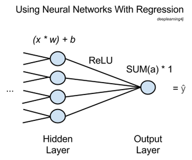

# 回帰を使ったニューラルネットワーク

一般に、ニューラルネットワークは、[教師なしの学習](./unsupervised-learning)、分類、回帰を目的として使用されます。つまり、教師付きの学習を終えた後、ラベル付けされていないデータのグループ化、そのデータの分類、または連続的な値の予測を行います。 

分類作業は、最終層でロジスティック回帰を使い、連続的データを0や1などのダミーの変数に変換します。ある人の身長、体重、年齢の情報を基に心臓病の可能性があるかどうかに分類します。一方、真の回帰を使って、ある連続的な入力のセットが別の連続的な出力のセットに変換されます。 

例えば、家の築年数とその床面積、優良な学校までの距離の情報があると、その家をどのくらいの価格で売ることができるかが予測できるのです。これがある連続的データから別の連続的データへの変換です。分類作業にありがちなダミー変数のある独立変数`x`を連続的`y`に変換するものとは異なります。

分別のある人には回帰にニューラルネットワークを使用することがやり過ぎかどうかについての意見があることでしょうが、ここではそれがどのように行われるのかということを説明することだけを目的としています。



上図では、`x`は入力される特徴であり、ネットワーク内の一つ前の層から前方に通過してきたものです。xの多くは、最後の隠れ層の各ノード（節）に提供され、各々に該当する重み`w`が掛け合わされます。

これらの産物の総和がバイアスに追加され、活性化機能に提供されます。ここで使用する活性化関数は*正規化線形関数*（rectified linear unit、ReLU）といって、一般によく使用され、非常に有用な関数を使用します。この関数は、シグモイド活性化関数のように浅い勾配で飽和状態にならないからです。
 
正規化線形関数は各隠れノードに活性化`a`を出力し、それらの総和が出力ノードまで行き、そのまま通過します。 

要するに、回帰を行うニューラルネットワークには、出力ノードが1つあり、そこで前の層の活性化の総和に1が掛け合わされるだけなのです。その結果は、ŷや"y hat"など、ネットワークによって見積もられ、すべてのxがマッピングした従属変数となります。 

誤差逆伝播法を行い、ネットワークに学習させるには、ŷをyの正解の値と比較し、ネットワークの重みとバイアスをエラーが最小限になるまで調整するだけで、その多くは分類器を使って行う作業です。平均二乗誤差（Root-means-squared-error、RMSE）は損失関数であるかもしれません。 

このようにして、ニューラルネットワークを使って任意の数の独立変数xを予測したい従属変数yと関連させる関数を入手することができるのです。 

Deeplearning4jにあるニューラルネットワークを使って回帰を行う場合、多層ニューラルネットワークを設定し、出力層を以下のプロパティの最後に追加します。

```
//Create output layer
.layer()
.nIn($NumberOfInputFeatures)
.nOut(1)
.activationFunction('identity')
.lossFunction(LossFunctions.LossFunction.RMSE)
```

`nOut`は、各層のノード数です。`nIn`は、前層から通過してきた特徴の数です。つまり、上図の例の場合だと、その値は4となります。`activationFunction`は`'identity'`に設定します。

より簡単な数学関数に近似させるための回帰を使ったニューラルネットワークについてをより網羅した例は、[こちら](https://github.com/deeplearning4j/dl4j-examples/tree/master/src/main/java/org/deeplearning4j/examples/feedforward/regression)をご覧ください。 

### <a name="beginner">その他の Deeplearning4jのチュートリアル</a>
* [Restricted Boltzmann Machines（制限付きボルツマン・マシン）](./ja-restrictedboltzmannmachine)
* [Eigenvectors, Covariance, PCA and Entropy（固有ベクトル、共分散、PCA、エントロピー）](./ja-eigenvector)
* [LSTMs and Recurrent Networks（長・短期記憶ユニットと再帰型ネットワーク）](./lstm)
* [Neural Networks（ニューラルネットワーク）](./ja-neuralnet-overview)
* [Convolutional Networks（畳み込みネットワーク）](./convolutionalnets)
* [Deeplearning4j Quickstart Examples（クイックスタートで見るDeeplearning4jの例）](./ja-quickstart)
* [ND4J:Numpy for the JVM（ND4J:Java仮想マシンで使用するNumpy）](http://nd4j.org/)

