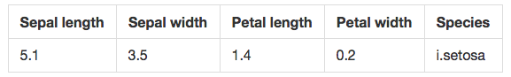
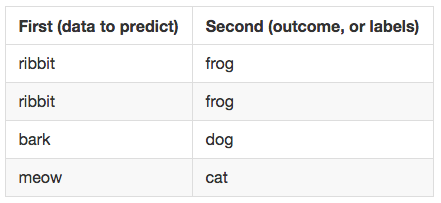
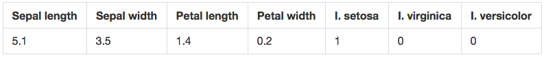
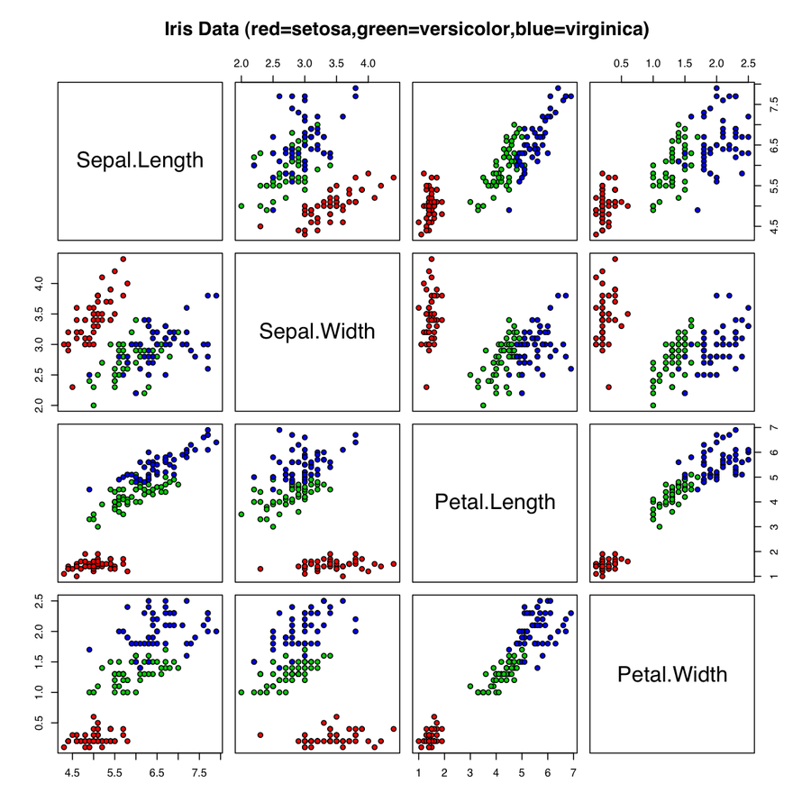

---
title:Deep-Belief Network Tutorial for Iris
layout: default
---

# アイリス用ディープ・ビリーフ・ネットワークのチュートリアル

**アイリスは小規模なデータセットであるため、これを使ったニューラルネットワークのトレーニングの出力結果は様々に異なります。**

ディープ・ビリーフ・ネットワーク（DBN）とは多クラス分類器です。入力の多くが様々なクラスに属している場合、DBNは最初に小規模なトレーニングセットで学習した後、ラベルなしのデータをそれらの様々なクラスに基づいて分類することができます。1つの入力を取り入れ、どのラベルをそのデータレコードに適用するべきかを決定します。 

入力レコードにより、DBNはラベルのセットからラベルを選択します。これは、ブール値の「はい」、「いいえ」を超えて、より広い多項分類を扱います。 

ネットワークは、1つの出力ノードにつき1つの数字を含むベクトルを1つ出力します。出力ノードの数はラベルの数に一致します。これらの出力のそれぞれは0か1であり、一緒に取り込まれます。0と1はベクトルを構成します。 

### IRISのデータセット

[花のアイリスのデータセット](https://archive.ics.uci.edu/ml/datasets/Iris)は分類技法をテストするために広く一般に機械学習で使用されています。ではこのアイリスデータセットをニューラルネットワークの効果を検証するために使用してみましょう。

データセットは、アイリスの3種の各々50サンプルとそれに適用する4つの測定値で構成されています。つまり、総計で150の花と600のデータポイントとなっています。アイリスは、種によって花弁とがく片（花弁のベースにある緑色の葉のようなさや）の長さ（センチメートルで測定）が異なります。セトナ、バージニカ、バーシクルというアイリスの3種のがく片と花弁の長さと幅が測定してあります。各種の名前がラベルとして使用されます。 

これらの測定値は連続的な性質を持つため、アイリスのデータセットは連続的なDBNには最適なテストです。これら4つの特徴のみで3種を十分正確に分類することができます。つまり、ニューラルネットワークに個々の花のデータレコードをその長さのみからそれぞれの種に分類することを教えることができると、成功したということになり、それができなかった場合はニューラルネットワークを修正しなければならないということが強く示唆されるのです。 

アイリスデータセットは小規模であるため、独自の問題が生じる可能性があります。また、バージニカ種とバーシクル種は非常に似ているため部分的に重なります。 

以下がそのレコードの一例です。

上記の表は人間に読みやすいようにしてありますが、Deeplearning4jのアルゴリズムは次のようでなければなりません。

     5.1,3.5,1.4,0.2,i.setosa

ここでさらに進んで、単語は消去して二つのオブジェクトに数値データを配列してみましょう。

データ:5.1,3.5,1.4,0.2    
ラベル:0,1,0

3つの出力ノードが2値決定を行う場合、3種のアイリスのラベルを1,0,0、0,1,0、0,0,1とすることができます。 

### データの読み込み

DL4Jはニューラルネットワークにデータを読み込むときにDataSetというオブジェクトを使用します。DataSetは、予測を行う対象のデータ（とそれに関連付けられたラベル）を格納するための簡単な方法です。下記の第一、第二はどちらもNDArrayです。1つはデータの属性を保持しており、もう一つはラベルを保持しています。（サンプルを実行するには、[こちら](https://github.com/agibsonccc/java-deeplearning/blob/master/deeplearning4j-examples/src/main/java/org/deeplearning4j/iris/IrisExample.java)のファイルを使ってください。）

（DataSetのオブジェクト内にあるのはDL4Jが数値計算を行う基礎的なオブジェクトである2つのNDArrayです。N次元配列はスケーラブルで多次元配列です。複雑な数学的演算に適しており、科学計算に頻繁に使用されています。） 

ほとんどのプログラマーはCSV（コンマ区切り値）などのファイルにあるデータセットを知っており、アイリスもその例外ではありません。アイリスのCSVを解析し、DL4Jが理解できるオブジェクトに入れるには以下を使ってください。 

    File f = new File(“Iris.dat”);
    InputStream fis = new FileInputStream(f);

    List<String> lines = org.apache.commons.io.IOUtils.readLines(fis);
    INDArray data = Nd4j.ones(to, 4);
    List<String> outcomeTypes = new ArrayList<>();
    double[][] outcomes = new double[lines.size()][3];

ここで、これを解釈していきましょう。アイリスデータはCSVファイルで、ネットワークに入れる必要のあるデータが含まれています。

ここでは **IOUtils** というApacheライブラリを使ってファイルストリームからデータを読みます。readLinesはすべてのデータをメモリにコピーすることに注意してください（通常は生成にこれを使用してはなりません）。代わりに、BufferedReaderオブジェクトを検討してください。

NDArrayの変数 **data** は生の数値データを保持し、リストの **outcomeTypes** はラベルを含むマップのようなものになるでしょう。データセットオブジェクトの **completedData** （下記の最後にあるコード）には、二値化されたラベルも含めてすべてのデータが含まれています。 

変数の **outcomes** はdouble型の二次元配列で、レコード数と同数の行数で、ラベル数と同数の列数（アイリスの3種）になります。これには二値化されたラベルも含まれます。

こちらのコードセグメントをご覧ください。

    for(int i = from; i < to; i++) {
        String line = lines.get(i);
        String[] split = line.split(",");

         //4つの数値をdouble型に変換して足します。
        double[] vector = new double[4];
        for(int i = 0; i < 4; i++)
             vector[i] = Double.parseDouble(line[i]);

        data.putRow(row,Nd4j.create(vector));

        String outcome = split[split.length - 1];
        if(!outcomeTypes.contains(outcome))
            outcomeTypes.add(outcome);

        double[] rowOutcome = new double[3];
        rowOutcome[outcomeTypes.indexOf(outcome)] = 1;
        outcomes[i] = rowOutcome;
    }

    DataSet completedData = new DataSet(data, Nd4j.create(outcomes));

さあ、ここで書かれたものを解釈していきましょう。

3行目:CSVデータを扱っているので、*split*を使ってコンマ1つずつでトークン化し、文字列配列*split*にデータを保管することができます。

6～10行目:ここでの文字列オブジェクトは数字列です。つまり1.5のdouble型でなく、文字「1.5」の文字列オブジェクトがあります。一時的にベクトルと呼ばれる配列を作成し、後に使用するために文字をここに保管します。 

12～14行目:文字配列の最後の要素を取ってラベルを入手します。ここでこのラベルを二値化することを考えましょう。リストのoutcomeTypesにすべてのラベルを集めます。これが次のステップへの橋渡しになります。

16～18行目:outcomeTypesリストを使ってラベルを二値化し始めます。各ラベルに特定の位置またはインデックスがあり、そのインデックス番号をここに作成するラベルの列にマッピングします。したがって、 **i. setosa** がラベルであれば、それをoutcomeTypesリストの最後に入れます。そこから大きさが3要素の新しいラベルの行を作成し、それに対応する位置を1、その他の二つを0としてrowOutcomeにマークします。最後にrowOutcomeを先に作成した二次元配列の出力に保存します。 

終了するころには、ラベルの数字表現である一行が出来上がります。**i. setosa** と分類されたデータレコードは、以下のようになります。

上のボックスにある単語はチュートリアル用に、どの単語がどの数字と組み合わされるかを分かりやすしただけのものです。下のボックスはデータ処理のベクトルとして表れるものです。実際、最後の行は **ベクトル化データ** と呼ばれます。

21行目:ここで、DL4J用のデータのパッケージ化に進みましょう。これには、作業したいデータとそれに伴う二値化ラベルを使って **DataSet** オブジェクトを1つ作成します。

最後に我々のディープラーニングネットワークが使用できるリストのcompletedDataを返します。 

### ニューラルネットワークの作成

入力を分類するためのディープラーニングネットワークを作成する準備ができました。

DL4Jを使ったニューラルネットワークの作成にはいくつかのステップがあります。 

まずは構成オブジェクトを作成します。

    NeuralNetConfiguration conf = new NeuralNetConfiguration.Builder()
    .hiddenUnit(RBM.HiddenUnit.RECTIFIED).momentum(5e-1f)
        .visibleUnit(RBM.VisibleUnit.GAUSSIAN).regularization(true)
        .regularizationCoefficient(2e-4f).dist(Distributions.uniform(gen))
        .activationFunction(Activations.tanh()).iterations(10000)
        .weightInit(WeightInit.DISTRIBUTION)
    .lossFunction(LossFunctions.LossFunction.RECONSTRUCTION_CROSSENTROPY).rng(gen)
        .learningRate(1e-3f).nIn(4).nOut(3).build();

これには我々のDBN分類器が必要とするすべてのものが含まれています。見ての通り、パラメータ（あるいはknob）がたくさんありますが、ネットワークの性能を向上させるためにこれらを調節することを時を経て学んでいきます。パラメータは、DL4Jのディープラーニングエンジンに付けられたペダル、クラッチ、ハンドルのようなものなのです。

そして、パラメータには、モメンタムの量、正規化（「はい」か「いいえ」）とその係数、イテレーションの回数、学習率の速度、出力ノード数と、各ノードの層に付けられた変換（GaussianやReLU関数など）などが含まれています。 

乱数ジェネレーターも必要になります。

        RandomGenerator gen = new MersenneTwister(123);

最後に、DBN自身（dbn）も作成します。

    DBN dbn = new DBN.Builder().configure(conf)
        .hiddenLayerSizes(new int[]{3})
        .build();
      dbn.getOutputLayer().conf().setActivationFunction(Activations.softMaxRows());
      dbn.getOutputLayer().conf().setLossFunction(LossFunctions.LossFunction.MCXENT);

ここで上記のコードを詳しく見てみましょう。最初の行で、「conf」という構成オブジェクトを取り、パラメータとして中にパスさせます。それから隠れ層のサイズを指定します。配列の各層において別々の配列でこれを行うことができます。この場合、ノード3つ分の長さの隠れ層が1つあります。 

ここで先ほど作ったDataSetオブジェクトの準備をすることができます。これを別の関数のloadIris()に入れます。

    DataSet ourDataSet = loadIris(0, 150);
    ourDataSet.normalizeZeroMeanZeroUnitVariance();
    dbn.fit(ourDataSet);

上記の2行目に注意してください。多くの機械学習のモデルでは、データを正規化し、外れ値によってモデルが歪曲しないようにすることが重要です。（番号の正規化とは、数十、数百、数百万と異なるスケールで測定されるかもしれない値を、0と1の間などの概念的に共通したスケールに調節することです。）リンゴを比較するにはすべてがリンゴに関する尺度でなければならないのです。

最後に、データ・セットでモデルをトレーニングするために **fit** を呼び出します。 

データセットでモデルをトレーニングすることにより、アルゴリズムは特定の特徴をデータから抽出することを学習します。これらの特定の特徴とは、ある種を他の種と区別することができるもので、ターゲット入力を分類するのに役立つ信号となっています。

トレーニングとは、機械が抽出した様々な特徴に基づいて、入力を繰り返し分類しようとすることです。これは2つの主要な段階から構成されています。推測と真の正解との比較、そして正解への距離に基づくネットワークの報酬やぺナルティーです。十分なデータやトレーニングにより、このネットワークを教師なしでアイリスデータを分類するのに使用でき、時を経て精度がかなり正確になることが期待できます。 

デバッグがオンであれば、最後の行を実行すると出力が確認できます。 

### **結果の評価**

**fit()** を呼び出した後の次のコードスニペットを見ていきましょう。

    Evaluation eval = new Evaluation();
    INDArray output = d.output(next.getFeatureMatrix());
    eval.eval(next.getLabels(),output);
    System.out.printf("Score:%s\n", eval.stats());
    log.info("Score " + eval.stats());

DL4Jは、モデルの性能に関する統計情報を収集する **Evaluation** オブジェクトを使用しています。INDArray出力は **DataSet.getFeatureMatrix()**と **output** の連鎖呼び出しによって作成されます。getFeatureMatrixの呼び出しはすべてのデータ入力のNDArrayを返し、これが **output()** に入力されます。このメソッドにより入力の可能性がラベル付けされます。この場合は、特徴行列です。*eval*そのものは予測との失敗と成功とモデルの真の結果を収集します。 

 **Evaluation** オブジェクトには、*f1()* など多くの役立つ呼び出しが含まれています。このメソッドは、確率（以下のF1スコアは、モデルは約77%正確に分類する能力があると考えていることを意味します）という形でモデルの精度を推測します。その他のメソッドには、モデルがどのようにして信頼性を保って同じ入力には同じ結果を予測できるかが分かる *precision()* 、いくつ正しい結果を取得したかが分かる*recall()* があります。

このサンプルでは、以下のようになりました。

     Actual Class 0 was predicted with Predicted 0 with count 50 times

     Actual Class 1 was predicted with Predicted 1 with count 1 times

     Actual Class 1 was predicted with Predicted 2 with count 49 times

     Actual Class 2 was predicted with Predicted 2 with count 50 times

    ====================F1Scores========================
                     0,767064393939394
    ====================================================

トレーニングの後は、このようなF1スコアが見られます。機械学習では、F1スコアとは分類器の性能を決定する1つのメトリックです。0と１の間の数字でトレーニング中のネットワークの性能を表します。百分率でいうと、1が精度100パーセントの予測に当たります。基本的にこれはネットワークの推測が正しい可能性を表すものです。

このモデルは十分に調整されたものではなかったし（knobに戻る必要があります！）、パスも第一回目だったのですが、さほど悪い結果にはなりませんでした。

最後に、ネットワークがアイリスデータを視覚的に表現したものをご覧ください。

