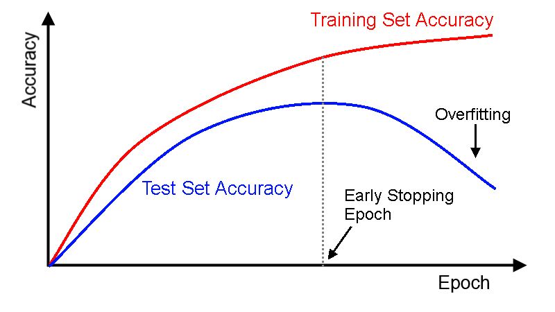

---
title:Early Stopping
layout: default
---

# 早期終了（Early Stopping）

ニューラルネットワークのトレーニングで性能を良くするには、使用する設定（ハイパーパラメータ）に関する多くの事項を決定します。これに関連するハイパーパラメータのうちの一つがトレーニングするエポック数です。つまり、データセットに完全通過させる回数（エポック数）をいくつにするか、ということです。エポック数が少なすぎると、アンダーフィット（訓練データから可能なことすべてを学習し尽くさないこと）の状態になります。エポック数が多すぎると、過学習になる可能性があります（訓練データのノイズには適合するが信号には適合しないこと）。

早期終了は、この値を手動設定しなくても済むようにするためのものです。これは、ネットワークの過剰適合を防止するという点で、一種の正規化法（L1/L2重み減衰やドロップアウト）とも言えます。

早期終了の概念は比較的簡単なものです。

* データをトレーニングセットとテストセットに分ける。
* 各エポック（またはエポック数N回ごとに）の最後に、
  * テストセットでネットワークの性能を評価する。
  * ネットワークの性能がそれ以前の最善のモデルを超えていれば、現時点のエポックでネットワークのコピーを保存する。
* テストセットでの性能が最も高かったものを最終モデルとする。


これをグラフにすると次のようになります。



縦の点線で示されたエポックで保存されたものが最善のモデルです。つまり、テストセットで最も精度が高かったモデルです。


DL4Jの早期終了機能を使用するには、いくつかの設定オプションを決めます。

* スコア計算に使用するもの。多層ネットワークには*DataSetLossCalculator*([JavaDoc](https://deeplearning4j.org/doc/org/deeplearning4j/earlystopping/scorecalc/DataSetLossCalculator.html)、[ソースコード](https://github.com/deeplearning4j/deeplearning4j/blob/c152293ef8d1094c281f5375ded61ff5f8eb6587/deeplearning4j-core/src/main/java/org/deeplearning4j/earlystopping/scorecalc/DataSetLossCalculator.java))、計算グラフには*DataSetLossCalculatorCG* ([JavaDoc](https://deeplearning4j.org/doc/org/deeplearning4j/earlystopping/scorecalc/DataSetLossCalculatorCG.html)、[ソースコード](https://github.com/deeplearning4j/deeplearning4j/blob/c152293ef8d1094c281f5375ded61ff5f8eb6587/deeplearning4j-core/src/main/java/org/deeplearning4j/earlystopping/scorecalc/DataSetLossCalculatorCG.java))があります。各エポック（例えば、テストセットの損失関数値やテストセットでの精度）で計算するのに使用されます。
* スコア関数をどのくらいの頻度で計算したいか（初期設定は1エポックごとになっています）。
* いつトレーニングプロセスを終了するかを指定するための終了条件を一つ以上。終了条件には二つのクラスがあります。
  * エポックの終了条件。エポック数Nごとに評価されます。
  * イテレーションの終了条件。ミニバッチ1つごとに評価されます。
* モデルセーバー。どのようにモデルが保存されるかを指定（[LocalFileModelSaver JavaDoc](https://deeplearning4j.org/doc/org/deeplearning4j/earlystopping/saver/LocalFileModelSaver.html)＆[ソースコード](https://github.com/deeplearning4j/deeplearning4j/blob/c152293ef8d1094c281f5375ded61ff5f8eb6587/deeplearning4j-core/src/main/java/org/deeplearning4j/earlystopping/saver/LocalFileModelSaver.java)、[InMemoryModelSaver JavaDoc](https://deeplearning4j.org/doc/org/deeplearning4j/earlystopping/saver/InMemoryModelSaver.html)＆[ソースコード](https://github.com/deeplearning4j/deeplearning4j/blob/c152293ef8d1094c281f5375ded61ff5f8eb6587/deeplearning4j-core/src/main/java/org/deeplearning4j/earlystopping/saver/InMemoryModelSaver.java)をご参照ください。）

例えば、エポック数を最大30、トレーニング時間を最大20分間、スコアをエポックごとに計算し、中間結果をディスクに保存すると設定した場合、以下のようになります。

```

MultiLayerConfiguration myNetworkConfiguration = ...;
DataSetIterator myTrainData = ...;
DataSetIterator myTestData = ...;

EarlyStoppingConfiguration esConf = new EarlyStoppingConfiguration.Builder()
		.epochTerminationConditions(new MaxEpochsTerminationCondition(30))
		.iterationTerminationConditions(new MaxTimeIterationTerminationCondition(20, TimeUnit.MINUTES))
		.scoreCalculator(new DataSetLossCalculator(myTestData, true))
        .evaluateEveryNEpochs(1)
		.modelSaver(new LocalFileModelSaver(directory))
		.build();

EarlyStoppingTrainer trainer = new EarlyStoppingTrainer(esConf,myNetworkConfiguration,myTrainData);

//早期終了トレーニングを実施:
EarlyStoppingResult result = trainer.fit();

//結果を表示:
System.out.println("Termination reason:" + result.getTerminationReason());
System.out.println("Termination details:" + result.getTerminationDetails());
System.out.println("Total epochs:" + result.getTotalEpochs());
System.out.println("Best epoch number:" + result.getBestModelEpoch());
System.out.println("Score at best epoch:" + result.getBestModelScore());

//最善のモデルを得る:
MultiLayerNetwork bestModel = result.getBestModel();

```


エポック終了条件の例

* ある特定のエポック数（最大数）後にトレーニングを終了するには、[MaxEpochsTerminationCondition](https://deeplearning4j.org/doc/org/deeplearning4j/earlystopping/termination/MaxEpochsTerminationCondition.html)を使用
* テストセットのスコアがエポック数M回連続して改善しない場合に終了するには、[ScoreImprovementEpochTerminationCondition](https://deeplearning4j.org/doc/org/deeplearning4j/earlystopping/termination/ScoreImprovementEpochTerminationCondition.html)を使用

イテレーション終了条件の例

* ある特定の時間が経った後にトレーニングを終了するには（エポックが完了していなくても）、[MaxTimeIterationTerminationCondition](https://github.com/deeplearning4j/deeplearning4j/blob/master/deeplearning4j-core/src/main/java/org/deeplearning4j/earlystopping/termination/MaxTimeIterationTerminationCondition.java)を使用
* スコアがある値を超えると、どの時点であってもトレーニングを終了するには、[MaxScoreIterationTerminationCondition](https://github.com/deeplearning4j/deeplearning4j/blob/c152293ef8d1094c281f5375ded61ff5f8eb6587/deeplearning4j-core/src/main/java/org/deeplearning4j/earlystopping/termination/MaxScoreIterationTerminationCondition.java)を使用。例えば、ネットワークが適切に調整されていない、トレーニングが不安定になる（重みやスコアの爆発など）などの状態にあるときに直ちに終了させたい時に役立ちます。

ビルトイン終了クラスのソースコードは[こちらのディレクトリ](https://github.com/deeplearning4j/deeplearning4j/tree/c152293ef8d1094c281f5375ded61ff5f8eb6587/deeplearning4j-core/src/main/java/org/deeplearning4j/earlystopping/termination)をご覧ください。

もちろん自分独自のイテレーションやエポック終了の条件を実装することも可能です。

## 早期終了と並列化ラッパー

上に挙げた早期終了の実装は単一デバイスでしか使用できません。しかし、`EarlyStoppingParallelTrainer`は早期終了に似た機能性を持ち、複数のCPUやGPUで最適化することが可能です。`EarlyStoppingParallelTrainer`は、モデルを`ParallelWrapper`クラスにラップし、ローカルで分散トレーニングします。

ただし、`EarlyStoppingParallelTrainer`は単一デバイスでの機能性すべてに対応しているわけではないことに注意してください。というのも、ユーザーインターフェイスとの互換性がないし、複雑なイテレーションリスナーに対応しない可能性があるからです。これは、モデルの分散やバックグラウンドでのコピーに使用されている方法が原因です。

異なるシナリオでの並列早期終了設定に役立つサンプルは、[TestParallelEarlyStopping.java](https://github.com/deeplearning4j/deeplearning4j/blob/master/deeplearning4j-scaleout/deeplearning4j-scaleout-parallelwrapper/src/test/java/org/deeplearning4j/parallelism/TestParallelEarlyStopping.java)をご覧ください。


## 最後に

* 非常にシンプルな早期終了のサンプルは[こちら](https://github.com/deeplearning4j/dl4j-examples/blob/master/dl4j-examples/src/main/java/org/deeplearning4j/examples/misc/earlystopping/EarlyStoppingMNIST.java)をご覧ください。
* 役に立つユニットテストは[こちら](https://github.com/deeplearning4j/deeplearning4j/blob/master/deeplearning4j-core/src/test/java/org/deeplearning4j/earlystopping/TestEarlyStopping.java)をご覧ください。
* Sparkでも早期終了のトレーニングができます。ネットワーク設定は同じですが、EarlyStoppingTrainerではなく、[SparkEarlyStoppingTrainer](https://github.com/deeplearning4j/deeplearning4j/blob/master/deeplearning4j-scaleout/spark/dl4j-spark/src/main/java/org/deeplearning4j/spark/earlystopping/SparkEarlyStoppingTrainer.java)を使用してください。
  * Sparkでの早期終了には、[こちらのユニットテスト](https://github.com/deeplearning4j/deeplearning4j/blob/master/deeplearning4j-scaleout/spark/dl4j-spark/src/test/java/org/deeplearning4j/spark/TestEarlyStoppingSpark.java)も役に立ちます。
