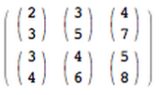
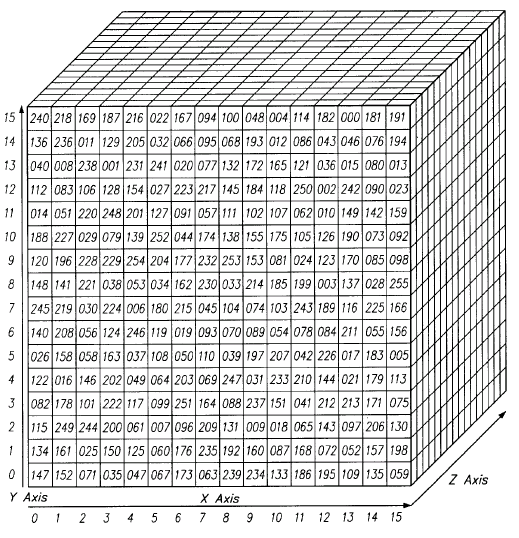
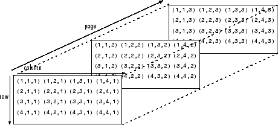
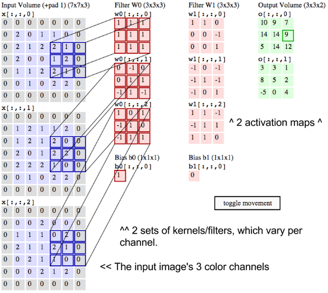
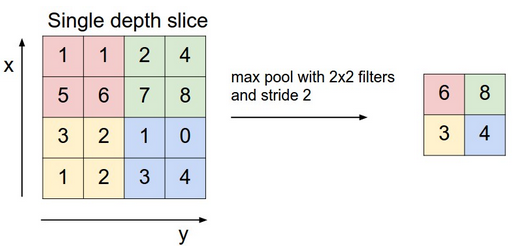
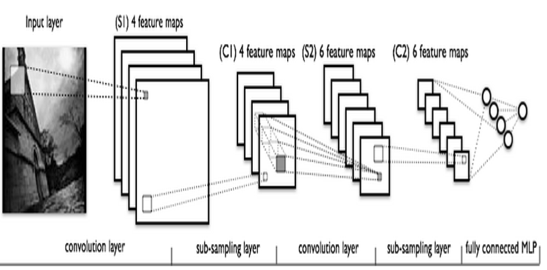

# 畳み込みネットワーク

目次

* <a href="#intro">はじめに</a>
* <a href="#tensors">画像とは4次元のテンソル?</a>
* <a href="#define">「Convolution」とは？</a>
* <a href="#work">畳み込みネットワークの仕組み</a>
* <a href="#max">最大プーリング/ダウンサンプリング</a>
* <a href="#code">DL4Jのコードのサンプル</a>
* <a href="#resource">その他のリソース</a>

## <a name="intro">はじめに</a>

畳み込みネットワークは、画像を分類し（見たものに名前を付ける）、類似性に基づいてクラスタリングし（写真をサーチする）、物体をシーン内で認識させるのに使用することができます。このネットワークは、顔、人物、道路標識、ナス、カモノハシなども含めてその他多くの視覚的データの側面を認識することができます。

畳み込みネットワークは、光学文字認識（OCR）によるテキスト分析と同様に、画像を文字化するシンボルと見なし、視覚的に表現することが可能であれば音声にも適用することができます。

畳み込みネットワークは画像認識に有効であるということが主な理由で、世界中がディープラーニングに目覚めました。機械産業の未来に重要な進歩をもたらす上で大きな力となっています。自動運転車、ドローン、視覚障害者の方々の治療などに適用できることは明らかなのです。

Deeplearning4jは、NVIDIAのcuDNNをラップし、OpenCVと統合します。弊社の畳み込みネットワークは、分散型のGPU（グラフィック処理ユニット）でSparkを使うことにより、世界一素早く動作します。

<a href="http://deeplearning4j.org/quickstart" class="btn btn-custom" onClick="ga('send', 'event', ‘quickstart', 'click');">Deeplearning4jを始めよう</a>

## <a name="tensors">画像とは4次元のテンソル?</a>

畳み込みネットワークは、画像をテンソルとして取り入れ、処理します。テンソルとは次元が追加された数行列のことです。

これらを視覚的に確認するのはなかなか困難なので、類似したものを例に取ってご説明しましょう。スカラーは、7などの単なる数字です。ベクトルは、数字が並べられたもの（例えば、`[7,8,9]`）のことで、行列は、全体が長方形状で、スプレッドシートのように縦列と横列に数字が並び、格子状になったものです。幾何学的には、スカラーをゼロ次元の点ととすると、ベクトルは一次元の線、マトリックスは二次元の平面、行列が積み重なったものは三次元の立方体と言えます。そして、これらの行列の各要素に積み重なった*特徴マップ*がある場合は、四次元になります。例えば、2×2の行列を見てみましょう。

    [ 1, 2 ]
    [ 5, 8 ]

テンソルの次元は、この二次元平面以上のものです。三次元に並べられたテンソルをイメージするのは簡単です。数字が立体形状に配列されているところを想像すればいいのです。以下は、2x3x2のテンソルを平らに表現したものです（これを感覚的に三次元でイメージするには、これらの数字2つで構成されたグループそれぞれが並んでz軸上にあると考えてみてください。）

コードで表すと、テンソルはこのように表されます。`[[[2,3],[3,5],[4,7]],[[3,4],[4,6],[5,8]]].` また、視覚的に表現すると、次のようになります。

別の言い方をすると、テンソルは配列の中にネストされた配列によって形成されており、このネスティングは無限に行うことができます。我々が空間的に視覚化できる数以上の次元を持つことができるのです。四次元のテンソルは、これらの各スカラーが、レベル一つさらに深くネストされた配列に取って代わっただけのものです。畳み込みネットワークは、以下のように四次元のテンソルを対象としています（ネストされた配列に注目してください）。

ND4JやDeeplearning4jは、`NDArray`とテンソルを同義語として扱います。テンソルの次元`(1、2、3…n)`は階（order）と呼ばれます。例えば、5階（fifth-order）のテンソルには五次元あります。

画像の縦横の長さは簡単に理解できます。奥行きが必要な訳は、色のエンコードを行うためです。例えば、RGB（赤、緑、青）のエンコーディングでは、三層の画像が産出されます。各層は、「チャネル（channel）」と呼ばれ、畳み込みによって四次元に存在する特徴マップを産出し、積み重ねます。（特徴とは、単に画像の詳細である線や曲線などで、畳み込みネットワークはそれらを使ってマップを作成します。）

そのため、画像は二次元のものではなく、畳み込みネットワークでは四次元のボリュームとして扱われます。以下にて、これをさらに詳しくご説明しましょう。

## <a name="define">「Convolution」とは？</a>

ラテン語の *convolvere*に由来する英語の「to convolve」とは「共に転がる」という意味です。数学的に言うと、畳み込み（convolution）とは、微分で、一つの関数がもう一つ関数を通過するとき、どのくらいこれらの関数に重複があるかを測定するものです。畳み込みとは、掛け合わせることによって2つの関数を混合させる方法と考えるといいでしょう。

<iframe src="http://mathworld.wolfram.com/images/gifs/convgaus.gif" width="100%" height="260px;" style="border:none;"></iframe>
著作権は、[Mathworld](http://mathworld.wolfram.com/)の制作者に帰属します。「緑の曲線は、tの関数としての青と赤の曲線の畳み込みを表したもので、位置は緑の垂直線で表示されています。グレーの領域はtの関数としての`g(tau)f(t-tau)`の産物で、tの関数の領域はまさに畳み込みなのです。」*

グラフの中央にあり、長く幅が広い釣鐘曲線をご覧ください。積分はその曲線内の領域です。近くには、短く幅が大きい2つ目の釣鐘曲線がグラフの左から右へとスライドしています。これらの2つの関数が各点でx軸に沿って重複して生み出されるものが[畳み込み（convolution）](http://mathworld.wolfram.com/Convolution.html)です。そのため、ある意味では、これらの2つの関数は、「共に転がっている」のです。

画像解析においては、静止し、基底にある関数（移動しない釣鐘曲線に相当する）が分析対象である入力画像で、二つ目の移動する関数は、フィルターとして知られており、画像の信号や特徴をピックアップします。これらの二つの関数は掛け算によって関連しています。畳み込みを釣鐘曲線ではなく、行列として視覚化するには、[Andrej Karpathy氏のサイト](https://cs231n.github.io/convolutional-networks/)の「Convolution Demo（畳み込みのデモ）」のセクションに素晴らしいアニメーションがありますので、これを是非ご参照ください。

畳み込みネットワークについて次に理解すべきことは、一つの画像の上を*数多くの*フィルターがそれぞれ異なる信号をピックアップして通過しているということです。かなり初期の層では、横線のフィルター、縦線のフィルター、斜線のフィルターを通過し、画像の端のマップを作成していると考えていいでしょう。

畳み込みネットワークは、これらのフィルター、画像の特徴空間のスライスをピックアップし、一つづつマッピングしていきます。つまり、特徴が発生する各場所のマップを作成するのです。機能空間の異なる部分を学習するため、畳み込みネットワークを使うと簡単に測定でき、強固な特徴量工学が可能になります。

（畳み込みネットワークは制限付きボルツマンマシンとは異なる方法で画像を分析します。制限付きボルツマンマシンは、各画像の特徴を全体として再構築し、識別しますが、畳み込みのネットワークの場合は、特徴マップと呼ばれる小さなピースを使って部分ごとに画像を学習します。）

このように畳み込みネットワークは、一種のサーチを行うのです。例えるなら、小さな虫眼鏡をそれより大きい画像の左から右へとスライドし、右端に着いたらまた左端からスライドするところをイメージしてみてください（タイピストの手の動きのようなものです）。この移動するウィンドウは、例えば、一本の縦線、のように一つのものしか認識することができません。3つの暗い画素が積み重なっています。この縦線を認識するフィルターを実際の画素上にスライド移動させ、マッチするものを探します。

マッチが検出されるたびに、その視覚要素に固有の特徴空間にマッチしたものがマッピングされていきます。その空間には、それぞれの縦線のマッチが検出された位置が記録されていきます。まるでバードウォッチャーが、最後に確認した大きい青サギの位置を地図にマークしている作業のような感じです。畳み込みネットワークは、一つの画像で非常にたくさんのサーチを行います。横線、斜線など視覚的な要素が見つかる限りサーチを続けます。

畳み込みネットワークは、畳み込み自体だけでなく入力の際にはもっと多くの演算を行います。

畳み込み層の後は、入力は*tanh*や*正規化線形関数*ユニットなどの非線形変換によって-1と1の領域内に押し込められます。

## <a name="work">畳み込みネットワークの仕組み</a>

畳み込みネットワークで最初に知っておくべき事は、このネットワークは画像を人間のようには知覚しないということです。したがって、畳み込みネットワークが画像を取り込み、処理する際にこの画像がどのように見なされているのかについては、違った方法で考える必要があります。

畳み込みネットワークは、画像を幅と高さのみで測定する平らなキャンバスではなく、ボリューム、つまり三次元を持つ物体と見なしています。というのは、デジタルカラー画像には、RGB（赤、青、緑）のエンコーディングがあり、これらの3つの色を混ぜて人間が知覚する色スペクトルを作り出しているからです。畳み込みネットワークは、このような画像を3つの別々な色の層が積まれたものとして取り込みます。

したがって、畳み込みネットワークはごく普通のカラー画像を、幅と高さがそれらの次元に沿った画素数で測定される長方形のボックスで、奥行きは赤、緑、青の3層で構成されたものとして受け取ります。これらの奥行き層は*チャンネル（channel）*と呼ばれています。

画像が、畳み込みネットワークを通過移動すると、入力及び出力ボリュームとして記述し、数学的には30x30x3という複数の次元を持った行列として表現するのです。この理由については後にご説明しますが、層が変わるにつれて次元数は変化します。

画像ボリュームの各次元を正確に測定するよう、十分注意しなければなりません。それらは画像処理に使用される線形代数演算の基盤に使用されるからです。

画像の各画素において、赤、緑、青の明暗度はそれぞれ一つの数字によって表現され、それらの数字は3つの積まれた二次元行列のうちの一つになり、共に画像ボリュームを形成します。

これらの数字は、畳み込みネットワ―クに入力される最初の生の知覚的特徴です。そして畳み込みネットワ―クの目的は、画像をより正確に分類するのに役立つ重要な信号となる数字がどれなのかを見つけることです。（これは、その他のフィードフォワードネットワークと同様です。）

畳み込みネットワークは、一回につき一つの画素だけを対象にするのではなく、隣り合う画素をまとめて正方形状に取り入れ、*フィルター*を通過させます。このフィルターは、画像全体よりは小さな正方形状の行列で、画素を取り入れる際に使用した正方形のサイズと同じです。これは、*カーネル（kernel）*とも呼ばれています。サポートベクターマシンに馴染みのある方なら聞いたことのある言葉ではないでしょうか。そしてフィルターの仕事とは、画素内のパターンを見つけることです。

<iframe src="https://cs231n.github.io/assets/conv-demo/index.html" width="100%" height="700px;" style="border:none;"></iframe>
*この素晴らしいアニメーションの著作権は、[Andrej Karpathy](https://cs231n.github.io/)氏に帰属します。*

行列2つを想像してみてください。片方は30x30でもう一方は3x3です。つまり、フィルターは、画像のチャンネルの表面領域の10分の1の部分に重なります。

このフィルターのドット積を画像チャンネルの行列をまとめた正方形から入手します。もしこれらの行列がどちらも同じ位置で数値が高ければ、ドット積の出力の数価は高くなります。そうでない場合は、低い数値になります。このようにして、ドット積の出力である数値一つによって、画像の画素のパターンがフィルターの画素のパターンと一致するかを示すことができるのです。

では、フィルターの2行目が高い数値で、1行目と3行目が低い数値で横線を表現している場合を想像してみてください。画像の左上端から開始して右上端までフィルターを順番にスライド移動させるとします。この一回のスライド移動での間隔サイズを*ストライド（stride）*といいます。フィルターを一回だけで右端に移動させることもできますし、この間隔サイズを大きめにすることもできます。

一回スライド移動するたびに、ドット積を取り入れ、その結果を*活性化マップ（activation map）*と呼ばれる3つ目の行列に配置させます。活性化マップの幅、つまり列数はフィルターが画像を通過する際の移動回数と同じになっています。間隔が大きめだと移動回数も活性化マップも小さめになります。畳み込みネットワークが各層で処理し、産出する行列のサイズは、計算コストやトレーニングに掛かる時間と正比例するため重要です。大きめの間隔は、時間や計算が少なめになるということを意味します。

画像の最初の3行の上に重なったフィルターは左へスライド移動し、同じ画像の4～6行目で同じ作業を開始します。スライド移動回数が3つの場合は、産出するドット積の行列は10x10となります。横線を表す同じフィルターは、赤、緑、青3つすべてのチャンネルに適用することができます。そしてこれらの3つの10x10の活性化マップを足して、画像の3つのチャンネルの横線を総計した活性化マップも10x10になるようにします。

ところで、画像にはあらゆる方向を向いた線が含まれており、形状や画素のパターンも様々なため、異なるフィルターをスライド移動させてこれらのパターンをサーチする、ということになるのです。例えば、一つの画素にパターンが96個あることもあります。これらの96個のパターンは活性化マップを作成し、新しいボリュームの10x10x96が生み出されます。ここまでご説明した畳み込みネットワークをできるだけ明確に理解していただくために、以下にラベルを再度付与された入力画像、カーネル、出力マップをお見せしましょう。  

畳み込みとは、信号処理で使用される一風変わった掛け算のようなものだと思っていただいていいでしょう。ドット積を作成する2つの行列について考えるもう一つの方法は、これらを2つの関数として考えることです。画像が基底にある関数で、フィルターがその上を転がせる関数です。

<iframe src="http://mathworld.wolfram.com//images/gifs/convgaus.gif" width="100%" height="250px;" style="border:none;"></iframe>

画像に関する主な問題の一つは、それらは高次元であること、つまり、時間が掛かり、計算処理能力が要されるということです。畳み込みネットワークは、画像の次元を様々な方法で軽減するように設計されています。フィルターストライドはそのうちの一つの方法です。もう一つの方法は、ダウンサンプルです。

## <a name="max">最大プーリング/ダウンサンプリング</a>

畳み込みネットワーク内の次の層には最大プーリング（max pooling）、ダウンサンプリング、サブサンプリング（subsampling）という3つの名前があります。活性化マップが、ダウンサンプリング層に送られ、畳み込みと同様に、このメソッドは、一回につき一部分に実行されます。この場合、最大プーリングはフィルターをかけた画像の一部から最大値をピックアップし、この新しい値をその前に入れた値の次の位置に入れていきます。そして活性化マップにあったその他の情報は除外します。

*著作権は[Andrej Karpathy](https://cs231n.github.io/)氏に帰属します。*

各特徴との相関関係が最も高かった（最大値）画像の位置のみが保存されます。そしてそれらの最大値が組み合わさって次元数が少なくなった空間を形成します。

このステップで低い値は失われてしまうため、代替方法を探す研究に拍車がかかりました。しかし、ダウンサンプリングの利点とは、正にこのように情報が失われるからこそ、保管や処理を要する量を減らすことができるというところなのです。

# その他の層

下の画像は、典型的な畳み込みネットワークで行われる変換のシーケンスを別の方法で表現してみたものです。

このプロセスは下図の左から右に向かって以下のような処理が行われます。

* 実際の入力画像から特徴がスキャンされます。明るい色の長方形は、画像の上を通過するフィルターです。
* 適用したそれぞれのフィルターの活性化マップが積まれていきます。大きいフィルターの長方形のサイズは、ダウンサンプリングされていきます。  
* ダウンサンプリングを通じて活性化マップは縮小されていきます。
* 最初にダウンサンプリングされた活性化マップにフィルターをかけて新しい活性化マップが作成されていきます。
* 2回目のダウンサンプリングによって、2つ目の活性化マップを縮小させます。
* ノード一つにつきラベルが一つ付与された出力を分類する完全に接続した層。

情報が失われれば失われるほど、畳み込みネットワークで処理されたパターンはさらに抽象化されていき、人間が認識する視覚パターンとはかけ離れていきます。だから、畳み込みネットワークが深く進むにつれて分かりやすい直観的な作業を提供しなくてもがっかりする必要はありません。

## <a name="code">DL4Jコードの例</a>

以下は、Deeplearning4jで畳み込みネットワークを構成する方法の一例です。

### <a name="beginner">その他のDeeplearning4jのチュートリアル</a>
* [Introduction to Neural Networks（ディープニューラルネットワークについて）](ja-neuralnet-overview)
* [LSTMs and Recurrent Networks（LSTMとリカレントネットワーク）](ja-lstm)
* [Word2vec](ja-word2vec)
* [Restricted Boltzmann Machines（制限付きボルツマン・マシン）](ja-restrictedboltzmannmachine)
* [Eigenvectors, Covariance, PCA and Entropy（固有ベクトル、PCA、共分散、エントロピー）](ja-eigenvector)
* [Neural Networks and Regression（ニューラルネットワークと回帰）](ja-linear-regression)

## <a name="resource">その他のリソース</a>

* [Yann LeCun](http://yann.lecun.com/exdb/publis/pdf/lecun-iscas-10.pdf)。ニューヨーク大学（New York University）の教授であり、フェイスブックのリサーチ部門のディレクター。機械ビジョン作業で多く使用される畳み込みネットワークの使用を促進させるための多大なる貢献をして来られました。
* [Andrej Karpathy氏によるスタンフォード大学の畳み込みネットワークに関するコース](https://cs231n.github.io/)は非常に素晴らしいので、畳み込みネットワークの基礎を学びたい方々にはかなりおすすめです。（*Pythonでの練習*）
* DL4Jの畳み込みネットワークを見たい方は、[Quickstart page（クイックスタートページ）](ja-quickstart)の指示に従った後、弊社の[examples](https://github.com/deeplearning4j/dl4j-0.4-examples/blob/master/dl4j-examples/src/main/java/org/deeplearning4j/examples/convolution/)をご覧ください。
