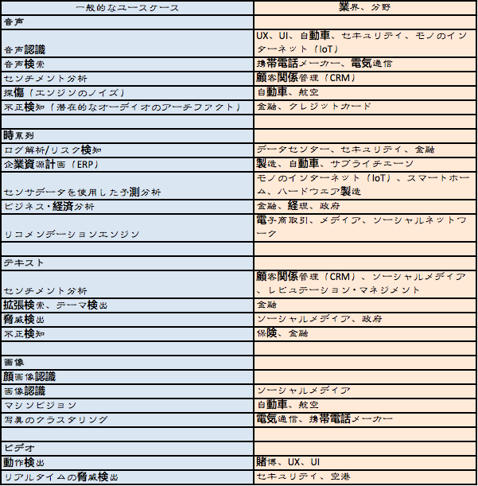

# ディープラーニングのユースケース

ディープラーニングの優れた点は、画像、音声、ビデオ、テキストなどのメディアとして知られる構造化されていないデータのパターンを識別できるというところです。
ここでは、サンプルとなるユースケースをその関連部門とともにご紹介しましょう。

## 特徴のイントロスペクション（内省）

従来の機械学習には、特徴のイントロスペクション（内省）、つまり、ある入力をある特定の方法で分類する理由がきちんと自覚されている、という長所があります。このことは分析という作業には非常に重要なことです。しかし、これを上回る長所とは、最新のディープラーニングモデルの導入により、ラベル付けや構造化がされていないデータの処理作業を省くことができ、しかもこれをこれまでにない高精度で達成することができるということです。特徴量設計は、従来の機械学習の持つ最大の弱点のうちの一つでしょう。というのは、変化するデータに対して十分に、そして素早く対処することができる人間というのはさほど多くいないからです。

特徴のイントロスペクションが必要な場合（例えば、法的義務により、信用取引において予測されたリスクにより貸し付けを拒否したい者はその正当な理由を示さなければならないというがあります。）に我々がお勧めするのは、ディープラーニングネットワークを機械学習のアルゴリズムと併用するということです。これらの併用により、各々の行う処理や長所を活用することができるからです。あるいは、ディープラーニングネットワークの結果の様々な分析を行うことにより、その意思決定の仮説を形成することもできます。

## テキスト

### 固有表現抽出

ディープラーニング・ネットワークの活用法の一つに、[固有表現抽出](https://en.wikipedia.org/wiki/Named-entity_recognition)といって、構造化、またはラベル化がされていないデータから人々、場所、会社、物など、特定の種類の情報を抽出する、というものがあります。これらの抽出された情報は、構造化されたスキーマに保管し、アドレスのリストの構築や識別確認エンジンの水準基準などに役立てることができます。

### 音声のテキスト化

適切なデータ変換を行うと、ディープネットワークを使って音声シグナルを理解することができます。つまり、例えば大規模な音声ファイルにある音声の一部を識別し、音声による単語をテキスト表示することができるのです。

## 画像

### 物体認識

物体認識とは、ある画像内にある任意の物体を識別するというアルゴリズムの能力を指しています。一般にこの機能はエンジニアリングのアプリケーションがモデル化を行うために必要な形状を識別するのに使用されています。また、この機能はソーシャルネットワークなどの写真のタグ付けにも導入されています。フェイスブックのDeepFace（顔認識テクノロジー）はこの分野におけるディープラーニングアプリケーションの良い例といえるでしょう。

以下はニューラルネットワークによりクラスタリングされた顔画像の一例です。

### マシンビジョン＋自然言語処理

[リアリティキャプチャー及びリアリティコンピューティング](http://pando.com/2014/02/16/convergence-what-happens-when-virtual-realities-take-over/)の進歩により、バーチャル世界が現実世界に近づきつつあります。最近、利用できるようになったこのタイプのデータをディープラーニングに適用した例に、三次元環境、及び現実の世界での物体認識やラベル化があります。

ここまで実現すると、その次にはすぐにシミュレーションしたセマンティクスによりバーチャル世界の表現を通して、世の中に存在する物体の性質や制約を機械に学習させ、その学習結果を、機械自らが生成し、取り込む言語に導入することができます。これはニューラルネットワークに秘められた将来の可能性の一つであると我々は信じています。
