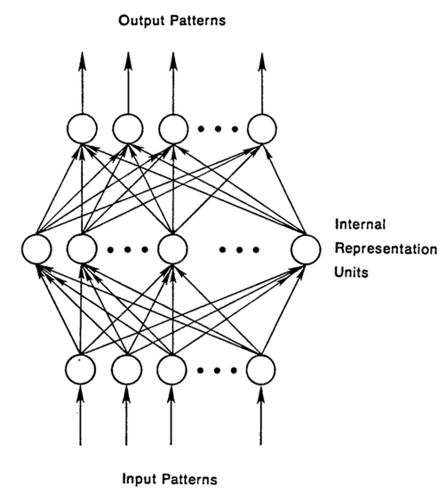
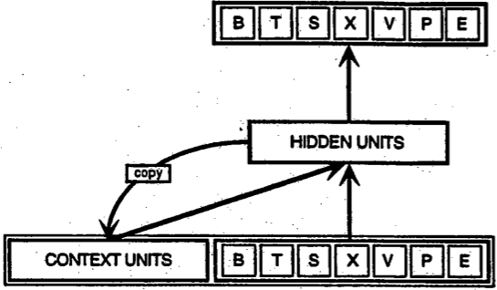
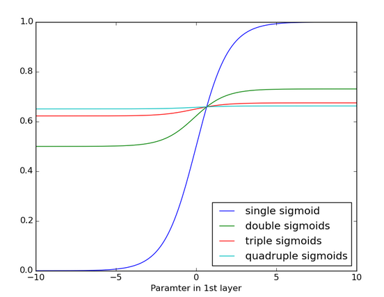
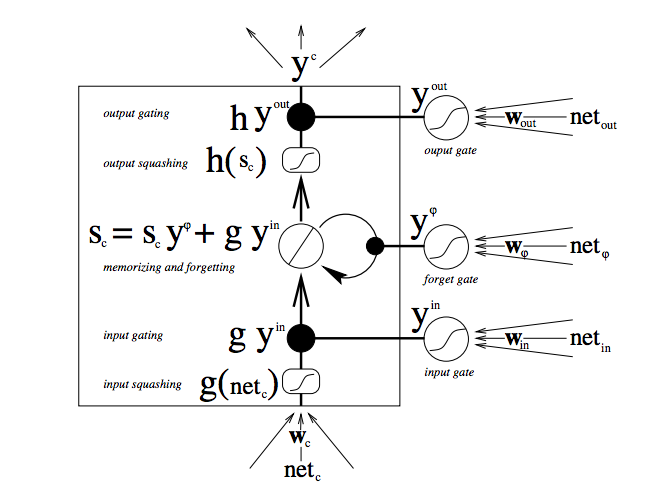
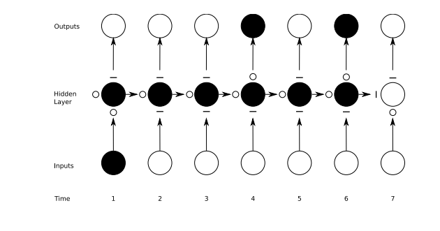
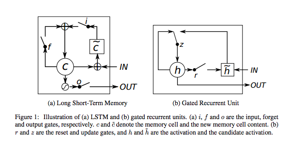

# 再帰型ネットワークと長・短期記憶についての初心者ガイド

目次

* [順伝播型ネットワークとは？](#feedforward)
* [再帰型ネットワーク](#recurrent)
* [通時的誤差逆伝播法](#backpropagation)
* [消失、爆発する勾配](#vanishing)
* [長・短期記憶ユニット（LSTM）](#long)
* [様々な時間スケールをキャプチャー](#capturing)
* [コードのサンプル＆コメント](#code)
* [リソース](#resources)

このページでは、ニューラルネットワークについて勉強されている方々のために、再帰型（リカレント）ニューラルネットワークの機能、そして主なバリエーションである長・短期記憶（LSTM）の目的と構造についてご説明します。

再帰型ニューラルネットワークは、人工的ニューラルネットワークの一種で、連続するデータからパターンを認識するよう設計されています。その扱うデータには、テキスト、ゲノム、手書き、話し言葉、さらにセンサーや株市場、政府機関などからの数値の時系列データなどがあります。

再帰型ニューラルネットワークは、最もパワフルなタイプのニューラルネットワークであると言ってもほぼ間違いありません。画像にも対応することできます。画像を入力すると連続したパッチへと分解し、系列として処理することができます。 

再帰型ニューラルネットワークには、ある種の記憶があります。また、記憶は人間の一部でもあります。我々は脳内の記憶に繰り返し類推を行います。[1](#one)

## <a name="feedforward">順伝播型ネットワークとは？</a>

再帰型ネットワークを理解するには、まず最初に[順伝播型（フィードフォワード）ニューラルネットワーク](https://deeplearning4j.org/ja/restrictedboltzmannmachine)の基礎も理解する必要があります。これら二種類のネットワークの名前の由来は、ノードでの一連の数学演算を使って情報を通過させる方法に関連しています。順伝播型ニューラルネットワークは、前方への一方向のみに情報を通過させ（同じノードを再び通過することはない）、再帰型ニューラルネットワークは、情報を繰り返しループ状に通過させます。

順伝播型ニューラルネットワークの場合、入力されたサンプルは、ネットワークに入り、教師付きの学習を行い、出力にラベルが付きます。入力画像に「猫」や「象」などとラベルを付けるように信号を送るパターンを認識し、生のデータをカテゴリーにマッピングします。 

順伝播型ネットワークは、カテゴリーを推測する際に発生するエラーが最小限になるまでラベルの付いた画像を使ってトレーニングを受けます。トレーニングを受けたパラメータ、あるいは重みの一式を使って、これまで処理したことのないデータも分類していきます。トレーニングを受けた順伝播型ネットワークは、ランダムに入力されたどんな写真の集合にも対応しなければならず、必ずしも最初に見た写真によって、次に見る写真の分類の仕方を変えるわけではありません。猫の写真を見たことによって、次に象が認識できるわけではないのです。 

つまり、このネットワークには、時間の観念がなく、現時点の入力のことしか考慮しません。最近扱った入力のことに関しては記憶がないのです。 

## <a name="recurrent">再帰型ネットワーク</a>

一方、再帰型ネットワークは、現時点で扱っているサンプルだけでなく、過去に扱ったものも認識しています。下図は、初期の頃、[Elman氏によって提唱された簡単な再帰型ネットワーク](https://web.stanford.edu/group/pdplab/pdphandbook/handbookch8.html)です。一番下にある **BTSXPE** は、ある時点に入力されたサンプルで、 **CONTEXT UNIT** は、その前に出力された情報を表しています。 

再帰型ネットワークがあるタイムステップ`t-1`で行った決定は、その次のタイムステップ`t`で行う決定に影響します。従って、再帰型ネットワークは、現在と近い過去の2か所から情報を受け取り、それらを組み合わせて新しい情報をどう処理するかを決めます。ちょうど人間がするのと同じような対処方法です。 

再帰型ネットワークは、このような帰還ループを使うという特徴から、順伝播型と異なります。再帰型ネットワークには記憶があるとよく言われます。[2](#two)なぜこのようにニューラルネットワークに記憶能力を追加させた再帰型ネットワークがあるかというと、情報が連続体であるものがあり、記憶能力を使うと順伝播型ネットワークだと不可能なタスクを行うことができるためです。 

連続した情報は、再帰型ネットワークの隠れ状態に保管されており、多くのタイムステップを超えて、新しいサンプルを処理するのに使用されます。 

目には見えなくとも人間には、体中に記憶があり、姿が見えなくとも我々の行動に影響を与えているように、情報は再帰ネットワーク内を隠れ状態で循環します。このように、記憶が巡り巡って何らかのフィードバックを送ってくる状態を表す言葉が英語にはたくさんあります。例えば、過去の自分の行動に苦しまされている人に対して、過去の行いの結果が災いしてバチが当たっていると言います。フランス語で、これを「*Le passé qui ne passe pas*（過ぎ去らない過去）」と言います。

では、次に記憶がこのように前方に送られる過程を数学的にご説明しましょう。

タイムステップ`t`での隠れ状態は`h_t`です。この関数は、同じタイムステップでの入力`x_t`に重み行列`W`（順伝播型で使用したもののような）を掛け合わせて修正した値に、その前のタイムステップの隠れ状態`h_t-1`と自身の隠れ状態から隠れ状態への遷移の行列`U`を掛けた値を足したものです。この行列`U`は、遷移行列とも呼ばれ、マルコフ連鎖に似たものです。重み行列とは、現在の入力と過去の隠れ状態の両方に、どのくらいの程度の重要性を割り当てるかを決めるフィルターです。重み行列が生み出したエラーは、誤差逆伝播法によって返され、エラーが最低限度になるまで重みを調整するのに使用されます。

重み付された入力と隠れ状態の総和は、ロジスティックシグモイド関数、あるいは双曲線正接関数（tanh）である`φ`により0と1の値域の空間に押し込まれます。この関数は、一般に非常に大きいか非常に小さい値をロジスティック空間に入れ込むのに使用されます。また、[勾配](../glossary.html#gradient)で誤差逆伝播法を使えるようにします。

連続する各タイムステップで帰還ループが発生するので、各隠れ状態には、1つ前の隠れ状態だけでなく、記憶が持続する限り、`h_t-1`以前のすべての隠れ状態の痕跡が含まれています。

連続する文字が提供されたら、再帰型ネットワークは、最初の文字を頼りに、次の文字の認識を行います。例えば、最初の文字が`q`であると、次の文字は`u`であると推測したり、最初の文字が`t`であると、次の文字は`h`であると推測するのです。

再帰型ネットワークには時間の経過が関わってくるため、アニメーションを使って説明してみましょう。（最初の縦線で示されたノードは、順伝播型ネットワークで、時が経過すると再帰型になります。） 

<iframe src="https://i.imgur.com/6Uak4vF.gif" width="100%" height="630px;" style="border:none;"></iframe>

[上図](https://i.imgur.com/6Uak4vF.gifv)の`x`はサンプル入力、`w`は入力をフィルターする重み、`a`は隠れ層の活性化（重みを付けた入力とその前の隠れ状態の組み合わせ）、`b`はReLUやシグモイド関数を使って変換または押し込まれた後の隠れ層の出力を表しています。 

## <a name="backpropagation">通時的誤差逆伝播法（BPTT）</a>

再帰型ネットワークの目的は、連続する入力を正確に分類することです。これを行うのに誤差逆伝播法と勾配降下が使われます。 

順伝播型ネットワークの誤差逆伝播法は、最後のエラーから順に出力、重み、それぞれの隠れ層の入力へ、というように後方から前方に進み、部分的な微分係数∂E/∂w、またはその変化の割合の関係を計算し、これらの重みにエラー分の責任を割り当てます。これらの微分係数は、重みを調整してエラーを減少させるために、学習ルールや勾配降下に使用されます。 

再帰型ネットワークは、再帰型ネットワークは、[通時的誤差逆伝播法（backpropagation through time、BPTT）](https://www.cs.cmu.edu/~bhiksha/courses/deeplearning/Fall.2015/pdfs/Werbos.backprop.pdf)と呼ばれる誤差逆伝播法の延長物の助けを得ています。ここでの時間とは、タイムステップ同士を繋げるための、明確に定義され順序付けられた一連の計算で表されます。誤差逆伝播法が必要とするのはこれだけなのです。 

ニューラルネットワークは、それが再帰型であろうとなかろうと、`f(g(h(x)))`のような単なる入れ子になった合成関数に過ぎません。時間の要素を追加しても、一連の関数が延長し、連鎖規則を使って微分係数を計算していくだけです。

### 打ち切り型通時的逆伝播

[打ち切り型通時的逆伝播（Truncated BPTT）](http://www.cs.utoronto.ca/~ilya/pubs/ilya_sutskever_phd_thesis.pdf)は、長い連続データに適しているフルの通時的誤差逆伝播法（BPTT）と近似していますが、フルの通時的誤差逆伝播法の場合、タイムステップが多くなると、パラメータの更新の際に前方/後方コストが非常に高くなります。これを回避するために打ち切り型が使用されています。しかし、打ち切り型の欠点は、打ち切られているため勾配の逆戻りできる長さに限界があり、ネットワークがフルの通時的誤差逆伝播法ほど長い依存関係を学習できないということです。

## <a name="vanishing">勾配消失（爆発）</a>

多くのニューラルネットワークと同様、再帰型ネットワークの歴史は古く、1990年の初期には、 **勾配消失問題** が再帰ネットワークの主な障害として知られていました。 

直線が、Xの値の変化に伴うYの値の変化の関連を表したものであるように、 **勾配** はエラーの変化に関連したすべての重みの変化を表したものなのです。勾配が分からなければ、エラーを減少させるための重み調整ができなくなり、ネットワークは学習を止めてしまいます。

再帰型ネットワークでは、最後の出力と、かなり前のタイムステップの事象との関連性を確立することが困難でした。随分前の入力にどの程度の重要性を割り当てればいいのかを知るのが非常に難しいからです。（まるで祖父母の祖父母との関係のように、どんどん新しい世代は生まれてきますが、遺産についての情報がはっきりしないままなのです。）

この困難さは、ニューラルネットワークを流れる情報は、数多くの段階を踏む掛け算を行うからということも一部の理由です。 

複利計算を勉強したことのある人は誰でも、どんな量であれ1より少し大きな数値と何度も掛け合わせると測定不可能なほどの大きな値になることを知っています。（実際、単純な数学上の真実により、ネットワークの影響と不可避的な社会的不平等が立証されています。）しかし、逆に、1未満の数値で掛けても同じ結果なのです。ギャンブラーが、1ドルにつきの勝ち取り額が97セントだと、破産はすぐ目の前に迫っているのです。 

ディープ・ニューラル・ネットワークの層とタイムステップは、掛け合わす関係にあるため、微分係数が消失したり爆発したりしやすくなります。 

勾配の爆発によるそれぞれの重みへの影響は、まるで蝶の羽の微かなはためきにより遠方でハリケーンが発生、といういわゆるバタフライ効果に似ています。重みの勾配が上限まで飽和し、強力すぎる状態になるのです。しかし、勾配爆発は比較的簡単に解決できます。勾配を打ち切ったり、押し込んだりすればいいからです。勾配が消失に向かい始めると、コンピューターが処理する、またはネットワークが学習する対象としてはあまりにも小さくなってしまい、こちらの方が解決は困難です。 

以下は、シグモイド関数が何度も適用された場合、どのようになるのかを示したグラフです。データは、傾斜が確認できなくなるほど平らになります。これはシグモイド関数が数多くの層を通過すると勾配が消失するという状態に似ています。

## <a name="long">長・短期記憶ユニット（LSTM）</a>

90年代の半ば、再帰型ネットワークのバリエーションである長・短期記憶ユニット（LSTM units、Long Short-Term Memory units）が、勾配の消失の問題を解決する方法としてドイツ人学者Sepp Hochreiter氏とJuergen Schmidhuber氏により提唱されました。 

長・短期記憶ユニットは、時間と層を通して誤差逆伝搬できるエラーを保存します。より一定したエラーを維持することにより、再帰ネットワークが多くのタイムステップ（1000以上）にわたって学習し続けられるようにしたもので、多くのタイムステップを超えて因果を繋げることが可能になりました。

長・短期記憶ユニットは、再帰型ネットワークの通常の流れ外の情報をゲート付きセルに含んでいます。コンピューターのメモリーにあるデータのように、セルに情報を読み込み、書き出しさせることができます。セルは開閉するゲートを使って、何を保管、いつ読み込み、書き出し、消去をするかを決めます。しかし、コンピューターのデジタルストレージとは異なり、これらのゲートはアナログで、0から1の間の値域で表されるシグモイド関数での要素の掛け合わせで実装されています。アナログはデジタルと比べて微分可能であるという点で有利です。このため、誤差逆伝播法に適しています。 

これらのゲートは受け取る信号に従い、ニューラルネットワークのノードと同じように、それぞれの重みの一式を使ってフィルタリングした情報を強度や重要性に基づいてブロックしたり通過させたりします。それらの重みは、入力や隠れ状態を調節する重みと同じように、再帰型ネットワークの学習過程で調整されます。つまり、これらのセルは、推測、エラーの逆伝播、勾配降下による重みの調整を反復して何度も繰り返すことにより、いつデータの入力、出力、削除を許可するかを学習するのです。

下図は、どのようにしてデータがメモリセルを流れ、ゲートの制御を受けているかを表したものです。

この図の中では、たくさんの移動が見られます。長・短期記憶についてまだよく知らない方は、少し我慢してよく観察してください。数分ほどすると様々なことが分かってきます。 

まず一番下の部分から始めましょう。3つの矢印は、情報が流れる複数の箇所を示しています。現在の入力と過去のセルの状態の組み合わせは、セル自体に送られるだけでなく、どのように入力を処理するかを決める3つのゲートそれぞれにも送られます。 

黒点はゲートを表したもので、新しい入力を受け入れるか、現在のセルの状態を消すか、そして/また、現在のタイムステップでの状態をネットワークの出力に影響させるかをそれぞれ決めます。`S_c`は、メモリセルの現在の状態、`g_y_in`はそのセルへの現在の入力です。各ゲートは、開閉し、それぞれの段階で開閉状態を組み合わせ直します。セルは各タイムステップで、その状態を忘れるか否か、書き込むか否か、読み込むか否かを決めることができます。それらのフローも図示されています。

そして、大きな太字は、それぞれの演算の結果を表したものです。 

次にご覧いただきたいのは、簡単な再帰型ネットワーク（左）と長・短期記憶ユニットのセル（右）を比較した二つの図です。青線はここでは無視してください。右側にあるボックス内の記号一覧表もご確認ください。 

長・短期記憶ユニットのメモリセルは、入力を変換させる際に、加算と乗算に別々の役割を割り当てます。両方の図の中央の**プラス記号**が長・短期記憶の本質的な部分なのです。馬鹿々々しいほどシンプルに見えるかもしれませんが、この基本的な変更によって、深部まで誤差逆伝搬する必要があるとき、一定のエラーを保存することが可能になります。現在の状態と新しい入力を掛けて次のセルの状態を決定するのではなく、それら2つを足します。これにより違いが生じます。（当然ながら忘却ゲートが乗算を必要とすることもあります。）

異なる重みの一式は、入力、出力、忘却用に入力をフィルタリングします。忘却ゲートは、線状恒等関数で表されます。というのは、ゲートが開いていると、メモリセルの現在の状態は、タイムステップを一つ進めるために1を掛けるだけだからです。

また、それぞれの長・短期記憶セルの忘却ゲートに[バイアスの1を含める](http://jmlr.org/proceedings/papers/v37/jozefowicz15.pdf)ことにより、[性能が高まる](http://www.felixgers.de/papers/phd.pdf)ことが知られています。（*Sutskeverは、バイアスの5をすすめています。*)  

長・短期記憶の目的は、かなり前のタイムステップで起こったこと同士を最後の出力で繋げることなのに、なぜ忘却ゲートがあるのかと思われるかもしれません。これは、忘れることが必要なこともあるからです。ある文書のテキストコーパスを最後まで分析し終えたとします。そして、次の文書はそのドキュメントに関連していると言える理由が皆無であることがあります。このため、ネットワークは次の文書の処理を開始する前にメモリセルをゼロに設定するのです。 

下の図はゲートの作動状態を図にしたものです。マイナス記号は閉じられたゲート、小さな白丸は開いたゲートを表します。隠れ層（Hidden Layer）の左右にあるマイナス記号や小さな白丸は忘却ゲートです。

順伝播型ネットワークの場合はある1つの入力をある1つの出力にマッピングしますが、再帰型ネットワークの場合は、上記のように1つの入力を数多くの出力に（画像一つをの数多くの単語を含む説明文に）、数多くの入力を数多くの出力に（翻訳）、数多くの入力を1つの出力（音声の分類）にマッピングすることができます。

## <a name="time">様々な時間スケールや遠く離れた依存関係をキャプチャー</a>

新しいデータがメモリセルに入るのを防ぐ入力ゲート、再帰型ニューラルネットワークの出力への影響を防ぐ出力ゲートに具体的にどのような価値があるのだろうかと思う方もいるかもしれません。これは、長・短期記憶はニューラルネットワークが異なる時間スケールで同時に作業を行うことができるようにするものだからです。

人間の場合について考えてみましょう。我々は、様々なデータの流れを時系列的に受け取っています。各タイムステップにおける地理位置情報が、次のタイムステップには非常に重要になります。したがって、時間のスケールは常に最新情報を受け入れる準備があります。 

世の中には、数年おきに行われる選挙の投票に毎回出かける真面目な人もいます。民主主義の時代において、このような人々の選挙に関連した行動のみに絞って情報を集めたいこともあります。このとき、投票後の彼らの帰宅後の生活や彼らの抱えている大きな問題とは切り離した形で情報をキャプチャーすることが必要なのです。地理情報からの一定したノイズを政治的分析に入り込ませないようにしなければなりません。 

また、例えば親との付き合いに律儀な女性がいるとすると、その女性の家族との時間を構築し、毎週日曜や祝日に著しく多く発生する通話のパターンを学習させることも可能です。この時間は、政治のサイクルとも地理位置情報ともほとんど関係ないのです。 

これらのような類いのデータは他にもあります。例えば、音楽は、複数のリズムを同時に演奏するものです。テキストには、様々な間隔を置いて繰り返されるテーマがあります。株式市場や経済は、広い間隔の波形で変動します。異なる時間スケールで同時に作動するため、長・短期記憶がキャプチャーできるのです。 

### ゲート付き再帰型ユニット（GRU）

ゲート付き再帰型ユニット（GRU、 gated recurrent unit）は、出力ゲートなしの長・短期記憶ユニットです。したがって、各タイムステップで、そのメモリセルから大型のネットワークにすべてのコンテンツを書き込みます。 

## <a name="code">コードのサンプル</a>

シェークスピアのドラマの複製方法を学習し、Deeplearning4jに実装したGraves長・短期記憶のコメント付きサンプルを、[こちら](https://github.com/deeplearning4j/dl4j-examples/blob/master/dl4j-examples/src/main/java/org/deeplearning4j/examples/recurrent/character/GravesLSTMCharModellingExample.java)でご覧いただけます。説明が必要と思われるAPIには、コメントが付けてあります。質問がある方は、是非[Gitter](https://gitter.im/deeplearning4j/deeplearning4j)に参加してください。

## <a name="tuning">LSTMハイパーパラメーターの調整</a>

再帰型ニューラルネットワーク用にハイパーパラメーターの最適化を手作業で行うときに覚えておくと良いことは以下の通りです。

* ニューラルネットワークがトレーニングのデータを「記憶する」ときに起こる **過剰適合（overfitting）** に注意してください。過剰適合とは、データのトレーニングに成功したが、サンプル外での予測には役に立たないという意味です。
* 正規化（Regularization）が役に立ちます。正規化の方法には、L1、L2、ドロップアウトなどがあります。
* ネットワークがトレーニングしないテストセットを別に準備する。
* ネットワークが大規模であるほどよりパワフルになります。しかし、これにより過剰適合も発生しやすくなります。1万のサンプルから100万のパラメーターを学習するのは好ましくありません。`パラメータ数 > サンプル数 = 問題発生` なのです。
* 常にといっていいほど、データは多ければ多いほどいいでしょう。過剰適合を回避するのに役立つからです。 
* 複数のエポックでトレーニングする（データセットを完全に通過）。 
* いつ止めるかを知るために、各エポックで、テストセットの性能を評価する（早期終了）。
* 学習係数は、最も重要な唯一のハイパーパラメータです。これを[deeplearning4j-ui](https://deeplearning4j.org/ja/visualization)を使って調整しましょう。[こちらのグラフ](http://cs231n.github.io/neural-networks-3/#baby)をご覧ください。
* 一般的には、層を積み重ねるといいでしょう。
* 長・短期記憶については、tanh関数でなく、softsign（ソフトマックスではありません）活性化機能を使用するのがいいでしょう。（そちらの方が速く、飽和状態になる可能性が低下します。(~0の勾配))
* アップデーター: RMSProp、AdaGrad、モメンタム（Nesterovs）がおすすめです。AdaGradも学習係数を減衰させますが、これも役立ちます。
* データ正常化、平均二乗誤差の損失関数と回帰問題用の恒等活性化関数、[Xavierの重み初期化](https://deeplearning4j.org/glossary.html#xavier)をお忘れなく。

## <a name="resources">リソース</a>
* [DRAW: A Recurrent Neural Network For Image Generation(DRAW：画像世代の再帰型ニューラルネットワーク)](http://arxiv.org/pdf/1502.04623v2.pdf)（アテンションモデル）
* [Gated Feedback Recurrent Neural Networks（ゲート付き再帰型ニューラルネットワーク）](http://arxiv.org/pdf/1502.02367v4.pdf)
* [Recurrent Neural Networks（再帰型ニューラルネットワーク）](http://people.idsia.ch/~juergen/rnn.html) Juergen Schmidhuber
* [Modeling Sequences With RNNs and LSTMs（再帰型ニューラルネットワークと長・短期記憶による系列モデリング）](https://class.coursera.org/neuralnets-2012-001/lecture/77) Geoff Hinton
* [The Unreasonable Effectiveness of Recurrent Neural Networks（想像以上に効果のある再帰型ニューラルネットワーク）](https://karpathy.github.io/2015/05/21/rnn-effectiveness/) Andrej Karpathy
* [Understanding LSTMs（長・短期記憶の説明ガイド）](https://colah.github.io/posts/2015-08-Understanding-LSTMs/) Christopher Olah
* [Backpropagation Through Time: What It Does and How to Do It（通時的誤差逆伝播法：何ができるのか、そしてその仕方について）](https://www.cs.cmu.edu/~bhiksha/courses/deeplearning/Fall.2015/pdfs/Werbos.backprop.pdf) Paul Werbos
* [Empirical Evaluation of Gated Recurrent Neural Networks on Sequence Modeling（系列モデリングのゲート付き再帰型ニューラルネットワークの経験的評価）](http://arxiv.org/pdf/1412.3555v1.pdf) Cho et al
* [Training Recurrent Neural Networks（再帰型ニューラルネットワークのトレーニング）](https://www.cs.utoronto.ca/~ilya/pubs/ilya_sutskever_phd_thesis.pdf) Ilya Sutskeverの論文
* [Supervised Sequence Labelling with Recurrent Neural Networks（再帰型ネットワークによる教師あり系列ラベリング）](http://www.cs.toronto.edu/~graves/phd.pdf) Alex Graves
* [Long Short-Term Memory in Recurrent Neural Networks（再帰型ネットワークの長・短期記憶）](http://www.felixgers.de/papers/phd.pdf) Felix Gers
* [LSTM: A Search Space Oddyssey（長・短期記憶：検索スペースオデュッセイア）](http://arxiv.org/pdf/1503.04069.pdf) Klaus Greff et al

## <a name="beginner">その他の初心者用ガイド</a>
* [制限付きボルツマン・マシン](https://deeplearning4j.org/ja/restrictedboltzmannmachine)
* [固有値、共分散、PCA、エントロピー](https://deeplearning4j.org/ja/eigenvector)
* [Word2vecとは？](https://deeplearning4j.org/ja/word2vec)
* [ディープニューラルネットワークについて](https://deeplearning4j.org/ja/neuralnet-overview)
* [ニューラルネットワークを回帰に使用](https://deeplearning4j.org/ja/linear-regression)
* [畳み込みネットワーク](https://deeplearning4j.org/ja/convolutionalnets)

### 脚注

<a name="one">1)</a> 再帰型ネットワークは、一般の人口知能とは全く異なるものに見えるかもしれませんが、知能というのものは、実際は我々が思っているほど賢くはないかもしれません。というのも、記憶の役割をする簡単な帰還ループがあるということは、既に意識の基本的構成要素の1つがあるということになるからです。もっとも、これは必要ですがこれだけで十分というわけではありません。その他に必要なものには、上記では触れていませんが、ネットワークとその状態を表す変数、データの解釈に基づく意思決定のロジックの枠組みなどがあります。後者は、理想的には、成功には報酬を与え、失敗には罰を与える大きな問題解決ループの一部とするのがいいでしょう。これは強化学習に非常に似ています。そう考えると、[DeepMindは既にそれを構築している](https://www.cs.toronto.edu/~vmnih/docs/dqn.pdf)と言えるのです。

<a name="two">2)</a> パラメータが最適化されたすべてのニューラルネットワークは、ある意味で記憶があるといえます。というのは、これらのパラメータは過去データの痕跡だからです。しかし、順伝播型ニューラルネットワークの場合、この記憶の時間は止まってしまっているといえます。つまり、ネットワークがトレーニングを受けて学習したモデルはその後調整されることなく、さらに多くのデータに適用されます。また、すべての入力データに同じ記憶（または重みの一式）が適用されるという点でモノリシックです。一方、再帰型ネットワークは、動的な（「変化する」という意味）ニューラルネットワークという別名を持つだけに、記憶があるということより、連続する事象に特定の重みを与えるという点で順伝播型ニューラルネットワークとは異なります。これらの事象は、直前と直後に繋がっている必要はなく、どれだけ離れていても、同じ時間のスレッドでつながっていると推定されています。順伝播型ニューラルネットワークはそのような推定をせず、世界をまるでバケツに入った複数の物体のように、順序や時間は無視して扱います。この2種類のニューラルネットワークを人間の持つ2種類の知識で説明してみましょう。我々は、子供の時に色を認識することを学習しますが、その後の人生で、場所や時間に関係なく様々なコンテキストで色を正しく認識することができます。色は一度学習しさえすればいいのです。この知識が順伝播型ネットワークでは、記憶のようなものなのです。これはスコープや定義のない過去を頼りに認識します。5分前にどの色が入力されたかを聞いても、覚えていないし、気にもしていません。短期間の記憶喪失を起こしているようなものです。一方、我々は子供の時、音の流れから成る言語というものも学習します。そして、「toe」、「roe」、「z」などの音声から引き出す意味は、常に、その前の（そしてその次の）音との関連で理解されます。この音の連続体の各段階は、前に何が起こったかに基づいており、その配列によって意味が明らかになってきます。実際、文はすべてその中にある各音節の意味を伝達しようとし、冗長信号は、環境雑音からの保護としての役目を果たします。これは、再帰型ネットワークの記憶が、過去のある一部を頼りにするというところと似ています。このように、これの2種類のニューラルネットワークは、どちらも過去、あるいは異なる種類の過去を使って、異なる結果を出力するのです。 
