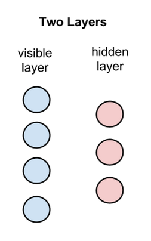
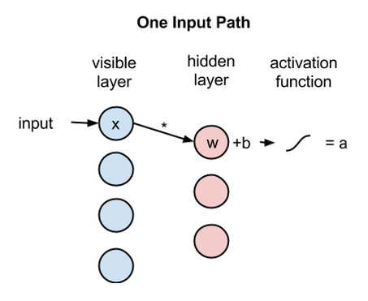
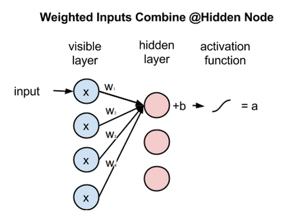
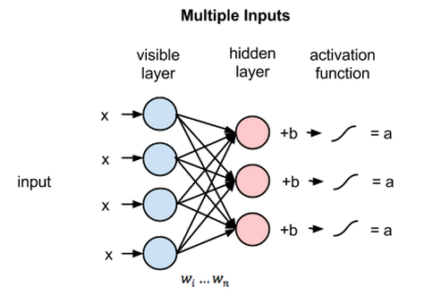
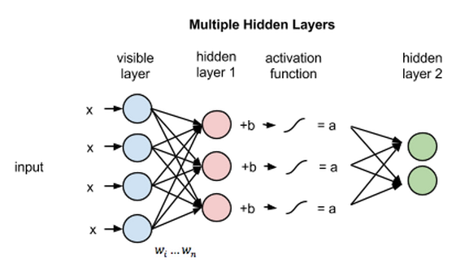
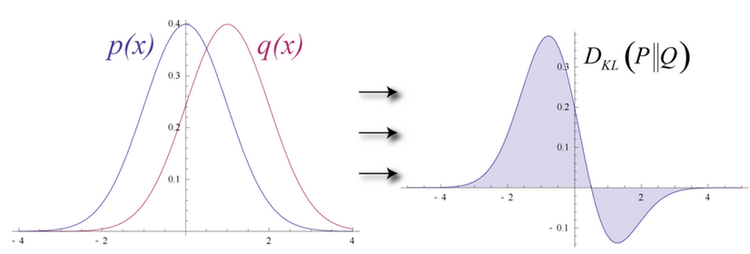
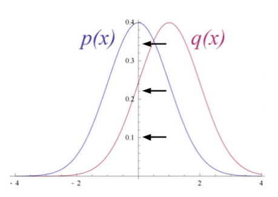
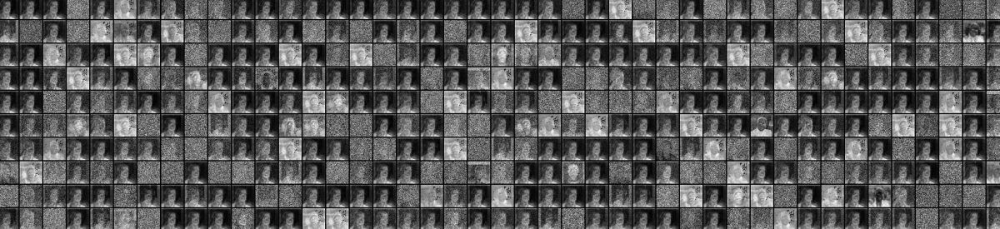

# 制限付きボルツマンマシンの初心者向けガイド

目次

* <a href="#define">定義と構造</a>
* <a href="#reconstruct">復元</a>
* <a href="#probability">確率分布</a>
* <a href="#code">コードサンプル：Deeplearning4jを使ったIrisで制限付きボルツマンマシンを起動する</a>
* <a href="#params">パラメータ及びkについて</a>
* <a href="#CRBM">連続的なRBM</a>
* <a href="#next">結論及び次のステップ</a>
* <a href="#resources">定義と構造</a>

## <a name="define">定義と構造</a>

Geoff Hintonによって開発された制限付きボルツマンマシン（RBM）は、次元削減、分類、[回帰](linear-regression)、協調フィルタリング、特徴学習、トピックモデルなどに役立ちます。（RBMなどのニューラルネットワークがどの[ように使われるか](neuralnet-overview)、さらに具体的な例を知りたい方は[ユースケース](use_cases)のページをご覧ください。）

制限付きボルツマンマシンは比較的シンプルで歴史的にも重要なので、まずはこのニューラルネットワークに取り組んでみることにしましょう。以下に、図と簡単な説明で、制限付きボルツマンマシンがどのように機能するのかを解説していきます。

RBMとは浅い2層のニューラルネットであり、ディープビリーフネットワークの構成要素です。RBMの最初の層は可視層または入力層と呼ばれ、2つ目の層は隠れ層と呼ばれます。

上記の図の各円はニューロンのようなユニットを表しており、ノードと呼ばれます。ノードとは、単に計算が行われる場所のことです。このノードは違う層のノードとのみ接続し、同じ層内のノード間では接続を持ちません。

つまり層内でのコミュニケーションはないのです。これが、制限付きボルツマンマシンでいう**制限**です。各ノードは入力を処理するための計算を行う場所であり、その入力を伝えるか否かの[確率的](../glossary.html#stochasticgradientdescent)決定を行うことから始めます。（確率的とは「ランダムに決定した」という意味で、この場合、入力値を調整する係数がランダムに初期化されていることを指します。）

各可視ノードは学習すべきデータセットの中のアイテムから低レベル特徴を抽出します。例えば、グレースケールの画像のデータセットから、各可視ノードは1つの画像における各画素の画素値を受け取ります。（MNISTの画像は784画素なので、それを処理するニューラルネットには可視層に784の入力ノードがあるということです。）

では、まずはひとつの画素値xを、2つの層にわたって見ていきましょう。隠れ層のノード1では、xに重みを掛け、それにバイアスというものを足します。この2つの計算結果が、活性化関数に入れられます。活性化関数は、入力値xを与えられると、ノードの出力値、つまり入力が活性化関数を通過する信号の強さを生成します。

    活性化関数 f((重み w * 入力 x) + バイアス b ) = 出力 a

次に、複数の入力が隠れノードでどのように組み合わされるのかを見てみましょう。各値xに個別の重みが掛けられたものの総和にバイアスが足され、その結果が活性化関数を通過しノードの出力値を生成します。

全ての可視ノードからの入力は全ての隠れノードに渡されますから、RBMは対称二部グラフと定義できます。

対称とは、各可視ノードに隠れノードが対になって接続されていることを意味します（下記参照）。二部とは、2つの部分に分かれている、つまり2つの層を持つという意味で、グラフとはノードとノードの結合関係を表す数学用語を指します。

各隠れノードでは、各入力値xがそれぞれの重みwに掛けられます。つまり下記の例では、1つの入力値xが3つの重みを持ち、全部で12の重みがあることになります（4つの入力ノード×3つの隠れノード）。2層間の重みで行列を作ると、常に行は入力ノードと等しく、列は常に出力ノードと等しくなります。

各隠れノードは、それぞれの重みを掛けた4つの入力値を受け取ります。これらの値の合計に、さらにバイアス（少なくとも何かしらの活性化が起こるようになっている）を足し、その計算結果が活性化アルゴリズムを通過し、各隠れノードに出力値を生成します。

この2つの層がより深いニューラルネットワークの一部だった場合、隠れ層1の出力値は隠れ層2の入力値として渡され、そこから先は最後の分類層に達するまで同じようにして隠れ層をいくつでも通過します。（シンプルなフィードフォワードの動きにするため、RBMのノードはオートエンコーダとしてのみ機能します。）

## <a name="reconstructions">復元</a>

今回の制限付きボルツマンマシンのイントロダクションでは、教師なし学習法（教師なしとは、データにより提供されたラベルを用いないということです）で可視層と隠れ層1との間の前方パスと後方パスのみで（それ以上の層が関与することなく）どのようにしてこのネットワークがデータ復元を学習するのかに焦点を当てていきます。

復元のフェーズでは、隠れ層1の活性化は後方パスでは入力になります。前方パスにおいてxの重みが調整されるのと同時に、後方パスでは各ノード間のエッジに同じ重みが掛けられます。各可視ノードで、これらの値の合計に可視層のバイアスが足され、これらの計算結果が復元結果となります。つまり、元の入力値の近似値となります。これを下記の図で表すことができます。

RBMの重みはランダムに初期化されているため、復元結果の値と元の入力値の差異が大きくなることが多いです。復元の誤差はrの値と入力値の違いだと考えることができます。反復学習のプロセスの中で、この誤差は最小になるまでRBMの重みに対して繰り返し逆伝播されます。

逆伝播についてさらに詳細な説明を見たい方は[こちら](ja-neuralnet-overview.html#forward)。

このように前方パスでは、RBMは、ノードの活性化、または[重みの値xの出力値の確率](https://ja.wikipedia.org/wiki/%E3%83%99%E3%82%A4%E3%82%BA%E3%81%AE%E5%AE%9A%E7%90%86)つまり`p(a|x; w)`の推測を行うために入力値を用います。

しかし、後方パスでは、活性化が導入され、復元つまり元データの予測結果が出されると、RBMは与えられた活性化関数`a`（前方パスで用いられたのと同じ係数で重み付けされている）から入力値`x`の確率を算出しようとします。この2つ目のフェーズは、`p(x|a; w)` のように表現できます。

これら2つの推定値により入力xと活性化`a`つまり`p(x, a)`の同時確率分布が導き出されます。

復元は、多くの入力に基づいて連続値を算出する回帰や、与えられた入力例に当てはまる個々のラベルを推測する分類とは異なった動きをします。

復元は元々の入力値の確率分布、つまり多くの異なる点の値を同時に推測するものです。これは[生成型学習](http://cs229.stanford.edu/notes/cs229-notes2.pdf)として知られるもので、分類で実行されるいわゆる識別学習とは区別しなければなりません。識別学習は、入力をラベルにマッピングし、データ点をグループに効果的に分ける手法です。

ここでは、入力データと復元を部分的に重なる二つの形の異なる正規曲線であると考えてみましょう。

推定の確率分布と真の入力値の分布の距離を測るために、RBMでは[Kullback Leiblerダイバージェンス](https://www.quora.com/What-is-a-good-laymans-explanation-for-the-Kullback-Leibler-Divergence)を使用します。数学的な詳しい説明は[Wikipedia](https://ja.wikipedia.org/wiki/%E3%82%AB%E3%83%AB%E3%83%90%E3%83%83%E3%82%AF%E3%83%BB%E3%83%A9%E3%82%A4%E3%83%96%E3%83%A9%E3%83%BC%E6%83%85%E5%A0%B1%E9%87%8F)を参照してください。

Kullback Leiblerダイバージェンスは、2つの曲線について、重ならずに相違（ダイバージェンス）している領域を測ります。RBMの最適化アルゴリズムは、共有の重みに隠れ層1の活性化関数により掛けられると、元の入力の近似値が算出できるよう、この2つの領域の差を最小化しようとします。グラフの左側が、実際の入力値による確率分布pで、その右が復元された分布qです。下のグラフはその差の積分です。

2つの確率分布の差に基づいて重みを繰り返し調整することによって、RBMは、元のデータに近似することを学習します。重みは次第に、最初の隠れ層の活性化でエンコードされた入力データの構造を反映するようになります。その学習過程は、2つの確率分布が徐々に1つのグラフに収束していく過程のように見えます。

## <a name="probability">確率分布</a>

ここで少し、確率分布についてお話ししましょう。2つのサイコロを振って出た目の合計値について確率分布を作成すると、次のようになります。

このグラフから分かるように、2から12まで合計値のうちで、最も出る確率の高い結果は7です。これは合計が7になる組み合わせが最も多いからです。サイコロを振った結果を予測しようとする数式は全て、このことを考慮に入れる必要があります。

もう一つ別の例で考えてみましょう。ある言語においてそれぞれの文字が使われる確率分布はその言語特有のものです。どの言語を見てもある文字が他の文字よりも多く使用されているからです。英語では、eとtとaが最もよく使われます。一方、アイスランド語では、aとrとnが最もよく使われます。英語をベースにした重み付けを使ってアイスランド語を復元しようとすると、大きな違いが生じるでしょう。

同じように、画像データセットはどんな画像を含んでいるかによって異なる独自の画素値の確率分布を持ちます。データセットが以下のようなMNISTの手書きの数字であるか、

以下のようなLabeled Faces in the Wildで入手できる顔の画像であるかによっても、画素値の分布は異なります。

仮にRBMに象と犬の画像だけが入力されたとしましょう。出力ノードは象と犬の1つずつです。RBMが前方パスの際に考えるのは、「与えられたこれらの画素において、重みは象のノードと犬のノードのどちらにより強い信号を送るべきか」ということです。後方パスでは、「象の場合、どちらの画素の分布を予測するべきか」と考えます。

これが同時確率です。つまりaの場合のxと、xの場合のaが同時に起きる確率です。これはRBMの2つの層の共有の重みとして表されます。

復元を学習する過程とは、ある意味、与えられた一連の画像に対して、どちらの画素のグループが同時に起こりやすいかを学ぶことだと言えます。ネットワークの深部にある隠れ層のノードによって生成された活性化は、共起性が非常に高くなっています。例えば、「曲線的な灰色のチューブ＋大きくてだらりと垂れた耳＋皺」などです。

上記の2つの画像から、RBMを実装した[Deeplearning4j](http://deeplearning4j.org/)がどのように復元を学習するかが分かります。これらの復元が表しているのは、RBMの活性化が「考える」元のデータです。Geoff Hinton氏は、これをマシンが見る「夢」のようなものだと言っています。ニューラルネットのトレーニング中にレンダリングされた際、RBMが本当に学習しているということを確認するには、そうした視覚化は非常に有効なヒューリスティックです。学習されていなければ、この後の説明にあるように、ハイパーパラメータの調整を行うべきです。

最後にもう一点、RBMには、2つのバイアスがあることに気が付くと思います。これが、オートエンコーダとの相違点です。隠されたバイアスは、RBMが前方パスを行う際に活性化を生成するのを助けます（データがどんなにわずかでも、少なくともいくつかのノードが活性化できるように底値を押し付けるからです）。可視層のバイアスはRBMの後方パスの際に復元するのを学習するのを助けます。

### 多層構造

このRBMがひとたび入力データを最初の隠れ層の活性化に関連付けるとともに入力データの構造を学習すると、データはネット内の一つ下の層に渡されます。すると今度は、最初に隠れ層だったものが可視層の役割を担います。ここで出力結果は事実上の入力値となり、2層目の隠れ層のノードで重みが掛けられます。そうして更に別の活性化関数で計算されます。

特徴をグループ化することによってこの連続的な活性化のセットを生成し、それに続いて特徴のグループをグループ化する過程は、特徴の階層の基本です。それによって、ニューラルネットワークがより複雑で抽象的なデータの表現を学習するのです。

新しい隠れ層を通過するたびに前の層からの入力に近づくまで重みが調整されます。これは、貪欲で層ごとに行われる教師なし事前トレーニングです。ネットワークの重みの改善にラベルは不要です。つまり、ラベルなしのデータを使ってトレーニングできるということです。ラベルなしのデータは人間に触れられていないデータで、世の中に存在する大部分のデータがそれに当たります。一般に、多くのデータにさらされたアルゴリズムほど、正確な結果を出します。そしてこれが、ディープラーニングのアルゴリズムが優れている理由の1つなのです。

これらの重みは既にデータの特徴に近似しているため、この後に続く教師あり学習では、ディープビリーフネットワークで画像の分類を試みる段階ではより良く学習ができるように調整されています。

RBMには多くの利用方法がありますが、重み初期化が適切であるため後の学習と分類が上手く進められるということが最大の長所です。ある意味、逆伝播に類似したことを達成できます。つまり、モデルデータに適切な重みをかけるのです。事前トレーニングと逆伝播は互いに同じ結果を得る代替手段と言えます。

下の図は、RBMを1つのダイアグラムでまとめた双方向性の対称二部グラフです。

より深い層のRBMの構造に関する学習に興味のある方への参考までに言うと、これらは無方向ラフィカルモデルのうちの一つで、[マルコフ確率場](https://ja.wikipedia.org/wiki/%E3%83%9E%E3%83%AB%E3%82%B3%E3%83%95%E7%A2%BA%E7%8E%87%E5%A0%B4)とも呼ばれています。

## <a name="code">コードサンプル：Deeplearning4jを使ったIrisで制限付きボルツマンマシンを起動する</a>

より一般的なクラスにパラメータが与えられた`NeuralNetConfiguration`の層として、RBMを簡単に作成できることに留意してください。同様に、RBMのオブジェクトは、可視層に適用されるガウス変換や、隠れ層に適用される修正線形変換のように、プロパティをストアするために利用されます。

      final int numRows = 4;
        final int numColumns = 1;
        int outputNum = 3;
        int numSamples = 150;
        int batchSize = 150;
        int iterations = 100;
        int seed = 123;
        int listenerFreq = iterations/5;

        log.info("Load data....");
        DataSetIterator iter = new IrisDataSetIterator(batchSize, numSamples);
        // Loads data into generator and format consumable for NN
        DataSet iris = iter.next();

        iris.normalizeZeroMeanZeroUnitVariance();

        log.info("Build model....");
        NeuralNetConfiguration conf = new NeuralNetConfiguration.Builder()
        // Gaussian for visible; Rectified for hidden
        // Set contrastive divergence to 1
        .layer(new RBM.Builder(HiddenUnit.RECTIFIED, VisibleUnit.GAUSSIAN, 1)
            .nIn(numRows * numColumns) // Input nodes
            .nOut(outputNum) // Output nodes
            .activation("tanh") // Activation function type
            .build())
        .seed(seed) // Locks in weight initialization for tuning
        .weightInit(WeightInit.DISTRIBUTION) // Weight initialization
        .dist(new UniformDistribution(0, 1))
        // ^^ Weight distribution curve mean and st. deviation
        .lossFunction(LossFunctions.LossFunction.SQUARED_LOSS)
        .learningRate(1e-1f) // Backprop step size
        .momentum(0.9) // Speed of modifying learning rate
        .regularization(true) // Prevents overfitting
        .l2(2e-4) // Regularization type L2
        .optimizationAlgo(OptimizationAlgorithm.LBFGS)
        // ^^ Calculates gradients
        .constrainGradientToUnitNorm(true)
        .build();
    Layer model = LayerFactories.getFactory(conf.getLayer()).create(conf);
    model.setListeners(Arrays.asList((IterationListener) new ScoreIterationListener(listenerFreq)));

このコードはgist-itから引用しました。こちらを参照してください。
[src/main/java/org/deeplearning4j/examples/deepbelief/DBNMnistFullExample.java](https://github.com/deeplearning4j/dl4j-examples/blob/master/src/main/java/org/deeplearning4j/examples/deepbelief/DBNMnistFullExample.java)

上記のコーディングは、Iris flowerのデータセットを処理するRBM のサンプルです。

## <a name="params">パラメータ及びkについて</a>

変数kは[コントラスティブダイバージェンス](http://deeplearning4j.org/glossary.html#contrastivedivergence)を実行する回数です。コントラスティブダイバージェンスは、学習が起きない間に、勾配を計算する際に用いられる方法です（勾配はネットワーク間の重みの関係を表しています）。

コントラスティブダイバージェンスが実行されると、それは毎回、制限付きボルツマンマシンを構成するマルコフ連鎖のサンプルになります。典型的な値は1です。

上記の例では、より一般的な`MultiLayerConfiguration`を使って、RBMが層として形成される様子を見ることができます。各ドットの後ろを見れば、ディープニューラルネットの構造やパフォーマンスに影響を及ぼす追加パラメータが分かるのです。このサイト上では、そういったパラメータの大部分を定義しています。

**weightInit**（`weightInitialization`）は、各ノードに入ってくる入力信号を増幅またはミュートする係数の最初の値を表しています。適切に重みを初期化すれば、訓練時間を大幅に短縮することができるのです。ネットワークの訓練とは、ネットワークが正確な分類を行うために、最適な信号を送るよう係数を調整することに他ならないからです。

**activationFunction**（活性化関数）とは、各ノードの閾値（上回る場合は信号がノードを通過し、満たない場合は信号が遮断される）を決定する関数の1つです。ノードが信号を通過させた場合は、「活性化している」ということになります。

**optimizationAlgo**とは、ニューラルネットが徐々に係数を調整して、誤差を最小化したり、最小誤差の位置を特定したりする方法のことです。 複数の発案者たちのラストネームの頭文字を取って名づけられたLBFGSは、二階微分値を利用して、係数が調整される勾配を計算する最適化アルゴリズムです。

**regularization**（**l2**のような正規化）の方法は、ニューラルネットにおける過学習の回避に役立ちます。係数が大きいと、ネットが学習する結果を少数の大きな重みの付いた入力に固定することを意味するので、正規化は基本的に大きな係数にペナルティを与えます。重みが過剰に強いと、新たなデータにさらされた場合に、ネットのモデルを一般化するのが難しくなる可能性があります。

**VisibleUnit**（可視ユニット）／**HiddenUnit**（隠れユニット） とは、ニューラルネットワークの層のことです。`VisibleUnit`または可視層と呼ばれる層は、入力がなされるノードの層で、`HiddenUnit`は、それらの入力がより複雑な形で再び組み合わされる層です。どちらのユニットにも独自の変換を行います。この場合、可視ユニットではガウス、隠れユニットでは正規化線形がそれぞれの層から出る信号を新たな空間へマッピングします。

**lossFunction**（損失関数）とは、誤差、つまりネットワークの予測とテストセットに含まれる正しいラベルとの差異を測定する方法です。ここで`SQUARED_ERROR`を使って、すべての誤差を正にし、和の計算や逆伝播ができるようにします。

**momentum**（モーメンタム）などの **learningRate**（学習率）は、ニューラルネットが誤差を修正する度に係数をどのくらい調整するかに影響を及ぼします。これらの2つのパラメータは、ネットが局所最適点まで勾配を下方に下げるステップのサイズを決定するのに役立ちます。学習率を大きくすると、学習速度が速くなり、最適値を越えてしまうかもしれません。学習率を小さくすると、学習速度が遅くなり、非効率的になる可能性があります。

## <a name="CRBM">連続的なRBM</a>

連続的な制限付きボルツマンマシンとは、種類の異なるコントラスティブダイバージェンスのサンプルを通じて、連続入力（小数点以下を切り捨てた数字）を受け入れるRBMの形式です。これにより、0と1の間の小数に正規化される画像画素やワードカウント・ベクトルのようなものを処理することができます。

注目すべき点は、ディープラーニングネットの全ての層が入力、係数、バイアス及び変換（活性化アルゴリズム）という4つの要素を必要としているということです。

入力とは、前の層から送られてきた（あるいは元データの）数値データ、ベクトルのことです。係数とは、各ノード層を通過する様々な特徴に与えられる重みのことです。バイアスは、層内のノードが何であろうと確実に活性化されるようにします。変換とは、データが各層を通過した後、勾配を簡単に計算できるように（勾配はネットの学習に必要なものです）データを押し込む追加アルゴリズムのことです。

追加アルゴリズムとその組み合わせは層によって異なる可能性があります。

効果的な連続的な制限付きボルツマンマシンは、可視層（または入力層）ではガウス変換を、隠れ層では正規化線形変換を使用しています。この方法は顔の復元の際に、特に役立ちます。RBMで2値データを処理するには、単に両方の変換を2値変換にするのです。

ガウス変換はRBMの隠れ層にはあまり効果的ではありません。その代わりに使用される正規化線形変換は、2値変換よりも多くの特徴を表すことができるため、[ディープビリーフネット](../deepbeliefnetwork)で採用されています。

## <a name="next">結論及び次のステップ</a>

RBMの出力数は割合として解釈することができます。復元の数字が0でない場合は常に、RBMが入力を学習したという良い結果を示しています。制限付きボルツマンマシンを動かすメカニズムを別の視点から見るには、[こちら](./understandingRBMs)をクリックしてください。

RBMにより、すべての浅い層の順伝播型ネットワークが最も安定した一貫性のある結果を生成できるというわけではないということに気を付けてください。 多くの場合、層が深い[変分オートエンコーダ](http://deeplearning4j.org/glossary.html#autoencoder)の方が優れています。実際、業界ではIndeed, the industry is moving toward tools such as variational autoencoders.

次回は、多くの制限付きボルツマンマシンが相互に積み重なったものである[ディープビリーフネットワーク](../deepbeliefnetwork)の実装方法をお教えします。

### <a name="resources">その他のリソース</a>

* [Geoff Hinton on Boltzmann Machines](http://www.scholarpedia.org/article/Boltzmann_machine)
* [Deeplearning.net's Restricted Boltzmann Machine Tutorial](http://deeplearning.net/tutorial/rbm.html)
* [A Practical Guide to Training Restricted Boltzmann Machines](https://www.cs.toronto.edu/~hinton/absps/guideTR.pdf); Geoff Hinton

### その他の初心者用ガイド

* [Neural Networks](ja-neuralnet-overview)
* [Eigenvectors, PCA and Entropy](eigenvector)
* [Neural Networks & Regression](linear-regression)
* [Convolutional Networks](convolutionalnets)
