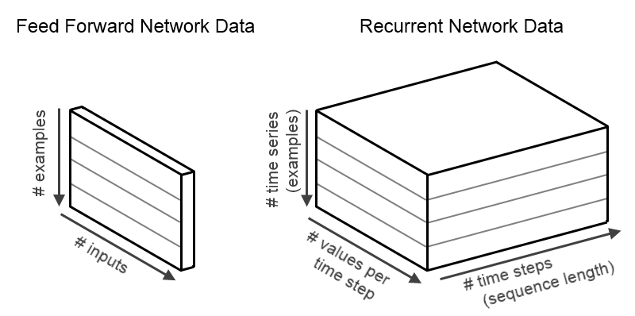
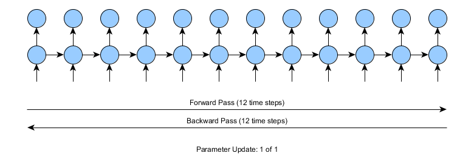
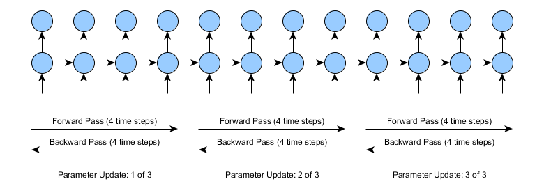
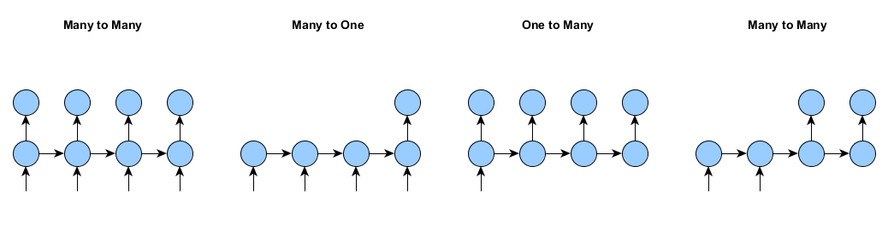
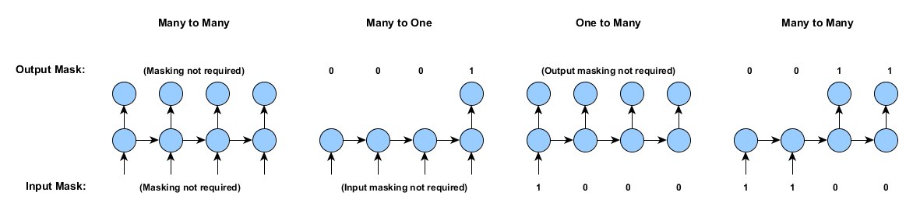
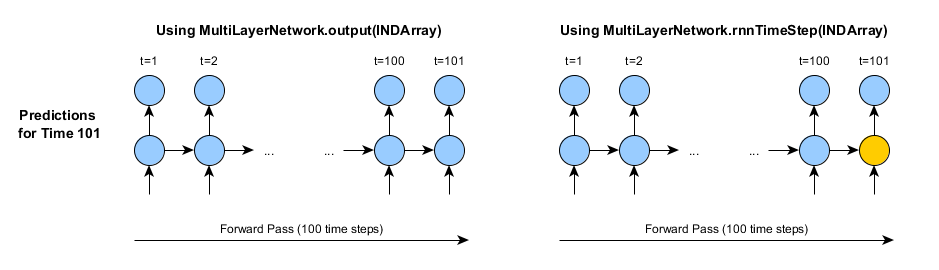
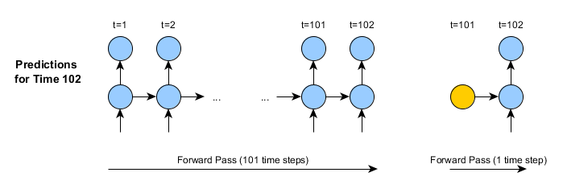
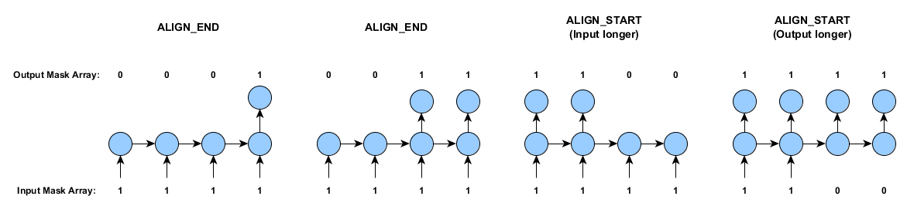
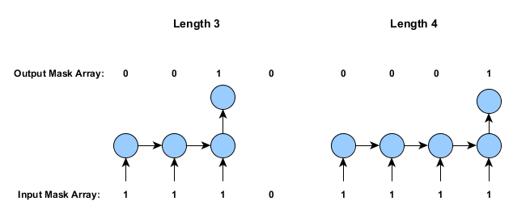

# 再帰型ニューラルネットワークをDL4Jで使用

このページでは再帰型ニューラルネットワークをどのようにDeepLearning4Jで使用するかに関連し、トレーニングの特徴や実用性についてご説明しましょう。ただし、ここでは再帰型ニューラルネットワークの使用方法や用語に関する初歩的な説明は省いております。初歩的説明が必要な方は、以下を読み進める前に[再帰型ネットワークと長・短期記憶についての初心者ガイド](/lstm.html)をお読みください。

**目次**

* [データとネットワークの設定の基本](#basics)
* [再帰型ニューラルネットワークのトレーニングの特徴](#trainingfeatures)
  * [打ち切り型通時的逆伝播](#tbptt)
  * [マスキング：1つの入力から多数の出力、多数の入力から1つの出力、系列分類](#masking)
  * [再帰型ニューラルネットワークの層を他のタイプの層と組み合わせる](#otherlayertypes)
* [予測に使用するタイムステップ数](#rnntimestep)
* [時系列データのインポート](#data)
* [例](#examples)

## <a name="basics">データとネットワークの設定の基本</a>
現在、DL4Jが対応しているのは、再帰型ニューラルネットワークの中でも主なものであるLSTM（長・短期記憶）モデル（クラス名：GravesLSTM）です（その他は今後対応予定）。

#### 再帰型ニューラルネットワークのデータ
まず、ごく標準的な順伝播型（フィードフォワード）ネットワーク（多層パーセプトン、またはDL4Jの「DenseLayer」）について考えてみましょう。このネットワークは、入力と出力データが2次元であるもの、つまりshapeが[numExamples,inputSize]であるデータを扱います。要するに、順伝播型ネットワークに入るデータは「numExamples（サンプル数）」個の行で、この行はそれぞれ「inputSize（サイズ数）」個の列で構成されています。サンプルが一つのときは、[1,inputSize]というshapeになりますが、実際は、計算上、または最適化を効率化させるために、一般に複数のサンプルを使用します。同様に、標準的な順伝播型ネットワークだと出力データも2次元であり、shapeは[numExamples,outputSize]となります。

一方、再帰型ニューラルネットワークの扱うデータは、時系列です。このため、時間の次元を追加した3次元で表されます。入力データのshapeは、[numExamples,inputSize,timeSeriesLength]で、出力データのshapeは、[numExamples,outputSize,timeSeriesLength]となります。要するに、我々のINDArrayにあるデータは、（i,j,k）という位置で、ミニバッチの例で、iはサンプル、kはタイムステップ、jは値となります。このデータを図式化したものが下の例です。

#### RnnOutputLayer

RnnOutputLayerは、多くの再帰型ニューラルネットワークシステムの最終層として使用されるタイプの層です（回帰と分類タスクの両方）。RnnOutputLayerは、スコア計算、損失関数に関連したエラー計算（予測対実際）の処理を行います。機能的に、「標準的な」OutputLayerクラス（順伝播型ネットワークに使用されるもの）に非常に似ています。しかし、出力するのもラベル付与を行うのもどちらも3次元の時系列データセットです。

RnnOutputLayerは、他の層と同じように設定します。例えば、MultiLayerNetworkの3つ目の層を分類上、RnnOutputLayerと設定するには、以下のようにします。

    .layer(2, new RnnOutputLayer.Builder(LossFunction.MCXENT).activation("softmax")
    .weightInit(WeightInit.XAVIER).nIn(prevLayerSize).nOut(nOut).build())

実際にRnnOutputLayerを使用したサンプルを載せたリンクを、このページの最後に紹介しています。

## <a name="trainingfeatures">再帰型ニューラルネットワークのトレーニングの特徴</a>

### <a name="tbptt">打ち切り型通時的逆伝播</a>
ニューラルネットワーク（再帰型など）のトレーニングは、非常に大変な計算が必要になることがあります。長い系列、つまりタイムステップが多いトレーニング用のデータを扱う場合は特に大変です。

打ち切り型通時的逆伝播（BPTT）が開発された目的は、再帰型ニューラルネットワークの各パラメータ更新での計算の複雑さを軽減することでした。ある部分の計算能力を使ったネットワークのトレーニングがより素早くできるのです（パラメータの更新をより頻繁にします）。入力系列が長い場合は打ち切り型BPTTを使用することをおすすめします（一般に数百タイムステップ以上など）。

まずは、12タイムステップの時系列での再帰型ネットワークのトレーニングはどのように行われるかを見てみましょう。このトレーニングでは、12タイムステップの前方向パス、エラーの計算（予測対実際）、12タイムステップの逆方向パスを行います。

上図のように、12タイムステップのような場合では問題は生じません。しかし、入力時系列が10,000以上のタイムステップである場合はどうでしょうか。標準的な通時的逆伝播だと、前方向と逆方向両方に10,000タイムステップでパスしなければなりません。計算が大変になるだろうことは明らかです。

打ち切り型BPTTの場合は、前方向と逆方向のパスを複数の小さめの前/逆方向パスに分割します。これらの前/逆方向パスのセグメントの長さは、パラメータによってユーザーが設定します。例えば、長さが4タイムステップの打ち切り型BPTTを使用すると、学習は下図のようになります。

複雑さの点では、全体的にみると打ち切り型BPTTでも標準的なBPTTでもほぼ同じです。どちらも同じ数のタイムステップを使って、前/逆方向にパスします。しかし、同じ労力を費やしても、打ち切り型の方は、パラメータを1つどころか3つも更新できます。しかし、それに掛かるコストはまったく同じというわけにはいかず、少しばかりのオーバーヘッドがパラメータの更新の際に掛かります。

打ち切り型BPTTの弱点は、学習した依存関係の長さが、フルのBPTTのときと比べてより短くなることです。考えてみるとこれは当然です。上図にある長さが4の打ち切り型BPTTをご覧ください。タイムステップ10で正確に予測するためには、ネットワークはタイムステップ0のときから情報を保管しなければなりません。標準的なBPTTの場合、展開したネットワークを勾配にタイムステップの10から0へと全部逆方向に伝播させることは可能です。しかし、打ち切り型BPTTの場合、これが不可能です。タイムステップを10から必要な情報を保管できるパラメータを更新できるほど勾配を逆方向に伝播させることがありません。しかし、このような欠点を差し引いても（打ち切り型BPTTの長さが適切に設定されてさえいれば）実際には打ち切り型BPTTを使用する価値は大いにあるのです。

打ち切り型BPTTのDL4Jでの使用方法は非常に簡単です。以下のコードをネットワーク設定に追加しさえすればいいのです。（ネットワーク設定の最後のところのbuild()の前に追加）

    .backpropType(BackpropType.TruncatedBPTT)
    .tBPTTForwardLength(100)
    .tBPTTBackwardLength(100)

上記のコードスニペットにより、ネットワークのトレーニング（MultiLayerNetwork.fit()のメソッドを呼び出します）に前方向パスと逆方向パスを同じ100の長さにした打ち切り型BPTTを使用することができるようになります。

打ち切り型BPTTの使用には、以下のことにご注意ください。

* デフォルト設定では、（誤差逆伝播の種類が手動設定されていない場合）、DL4JはBackpropType.Standard（フルのBPTT）を使用します。
* tBPTTForwardLengthとtBPTTBackwardLengthのオプションは、打ち切り型BPTTのパスの長さを設定します。アプリーケーションにもよりますが、一般にタイムステップは大体50から200で、前方向と逆方向のパスは同じ長さになります（tBPTTBackwardLengthは短くなるかもしれませんが、長くなることはありません）。
* 打ち切り型BPTTの長さは、全時系列の長さより短い、または同じでなければなりません。

### <a name="masking">マスキング：1つの入力から多数の出力、多数の入力から1つの出力、系列分類</a>

DL4Jは、パディングやマスキングを使い、再帰型ネットワークの数多くのトレーニングの特徴に対応します。パディングやマスキングにより、1つの入力から多数の出力、多数の入力から1つの出力、（同じミニバッチ内の）変化する時系列の長さなど、トレーニングの際に生ずる様々な状況に対処することができます。

入力や出力が毎タイムステップにあるわけではない再帰型ニューラルネットワークをトレーニングするとしましょう。下の図は、そのサンプルの各例です。DL4Jは、これらすべての例におけるネットワークのトレーニングの状況に対処することができます。

マスキングやパディングなしでは、多数の入力から多数の出力のケース（上記、左）に限定されます。つまり、(a) すべてのサンプルの長さが同じで、(b) サンプルはすべてのタイムステップにおいて入力と出力の両方がある必要があります。

パディングの仕組みは簡単です。長さがそれぞれ50、100のタイムステップである2つの時系列が同じミニバッチにあるとします。そのトレーニングデータは、長方形配列です。したがって、短い方の時系列（入力、出力どちらでも）をパディングし（ゼロを追加します）、入力と出力の長さが同じになるようにします（この例では、100タイムステップに合わせます）。 

もちろん、これだけだと、トレーニングの際に問題が発生します。そこで、パディングの他にマスキング・メカニズムを取り入れます。マスキングの仕組みも簡単です。2つの配列を使って、あるタイムステップやサンプルにおける入力や出力が実際に存在するかどうか、または入力/出力がパディングに過ぎないかを記録します。

我々のミニバッチデータは、再帰型ネットワークで3次元であり、入力、出力のshapeはそれぞれ[miniBatchSize,inputSize,timeSeriesLength]、[miniBatchSize,outputSize,timeSeriesLength]です。そして、パディング配列は2次元で、入力と出力のshapeが両方とも[miniBatchSize,timeSeriesLength]で、各時系列やサンプルの値が0（無）、あるいは1（有）となっています。入力と出力のマスキング配列は別々の配列に保管されます。

下図は、1つのサンプルの入力と出力のマスキング配列です。

「Masking not required（マスキング不要）」のケースについては、すべての入力にマスキング配列の1を割り当てても、マスキング配列が全くないのと同じ結果になります。また、再帰型ネットワークの学習で、1つや2つのマスキング配列のゼロを使うことは可能です。例えば、多対1つのケースは、出力だけにマスキング配列を持たすことができるのです。

実際、これらのパディングの配列は、一般にデータをインポートする段階で作成されます。（例えば、後述するSequenceRecordReaderDatasetIteratorで作成されます）そして、DataSetオブジェクトに入っています。もしDataSetにマスキング配列があると、MultiLayerNetworkフィットはトレーニング中に自動的にそれを使用します。しかし、マスキング配列がなければ、マスキング機能は使用されません。

#### マスキングを使った評価、スコア付け

マスク配列は、スコア付けや評価にも必要です（再現型ネットワークの分類子の正確さを評価するため）。例えば、多対1のケースを考えてみましょう。各サンプルには、出力は1つしかありません。そしてどの評価もこれを考慮に入れなければならないのです。

（出力）マスク配列を使った評価は、評価の間に以下の方法でサンプルを通過させることによって行うことができます。

    Evaluation.evalTimeSeries(INDArray labels, INDArray predicted, INDArray outputMask)

この中のlabelsは、実際に行った出力（3次元の時系列）、pedictedはネットワークの予測（3次元の時系列、labelsと同じshape）、そしてoutputMaskは、出力の2次元のマスク配列です。入力マスク配列は、評価に必要ないことにご注意ください。

スコアの計算にも、MultiLayerNetwork.score（DataSet）方法を使って、マスク配列が活用されます。また、DataSetが出力マスキング配列を含んでいると、ネットワークのスコアの計算（損失関数、平均二乗エラー、負の対数尤度など）に自動的に使用されます。

### <a name="otherlayertypes">再帰型ニューラルネットワークの層を他のタイプの層と組み合わせる</a>

再帰型ニューラルネットワークは、他のタイプの層と組み合わせることが可能です。例えば、同じネット-ワークでDenseLayerとGravesLSTMの層を組み合わせたり、ビデオのデータに畳み込み（CNN）ニューラルネットワークの層とGravesLSTMの層を組み合わせることができます。

もちろん、DenseLayerと畳み込み層は、時系列データを扱いません。これとは異なるタイプの入力を求めています。このことに対処するためには、我々は層のプリプロセッサ機能を使用する必要があります。例えば、CnnToRnnPreProcessorとFeedForwardToRnnPreprocessorのクラスなどがあります。すべてのプリプロセッサについては、[こちら](https://github.com/deeplearning4j/deeplearning4j/tree/master/deeplearning4j-core/src/main/java/org/deeplearning4j/nn/conf/preprocessor)をご覧ください。好都合なことに、ほとんどの場合、DL4Jの設定システムはこれらのプリプロセッサを必要に応じて自動的に追加します。また、プリプロセッサを手作業で追加することも可能です（各層につき、プリプロセッサの自動による追加をオーバーライドします）。

例えば、プリプロセッサを手作業で層の1と2の間に追加するには、コマンドの`.inputPreProcessor(2, new RnnToFeedForwardPreProcessor())`をネットワーク設定に追加してください。

## <a name="rnntimestep">予測に使用するタイムステップ数</a>
他のニューラルネットワークのタイプとともに、`MultiLayerNetwork.output()`と`MultiLayerNetwork.feedForward()`のメソッドを使って再帰型ネットワークの予測を立てることができます。これらのメソッドは多くの状況で対応することができますが、毎回最初から始める時系列の予測しか立てることができません。

例えば、リアルタイムのシステムで膨大な量の過去データに基づいて予測を立てたい場合を考えてみましょう。この場合、MultiLayerNetwork.output()やMultiLayerNetwork.feedForward()のメソッドを使用するのは、非実用的でしょう。というのは、呼び出されるたびに、全部のデータ歴を対象として、フルの前方向パスを行うことになるからです。各タイムステップで1つのタイムステップの予測をする場合、これらのメソッドだと同じ計算を何度も行うため、(a) 非常にコストが掛かり、(b) 無駄も多くなります。

これらの状況に対応するために、MultiLayerNetworkは4つのメソッドを提供しています。

* `rnnTimeStep(INDArray)`
* `rnnClearPreviousState()`
* `rnnGetPreviousState(int layer)`
* `rnnSetPreviousState(int layer, Map<String,INDArray> state)`

rnnTimeStep()のメソッドは、1つ以上のステップで前方向パス（予測）が効率的に行われるように設計されています。MultiLayerNetwork.output()やMultiLayerNetwork.feedForward()のメソッドと異なり、rnnTimeStep()メソッドは、呼び出されると再帰型ニューラルネットワーク層の内部の状態を記録します。これらの予測をすべて一度にまとめて行っても（MultiLayerNetwork.output()やMultiLayerNetwork.feedForward()）、これらの予測を1つ、または複数のタイムステップごとに生成しても（rnnTimeStep）、rnnTimeStepのメソッドとMultiLayerNetwork.output()やMultiLayerNetwork.feedForward()のメソッドの出力が（各タイムステップにおいて）全く同じであることが重要です。したがって、違いは計算コストだけになるようにするべきです。

まとめると、MultiLayerNetwork.rnnTimeStep()のメソッドは、以下の2つのことを行います。

1.	前の保管状態（あれば）を使用して出力/予測（前方向パス）を生成
2.	最後のタイムステップの活性化を保管しつつ、保管状態を更新（次にrnnTimeStepが呼ばれたときに使用する準備をします。）

例えば、1時間後の天気を予測するのに再帰型ニューラルネットワークを使用したいとします（過去100時間を遡る天気のデータを基にする）。
101時間目の天気を予測するのに、それぞれの時間でMultiLayerNetwork.output()のメソッドを使うとすると、100時間のフルデータを入力する必要があります。それから、102時間目の天気を予測するには、100（または101）時間のフルデータが必要です。103時間目、それ以降も同様です。

その代わりに、rnnTimeStepのメソッドを使用することができます。しかし、もちろん最初の予測をするのに100時間フルの履歴を使いたければ、フルの前方向伝播を行う必要はあります。

初めてrnnTimeStepを使うとき、これらの2つのアプローチが実用面で唯一異なることは、最後のタイムステップの活性化/状態が保管されることです。図のオレンジ色で表示された部分がこれを示したものです。しかし、rnnTimeStepのメソッドを次に使用するときに、この保管された状態が次の予測に使用されます。

rnnTimeStepのメソッドとMultiLayerNetwork.output()やMultiLayerNetwork.feedForward()のメソッドとには以下のように重要な違いがあります。

1. 二つ目の図（rnnTimeStepの2つ目の呼び出し）にあるように、入力データは過去データすべてではなく、タイムステップ1つで構成されています。
2. したがって、前方向伝播は、タイムステップ一つ（100やそれ以上でなく）です。
3. rnnTimeStepのメソッドが返った後、内部の状態が自動的に更新されます。従って、103時間目の予測は、102時間目やその他の時間と同じように行われます。

しかし、新しい（全く別の）時系列の予測を開始したい場合は、保管された状態を`MultiLayerNetwork.rnnClearPreviousState()`のメソッドを使って、手動でクリアすることが必要となります。これにより、ネットワーク内すべての再帰層の内部状態がリセットされます。

予測用に再帰型ニューラルネットワークの内部状態を保管する必要がある場合、各層にそれぞれrnnGetPreviousStateのメソッドとrnnSetPreviousStateのメソッドを使うことができます。これはシリアライゼーション（ネットワークの保存/ローディング）の際などに役立ちます。というのは、rnnTimeStepのメソッドからの内部状態はデフォルト設定では保存 **されない** ため、別々に保存、ロードする必要があるからです。これらの状態の獲得/設定メソッドは、活性化のタイプで適合されたマップを返し、受け取ります。例えば、長・短期記憶モデルには、出力活性化とメモリセル状態の両方を保管することが必要です。

その他、重要なことを以下にまとめます。

- rnnTimeStepのメソッドを複数の独立したサンプルやに同時に使用することができます。上述の天気の予測の場合、同じニューラルネットワークを使って複数の位置の予測をしたいこともあるでしょう。これはトレーニングとMultiLayerNetwork.output()やMultiLayerNetwork.feedForward()のメソッドと同じ方法で作動します。複数の行（インプットには次元0）が複数のサンプルで使用されます。
- 履歴/保管された状態が設定されていない場合（最初に、またはrnnClearPreviousStateを呼び出した後）、デフォルト設定の初期化（ゼロ）が行われます。これは、トレーニング間でのものと同じアプローチです。
- rnnTimeStepを、一つではなく任意の数のタイムステップに同時に使うことができます。しかし、以下のことに注意する必要があります。
  - タイムステップ1つの予測：　データは2次元、[numExamples,nIn]というshapeです。この場合、出力も2次元で、[numExamples,nOut]というshapeです。
  - 複数のタイムステップの予測：　データは3次元で[numExamples,nIn,numTimeSteps]というshapeです。;出力は、[numExamples,nOut,numTimeSteps].というshapeです。最後のタイムステップ活性化は、以前のように保管されます。
- rnnTimeStepnの呼び出し間でサンプル数を変更することはできません（最初にrnnTimeStepを3つのサンプルで使用した場合、後に続く呼び出しはすべて3つのサンプルでなければなりません。）内部状態を再設定した後で（rnnClearPreviousState()を使って）、次のrnnTimeStepのサンプルはいくつでも使用することができます。
- rnnTimeStepのメソッドは、パラメータに変更をもたらすものではありません。ネットワークのトレーニングが終わってからのみ使用されます。
- rnnTimeStepのメソッドは、1つ、スタックされた/複数層から成るネットワーク、また他のタイプの層（畳み込み層、密層）を組み合わせたネットワークに使用可能です。
- RnnOutputLayerの層のタイプは、再帰的結合がないため、内部状態がありません。

## <a name="data">時系列データのインポート</a>

再帰型ニューラルネットワークのデータインポートは複雑な過程を経ます。というのは、1つの入力から多数の出力、多数の入力から1つの出力、様々に変化する時系列の長さなど再帰型ニューラルネットワークに使用したいタイプのデータが複数あるからです。このセクションでは、現在実装されたDL4Jのメカニズムを説明します。

ここに説明するメソッドは、SequenceRecordReaderDataSetIteratorクラスをCanovaのCSVSequenceRecordReaderと合わせて使用します。このアプローチを使うと、時系列が別々のファイルにあっても、それら複数のファイルから（タブやコンマなどで）区切り文字で分けたデータをロードすることができます。
このメソッドは以下の状況にも対応します。

* 様々の長さの時系列の入力
* 1つの入力から多数の出力と多数の入力から多数の出力のデータの読み込み（入力とラベルが異なるファイルにある場合）
* 分類用にインデックスからワン・ホット（one-hot）の表示にラベルを変換（2を[0,0,1,0]に）
* データファイルの最初に固定した/指定された行数のスキップ（コメントやヘッダーの行）

すべてのケースにおいて、データの各行は1つのタイムステップを表していることに注意してください。

（以下の例に加えて、[これらのユニットテスト](https://github.com/deeplearning4j/deeplearning4j/blob/master/deeplearning4j-core/src/test/java/org/deeplearning4j/datasets/canova/RecordReaderDataSetiteratorTest.java)が役に立つかもしれません。）

#### 例1：時系列の長さが同じで、入力とラベルが別々のファイルにある場合

トレーニングデータに20ファイルに表示された10の時系列があるとします。10ファイルは、各時系列の入力、残りの10ファイルは出力/ラベルとします。これらの20ファイルは、すべて同数のタイムステップがあるとします（同じ行数）。

[SequenceRecordReaderDataSetIterator](https://github.com/deeplearning4j/deeplearning4j/blob/master/deeplearning4j-core/src/main/java/org/deeplearning4j/datasets/canova/SequenceRecordReaderDataSetIterator.java)アプローチと[CSVSequenceRecordReader](https://github.com/deeplearning4j/Canova/blob/master/canova-api/src/main/java/org/canova/api/records/reader/impl/CSVSequenceRecordReader.java)のアプローチを使用するには、最初に1つは入力用、もう1つはラベル用である、2つのCSVSequenceRecordReaderオブジェクトを作成します。

    SequenceRecordReader featureReader = new CSVSequenceRecordReader(1, ",");
    SequenceRecordReader labelReader = new CSVSequenceRecordReader(1, ",");

このコンストラクターは、スキップする行（ここでは1行スキップ）と区切り文字（ここではコンマを使用）を使います。

次に、データをどこから得るかを教えることにより、これらの2つのリーダーを初期化する必要があります。我々は、これをInputSplitオブジェクトを使って行います。
我々の時系列は、"myInput_0.csv", "myInput_1.csv", ..., "myLabels_0.csv"などのようにファイル名と番号が付けられているとします。そのアプローチに[NumberedFileInputSplit](https://github.com/deeplearning4j/Canova/blob/master/canova-api/src/main/java/org/canova/api/split/NumberedFileInputSplit.java)を使用する、というものがあります。

    featureReader.initialize(new NumberedFileInputSplit("/path/to/data/myInput_%d.csv", 0, 9));
    labelReader.initialize(new NumberedFileInputSplit(/path/to/data/myLabels_%d.csv", 0, 9));

このアプローチでは、「%d」に該当する数字が入り、数字の0から9（両方含む）が使用されます。

これで自分のSequenceRecordReaderdataSetIteratorを作成することができます。

    DataSetIterator iter = new SequenceRecordReaderDataSetIterator(featureReader, labelReader, miniBatchSize, numPossibleLabels, regression);

次に、このDataSetIteratorは、ネットワークをトレーニングするために、MultiLayerNetwork.fit()を通過することができます。

miniBatchSizeの引数は、各ミニバッチのサンプル（時系列）の数を指定します。例えば、ファイルが全部で10ある場合、5のminiBatchSizeで2つのminibatch（DataSetオブジェクト）と5つの時系列のデータセットが2つが提供されます。

この例では以下のことに注意してください。

* 分類の問題：numPossibleLabelsは、データセット内のクラスの数を表します。regression = falseを使用してください。
  * ラベルのデータ： クラスインデックスとして各行につき１つの値
  * ラベルのデータは、自動的にワンホット（one-hot）表示に変換されます。
* 回帰問題：numPossibleLabelsは使用されていません。（何に設定してもいい）、そしてregression = trueを使用してください。
  * 入力とラベルの値の数は、何でも構いません。（分類とは異なり、出力はいくつあっても大丈夫です。）
  * regression = trueのとき、ラベルの処理は行われません。

#### 例2：時系列の長さが同じで、入力とラベルが同じファイルにある場合

次に入力データとラベルが別々のファイルでなく、同じファイルにあるとします。しかし、各時系列は別々のファイルにあります。

DL4J 0.4-rc3.8以降、このアプローチでは、出力（1つのクラスインデックス、または実数値の回帰出力）が一列に制限されます。

この場合、1つのリーダーを作成し、初期化します。また、ヘッダー1行をスキップし、フォーマットには区切り文字にコンマを使用すると指定します。データファイル名は"myData_0.csv"、...、"myData_9.csv"とします。

    SequenceRecordReader reader = new CSVSequenceRecordReader(1, ",");
    reader.initialize(new NumberedFileInputSplit("/path/to/data/myData_%d.csv", 0, 9));
    DataSetIterator iterClassification = new SequenceRecordReaderDataSetIterator(reader, miniBatchSize, numPossibleLabels, labelIndex, false);

`miniBatchSize`と`numPossibleLabels`は、前のサンプルと同じです。ここで、`labelIndex`は、ラベルのある列を指定します。例えば、ラベルが5列目にあれば、labelIndex = 4としてください（numColumns-1の場合、列は0とします）。

1つの出力値の回帰には、以下を使用します。

    DataSetIterator iterRegression = new SequenceRecordReaderDataSetIterator(reader, miniBatchSize, -1, labelIndex, true);

この例でもnumPossibleLabelsの引数は回帰に使用されません。

#### 例3：時系列の長さが異なる場合（多数の入力から多数の出力）

上記の2例の次は、各サンプルにつき、出力とラベルが同じ長さですが、時系列では長さが異なるとします。

同じアプローチ（CSVSequenceRecordReaderとSequenceRecordReaderDataSetIterator）を異なるコンストラクターで使用することができます。

    DataSetIterator variableLengthIter = new SequenceRecordReaderDataSetIterator(featureReader, labelReader, miniBatchSize, numPossibleLabels, regression, SequenceRecordReaderDataSetIterator.AlignmentMode.ALIGN_END);

AlignmentMode.ALIGN_ENDが追加されたことを除いては、ここの引数は、前の例と同じです。このアライメントモード入力は、SequenceRecordReaderDataSetIteratorに以下の2つの状況に対応するよう指示します。

1. 時系列の長さが異なる可能性がある。
2. 各サンプルの入力とラベルを調整すること。最後の値が同じタイムステップで発生するようにする。

特徴やラベルがいつも同じ長さの場合（例3の場合ように）、2つのアライメントモード（AlignmentMode.ALIGN_ENDとAlignmentMode.ALIGN_START）が同じ出力になります。次のセクションでは、アライメントモードのオプションについて説明します。

また、様々な長さの時系列は、データ配列の中で、時間は常に0から始まります。パディングは必要な際、時系列が終わった後で追加されます。

上述の例1、2と異なり、上記のvariableLengthIterインスタンスで産出されたDataSetオブジェクトは、前述したように、入力とマスキング配列を含みます。

#### 例4：多数の入力から1つの出力、1つの入力から多数の出力の場合
AlignmentMode機能を例3に使用して多対1の再帰型シーケンス分類子を実装することができます。この例では、以下のことを仮定します。

* 入力とラベルが別々の区切り文字で分けたファイルにある。
* ラベルファイルに1行（タイムステップ）が含まれている（分類用のクラスインデックスか回帰用の1以上の数字）。
* 入力の長さは、サンプルによって（随意に）異なることがあります。

例3と同じアプローチでこれを行うことができます。

    DataSetIterator variableLengthIter = new SequenceRecordReaderDataSetIterator(featureReader, labelReader, miniBatchSize, numPossibleLabels, regression, SequenceRecordReaderDataSetIterator.AlignmentMode.ALIGN_END);

アライメントモードは、比較的、単純です。短めの時系列の最初か最後にパディングを行うか否かを指定します。下図はその仕組みとマスキング配列を表したものです（上述した仕組みと同じです）。

1対多のケース（上述の最後のケースに似ていますが、入力は一つ）は、AlignmentMode.ALIGN_STARTを使用します。

長さが異なる時系列を含むトレーニングデータの場合、ラベルと入力は各サンプルが別々に調整されます。そして必要に応じて短めの時系列がパディングされます。

####その他の方法：カスタマイズされたDataSetIteratorを実装する
一般的なデータインポートの方法を適用できない場合もあります。このような場合は、カスタマイズされた[DataSetIterator](https://github.com/deeplearning4j/nd4j/blob/master/nd4j-api/src/main/java/org/nd4j/linalg/dataset/api/iterator/DataSetIterator.java).を実装することができます。DataSetIteratorは、入力をカプセル化し、INDArrays、（随意に）入力とラベルのマスク配列を対象とするDataSetオブジェクトをイテレートするインターフェイスです。

このアプローチはかなり低いレベルであることに注意してください。DataSetIteratorを実装する場合、入力とラベルに必要なINDArraysや（必要な場合は）入力とラベルのマスク配列を手作業で作成する必要があります。しかし、このアプローチだと、データの読み込み方法にかなりの柔軟性を持たせることができます。

実際のアプローチの例については、[tex/character example](https://github.com/deeplearning4j/dl4j-0.4-examples/blob/master/src/main/java/org/deeplearning4j/examples/rnn/CharacterIterator.java)や[Word2Vec movie review sentiment example](https://github.com/deeplearning4j/dl4j-0.4-examples/blob/master/src/main/java/org/deeplearning4j/examples/word2vec/sentiment/SentimentExampleIterator.java)のイテレーターをご覧ください。

## <a name="examples">例</a>

現在、以下のようなDL4Jの[再帰型ネットワークの例](https://github.com/deeplearning4j/dl4j-0.4-examples/tree/master/src/main/java/org/deeplearning4j/examples/recurrent)があります。

* [登場人物のモデリング例](https://github.com/deeplearning4j/dl4j-0.4-examples/blob/master/src/main/java/org/deeplearning4j/examples/recurrent/character/GravesLSTMCharModellingExample.java)は、シェークスピアの散文を各登場人物の台詞ごとに生成します。
* [基本的なビデオフレーム分類例](https://github.com/deeplearning4j/dl4j-0.4-examples/blob/master/src/main/java/org/deeplearning4j/examples/recurrent/video/VideoClassificationExample.java)は、ビデオ（.mp4フォーマット）をインポートし、各フレームにあるシェイプを分類します。
* [word2vec系列分類例](https://github.com/deeplearning4j/dl4j-0.4-examples/tree/master/src/main/java/org/deeplearning4j/examples/recurrent/word2vecsentiment) は、あらかじめトレーニングした単語ベクトルと再帰型ニューラルネットワークを使用し、映画のレビューをポジティブかネガティブに分類します。

