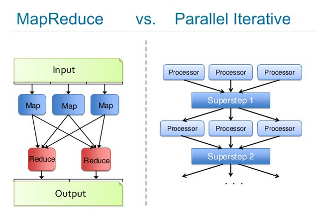
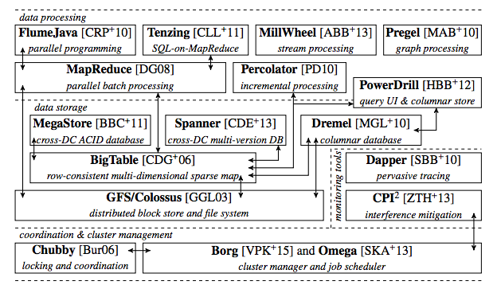

# Hadoop과 Spark 기반의 DL4J를 사용한 반복적인 리듀스(Iterative Reduce) 작업

맵리듀스를 이해한다면 반복적인 리듀스 작업을 이해하는 데 더 수월할 것입니다.

## 맵리듀스(MapReduce)

맵리듀스는 큰 데이터 집합을 여러개의 코어에서 동시에 처리하기 위한 기술입니다. Google의 Jeff Dean은 이 이론을 [2004 research paper](https://static.googleusercontent.com/media/research.google.com/en/us/archive/mapreduce-osdi04.pdf) 에서 소개했고, 이후 Doug Cutting은 Yahoo에서 이와 유사한 구조를 구현했습니다. Cutting의 프로젝트는 이후 [Apache Hadoop](https://hadoop.apache.org/) 으로 발전했습니다. 두 프로젝트는 웹 인덱싱을 처리하기 위해 사용되었고, 이후 다른 여러 어플리케이션에도 사용되고 있습니다.

맵리듀스라는 단어는 함수형 프로그래밍에서 유래된 2개의 메서드를 참조하였습니다. 맵(Map)은 목록에 있는 모든 값들에 동일한 처리(수식 계산 등)를 적용하고 적용된 새로운 값들의 목록을 생성하는 명령입니다. 리듀스(Reduce)는 여러개의 값들을 가진 목록에서 내부의 값들을 조합하여 값들의 갯수를 줄이는 명령입니다.

예를 들어, 가장 단순한 형태로 맵과 리듀스를 이해하기 위해 문장 안에 있는 각 단어의 개수를 세는 예제를 보여드리겠습니다. 주어진 문장에서, 맵은 모든 단어를 잘라내서 키-값 쌍으로 만들고 모든 단어에 1이라는 값을 반영하는 과정입니다. 리듀스 과정에서는 잘라낸 값들을 보면서 같은 단어가 발견될 경우 1로 입력한 값들을 더해가도록 하면서 각 단어가 몇개가 있는지 합계를 구합니다.

실제로 맵리듀스는 이보다 큰 스케일의 환경에서 적용되고 있습니다. 맵 과정에서는 데이터를 여러 코어로 분산시킨 뒤, 나눠진 데이터 파편들에 같은 명령을 수행시키는 방법으로 큰 단위의 작업을 분리합니다. 리듀스 과정에서는 분리되어 변형된 데이터 조각들을 통합하여 하나의 데이터 셋으로 만들고 한곳으로 모아 추가적인 작업을 수행합니다. Map explodes and Reduce collapses, like a star expands to become a Red Giant, and shrinks to a White Dwarf. 

## 반복적인 맵리듀스

여러 사용 사례에서 맵리듀스의 일회성 실행에는 문제가 없었지만, 기계학습과 딥러닝에서는 필수적으로 이러한 과정의 반복이 필요합니다. 데이터 모델은 오류를 최소화 할 수 있는 최적화 알고리즘을 통해 '학습'을 진행하게 되고, 이를 발견하기 위해서는 반복적인 과정을 거쳐야 하기 때문입니다.

여기에서 [Jeff Dean](https://static.googleusercontent.com/media/research.google.com/en/us/people/jeff/CIKM-keynote-Nov2014.pdf)에 의해 영향을 받은 반복적인 맵리듀스라는 개념을 생각해볼 필요가 있습니다. 이 개념을 바탕으로, YARN 프레임워크에서는 데이터에 대해 한 개가 아닌, 여러 개의 통로를 만들어 놓습니다. 비록 반복적인 리듀스는 맵리듀스와 구조 상으로는 다르지만, MapReduce1의 결과물은 MapReduce2의 입력값이 되는 과정이 반복된다는 관점으로 볼 때 반복적인 맵리듀스는 결국 맵리듀스 명령을 연속적으로 실행하는 것으로 볼 수 있습니다.

예를 들어 당신에게 deep-belief net가 있고, 여기에서 대규모 데이터를 학습시켜 이후 들어오는 새로운 데이터를 정확하게 분류해 내고 싶다고 가정합시다. 이 deep-belief net은 입력값을 분류하는 기록 기능, 모델의 예측값과 실제 정답 사이의 차이를 측정하는 오류 처리 기능, 데이터 모델의 항목들을 조정하여 이후의 예측들에서 오류를 최소화하도록 하는 최적화 기능으로 나뉘어집니다.

맵 과정에서는 이 모든 명령들을 분산 시스템의 각 코어에 놓고, 입력할 큰 데이터 세트들을 이 많은 코어들로 분산시킵니다. 각 코어에서 모델들은 입력된 값을 통해 학습됩니다. 그리고 새로운 값들을 분산시키기 전에, 리듀스 과정에서는 이 모델들을 전부 받아서 계산된 값의 평균값을 구합니다. 반복적인 리듀스 과정에서는 learning plateaus와 에러가 줄어들지 않을 때까지 이를 반복합니다.

[Josh Patterson](http://www.slideshare.net/cloudera/strata-hadoop-world-2012-knitting-boar)이 만든 이미지에서는 두 프로세스를 비교하고 있습니다. 왼쪽 이미지에서는 맵리듀스의 과정을 상세하게 나타내고 있고, 오른쪽에서는 이를 반복하는 과정을 표현하였습니다. 각 'Processor'는 데이터 집합을 학습하고 있는 deep-belief 네트워크 이고, 'Superstep'은 중앙의 모델값이 나머지 클러스터로 다시 분산되기 전에 받아온 값들의 평균을 구하는 개체입니다.

## Hadoop & Spark

Hadoop과 Spark는 둘 다 맵리듀스와 반복적인 리듀스를 수행하는 분산 런타임 입니다. Deeplearning4j는 Hadoop/YARN 또는 Spark 안에서 job로서 수행됩니다. 예를 들어 YARN app으로서 동작하고 배포된다고 표현할 수도 있습니다.

Hadoop에서는 반복적인 리듀스를 수행하는 기능들이 HDFS의 블록이나 조각들에 배치되어서, 처리한 값들이 중앙의 master에게로 보내져서 평균값을 구하고 각 모델들에 적용되기 전까지 데이터들을 비동기적으로 병렬 처리합니다. 이제 맵과 맵리듀스 절차는 제외되지만, 반복적인 리듀스 프로세스는 계속 진행됩니다. 이 구조는 Spark와도 대략 유사합니다.

최근의 상황을 조금 말하자면, Google과 Yahoo 둘 다 수십억의 파라메터를 저장하고 이를 처리하는 클러스터로 분산시키는 서버들을 운용하고 있습니다. Google에서 Google Brain이라 부르는 이 시스템은 Andrew Ng이 개발하고, 이제는 그의 학생 Quoc Le가 주도하고 있습니다. 여기에 2015년 기준의 대략적인 Google의 시스템 구조가 있으며, 여기에서 MapReduce가 어떻게 활용되는지 확인할 수 있습니다.

Deeplearning4j considers distributed run-times to be interchangeable (but not necessarily equal); they are all simply a directory in a larger modular architecture that can be swapped in or out. This allows the overall project to evolve at different speeds, and separate run-times from other modules devoted to neural net algorithms on the one hand, and hardware on the other. Deeplearning4j users are also able to build a standalone distributed architecture via Akka, spinning out nodes on AWS.

Hadoop과 Spark이 포함된 확장에 대한 모든 양식은 우리의 [확장 repository](https://github.com/deeplearning4j/deeplearning4j/tree/master/deeplearning4j-scaleout)에 포함되어 있습니다.
예를 들어 Deeplearning4j 코드는 Spark와 혼용되어 사용될 수 있으며, DL4J 명령들은 다른 것과 동일하게 분산되어 처리될 것입니다.

