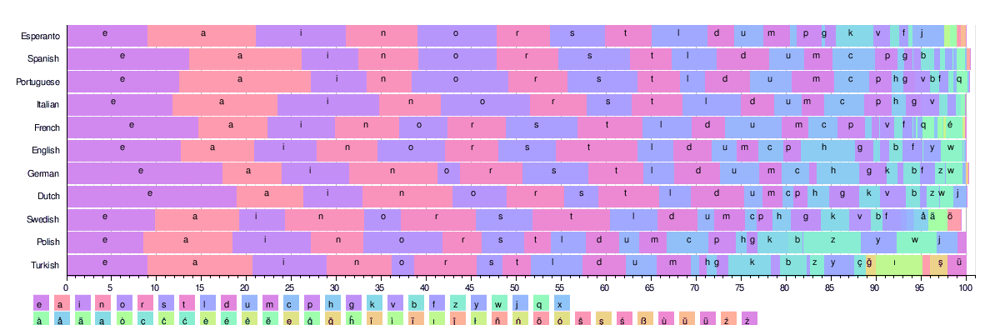
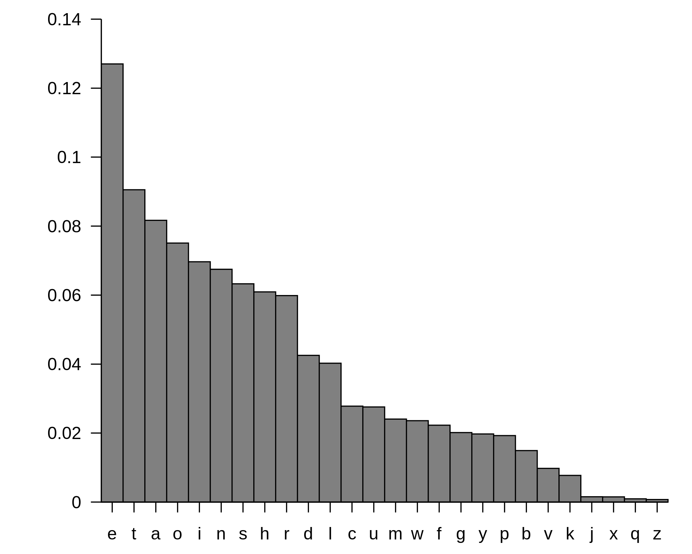

# Markov Chains, Monte Carlo Methods, and Machine Learning

Markov Chain Monte Carlo is a method to sample from a population with a complicated probability distribution. *OK.*

Let's define some terms:

* **Sample** - A subset of data drawn from a larger population. (Also used as a verb *to sample*; i.e. the act of selecting that subset. Also, reusing a small piece of one song in another song, which is not so different from the statistical practice, but is more likely to [lead to lawsuits](https://www.theatlantic.com/entertainment/archive/2013/09/did-the-decline-of-sampling-cause-the-decline-of-political-hip-hop/279791/).) Sampling permits us to approximate data without exhaustively analyzing all of it, because some datasets are too large or complex to compute. We're often stuck behind a veil of ignorance, unable to gauge reality around us with much precision. So we sample.<sup>[1](#one)</sup>  
* **Population** - The set of all things we want to know about; e.g. coin flips, whose outcomes we want to predict. Populations are often too large for us to study them *in toto*, so we sample. For example, humans will never have a record of the outcome of all coin flips since the dawn of time. It's physically impossible to collect, inefficient to compute, and politically unlikely to be allowed. Gathering information is expensive. So in the name of efficiency, we select subsets of the population and pretend they represent the whole. Flipping a coin 100 times would be a sample of the population of all coin tosses and would allow us to reason inductively about all the coin flips we cannot see. 
* **Distribution** (or probability distribution) - You can think of a distribution as table that links outcomes with probabilities. A coin toss has two possible outcomes, heads (H) or tails (T). Flipping it twice can result in either HH, TT, HT or TH. So let's contruct a table that shows the outcomes of two coin tosses as measured by the number of H that result. Here's a simple distribution: 

| Number of H  |   | Probability |
| :-------------: |:-------------:| :-----:| 
| 0 | | 0.25 | 
| 1 | | 0.50 | 
| 2 | | 0.25 | 

There are just a few possible outcomes, and we assume H and T are equally likely. Another word for outcomes is *states*, as in: what is the end state of the coin flip? 

Instead of attempting to measure the probability of states such as heads or tails, we could try to estimate the distribution of `land` and `water` over an unknown earth, where land and water would be states. Or the reading level of children in a school system, where each reading level from 1 through 10 is a state. 

Markov Chain Monte Carlo (MCMC) is a mathematical method that draws samples randomly from a black-box to approximate the probability distribution of attributes over a range of objects (the height of men, the names of babies, the outcomes of events like coin tosses, the reading levels of school children, the rewards resulting from certain actions) or the futures of states. You could say it's a large-scale statistical method for guess-and-check. 

MCMC methods help gauge the distribution of an outcome or statistic you're trying to predict, by randomly sampling from a complex probabilistic space. 

As with all statistical techniques, we sample from a distribution when we don't know the function to succinctly describe the relation to two variables (actions and rewards). MCMC helps us approximate a black-box probability distribution. 

With a little more jargon, you might say it's a simulation using a pseudo-random number generator to produce samples covering many possible outcomes of a given system. The method goes by the name "Monte Carlo" because the capital of Monaco, a coastal enclave bordering southern France, is known for its casinos and games of chance, where winning and losing are a matter of probabilities. It's "James Bond math." 

## Concrete Examples of Monte Carlo Sampling

Let's say you're a gambler in the saloon of a Gold Rush town and you roll a suspicious die without knowing if it is fair or loaded. You roll a six-sided die a hundred times, count the number of times you roll a four, and divide by a hundred. That gives you the probability of four in the total distribution. If it's close to 16.7 (1/6 * 100), the die is probably fair. 

Monte Carlo looks at the results of rolling the die many times and tallies the results to determine the probabilities of different states. It is an inductive method, drawing from experience. The die has a state space of six, one for each side.

The states in question can vary. Instead of games of chance, the states might be letters in the Roman alphabet, which has a state space of 26. ("e" happens to be the most frequently occurring letter in the English language....) They might be stock prices, weather conditions (rainy, sunny, overcast), notes on a scale, electoral outcomes, or pixel colors in a JPEG file. These are all systems of discrete states that can occur *in seriatim*, one after another. Here are some other ways Monte Carlo is used:

* In finance, to model risk and return
* In search and rescue, the calculate the probably location of vessels lost at sea
* In AI and gaming, to calculate the best moves (more on that later)
* In computational biology, to calculate the most likely evolutionary tree (phylogeny)
* In telecommunications, to predict optimal network configurations

[An origin story](http://citeseerx.ist.psu.edu/viewdoc/download?doi=10.1.1.13.7133&rep=rep1&type=pdf): 

```
While convalescing from an illness in 1946, Stan Ulam was playing solitaire. It occurred to him to try to compute the chances that a particular solitaire laid out with 52 cards would come out successfully (Eckhard, 1987). After attempting exhaustive combinatorial calculations, he decided to go for the more practical approach of laying out several solitaires at random and then observing and counting the number of successful plays. This idea of selecting a statistical sample to approximate a hard combinatorial problem by a much simpler problem is at the heart of modern Monte Carlo simulation.
```

## Systems and States

At a more abstract level, where words mean almost anything at all, a system is a set of things connected together (you might even call it a [graph](./graphdata), where each state is a vertex, and each transition is an edge). It's a set of states, where each state is a condition of the system. But what are states? 

* Cities on a map are "states". A road trip strings them together in transitions. The map represents the system. 
* Words in a language are states. A sentence is just a series of transitions from word to word.
* Genes on a chromosome are states. To read them (and create amino acids) is to go through their transitions. 
* Web pages on the Internet are states. Links are the transitions. 
* Bank accounts in a financial system are states. Transactions are the transitions.
* Emotions are states in a psychological system. Mood swings are the transitions. 
* Social media profiles are states in the network. Follows, likes, messages and friending are the transitions. 
* Rooms in a house are states. People walking through doorways are the transitions.

So states are an abstraction used to describe these discrete, separable, things. A group of those states bound together by transitions is a system. And those systems have structure, in that some states are more likely to occur than others (ocean, land), or that some states are more likely to follow others. 

We are more like to read the sequence Paris -> France than Paris -> Texas, although both series exist, just as we are more likely to drive from Los Angeles to Las Vegas than from L.A. to [Slab City](https://www.google.com/maps/place/Slab+City,+CA+92233/@33.2579686,-117.7035463,7z/data=!4m5!3m4!1s0x80d0b20527ca5ebf:0xa7f292448cbd1988!8m2!3d33.2579703!4d-115.4623352), although both places are nearby. 

A list of all possible states is known as the "state space." The more states you have, the larger the state space gets, and the more complex your combinatorial problem becomes. 

## Markov Chains

Since states can occur one after another, it may make sense to traverse the state space, moving from one to the next. A Markov chain is a probabilistic way to traverse a system of states. It traces a series of transitions from one state to another. It's a random walk across a graph. 

Each current state may have a set of possible future states that differs from any other. For example, you can't drive straight from Atlanta to Seattle - you'll need to hit other states in between. We are all, always, in such corridors of probabilities; from each state, we face an array of possible future states, which in turn offer an array of future states two degrees away from the start, changing with each step as the state tree unfolds. New possibilites open up, others close behind us. Since we generally don't have enough compute to explore every possible state of a game tree for complex games like go, one trick that organizations like DeepMind use is Monte Carlo Tree Search to narrow the beam of possibilities to only those states that promise the most likely reward. 

Traversing a Markov chain, you're not sampling with a God's-eye view any more like a conquering alien. You are in the middle of things, groping your way toward one of several possible future states step by probabilistic step, through a Markov Chain. 

While our journeys across a state space may seem unique, like road trips across America, an infinite number of road trips would slowly give us a picture of the country as a whole, and the network that links its cities together. This is known as an equilibrium distribution. That is, given infinite random walks through a state space, you can come to know how much total time would be spent in any given state. If this condition holds, you can use Monte Carlo methods to initiate randoms "draws", or walks through the state space, in order to sample it. 

## On Markov Time

Markov chains have a particular property: oblivion, or forgetting. 

That is, they have no long-term memory. They know nothing beyond the present, which means that the only factor determining the transition to a future state is a Markov chain's current state. You could say the "m" in Markov stands for "memoryless": A woman with amnesia pacing through the rooms of a house without knowing why. 

Or you might say that Markov Chains assume the entirety of the past is encoded in the present, so we don't need to know anything more than where we are to infer where we will be next.<sup>[2](#two)</sup>   

For an excellent interactive demo of Markov Chains, [see the visual explanation on this site](http://setosa.io/ev/markov-chains/). 

So imagine the current state as the input data, and the distribution of attributes related to those states (perhaps that attribute is reward, or perhaps it is simply the most likely future states), as the output. From each state in the system, by sampling you can determine the probability of what will happen next, doing so recursively at each step of the walk through the system's states.

## Probability as Space

When they call it a state space, they're not joking. You can picture it, just like you can picture land and water, each one of them a probability as much as they are a physical thing. Unfold a six-sided die and you have a flattened state space in six equal pieces, shapes on a plane. Line up the letters by their frequency for 11 different languages, and you get 11 different state spaces:

 

Five letters account for half of all characters occurring in Italian, but only a third of Swedish, if you're just dropping socks from the sky. 

If you wanted to look at the English language alone, you would get this set of histograms. Here, probabilities are defined by a line traced across the top, and the area under the line can be measured with a calculus operation called integration, the opposite of a derivative.  

 

## MCMC and Deep Reinforcement Learning

MCMC can be used in the context of deep reinforcement learning to sample from the array of possible actions available in any given state. For more information, please see our page on [Deep Reinforcement Learning](./deepreinforcementlearning).

## More Deep Learning Tutorials

* [Regressions & Neural Networks](./logistic-regression.html)
* [Recurrent Networks and LSTMs](./lstm.html)
* [Deep Reinforcement Learning](./deepreinforcementlearning.html)
* [Deep Convolutional Networks](./convolutionalnetwork.html)
* [Symbolic AI and Machine Learning](./symbolicreasoning.html)
* [Graph Data for Deep Learning](./graphdata.html)
* [Generative Adversarial Networks (GANs)](./generative-adversarial-network.html)
* [Word2vec: Neural Embeddings for NLP](./word2vec.html)
* [MNIST for Beginners](./mnist-for-beginners.html)
* [Open Datasets for Machine Learning](./opendata.html)
* [Eigenvectors, Eigenvalues, PCA, Covariance and Entropy](./eigenvector.html)
* [Glossary of Deep-Learning and Neural-Net Terms](./glossary.html)
* [Quickstart Examples for Deep Learning](./quickstart.html)
* [Restricted Boltzmann Machines (RBMs)](./restrictedboltzmannmachine.html)
* [Inference: Machine Learning Model Server](./modelserver.html)
* [Multilayer Perceptrons (MLP) for Classification](./multilayerpercepton.html)

## Further Reading on Markov Chain Monte Carlo 

* [Markov Chain Monte Carlo Without all the Bullshit](https://jeremykun.com/2015/04/06/markov-chain-monte-carlo-without-all-the-bullshit/)
* [A Zero-Math Introduction to Markov Chain Monte Carlo Methods](https://towardsdatascience.com/a-zero-math-introduction-to-markov-chain-monte-carlo-methods-dcba889e0c50)
* [Hamiltonian Monte Carlo explained](http://arogozhnikov.github.io/2016/12/19/markov_chain_monte_carlo.html)

## <a name="footnote">Footnotes</a>

<a name="one">1)</a> *You could say that life itself is too complex to know in its entirety, confronted as we are with imperfect information about what's happening and the intent of others. You could even say that each individual human is a random draw that the human species took from the complex probability distribution of life, and that we are each engaged in a somewhat random walk. Literature is one way we overcome the strict constraints on the information available to us through direct experience, the limited bandwidth of our hours and sensory organs and organic processing power. Simulations mediated by books expose us to other random walks and build up some predictive capacity about states we have never physically encountered. Which brings us to the fundamental problems confronted by science: How can we learn what we don't know? How can we test what we think we know? How can we say what we want to know? (Expressed that in a way an algorithm can understand.) How can we guess smarter? (Random guesses are pretty inefficient...)* 

<a name="two">2)</a> *It's interesting to think about how these ways of thinking translate, or fail to translate, to real life. For example, while we might agree that the entirety of the past is encoded in the present moment, we cannot know the entirety of the present moment. The walk of any individual agent through life will reveal certain elements of the past at time step 1, and others at time step 10, and others still will not be revealed at all because in life we are faced with imperfect information -- unlike in Go or Chess. [Recurrent neural nets](./lstm.html) are structurally Markovian, in that the tensors passed forward through their hidden units contain everything the network needs to know about the past. LSTMs are thought to be more effective at retaining information about a larger state space (more of the past), than other algorithms such as Hidden Markov Models; i.e. they decrease how imperfect the information is upon which they base their decisions.* 
