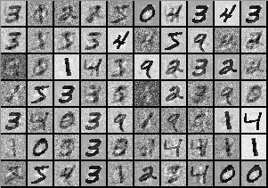
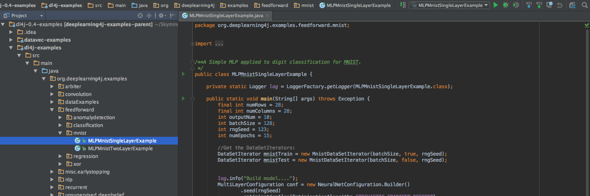
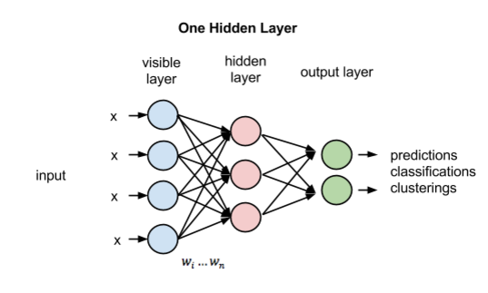
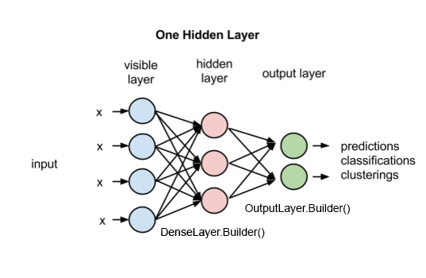
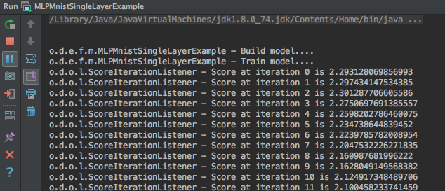
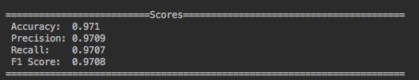

# MNIST for Beginners

## Introduction

In this tutorial, we’ll classify the MNIST dataset, the “Hello World” of machine learning. 



MNIST is a database containing images of handwritten digits, with each image labeled by integer. It is used to benchmark the performance of machine learning algorithms. Deep learning performs quite well on MNIST, achieving more than 99.7% accuracy. 

We will use MNIST to train a neural network to look at each image and predict the digit. The first step is to install Deeplearning4j.

<p align="center"><a href="./quickstart" class="btn btn-custom">Get Started With Deeplearning4j</a></p>

## The MNIST Dataset

The MNIST dataset contains a **training set** of 60,000 examples, and a **test set** of 10,000 examples. The training set is used to teach the algorithm to predict the correct label, the integer, while the test set is used to check how accurately the trained network can make guesses. 

In the machine learning world, this is called [supervised learning](https://en.wikipedia.org/wiki/Supervised_learning), because we have the correct answers for the images we’re making guesses about. The training set can therefore act as a supervisor, or teacher, correcting the neural network when it guesses wrong. 

## Configuring the MNIST Example

We’ve packaged the MNIST tutorial into Maven, so there’s no need to write code. Please open IntelliJ to get started. (To download IntelliJ, see our [Quickstart](./quickstart)...)

Open the folder labeled `dl4j-examples`. Go to the directories src → main → java → feedforward → mnist, and open the file `MLPMnistSingleLayerExample.java`. 



In this file, we will configure the neural network, train a model and evaluate the results. It will be helpful to view this code alongside the tutorial.

### Setting Variables
```
final int numRows = 28; // The number of rows of a matrix.
final int numColumns = 28; // The number of columns of a matrix.
int outputNum = 10; // Number of possible outcomes (e.g. labels 0 through 9). 
int batchSize = 128; // How many examples to fetch with each step. 
int rngSeed = 123; // This random-number generator applies a seed to ensure that the same initial weights are used when training. We’ll explain why this matters later. 
int numEpochs = 15; // An epoch is a complete pass through a given dataset. 
```
In our example, each MNIST image is 28x28 pixels, which means our input data is a 28 **numRows** x 28 **numColumns** matrix (matrices are the fundamental data structures of deep learning). Furthermore, MNIST contains 10 possible outcomes (the labels numbered 0 - 9) which is our **outputNum**. 

The **batchSize** and **numEpochs** have to be chosen based on experience; you learn what works through experimentation. A larger batch size results in faster training, while more *epochs*, or passes through the dataset, result in better accuracy. 

However, there are diminishing returns beyond a certain number of epochs, so there is a trade off between accuracy and training speed. In general, you’ll need to experiment to discover the optimal values. We’ve set reasonable defaults in this example.

### Fetching the MNIST Data
```
DataSetIterator mnistTrain = new MnistDataSetIterator(batchSize, true, rngSeed);
DataSetIterator mnistTest = new MnistDataSetIterator(batchSize, false, rngSeed);
```
The class called “DataSetIterator” is used to fetch the MNIST dataset. We create one dataset "mnistTrain” for **training the model** and another dataset “mnistTest” for **evaluating the accuracy** of our model after training. The model, by the way, refers to the parameters of the neural network. Those parameters are coefficients that process signal from the input, and they are adjusted as the network learns until they can finally guess the correct label for each image; at that point, you have an accurate model. 

## Building Our Neural Network

We'll build a feedforward neural network based off a [paper by Xavier Glorot and Yoshua Bengio](http://jmlr.org/proceedings/papers/v9/glorot10a/glorot10a.pdf). For our purposes, we’ll start with a basic example with only one hidden layer. However, as a rule of thumb, the deeper your network (i.e. the more layers), the more complexity and nuance it can capture to produce accurate results. 



Keep this image in mind, because this is what we’re constructing, a single layer neural network.

### Setting Hyperparameters

For any neural network you build in Deeplearning4j, the foundation is the [NeuralNetConfiguration class](http://deeplearning4j.org/neuralnet-configuration.html). This is where you configure **hyperparameters**, the quantities that define the architecture and how the algorithm learns. Intuitively, each hyperparameter is like one ingredient in a meal, a meal that can go very right, or very wrong... Luckily, you can adjust hyperparameters if they don’t produce the right results. 

```
MultiLayerConfiguration conf = new NeuralNetConfiguration.Builder()
        .seed(rngSeed)
        .optimizationAlgo(OptimizationAlgorithm.STOCHASTIC_GRADIENT_DESCENT)
        .iterations(1)
        .learningRate(0.006)
        .updater(Updater.NESTEROVS).momentum(0.9)
        .regularization(true).l2(1e-4)
        .list()
```

**.seed(rngSeed)**

This parameter uses a specific, randomly generated weight initialization. If you run an example many times, and generate new, random weights each time you begin, then your net’s results -- accuracy and F1 score -- may vary a great deal, because different initial weights can lead algorithms to different local minima in the errorscape. Keeping the same random weights allows you isolate the effect of adjusting other hyperparameters more clearly, while other conditions remain equal.

**.optimizationAlgo(OptimizationAlgorithm.STOCHASTIC_GRADIENT_DESCENT)**

Stochastic gradient descent (SGD) is a common method to optimize the cost function. To learn more about SGD and other optimization algorithms that help minimize error, we recommend [Andrew Ng’s Machine Learning course](https://www.coursera.org/learn/machine-learning) and the SGD definition in our [glossary](http://deeplearning4j.org/glossary#stochasticgradientdescent).

**.iterations(1)**

Each iteration, for a neural network, is a learning step; i.e. an update of the model's weights. The network is exposed to data, makes guesses about the data, and then corrects its own parameters based on how wrong its guesses were. So more iterations allow neural networks to take more steps and to learn more, minimizing error. 

**.learningRate(0.006)**

This line sets the learning rate, which is the size of the adjustments made to the weights with each iteration, the step size. A high learning rate makes a net traverse the errorscape quickly, but also makes it prone to overshoot the point of minimum error. A low learning rate is more likely to find the minimum, but it will do so very slowly, because it is taking small steps in adjusting the weights. 

**.updater(Updater.NESTEROVS).momentum(0.9)**

Momentum is an additional factor in determining how fast an optimization algorithm converges on the optimum point. Momentum affects the direction that weights are adjusted in, so in the code we consider it a weight `updater`. 

**.regularization(true).l2(1e-4)**

Regularization is a technique to prevent what’s called **overfitting**. Overfitting is when the model fits the training data really well, but performs poorly in real life as soon as it's exposed to data it hasn’t seen before. 

We use L2 regularization, which prevents individual weights from having too much influence on the overall results. 

**.list()**

The list specifies the number of layers in the net; this function replicates your configuration n times and builds a layerwise configuration.

Again, if any of the above was confusing, we recommend [Andrew Ng’s Machine Learning course](https://www.coursera.org/learn/machine-learning). 

### Building Layers

We won’t go into the research behind each hyperparameter (i.e. `activation`, `weightInit`); we'll just attempt to give brief definitions of what they do. However, feel free to read the [paper by Xavier Glorot and Yoshua Bengio](http://jmlr.org/proceedings/papers/v9/glorot10a/glorot10a.pdf) to learn why these matter.



```
        .layer(0, new DenseLayer.Builder()
                .nIn(numRows * numColumns) // Number of input datapoints.
                .nOut(1000) // Number of output datapoints.
                .activation("relu") // Activation function.
                .weightInit(WeightInit.XAVIER) // Weight initialization.
                .build())
        .layer(1, new OutputLayer.Builder(LossFunction.NEGATIVELOGLIKELIHOOD)
                .nIn(1000)
                .nOut(outputNum)
                .activation("softmax")
                .weightInit(WeightInit.XAVIER)
                .build())
        .pretrain(false).backprop(true)
        .build();
```
So what exactly is the hidden layer? 

Each node (the circles) in the hidden layer represents a feature of a handwritten digit in the MNIST dataset. For example, imagine you are looking at the number 6. One node may represent rounded edges, another node may represent the interesection of curly lines, and so on and so forth. Such features are weighted by importance by the model's coefficients, and recombined in each hidden layer to help predict whether the handwritten number is indeed 6. The more layers of nodes you have, the more complexity and nuance they can capture to make better predictions.  

You could think of a layer as "hidden" because, while you can see the input entering a net, and the decisions coming out, it’s difficult for humans to decipher how and why a neural net processes data on the inside. The parameters of a neural net model are simply long vectors of numbers, readable by machines. 

## Training Your Model

Now that our model is built, let’s begin training. On the top right in IntelliJ, click the green arrow. This will run the code explained above. 



This may take several minutes to complete, depending on your hardware.

## Evaluating The Results



**Accuracy** - The percentage of MNIST images that were correctly identified by our model. <br>
**Precision** - The number of true positives divided by the number of true positives and false positives. <br>
**Recall** - The number of true positives divided by the number of true positives and the number of false negatives. <br>
**F1 Score** - Weighted average of **precision** and **recall**.

**Accuracy** measures the model over all. 

**Precision, recall and F1** measure a model’s **relevance**. For example, it would be dangerous to predict that cancer will not reoccur (i.e. a false negative) as the person would not seek further treatment. Because of this, it would be wise to choose a model that avoids false negatives (i.e. a higher precision, recall and F1) even if the overall **accuracy** lower.

## Conclusion

And there you have it! At this point, you've successfully trained a neural network with zero domain knowledge of computer vision to achieve 97.1% accuracy. State-of-the-art performance is even better than that, and you can improve the model by adjusting the hyperparameters further. 

Compared to other frameworks, Deeplearning4j excels at the following. 

1. Integration with major JVM frameworks like Spark, Hadoop and Kafka at scale
2. Optimized to run on distributed CPUs and/or GPUs
3. Serving the Java and Scala communities
4. Commercial support for enterprise deployments

If you have any questions, please join us online in our [Gitter support chat room](https://gitter.im/deeplearning4j/deeplearning4j). 

### <a name="beginner">Other Deeplearning4j Tutorials</a>
* [Introduction to Neural Networks](./neuralnet-overview)
* [Restricted Boltzmann Machines](./restrictedboltzmannmachine)
* [Eigenvectors, Covariance, PCA and Entropy](./eigenvector)
* [LSTMs and Recurrent Networks](./lstm)
* [Neural Networks and Regression](./linear-regression)
* [Convolutional Networks](./convolutionalnets)


## Recommended Resources

* [Andrew Ng's Online Machine Learning Course](https://www.coursera.org/learn/machine-learning/home/week/1)<br>
* [LeNet Example: MNIST With Convolutional Nets ](https://github.com/deeplearning4j/dl4j-examples/blob/master/dl4j-examples/src/main/java/org/deeplearning4j/examples/convolution/LenetMnistExample.java)
