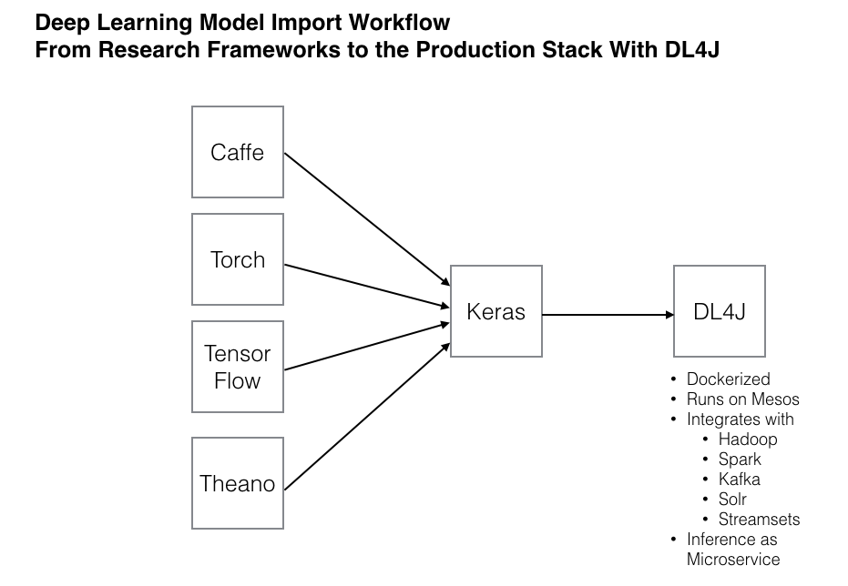

# Importing Models From Keras to Deeplearning4j

The `deeplearning4j-modelimport` module provides routines for importing neural network models originally configured
and trained using [Keras](https://keras.io/), a popular Python deep learning library that provides abstraction
layers on top of both [Theano](http://deeplearning.net/software/theano/) and [TensorFlow](https://www.tensorflow.org)
backends. You can learn more about saving Keras models on the Keras [FAQ Page](https://keras.io/getting-started/faq/#how-can-i-save-a-keras-model).

An `IncompatibleKerasConfigurationException` message indicates that you are attempting to import a Keras model configuration
that is not currently supported in Deeplearning4j (either because model import does not cover it, or DL4J does not implement the model, layer, or feature).

You can inquire further by visiting the [DL4J gitter channel](https://gitter.im/deeplearning4j/deeplearning4j). You
might consider filing a [feature request via Github](https://github.com/deeplearning4j/deeplearning4j/issues) so that
this missing functionality can be placed on the DL4J development roadmap or even sending us a pull request with the
necessary changes!

Check back for frequent updates to both the model import module *and* to this page!

## Available Methods

Using the Keras Model Import feature you have the following options. 

### Just the configuration of the Model

Be aware that not all models will be supported, it is our goal however to import the most useful and widely used networks.

To use this, you would save the model in Keras to a JSON file, and in DL4J you would create a new `MultiLayerConfiguration` by loading the saved model. The next steps would then be to train the model in Deeplearning4j.

## The Model Configuration and the Saved Weights from a Model Trained in Keras

In this case you would save both the JSON config and the weights from the trained model in Keras. 
In Deeplearning4j you would import both the model config and the weights, using modelimport.keras.Model.importSequentialModel and passing it both the config file path, and the path to the h5file that contains the weights. 

## Keras Model Import

Below is a [video tutorial](https://www.youtube.com/embed/bI1aR1Tj2DM) demonstrating working code to load a Keras model into Deeplearning4j and validating the working network. Instructor Tom Hanlon provides an overview of a simple classifier over Iris data built in Keras with a Theano backend, and exported and loaded into Deeplearning4j:

<iframe width="560" height="315" src="https://www.youtube.com/embed/bI1aR1Tj2DM" frameborder="0" allowfullscreen></iframe>

If you have trouble viewing the video, please click here to [view it on YouTube](https://www.youtube.com/embed/bI1aR1Tj2DM).

## Why Keras?

Keras is a layer of abstraction that sits atop Python libraries like Theano or Tensorflow, providing an easier to use interface for deep learning. 

To define a layer in a framework like Theano, you have to precisely define the weights, biases, activation functions and how your input data will be transformed into outputs. 
Moreover, you need to deal with backpropagation and updating those weights and biases. Keras wraps all that. It gives you prefab layers that encompass those calculations and updates.

With Keras, the only thing you define is the shape of the input, the shape of the output, and how you want to calculate the loss. Keras ensures that all the layers are the right size, and that the error gets backpropagated properly. It even does batching.

More information is also available [here](http://deeplearning4j.org/keras).

