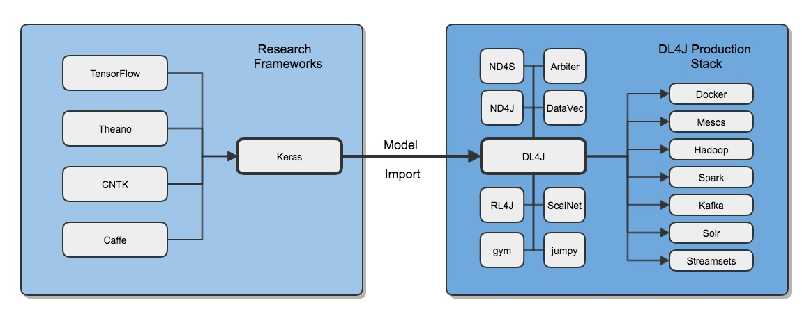

# Importing Models From Keras to Deeplearning4j

The `deeplearning4j-modelimport` module provides routines for importing neural network models originally configured
and trained using [Keras](https://keras.io/), a popular Python deep learning library that provides abstraction
layers on top of [TensorFlow](https://www.tensorflow.org), [Theano](http://deeplearning.net/software/theano/) and [CNTK](https://docs.microsoft.com/en-us/cognitive-toolkit/)
backends. You can learn more about saving Keras models on the Keras [FAQ Page](https://keras.io/getting-started/faq/#how-can-i-save-a-keras-model). Details about Deeplearning4j's [Python API using Keras](https://github.com/crockpotveggies/dl4j-examples/tree/keras-examples/dl4j-keras-examples) are through the link.



Once you have imported your model into DL4J, our full production stack is at your disposal. Please check [here](https://deeplearning4j.org/keras-supported-features) for a complete list of keras features supported through model import.

## Getting started: Keras Model Import Video

Below is a [video tutorial](https://www.youtube.com/embed/bI1aR1Tj2DM) demonstrating working code to load a Keras model into Deeplearning4j and validating the working network. Instructor Tom Hanlon provides an overview of a simple classifier over Iris data built in Keras with a Theano backend, and exported and loaded into Deeplearning4j:

<iframe width="560" height="315" src="https://www.youtube.com/embed/bI1aR1Tj2DM" frameborder="0" allowfullscreen></iframe>

If you have trouble viewing the video, please click here to [view it on YouTube](https://www.youtube.com/embed/bI1aR1Tj2DM).

## Configuring your IDE to have access to the `modelimport` classes

Edit your pom.xml adding the following dependency

```
<dependency>
    <groupId>org.deeplearning4j</groupId>
    <artifactId>deeplearning4j-modelimport</artifactId>
    <version>${dl4j.version}</version>
</dependency>
```

## Available Methods

Using the Keras Model Import feature you have the following options. Note that Keras has two types of networks, Sequential and Functional. Keras Sequential model is equivalent to DeepLeanring4J's MultiLayerNetwork. Keras functional model is equivalent to DeepLearning4J's Computation Graph.  

## Just the configuration of the Model

Be aware that not all models will be supported, it is our goal however to import the most useful and widely used networks.

To use this, you would save the model in Keras to a JSON file, the DeepLearning4J options available are.

* Sequential Model
* Sequential Model with updater to allow further training
* Functional Model
* Functional Model with updater for further training

### Show me the code

* Sequential Model Configuration import, saved in Keras with model.to_json()

```
MultiLayerNetworkConfiguration modelConfig = KerasModelImport.importKerasSequentialConfiguration("PATH TO YOUR JSON FILE)

```

* ComputationGraph Configuration import, saved in Keras with model.to_json()

```
ComputationGraphConfiguration computationGraphConfig = KerasModelImport.importKerasModelConfiguration("PATH TO YOUR JSON FILE)

```

## The Model Configuration and the Saved Weights from a Model Trained in Keras

In this case you would save both the JSON config and the weights from the trained model in Keras. The weights are saved in an H5 formatted file. In Keras you can save the weights and the model configuration into a single H5 file, or you can save the config in a separate file.

### Show me the code

* Sequential Model single file

```
MultiLayerNetwork network = KerasModelImport.importKerasSequentialModelAndWeights("PATH TO YOUR H5 FILE")

```

The network would be ready to use for inference by passing it input data, formatted, transformed, and normalized in the same manner that the original data was and calling network.output.

* Sequential Model one file for config one file for weights.


```
MultiLayerNetwork network = KerasModelImport.importKerasSequentialModelAndWeights("PATH TO YOUR JSON FILE","PATH TO YOUR H5 FILE")

```

## Additional Options

The model import feature includes an `enforceTrainingConfig` parameter.

If you want to import a pre-trained model only for inference, then you should set `enforceTrainingConfig=false`. Unsupported training-only configurations generate warnings but model import will proceed.

If you want to import a model for training and want to ensure the resulting model matches a trained Keras model as closely as possible, then you should set enforceTrainingConfig=true. In that case, unsupported training-only configurations will throw an `UnsupportedKerasConfigurationException` and stop model import.

## Troubleshooting
An `IncompatibleKerasConfigurationException` message indicates that you are attempting to import a Keras model configuration
that is not currently supported in Deeplearning4j (either because model import does not cover it, or DL4J does not implement the model, layer, or feature).

Once you have imported your model we recommend our own modelserializer class for further saving and reloading of your model.

You can inquire further by visiting the [DL4J gitter channel](https://gitter.im/deeplearning4j/deeplearning4j). You might consider filing a [feature request via Github](https://github.com/deeplearning4j/deeplearning4j/issues) so that this missing functionality can be placed on the DL4J development roadmap or even sending us a pull request with the necessary changes!

Check back for frequent updates to both the model import module *and* to this page!

## Popular Model Support

VGG16 and other pre-trained models are widely used for demonstration purposes and for retraining for a specific use case. We are proud to announce support for VGG16 import along with some helper functions to properly format and normalize data for ingest, and helper functions to convert the numeric output to labelled text classes.  

## DeepLearning4J Model Zoo

In addition to being able to import pre-trained Keras models, DeepLearning4j will actively add models to our own model zoo.


## Why Keras?

Keras is a layer of abstraction that sits atop Python libraries like Theano, Tensorflow CNTK, providing an easier to use interface for deep learning.

To define a layer in a framework like Theano, you have to precisely define the weights, biases, activation functions and how your input data will be transformed into outputs.
Moreover, you need to deal with backpropagation and updating those weights and biases. Keras wraps all that. It gives you prefab layers that encompass those calculations and updates.

With Keras, the only thing you define is the shape of the input, the shape of the output, and how you want to calculate the loss. Keras ensures that all the layers are the right size, and that the error gets backpropagated properly.

More information is also available [here](http://deeplearning4j.org/keras).
