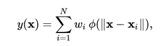

# A Beginner's Guide to Radial Basis Function Networks

A radial basis function (RBF) is a function that assigns a real value to each input from its domain (it is a real-value function), and the value produced by the RBF is always an absolute value; i.e. it is a measure of distance and cannot be negative. 

`f(x) = f(||x||)`

Euclidean distance, the straight-line distance between two points in Euclidean space, is typically used. 

<a href="https://docs.skymind.ai/docs/welcome" type="button" class="btn btn-lg btn-success" onClick="ga('send', 'event', ‘quickstart', 'click');">GET STARTED WITH RBF NETWORKS</a>

## Radial Basis Function Networks

Radial basis functions are used to approximate functions, much as [neural networks](./neuralnet-overview) act as function approximators. The following sum:

represents a radial basis function network. The radial basis functions act as activation functions. 

The approximant `f(x)` is differentiable with respect to the weights `W`, which are learned using iterative updater methods commong among neural networks.

### <a name="beginner">Other Machine Learning Tutorials</a>

* [Introduction to Neural Networks](./neuralnet-overview)
* [Deep Reinforcement Learning](./deepreinforcementlearning)
* [Symbolic AI and Deep Learning](./symbolicreasoning)
* [Using Graph Data with Deep Learning](./graphdata)
* [Recurrent Networks and LSTMs](./lstm)
* [Word2Vec: Neural Embeddings for NLP](./word2vec)
* [Restricted Boltzmann Machines](./restrictedboltzmannmachine)
* [Eigenvectors, Covariance, PCA and Entropy](./eigenvector)
* [Neural Networks & Regression](./logistic-regression)
* [Convolutional Networks (CNNs)](./convolutionalnets)
* [Open Datasets for Deep Learning](./opendata)
* [Inference: Machine Learning Model Server](./modelserver)

### Further Reading

* [Radial basis functions, multi-variable functional interpolation and adaptive networks (Technical report)](http://www.dtic.mil/cgi-bin/GetTRDoc?AD=ADA196234)
* [Universal Approximation Using Radial-Basis-Function Networks](http://www.mitpressjournals.org/doi/abs/10.1162/neco.1991.3.2.246)
