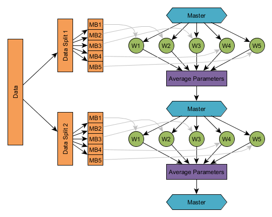

# Deeplearning4j on Spark

Deep learning is computationally intensive, so on very large datasets, speed matters. You can tackle the problem with faster hardware (usually GPUs), optimized code and some form of parallelism. 

Data parallelism shards large datasets and hands those pieces to separate neural networks, say, each on its own core. Deeplearning4j relies on Spark for this, training models in parallel and [iteratively averages](./iterativereduce.html) the parameters they produce in a central model. (Model parallelism, [discussed here by Jeff Dean et al](https://static.googleusercontent.com/media/research.google.com/en//archive/large_deep_networks_nips2012.pdf), allows models to specialize on separate patches of a large dataset without averaging.)

**Contents**

* [Overview](#overview)
* [How Distributed Network Training Occurs with DL4J on Spark](#how)
* [A Minimal Example](#minimal)
* [Configuring the TrainingMaster](#configuring)
* [Dependencies for Training on Spark](#dependencies)
* [Spark Examples Repository](#examples)
* [Configuring Memory for Spark on YARN](#memoryyarn)
    * [How Deeplearning4j (and ND4J) Manages Memory](#memory1)
    * [How YARN Manages Memory](#memory2)
    * [Configuring Memory for Deeplearning4j Spark Training on YARN](#memory3)
* [Using Kryo Serialization with Deeplearning4j](#kryo)
* [Using Intel MKL on Amazon Elastic MapReduce with Deeplearning4j](#mklemr)

## <a name="overview">Overview</a>

Deeplearning4j supports training neural networks on a Spark cluster, in order to accelerate network training.

Similar to DL4J's MultiLayerNetwork and ComputationGraph classes, DL4J defines two classes for training neural networks on Spark:

- SparkDl4jMultiLayer, a wrapper around MultiLayerNetwork
- SparkComputationGraph, a wrapper around ComputationGraph

Because these two classes are wrappers around the stardard single-machine classes, the network configuration process (i.e., creating a MultiLayerConfiguration or ComputationGraphConfiguration) is identical in both standard and distributed training. Distributed on Spark differs from local training in two respects, however: how data is loaded, and how training is set up (requiring some additional cluster-specific configuration).

The typical workflow for training a network on a Spark cluster (using spark-submit) is as follows.

1. Create your network training class. Typically, this will involve code for:
    * Specifying your network configuration (MultiLayerConfiguration or ComputationGraphConfiguration), as you would for single-machine training
    * Creating a TrainingMaster instance: this specifies how distributed training will be conducted in practice (more on this later)
    * Creating the SparkDl4jMultiLayer or SparkComputationGraph instance using the network configuration and TrainingMaster objects
    * Load your training data. There are a number of different methods of loading data, with different tradeoffs; further details will be provided in future documentation
    * Calling the appropriate ```fit``` method on the SparkDl4jMultiLayer or SparkComputationGraph instance
    * Saving or using the trained network (the trained MultiLayerNetwork or ComputationGraph instance)
2. Package your jar file ready for Spark submit
    * If you are using maven, running "mvn package -DskipTests" is one approach
3. Call Spark submit with the appropriate launch configuration for your cluster


**Note**: For single machine training, Spark local *can* be used with DL4J, though this is not recommended (due to the synchronization and serialization overheads of Spark). Instead, consider the following:

* For single CPU/GPU systems, use standard MultiLayerNetwork or ComputationGraph training
* For multi-CPU/GPU systems, use [ParallelWrapper](https://github.com/deeplearning4j/deeplearning4j/blob/master/deeplearning4j-core/src/main/java/org/deeplearning4j/parallelism/ParallelWrapper.java). This is functionally equivalent to running Spark in local mode, though has lower overhead (and hence provides better training performance). 

## <a name="how">How Distributed Network Training Occurs with DL4J on Spark</a>

The current version of DL4J uses a process of parameter averaging in order to train a network. Future versions may additionally include other distributed network training approaches.


The process of training a network using parameter averaging is conceptually quite simple:

1. The master (Spark driver) starts with an initial network configuration and parameters
2. Data is split into a number of subsets, based on the configuration of the TrainingMaster
3. Iterate over the data splits. For each split of the training data:
    * Distribute the configuration, parameters (and if applicable, network updater state for momentum/rmsprop/adagrad) from the master to each worker
    * Fit each worker on its portion of the split
    * Average the parameters (and if applicable, updater state) and return the averaged results to the master
4. Training is complete, with the master having a copy of the trained network

For example, the diagram below shows the parameter averaging process with 5 workers (W1, ..., W5) and a parameter averaging frequency of 1.
Just as with offline training, a training data set is split up into a number of subsets (generally known as minibatches, in the non-distributed setting); training proceeds over each split, with each worker getting a subset of the split. In practice, the number of splits is determined automatically, based on the training configuration (based on number of workers, averaging frequency and worker minibatch sizes - see configuration section).



## <a name="minimal">A Minimal Example</a>

This section shows the minimal set of components that you need in order to train a network on Spark.
Details on the various approaches to loading data are forthcoming.

```java
    JavaSparkContent sc = ...;
    JavaRDD<DataSet> trainingData = ...;
    MultiLayerConfiguration networkConfig = ...;

    //Create the TrainingMaster instance
    int examplesPerDataSetObject = 1;
    TrainingMaster trainingMaster = new ParameterAveragingTrainingMaster.Builder(examplesPerDataSetObject)
            .(other configuration options)
            .build();

    //Create the SparkDl4jMultiLayer instance
    SparkDl4jMultiLayer sparkNetwork = new SparkDl4jMultiLayer(sc, networkConfig, trainingMaster);

    //Fit the network using the training data:
    sparkNetwork.fit(trainingData);
```

## <a name="configuring">Configuring the TrainingMaster</a>

A TrainingMaster in DL4J is an abstraction (interface) that allows for multiple different training implementations to be used with SparkDl4jMultiLayer and SparkComputationGraph. 

Currently DL4J has one implementation, the ParameterAveragingTrainingMaster. This implements the parameter averaging process shown in the image above.
To create one, use the builder pattern:

```java
    TrainingMaster tm = new ParameterAveragingTrainingMaster.Builder(int dataSetObjectSize)
            ... (your configuration here)
            .build();
```

The ParameterAveragingTrainingMaster defines a number of configuration options that control how training is executed:

* **dataSetObjectSize**: Required option. This is specified in the builder constructor. This value specifies how many examples are in each DataSet object. As a general rule,
    * If you are training with pre-processed DataSet objects, this will be the size of those preprocessed DataSets
    * If you are training directly from Strings (for example, CSV data to a ```RDD<DataSet>``` though a number of steps) then this will usually be 1
* **batchSizePerWorker**: This controls the minibatch size for each worker. This is analagous to the minibatch size used when training on a single machine. Put another way: it is the number of examples used for each parameter update in each worker.
* **averagingFrequency**: This controls how frequently the parameters are averaged and redistributed, in terms of number of minibatches of size batchSizePerWorker. As a general rule:
    * Low averaging periods (for example, averagingFrequency=1) may be inefficient (too much network communication and initialization overhead, relative to computation)
    * Large averaging periods (for example, averagingFrequency=200) may result in poor performance (parameters in each worker instance may diverge significantly)
    * Averaging periods in the range of 5-10 minibatches is usually a safe default choice.
* **workerPrefetchNumBatches**: Spark workers are capable of asynchorously prefetching a number of minibatches (DataSet objects), to avoid waiting for the data to be loaded.
    * Setting this value to 0 disables prefetching.
    * A value of 2 is often a sensible default. Much larger values are unlikely to help in many circumstances (but will use more memory)
* **saveUpdater**: In DL4J, training methods such as momentum, RMSProp and AdaGrad are known as 'updaters'. Most of these updaters have internal history or state.
    * If saveUpdater is set to true: the updater state (at each worker) will be averaged and returned to the master along with the parameters; the current updater state will also be distributed from the master to the workers. This adds extra time and network traffic, but may improve training results.
    * If saveUpdater is set to false: the updater state (at each worker) is discarded, and the updater is reset/reinitialized in each worker.
* **repartition**: Configuration setting for when data should be repartitioned. The ParameterAveragingTrainingMaster does a mapParititons operation; consequently, the number of partitions (and, the values in each partition) matters a lot for proper cluster utilization. However, repartitioning is not a free operation, as some data necessarily has to be copied across the network. The following options are available:
    * Always: Default option. That is, repartition data to ensure the correct number of partitions
    * Never: Never repartition the data, no matter how imbalanced the partitions may be.
    * NumPartitionsWorkersDiffers: Repartition only if the number of partitions and the number of workers (total number of cores) differs. Note however that even if the number of partitions is equal to the total number of cores, this does not guarantee that the correct number of DataSet objects is present in each partition: some partitions may be much larger or smaller than others.
* **repartitionStrategy**: Strategy by which repartitioning should be done
    * SparkDefault: This is the stardard repartitioning strategy used by Spark. Essentially, each object in the initial RDD is mapped to one of N RDDs independently at random. Consequently, the partitions may not be optimally balanced; this can be especially problematic with smaller RDDs, such as those used for preprocessed DataSet objects and frequent averaging periods (simply due to random sampling variation).
    * Balanced: This is a custom repartitioning strategy defined by DL4J. It attempts to ensure that each partition is more balanced (in terms of number of objects) compared to the SparkDefault option. However, in practice this requires an additional count operation to execute; in some cases (most notably in small networks, or those with a small amount of computation per minibatch), the benefit may not outweigh additional overhead of executing the better repartitioning.   
    


## <a name="dependencies">Dependencies for Training on Spark</a>

To use DL4J on Spark, you'll need to include the deeplearning4j-spark dependency:

```
        <dependency>
        <groupId>org.deeplearning4j</groupId>
        <artifactId>dl4j-spark_${scala.binary.version}</artifactId>
        <version>${dl4j.version}</version>
        </dependency>
```

Note that the ```_${scala.binary.version}``` should be ```_2.10``` or ```_2.11``` and should match the version of Spark you are using. 


## <a name="examples">Spark Examples Repository</a>

The [Deeplearning4j examples repo](https://github.com/deeplearning4j/dl4j-examples) ([old examples here](https://github.com/deeplearning4j/dl4j-spark-cdh5-examples)) contains a number of Spark examples.


## <a name="memoryyarn">Configuring Memory for Spark on YARN</a>

Apache Hadoop YARN is a commonly used resource manager for Hadoop clusters ([Apache Mesos](http://mesos.apache.org/) being an alternative).
When submitting a job to a cluster via Spark submit, it is necessary to specify a small number of configuration options, such as the number of executors, the number of cores per executor and amount of memory for each executor.

To get the best performance out of DL4J when training on Spark (and to avoid exceeding memory limits), some additional memory configuration is required. This section explains why this is necessary, and how to do it in practice.

### <a name="memory1">How Deeplearning4j (and ND4J) Manages Memory</a>

Deeplearning4j is built upon the numerical computing library ND4J. The neural network implementations in DL4J are built using the matrix and vector operations in ND4J.

One key design aspect of ND4J is the fact that it utilizes off-heap memory management. This means that the memory allocated for INDArrays by ND4J is not allocated on on the JVM heap (as a standard Java object would be); instead, it is allocated in a separate pool of memory, outside of the JVM. This memory management is implemented using [JavaCPP](https://github.com/bytedeco/javacpp).

Off-heap memory management provides a number of benefits.
Most notably, it allows for efficient use of high-performance native (c++) code for numerical operations (using BLAS libraries such as OpenBLAS and Intel MKL, as well as the C++ library [Libnd4j](https://github.com/deeplearning4j/libnd4j)). Off-heap memory management is also necessary for efficient GPU operations with CUDA. If memory was allocated on the JVM heap (as it is in some other JVM BLAS implementations), it would be necessary to first copy the data from the JVM, perform the operations, and then copy the result back - adding both a memory and time overhead to each operation. Instead, ND4J can simply pass pointers around for numerical operations - entirely avoiding the data copying issue.

The important point here is that the on-heap (JVM) memory and off-heap (ND4J/JavaCPP) are two separate memory pools. It is possible to configure the size of each independently; by default, JavaCPP will allow the off-heap memory allocation to grow as large as the Runtime.maxMemory() setting (see: [code](https://github.com/bytedeco/javacpp/blob/master/src/main/java/org/bytedeco/javacpp/Pointer.java)) - this default is essentially equivalent to the size of the JVM 'Xmx' memory setting, used for configuring Java memory.

To manually control the maximum amount of off-heap memory that JavaCPP can allocate, we can set the ```org.bytedeco.javacpp.maxbytes``` system property. For a single JVM run locally, we would pass ```-Dorg.bytedeco.javacpp.maxbytes=1073741824``` to limit the off-heap memory allocation to 1GB. We will see how to configure this for Spark on YARN in a later section.


### <a name="memory2">How YARN Manages Memory</a>

As noted, YARN is a cluster resource manager. When submitting a compute task (such as DL4J Spark network training) to a YARN-managed cluster, it is YARN that is responsible for managing the allocation of a limited pool of resources (memory, CPU cores) to your job (and all other jobs). For more details on YARN and resource allocation, see [this](http://blog.cloudera.com/blog/2015/09/untangling-apache-hadoop-yarn-part-1/) and [this](http://blog.cloudera.com/blog/2015/03/how-to-tune-your-apache-spark-jobs-part-2/).


The key points for our purposes are as follows:

* YARN jobs run in containers, with a fixed amount of memory for each
* The amount of memory allocated to a YARN container is the sum of the on-heap (i.e., JVM memory size) and off-heap ("memory overhead" in YARN terms) memory requested by the user
* If a task exceeds the amount of memory available allocated to the container, YARN may kill the container, and hence the executor running in it. The exact behaviour will depend on the YARN configuration.
* Programs that exceed the container memory limits usually do so due to off-heap memory; the maximum amount of on-heap (JVM) memory is fixed as a launch parameter via Spark submit.


There are two key configuration options for controlling how much memory YARN will allocate to a container.

1. ```spark.executor.memory```: This is the standard JVM memory allocation. It is analogous to the Xmx setting for a single JVM.
2. ```spark.yarn.executor.memoryOverhead```: This is  the amount of 'extra' memory allocated to the container. It is not allocated to the JVM, and hence is available for code that utilizes off-heap memory (including ND4J/JavaCPP).

By default, the ```spark.yarn.executor.memoryOverhead``` setting is equal to 10% of the executor memory, with a minimum of 384 MB.
For more details, see the [Apache Spark documentation for YARN](http://spark.apache.org/docs/latest/running-on-yarn.html).

Because of the extensive use of off-heap memory by ND4J, it is generally necessary to increase the memory overhead setting when training on Spark.


### <a name="memory3">Configuring Memory for Deeplearning4j Spark Training on YARN</a>

To recap the previous sections, when running distributed neural network training on Spark via YARN, it is necessary to do the following:

1. Specify the executor JVM memory amount, using ```spark.executor.memory```
2. Specify the YARN container memory overhead, using ```spark.yarn.executor.memoryOverhead```
3. Let ND4J/JavaCPP know how much off-heap memory it is allowed to use, using the ```org.bytedeco.javacpp.maxbytes``` system property

When setting these values, there are some things to keep in mind.
First, the sum of ```spark.executor.memory``` and ```spark.yarn.executor.memoryOverhead``` must be less than the maximum amount of memory that YARN will allocate to a single container. You can generally find this limit in the YARN configuration or YARN resource manager web UI. If you exceed this limit, YARN is likely to reject your job.

Second, the value for ```org.bytedeco.javacpp.maxbytes``` should be strictly less than ```spark.yarn.executor.memoryOverhead```. Recall by default the memoryOverhead setting is 10% of the executor memory - this is because the JVM itself (and possibly other libraries) may require some off-heap memory. Consequently, we don't want JavaCPP to use up the entire non-JVM allocation of memory.  

Third, because DL4J/ND4J makes use off-heap memory for data, parameters and activations, we can afford to allocate less to the JVM (i.e., executor.memory) than we might otherwise do. Of course, we still require enough JVM memory for Spark itself (and any other libraries we are using), so we don't want to reduce this too much.

Here's an example. Suppose we are running Spark training, and want to configure our memory as follows:

* 4 executors, 8 cores each
* Maximum container memory allocatable by YARN: 11GB
* JVM (executors and driver) memory: 4GB
* ND4J/JavaCPP off-heap memory (executors and driver): 5GB
* Extra off-heap memory: 1GB

The total off-heap memory is 5+1=6GB; the total memory (JVM + off-heap/overhead) is 4+6=10GB, which is less than the YARN maximum allocation of 11GB. Note that the JavaCPP memory is specified in bytes, and 5GB is 5,368,709,120 bytes; YARN memory overhead is specified in MB, and 6GB is 6,144MB.

The arguments for Spark submit would be specified as follows:

```
--class my.class.name.here --num-executors 4 --executor-cores 8 --executor-memory 4G --driver-memory 4G --conf "spark.executor.extraJavaOptions=-Dorg.bytedeco.javacpp.maxbytes=5368709120" --conf "spark.driver.extraJavaOptions=-Dorg.bytedeco.javacpp.maxbytes=5368709120" --conf spark.yarn.executor.memoryOverhead=6144
```


## <a name="kryo">Using Kryo Serialization with Deeplearning4j</a>

Kryo is a serialization library commonly used with Apache Spark. It proposes to increase performance by reducing the amount of time taken to serialize objects.
However, Kryo has difficulties working with the off-heap data structures in ND4J. To use Kryo serialization with ND4J on Apache Spark, it is necessary to set up some extra configuration for Spark.
If Kryo is not correctly configured, it is possible to get NullPointerExceptions on some of the INDArray fields, due to incorrect serialization.

To use Kryo, add the appropriate [nd4j-kryo dependency](http://search.maven.org/#search%7Cga%7C1%7Cnd4j-kryo) and configure the Spark configuration to use the Nd4j Kryo Registrator, as follows:

```
    SparkConf conf = new SparkConf();
    conf.set("spark.serializer", "org.apache.spark.serializer.KryoSerializer");
    conf.set("spark.kryo.registrator", "org.nd4j.Nd4jRegistrator");
```

Note that when using Deeplearning4j's SparkDl4jMultiLayer or SparkComputationGraph classes, a warning will be logged if the Kryo configuration is incorrect.

## <a name="mklemr">Using Intel MKL on Amazon Elastic MapReduce with Deeplearning4j</a>

Releases of DL4J available on Maven Cental are distributed with OpenBLAS. Thus this section does not apply to users who are using using versions of Deeplearning4j on Maven Central.

If DL4J is built from source with Intel MKL as the BLAS library, some additional configuration is required to make this work on Amazon Elastic MapReduce.
When creating a cluster in EMR, to use Intel MKL it is necessary to provide some additional configuration.

Under the Create Cluster -> Advanced Options -> Edit Software Settings, add the following:

```
[
    {
        "Classification": "hadoop-env", 
        "Configurations": [
            {
                "Classification": "export", 
                "Configurations": [], 
                "Properties": {
                    "MKL_THREADING_LAYER": "GNU",
                    "LD_PRELOAD": "/usr/lib64/libgomp.so.1"
                }
            }
        ],
        "Properties": {}
    }
]
```


## Resources

* [Deeplearning4j Examples Repo](https://github.com/deeplearning4j/dl4j-examples)
* ND4S: [N-Dimensional Arrays for Scala](https://github.com/deeplearning4j/nd4s)
* [ND4J, Scala & Scientific Computing](http://nd4j.org/scala.html)
* [Intro to Iterative Reduce](./iterativereduce)
