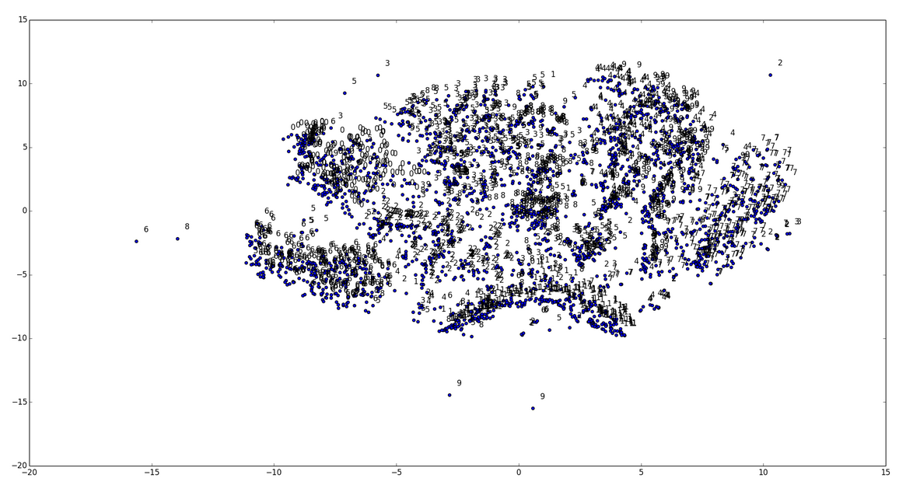
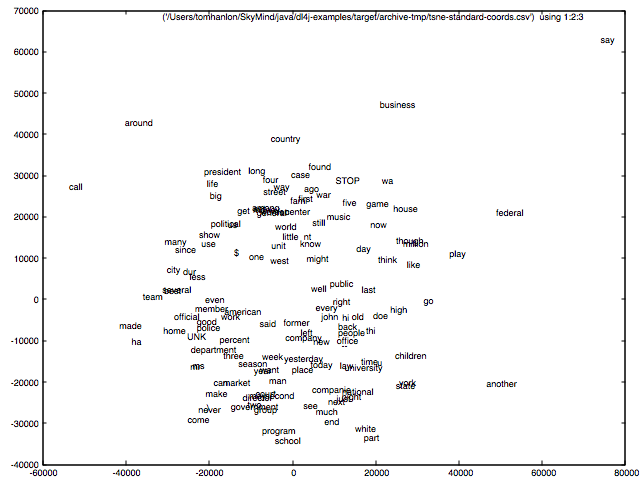

# t-SNE's Data Visualization

[t-Distributed Stochastic Neighbor Embedding](http://homepage.tudelft.nl/19j49/t-SNE.html) (t-SNE) is a data-visualization tool created by Laurens van der Maaten at Delft University of Technology. 

While it can be used for any data, t-SNE (pronounced Tee-Snee) is only really meaningful with labeled data, which clarify how the input is clustering. Below, you can see the kind of graphic you can generate in DL4J with t-SNE working on [MNIST data](http://deeplearning4j.org/deepbeliefnetwork.html). 

Look closely and you can see the numerals clustered near their likes, alongside the dots. 

Here's how t-SNE appears in Deeplearning4j code. 
<pre><code class="language-java">
import org.datavec.api.util.ClassPathResource;
import org.deeplearning4j.berkeley.Pair;
import org.deeplearning4j.models.embeddings.inmemory.InMemoryLookupTable;
import org.deeplearning4j.models.embeddings.loader.WordVectorSerializer;
import org.deeplearning4j.models.word2vec.wordstore.VocabCache;
import org.deeplearning4j.plot.BarnesHutTsne;
import org.nd4j.linalg.api.buffer.DataBuffer;
import org.nd4j.linalg.api.ndarray.INDArray;
import org.nd4j.linalg.factory.Nd4j;
import org.slf4j.Logger;
import org.slf4j.LoggerFactory;

import java.io.File;
import java.util.ArrayList;
import java.util.List;

/**
 * Created by agibsonccc on 9/20/14.
 *
 * Dimensionality reduction for high-dimension datasets
 */
public class TSNEStandardExample {

    private static Logger log = LoggerFactory.getLogger(TSNEStandardExample.class);

    public static void main(String[] args) throws Exception  {
        int iterations = 100;
        Nd4j.dtype = DataBuffer.Type.DOUBLE;
        Nd4j.factory().setDType(DataBuffer.Type.DOUBLE);
        List<String> cacheList = new ArrayList<>();

        log.info("Load & Vectorize data....");
        File wordFile = new ClassPathResource("words.txt").getFile();
        Pair<InMemoryLookupTable,VocabCache> vectors = WordVectorSerializer.loadTxt(wordFile);
        VocabCache cache = vectors.getSecond();
        INDArray weights = vectors.getFirst().getSyn0();

        for(int i = 0; i < cache.numWords(); i++)
            cacheList.add(cache.wordAtIndex(i));

        log.info("Build model....");
        BarnesHutTsne tsne = new BarnesHutTsne.Builder()
                .setMaxIter(iterations).theta(0.5)
                .normalize(false)
                .learningRate(500)
                .useAdaGrad(false)
//                .usePca(false)
                .build();

        log.info("Store TSNE Coordinates for Plotting....");
        String outputFile = "target/archive-tmp/tsne-standard-coords.csv";
        (new File(outputFile)).getParentFile().mkdirs();
        tsne.plot(weights,2,cacheList,outputFile);
    }

}

</code></pre> 

Here is an image of the tsne-standard-coords.csv file plotted using gnuplot.

<!-- was this??

-->
