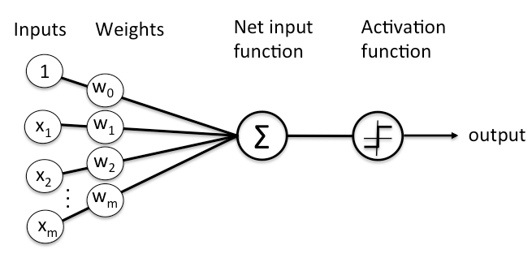
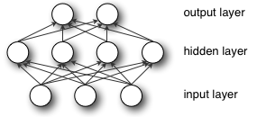
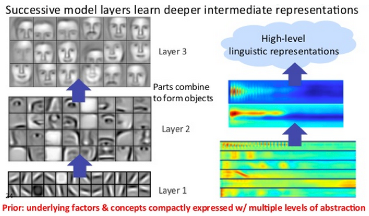
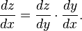
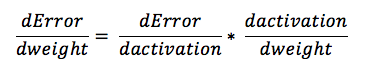
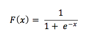

# 深度神经网络简介

目录

* <a href="#define">神经网络的定义</a>
* <a href="#element">神经网络的要素</a>
* <a href="#concept">深度神经网络的重要概念</a>
* <a href="#forward">示例：前馈网络与反向传播</a>
* <a href="#regression">多元线性回归分析</a>
* <a href="#logistic">逻辑回归与分类器</a>
* <a href="#ai">神经网络与人工智能</a>
* <a href="#intro">其他教程资源</a>

## <a name="define">神经网络的定义</a>

神经网络是一组大致模仿人类大脑构造设计的算法，用于识别模式。神经网络通过机器感知系统解释传感器数据，对原始输入进行标记或聚类。神经网络所能识别的模式是包含在向量中的数值形式，因此图像、声音、文本、时间序列等一切现实世界的数据必须转换为数值。 

神经网络帮助我们进行聚类和分类。可以将其理解为建立在你所存储和管理的数据之上的一个聚类与分类层。对于未标记的数据，神经网络可以按照输入样例的相似之处将数据分组；若能用已标记的数据集定型，神经网络就可以对数据进行系统分类。（更准确地说，神经网络提取特征，再输入其他算法进行聚类和分类；因此可以将深度神经网络视为更大的机器学习应用系统的一部分，这个系统中还包括[强化学习](./reinforcementlearning.html)、分类和[回归分析](./linear-regression.html)的算法。)

<a href="./zh-quickstart" class="btn btn-custom" onClick="ga('send', 'event', ‘quickstart', 'click');">快速入门指南</a>

思考深度学习能够解决怎样的问题时，不妨先自问：我关注的是哪些类别？哪些信息可以作为我的行动依据？这两个问题的回答就是可以赋予数据的标签：`垃圾邮件`或`非垃圾邮件`、`好人`或`坏人`、`愤怒的客户`或`高兴的客户`。然后再问：有没有能和这些标签匹配的数据？能否找到已标记的数据，或者创建一个带标签的数据集（利用Mechanical Turk或Crowdflower一类的服务），用来让算法学习标签与输入之间的关联？

举例而言，如果你要识别癌症高危人群，所需的定型数据集可以是一份癌症病人和健康人的名单，包括与个人身份号码相关联的所有数据，既有年龄、是否吸烟等明显特征，也包括记录动作的时间序列或网络行为记录等原始数据，这些数据或许能揭示出大量有关生活方式、习惯、兴趣和风险的信息。 

你可以用这一数据集定型一个神经网络，将这些人分为癌症病人和健康人两个类别，再将分类模型应用于癌症风险未知的人，以此预测新病人的癌症风险，对有风险的患者加强关注和预防治疗。 

无论你要找的是合适的相亲对象、棒球联赛的明日之星、一家企业最有潜力的员工，还是演技差的演员，基本流程都大致相同：收集人口统计、社交图谱、原始通讯文本、点击流等各种数据，创建一个定型数据集，随后将不同类型的数据进行比较，以此揭示出模式，发现目标个体。 

## <a name="element">神经网络的要素</a>

深度学习系统指一系列由多个层堆叠组成的特定神经网络。每一层则由节点构成。运算在节点中进行，节点的运作模式与人类的神经元大致相似，遇到足够的刺激信息时就会激活并释放信号。节点将输入数据与一组系数（或称权重）结合，通过放大或抑制输入来指定其在算法学习任务中的重要性。输入数据与权重的乘积之和将进入节点的激活函数，判定信号是否继续在网络中传递，以及传递的距离，从而决定信号如何影响网络的最终结果，例如分类动作。 

以下是单个节点的示意图。

节点层是一行类似神经元的开关，在输入数据通过网络时开启或关闭。从最初接收数据的第一个输入层开始，每一层的输出同时也是下一层的输入。  

我们将输入特征与可调整的权重匹配，由此指定这些特征的重要性，即它们对网络的输入分类和聚类方式有多大程度的影响。 

## <a name="concept">深度神经网络的重要概念</a>

顾名思义，深度学习网络与更常见的单一隐藏层神经网络的区别在于**深度**，即数据在模式识别的多步流程中所经过的节点层数。 

传统机器学习系统主要使用由一个输入层和一个输出层组成的浅层网络，至多在两层之间添加一个隐藏层。三层以上（包括输入和输出层在内）的系统就可以称为“深度”学习。所以，深度是一个有严格定义的术语，表示一个以上的隐藏层。 

在深度学习网络中，每一个节点层在前一层输出的基础上学习识别一组特定的特征。随着神经网络深度增加，节点所能识别的特征也就越来越复杂，因为每一层会整合并重组前一层的特征。 

这被称为**特征层次结构**，复杂度与抽象度逐层递增。这种结构让深度学习网络能处理大规模高维度数据集，进行数十亿个参数的[非线性函数](./glossary.html#nonlineartransformfunction)运算。 

最重要的是，深度学习网络可以发现**未标记、非结构化数据**中的潜在结构，而现实世界中的数据绝大多数都属于这一类型。非结构化数据的另一名称是*原始媒体*，即图片、文本、音视频文件等。因此，深度神经网络最擅长解决的一类问题就是对现实中各类未标记的原始媒体进行处理和聚类，在未经人工整理成关系数据库的数据中，甚至是尚未命名的数据中识别出相似点和异常情况。 

例如，深度学习网络可以处理一百万张图片，根据其相似之处进行聚类：一个角落是猫的图片，一个角落是破冰船的图片，还有一个角落都是你祖母的照片。这就是所谓智能相册的基础。 

同样的原理还可以应用于其他数据类型：深度学习可以对电子邮件或新闻报道等原始文本进行聚类。通篇都是愤怒投诉的邮件可以聚集到向量空间的一个角落，而客户的满意评价或者垃圾邮件则可以聚集到别的角落。这就是各类信息过滤器的基础，也可以用于客户关系管理（CRM）。这对于语音消息同样适用。 
如果使用时间序列，数据可以按正常/健康行为或异常/危险行为进行聚类。由智能手机生成的时间序列数据可以用于洞悉用户的健康状况和生活习惯；而由汽车零部件产生的时间序列数据则可以用来预防严重故障。  

与多数传统的机器学习算法不同，深度学习网络可以进行**自动特征提取**，而无需人类干预。由于特征提取是需要许多数据科学家团队多年时间才能完成的任务，深度学习可以用于缓解专家人数不足造成的瓶颈。较小的数据科学家团队原本难以实现规模化，而深度学习可以增强他们的力量。 

用未标记数据定型时，深度神经网络的每一节点层会自动学习识别特征，方法是反复重构输入的样本，让网络猜测结果与输入数据自身几率分布之间的差异最小化。例如，受限玻尔兹曼机就以这种方式进行所谓的重构。  

深度神经网络通过这一过程学习识别具体相关特征和理想结果之间的关联－它们在特征信号与特征所代表的含义之间建立联系，可以是完全重构，也可以利用已标记的数据。 

深度学习网络用已标记数据定型后即可用于处理非结构化数据，所以这类网络所能适应的输入大大多于普通的机器学习网络。这对于提高性能大有帮助：网络定型所用的数据越多，网络的准确度就越高。（较差的算法经过大量数据定型后的表现可超过仅用很少数据定型的较好算法。）处理并学习大量未标记数据的能力是深度学习网络超越以往算法的独特优势。 

深度学习网络最终有一个输出层：一个逻辑或softmax分类器，用于指定某一种特定结果或标签的可能性。我们称之为预测，但这是广义上的预测。比方说，对一个深度学习网络输入图像形式的原始数据，网络可能会判定输入数据代表一个人的可能性是90%。 

## <a name="forward">示例：前馈网络</a>

我们使用神经网络的目的是以尽可能快的速度实现误差最小化。这是一场赛跑，这场赛跑在环形跑道上进行，所以每一圈都会重复经过跑道上相同的点。起跑线也就是权重的初始化状态，而终点线则是系统能够产生准确分类和预测时的参数状态。 

赛跑要跑许多步，每一步都与前后的步伐相似。和赛跑选手一样，我们会重复同个动作，直至最后抵达终点线。神经网络的每一步都要进行猜测，衡量误差，并且对权重进行微调，即逐渐调整系数。 

一组权重，无论是处于初始还是最终状态，也称为一个模型，因为它是对于数据和实际基准（ground-truth）标签之间关系的模拟，目的是确定数据的结构。模型一开始通常表现不佳，随着神经网络调整参数而逐步改善，最终获得更好的效果。 

这是因为神经网络的最初状态是无知的。网络并不知道怎样的权重和偏差最为恰当，可以让输入数据转换为正确的预测。网络必须由猜测开始，连续不断地从自己的错误中学习，逐步提高猜测的准确度。（你可以认为神经网络运用了测试假设并再度尝试的科学方法－只不过是在“摸黑”运用这种方法。）

下面我们简要介绍一下结构最简单的前馈神经网络的学习机制。

输入数据进入网络。系数或权重将输入映射至网络最终得到的一组猜测结果。 

    输入 * 权重 = 猜测值

输入加权后得到有关于输入是什么的猜测结果。神经网络随后将猜测结果与数据的实际基准进行比较，等于是在问一位专家“我猜得对不对？” 

    实际基准 - 猜测值 = 误差

网络猜测结果与实际基准之差便是猜测的*误差*。网络衡量误差，将其反向传递至模型，根据权重对于误差的影响大小来调整权重。 

    误差 * 权重对于误差的影响 = 调整幅度

以上三个伪数学公式解释了神经网络的三大关键功能：输入计分、计算误差、更新模型－随后重复这三个步骤。神经网络是一种纠正性反馈循环，奖励有助于正确猜测的权重，惩罚导致猜测错误的权重。

下面将具体介绍第一个步骤。

### <a name="multiple">多元线性回归分析</a>

虽然人工神经网络这个名字来源于生物学，但其实质无非是数学运算和程序代码，就像其他机器学习算法一样。事实上，只要理解*线性回归*这一统计学中的基本方法，就能理解神经网络的运作原理。线性回归的最简表示方式是：

        Y_hat = bX + a

其中`Y_hat`是估测的输出，X是输入，b是斜率，a是一条直线在二维图像平面纵轴上的截距。（用更具体的例子说明：X可以是辐射照射量，Y可以是癌症风险；X可以是每天做俯卧撑的次数，Y是你能卧推的总重量；X可以是肥料的使用量，Y可以是农作物的大小。）可以想象，每当X增加一个单位时，不论在X轴上的距离有多远，应变量Y都会按比例增加。两个变量同步上下移动的简单关系是起点。 

下一步是想象多元线性回归，它有多个输入变量，一个输出变量。多元线性回归通常表示为以下形式：

        Y_hat = b_1*X_1 + b_2*X_2 + b_3*X_3 + a

（借用前文农作物的例子，可以在肥料这一变量之外增加日照、降水量，所有三个变量都会影响`Y_hat`。）

这种形式的多元线性回归在神经网络的每个节点发生。对于单个层内的每一节点，上一层内每个节点的输入都与所有其他节点的输入重新组合。也就是说，输入按照各自的系数以不同比例混合，而系数在进入下一层的每个节点时会有所改变。网络在减少误差的过程中用这种方式测试何种输入的组合具有意义。 

节点输入在相加得到`Y_hat`之前，还会经过一个非线性函数。其原因在于：如果每个节点都只进行多元线性回归运算，`Y_hat`将随X的增加而无限增大，这并不符合我们的目的。 

每个节点所要实现的功能相当于一个开关（就像神经元一样……），其开关状态取决于是否应当让输入信号通过并对网络的最终判定结果产生影响。 

每个开关也就是一个分类问题。对于输入的信号，节点应当将其归为足够还是不够，开还是关？二元判定可以用1和0表示，使用[逻辑回归](#logistic)这种非线性函数可以挤压输入，将其转换至0到1的区间内。 

每个节点的非线性变换通常使用与逻辑回归相似的S型函数。这类函数被称为sigmoid（希腊字母“S”的读音）、tanh、hard tanh等，用于调整每个节点的输出。每个节点的输出均被挤压至0到1之间的s形空间内，随后作为输入传递至前馈神经网络的下一个层，如此不断推进，直至网络进行判定的最终层。 

### 梯度下降

“梯度下降”是一种常用的权重优化函数，根据权重造成的误差来调整权重。 

梯度即是斜率。对x-y坐标系图像而言，斜率通常代表了两个变量之间的关联：纵向距离与横向距离之比、金额变化与时间变化之比等。在这个具体的例子中，我们所关注的斜率描述了网络误差与单个权重之间的关系，亦即：权重调整时，误差会如何变化。 

具体的问题包括，哪些权重产生的误差最少？哪些权重能正确表示输入数据所包含的信号，并且将其转换为正确的分类？哪些权重能辨别出输入图像中的“噪声”，知道应该把图像标记为人脸而非煎锅？

神经网络在学习过程中会慢慢调整许多权重，直至能够正确地将信号映射至含义。网络*误差*与每个*权重*之间的关系是一个导数：*dE/dw*，它衡量的是权重微调后误差的变化程度。 

每个权重仅是深度网络中的一个因数，整个网络包括许多变换；权重的信号会经过多个层的激活与求和运算，所以我们使用[微积分链式法则](https://en.wikipedia.org/wiki/Chain_rule)沿网络的激活函数和输出反向传递，最终发现关键的权重及其与总体误差之间的关系。 

微积分的链式法则公式如下： 

在前馈网络中，网络误差与单一权重的关系可以用以下方法表示：

亦即，*误差*和*权重*这两个给定的变量之间存在第三个变量*激活值*作为中介，权重通过中介变量传递。如要计算*权重*变化对于*误差*变化的影响，可以先计算*激活值*变化对于*误差*变化的影响，以及*权重*变化如何影响*激活值*的变化。  

深度学习的实质无非如此：根据模型产生的误差调整模型中的诸多权重，直到误差不能再减少为止。 

## <a name="logistic">逻辑回归</a>

对于多层的深度神经网络，最后一个层有着独特的作用。在处理已标记的输入时，输出层会对每个样例进行分类，添加最有可能与之匹配的标签。输出层上的每个节点都代表一个标签，节点根据其从上一层输入和参数中接收到的信号强度来决定开关。 

每个节点都有两种可能的结果，即二进制输出值0或1，因为[输入变量要么与标签匹配，要么不匹配](https://en.wikipedia.org/wiki/Law_of_excluded_middle)。毕竟，世界上不存在“稍微有点怀孕”这种事。  

处理已标记数据的神经网络生成的是二进制输出，然而网络接收的输入数据通常是连续的。也就是说，网络接收到的输入信号通常会涵盖较大范围的值，包含许多种指标，具体取决于网络所要解决的问题。 

例如，推荐引擎必须决定是否显示一个广告，这是一种二元判定。但是引擎判定所依赖的输入可能包括客户上周在亚马逊网站上的消费金额，或者客户访问网站的频率等。 

于是，输出层就必须将“花67.59美元购买尿布”、“访问网站15次”这样的信号压缩至0到1的区间内，亦即特定输入应当被标记的概率。 

用于将连续信号转换为二进制输出的机制称为逻辑回归。逻辑回归名不副实，因为它的用途是分类，而非大多数人所熟悉的线性回归分析。逻辑回归用于计算一组输入与标签相匹配的概率。  

我们看一看这个简单的公式。 

连续输入如果要用概率的形式表示，就必须输出正的结果，因为不存在负概率。正因为如此，输入在公式里是分母中*e*的指数－因为指数后的运算结果必定大于零。接下来再看*e*的指数与分数1/1的关系。我们知道，概率的最大值是一，如果超过一，则必然得出荒唐的结果。（对此我们120%肯定。） 

触发标签的输入*x*增加时，*e的负x次幂*会逐渐趋于零，函数的结果则趋向1/1，即100%，意味着我们越来越接近（但并不会达到）确定标签绝对匹配的状态。与输出负相关的输入作为*e*的指数时会被负号转换成正数，所以随着负信号不断增加，*e的负x次幂*也会增大，使整个分数更趋向于零。 

现在试想指数不再是*x*，而是所有权重与其对应输入的乘积的总和－在网络中传递的信号总和。这就是输入神经网络分类器输出层的逻辑回归层的数据。

我们可以为这个层设置判定的标准，高于标准的样例标记为1，低于标准则不予标记。你可以按照需要自行设定不同的标准－标准过低会增加取伪错误的数量，标准过高会增加弃真错误的数量－具体取决于你更能容忍哪一类的错误。 

## <a name="ai">神经网络与人工智能</a>

在有些领域内，神经网络被视为“蛮力型”人工智能，因为这类系统最开始都是白纸一张，随后再一步一步打造出一个准确的模型。神经网络很有效，但有些人认为这种建模方法效率低下，不能对输出与输入之间的函数依赖性进行假设。 

话虽如此，梯度下降其实并不需要将每个权重都与其他所有权重重组才能发现最佳组合－梯度下降的寻路算法会压缩相关的权重空间，进而使所需的更新次数以及运算量减少许多个数量级。 

## <a name="intro">其他教程资源</a>

以下教程和视频对前馈网络的基本概念进行了简明易懂的介绍，供刚开始了解深度学习的读者参考：

* [受限玻尔兹曼机](./zh-restrictedboltzmannmachine)
* [本征向量、PCA、协方差和熵](./zh-eigenvector)
* [深度学习和神经网络词汇表](./glossary.html)
* [卷积网络教程](./zh-convolutionalnets)
* [递归网络和LSTM](./zh-lstm)
* [Word2vec和自然语言处理](./zh-word2vec)
* [Deeplearning4j快速入门](./zh-quickstart)
* [神经网络解密](https://www.youtube.com/watch?v=bxe2T-V8XRs)（全系列共七个视频）
* [11行Python代码实现的神经网络](https://iamtrask.github.io/2015/07/12/basic-python-network/)
* [反向传播分步示例](http://mattmazur.com/2015/03/17/a-step-by-step-backpropagation-example/)
