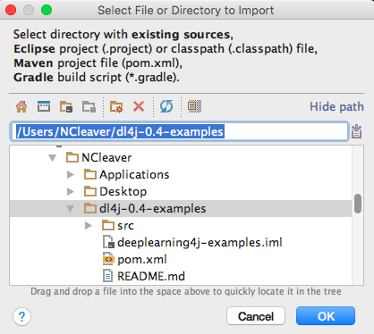
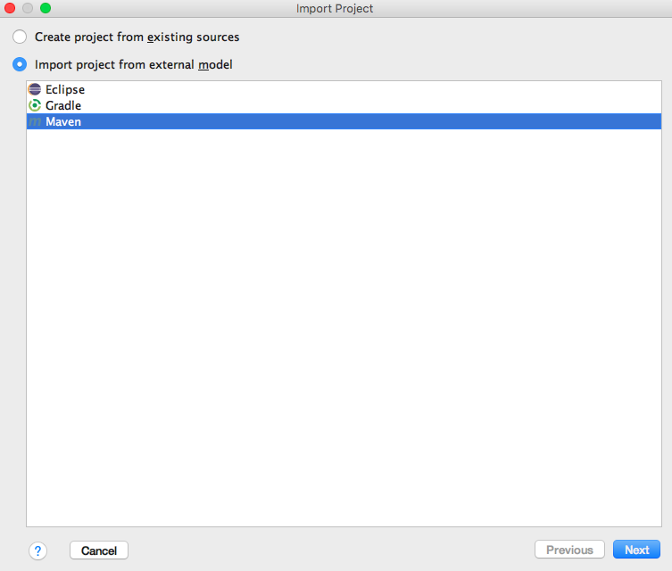
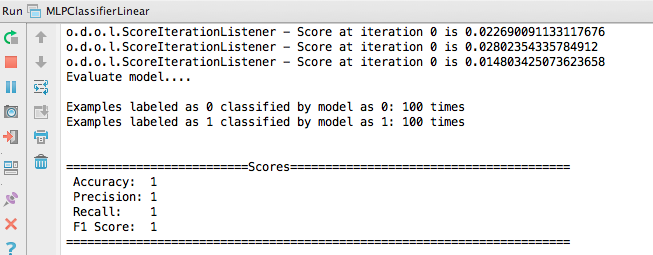
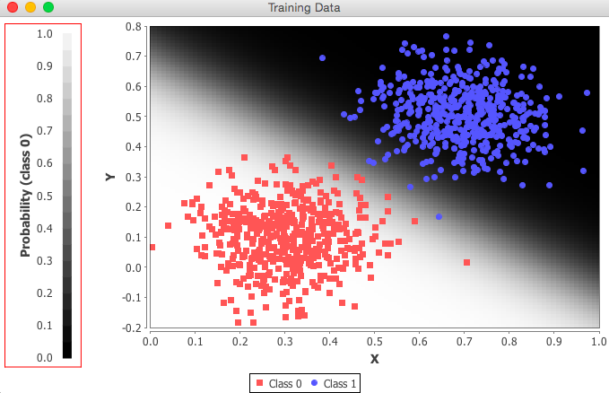

<!-- Begin Inspectlet Embed Code -->
<script type="text/javascript" id="inspectletjs">
window.__insp = window.__insp || [];
__insp.push(['wid', 1755897264]);
(function() {
function ldinsp(){if(typeof window.__inspld != "undefined") return; window.__inspld = 1; var insp = document.createElement('script'); insp.type = 'text/javascript'; insp.async = true; insp.id = "inspsync"; insp.src = ('https:'== document.location.protocol ?'https' :'http') + '://cdn.inspectlet.com/inspectlet.js'; var x = document.getElementsByTagName('script')[0]; x.parentNode.insertBefore(insp, x); };
setTimeout(ldinsp, 500); document.readyState != "complete" ?(window.attachEvent ? window.attachEvent('onload', ldinsp) : window.addEventListener('load', ldinsp, false)) : ldinsp();
})();
</script>
<!-- End Inspectlet Embed Code -->

快速入门指南
=================

本页将向您全面介绍如何运行DL4J示例，启动您自己的项目。

建议您加入我们的[Gitter线上交流群](https://gitter.im/deeplearning4j/deeplearning4j)。您可以在Gitter上请求帮助、提出反馈，不过也请您在遇到问题时先参考本指南中已列出的疑难解答。如果您是初次接触深度学习，我们准备了[一份初学者学习计划](./deeplearningforbeginners.html)，包括课程、阅读材料和其他资源的链接。 

#### 代码一瞥

Deeplearning4j是一种用于配置深度多层神经网络的领域专用语言。首先都需要用`MultiLayerConfiguration`来设定网络的层及其超参数。

超参数是决定神经网络学习方式的变量，包括模型的权重更新次数、如何初始化权重、为节点添加哪些激活函数、使用哪些优化算法以及模型的学习速度。网络配置的示例如下： 

``` java
    MultiLayerConfiguration conf = new NeuralNetConfiguration.Builder()
        .iterations(1)
        .weightInit(WeightInit.XAVIER)
        .activation("relu")
        .optimizationAlgo(OptimizationAlgorithm.STOCHASTIC_GRADIENT_DESCENT)
        .learningRate(0.05)
        // ……其他超参数
        .backprop(true)
        .build();
```

在Deeplearning4j中，添加一个层的方式是通过`NeuralNetConfiguration.Builder()`调用`layer`，指定其在所有层中的先后位置（下面示例中标记为零的层是输入层）、输入及输出节点数`nIn`和`nOut`，以及层的类型：`DenseLayer`。

``` java
        .layer(0, new DenseLayer.Builder().nIn(784).nOut(250)
                .build())
```

网络配置完成后，就可以用`model.fit`来定型模型了。

## 系统要求

* [Java（开发者版）](#Java) 1.7或更新版本（**仅支持64位版本**）
* [Apache Maven](#Maven) 
* [IntelliJ IDEA](#IntelliJ)或Eclipse
* [Git](#Git)

在使用以下快速入门指南前，请先安装上述各项。DL4J主要面向熟悉各类生产部署工具、IDE和自动化构建工具的专业Java开发者。若您已熟悉这些工具，使用DL4J将易如反掌。

如果您是初学Java，或对上述工具了解有限，请阅读以下的详细介绍，了解关于安装和设置的帮助。如无需了解这些内容，您可**跳至<a href="#examples">DL4J示例</a>**。

#### <a name="Java">Java</a>

如您还没有Java 1.7或更新版本，请[在此下载Java开发工具包（JDK）](http://www.oracle.com/technetwork/java/javase/downloads/jdk8-downloads-2133151.html)。若要检查已安装的Java版本是否兼容，请使用以下命令：

``` shell
java -version
```

请确保安装的是64位的Java，如果使用的是32位版本，会出现`no jnind4j in java.library.path`的错误信息。

#### <a name="Maven">Apache Maven</a>

Maven是针对Java项目的依赖管理和自动化构建工具。它与IntelliJ等IDE兼容性良好，可以让您轻松安装DL4J项目库。您可参照[官方说明](https://maven.apache.org/install.html)为您的系统[安装或更新Maven](https://maven.apache.org/download.cgi)的最新版本。若要检查已安装的Maven是否为最新版本，请使用以下命令：

``` shell
mvn --version
```

如果您使用的是Mac，可以在命令行中输入：

``` shell
brew install maven
```

Maven被Java开发者广泛使用，可以说是DL4J的必备条件。如果您此前并未从事Java开发，对Maven了解有限，请参考[Apache的Maven概述](http://maven.apache.org/what-is-maven.html)以及本站[面向非Java程序员的Maven简介](http://deeplearning4j.org/maven.html)，其中包括额外的疑难解答内容。Ivy和Gradle等[其他构建工具](../buildtools)也能够运行，但我们对Maven的支持最好。

#### <a name="IntelliJ">IntelliJ IDEA</a>

集成开发环境（[IDE](http://encyclopedia.thefreedictionary.com/integrated+development+environment)）让您能使用我们的API，只需要几个步骤就能配置神经网络。我们强烈推荐使用[IntelliJ](https://www.jetbrains.com/idea/download/)，它能与Maven相结合，有效管理依赖项。[IntelliJ社区版](https://www.jetbrains.com/idea/download/)是免费的。 

其他较为流行的IDE包括[Eclipse](http://books.sonatype.com/m2eclipse-book/reference/creating-sect-importing-projects.html)和[Netbeans](http://wiki.netbeans.org/MavenBestPractices)。我们推荐使用IntelliJ，遇到问题时在[Gitter线上交流群](https://gitter.im/deeplearning4j/deeplearning4j)中也更容易得到帮助。

#### <a name="Git">Git</a>

请安装[最新版本的Git](https://git-scm.com/book/en/v2/Getting-Started-Installing-Git)。如您已经安装了Git，您可以让Git自行升级至最新版本：

``` shell
$ git clone git://git.kernel.org/pub/scm/git/git.git
```

## <a name="examples">运行DL4J示例的简易步骤</a>

1.在命令行中输入：

        $ git clone https://github.com/deeplearning4j/dl4j-examples.git
        $ cd dl4j-examples/
        $ mvn clean install

2.打开IntelliJ，选择“导入项目”。然后选择“dl4j-examples”主目录。 



3.选择“从外部模型导入项目”，确保已选中Maven。 


4.继续按向导选项操作。选中以`jdk`开头的SDK。（可能需要点击加号才能看到相关选项……）随后点“完成”。稍等片刻，让IntelliJ下载所有的依赖项。右下方会显示进度条。

5.在左边的树形目录中选择一个示例。

右击文件，运行。 

## 在您自己的项目中使用DL4J：配置POM.xml文件

若要在您自己的项目中运行DL4J，我们强烈推荐Java用户使用Maven，Scala用户使用SBT等工具。基本的依赖项及其版本如下所示。其中包括：

- `deeplearning4j-core`，包含神经网络实现方法
- `nd4j-native`，ND4J库的CPU版本，驱动DL4J
- `canova-api` - Canova是我们的数据向量化和加载库

每个Maven项目都有一个POM文件。运行示例时，[POM文件的内容应当如此处所示](https://github.com/deeplearning4j/dl4j-examples/blob/master/pom.xml)。

在IntelliJ中，你需要选择将要运行的第一个Deeplearning4j示例。我们建议选择`MLPLinearClassifier`，在我们的用户界面中几乎能立即看到该网络将数据分类为两组。文件可以[在Github上找到](https://github.com/deeplearning4j/dl4j-examples/blob/master/src/main/java/org/deeplearning4j/examples/feedforward/classification/MLPClassifierLinear.java)。 

右击示例，在下拉菜单中选择绿色按钮即可运行。你会在IntelliJ底部的窗口中看到一系列分值。最右边的数字是网络分类的误差得分。如果网络在进行学习，该数字就会随着处理批次的增加而减少。最后，该窗口会告诉你神经网络模型最终的准确度。



另一个窗口中的图像会显示多层感知器（MLP）对示例数据的分类结果，如下图所示：



祝贺您！您已经用Deeplearning4j成功定型了第一个神经网络……

更多链接：

- [Maven Central上的Deeplearning4j工件](http://search.maven.org/#search%7Cga%7C1%7Cdeeplearning4j)
- [Maven Central上的ND4J工件](http://search.maven.org/#search%7Cga%7C1%7Cnd4j)
- [Maven Central上的Canova工件](http://search.maven.org/#search%7Cga%7C1%7Ccanova)

## 后续步骤

1. 在Gitter上加入我们。我们有三大社区交流渠道。
    * [DL4J线上交流群](https://gitter.im/deeplearning4j/deeplearning4j)是有关DL4J的主要交流渠道。大多数人都在此出没。
    * [调试帮助](https://gitter.im/deeplearning4j/deeplearning4j/tuninghelp)面向刚开始接触神经网络的用户。初学者请访问这个交流群！
    * [早期用户交流群](https://gitter.im/deeplearning4j/deeplearning4j/earlyadopters)面向那些帮助我们检查并改进新版本的用户。注意：这个群供经验更丰富的用户交流。 
2. 阅读[深度神经网络简介](./zh-neuralnet-overview)或其他详细教程。 
3. 查看更详细的[完全安装指南](./gettingstarted)。
4. 浏览[DL4J文档](./documentation)。


### 疑难解答

#### **问：**我在Windows中使用64位的Java，但仍然发生`no jnind4j in java.library.path`错误

**答：**您的路径中可能有不兼容的DLL文件。您需要将以下代码作为VM参数添加（IntelliJ中选择运行 -> 编辑配置 -> VM选项），让DL4J忽略这些文件：

```
-Djava.library.path=""
```

#### **问：**我遇到了这个错误：`Intel MKL FATAL ERROR:Cannot load mkl_intel_thread.dll`，导致JVM故障（不会崩溃，只是停止运行……）。

**答：**Maven Central当前的rc3.10版本中，`libnd4j`库在路径中发现英特尔的MKL时无法将其正确加载。解决方法是添加`System.loadLibrary("mkl_rt")`。
