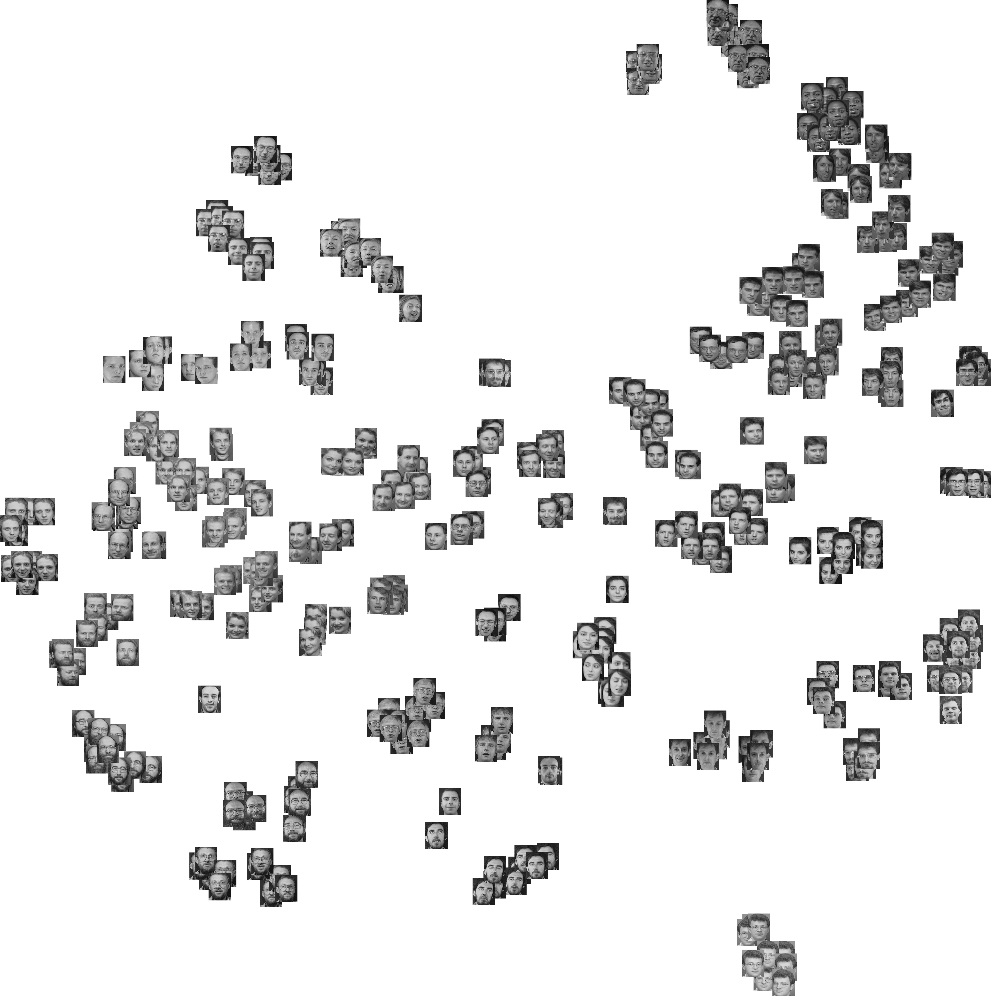

# 深度学习应用案例

深度学习擅长识别非结构化数据中的模式，而大多数人熟知的图像、声音、视频、文本等媒体均属于此类数据。 
下表列出了我们已知的应用类型及与之相关的行业。 

| 应用类型  | 行业 | 
| ------------- |:-------------:| 
| **声音** |       |
| 语音识别 | UX/UI、汽车、安保、物联网 |
| 语音搜索 | 手机制造、电信 |
| 情感分析 | 客户关系管理（CRM） |
| 探伤检测（引擎噪音） | 汽车、航空 |
| 欺诈检测 | 金融、信用卡 |
| | |
| **时间序列**| |
| 日志分析/风险检测 | 数据中心、安保、金融 |
| 企业资源计划 | 制造、汽车、供应链 |
| 传感器数据预测分析 | 物联网、智能家居、硬件制造 |
| 商业与经济分析 | 金融、会计、政府 |
| 推荐引擎 | 电子商务、媒体、社交网络 |
| | |
| **文本** | |
| 情感分析 | CRM、社交媒体、声誉管理 |
| 增强搜索、主题检测 | 金融 |
| 威胁侦测 | 社交媒体、政府 |
| 欺诈检测 | 保险、金融 |
| | |
| **图像** | |
| 面部识别 | |
| 图像搜索 | 社交媒体 |
| 机器视觉 | 汽车、航空 |
| 相片聚类 | 电信、手机制造 |
| | |
| **视频**| |
| 动作检测 | 游戏、UX/UI |
| 实时威胁侦测 | 安保、机场 | 

特征内省

传统机器学习的优势是能够进行特征内省－即系统理解为什么将一项输入这样或那样分类，这对于分析而言很重要。但这种优势却恰恰导致传统机器学习系统无法处理未标记、非结构化的数据，也无法像最新的深度学习模型那样达到前所未有的准确度。特征工程是传统机器学习的主要瓶颈之一，因为很少有人能把特征工程做得又快又好，适应数据变化的速度。

对于必须进行特征内省的应用情景（例如法律规定，以预测的信用风险为由拒绝贷款申请时必须提供依据），我们建议使用与多种传统机器学习算法相集成的深度神经网络，让每种算法都有投票权，发挥各自的长处。或者也可以对深度神经网络的结果进行各类分析，进而推测网络的决策原理。 

## 文本

### 命名实体识别

深度学习网络的作用之一是[命名实体识别](https://en.wikipedia.org/wiki/Named-entity_recognition)，这是从非结构化的未标记数据中提取人名、地名、企业名、其他事物名称等特定信息的一种方法。此类信息可以储存在结构化的架构中，用于建立一个地址列表或作为身份验证引擎的基准。 

### 语音转文本

通过适当的数据转换，深度神经网络可以理解声音信号。这可以用于在较大的声音文件中识别声音片段，以及将语音转录为文本。

## 图像

### 物体识别

物体识别指算法识别任意物体的能力，物体可以是球、动物，甚至人脸。这一功能通常用于工程应用程序，在建模时进行形状识别。它也用于实现社交网络中的照片标签功能。Facebook的Deep Face是深度学习应用于这一领域的典型案例。 

以下是由神经网络完成的人脸聚类示例：

### 机器视觉 + 自然语言处理

[现实捕捉和现实计算](http://pando.com/2014/02/16/convergence-what-happens-when-virtual-realities-take-over/)领域的进步令虚拟世界与现实不断交融。就此类全新的数据而言，深度学习网络的应用之一是识别并标识三维环境以及现实中的物体。 

实现这一功能后，就很容易发展出模拟语义，让机器借由各类现实物体的虚拟表示来学习这些物体的本质和限制，随后将这种理解运用到语言的生成和处理当中。我们认为这是神经网络未来众多的发展方向之一。 

### <a name="beginner">其他Deeplearning4j教程</a>
* [神经网络简介](./zh-neuralnet-overview)
* [受限玻尔兹曼机](./zh-restrictedboltzmannmachine)
* [本征向量、协方差、PCA和熵](./zh-eigenvector)
* [LSTM和递归网络](./zh-lstm)
* [神经网络与回归分析](./linear-regression)
* [卷积网络](./zh-convolutionalnets)
* [Word2vec：Java中的神经词向量](./zh-word2vec)
