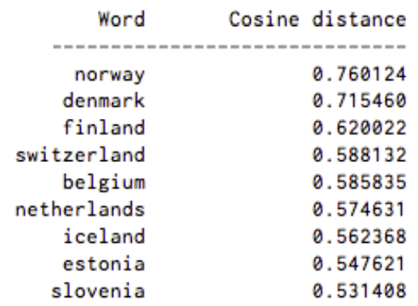
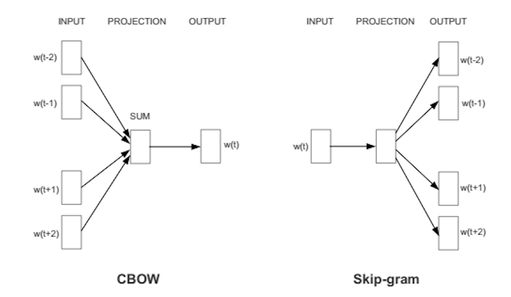
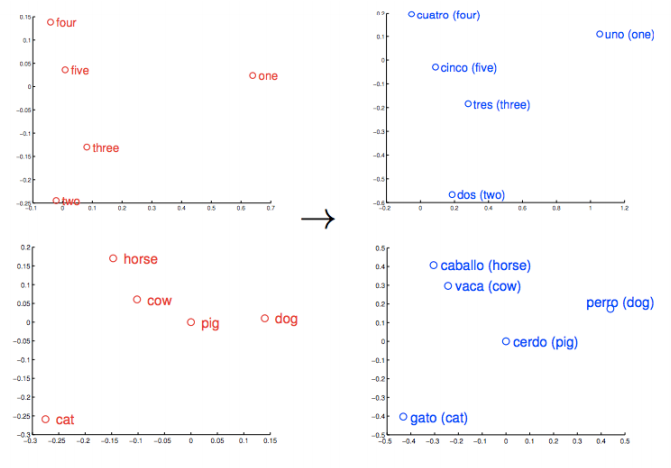
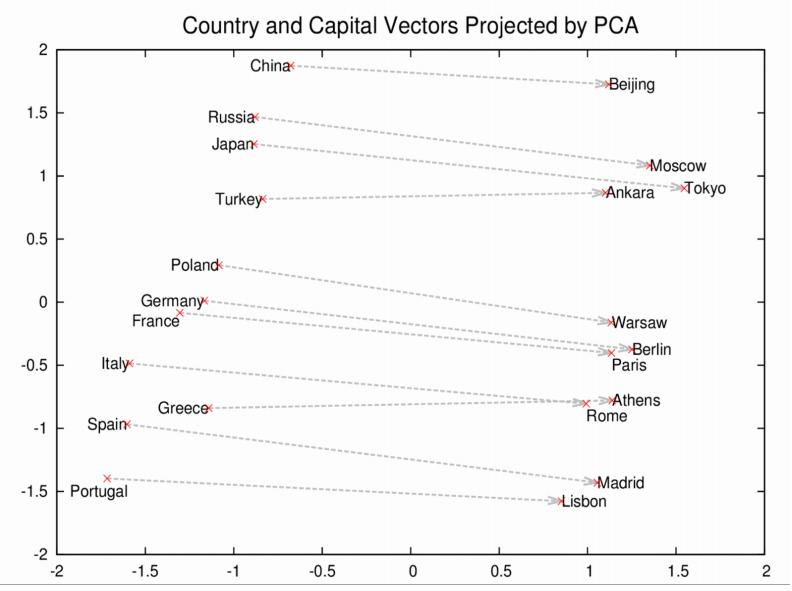

# Word2Vec

目录

* <a href="#intro">简介</a>
* <a href="#embed">神经词向量</a>
* <a href="#crazy">有趣的Word2vec结果</a>
* <a href="#just">**直接看代码**</a>
* <a href="#anatomy">Word2Vec解析</a>
* <a href="#setup">设置、加载、定型</a>
* <a href="#code">代码示例</a>
* <a href="#trouble">Word2Vec疑难解答与调试</a>
* <a href="#use">Word2vec应用案例</a>
* <a href="#foreign">外语</a>
* <a href="#glove">GloVe（全局向量）与Doc2Vec</a>

## <a name="intro">Word2Vec简介</a>

Word2vec是一个用于处理文本的双层神经网络。它的输入是文本语料，输出则是一组向量：该语料中词语的特征向量。虽然Word2vec并不是[深度神经网络](./zh-neuralnet-overview.html)，但它可以将文本转换为深度神经网络能够理解的数值形式。[Deeplearning4j](http://deeplearning4j.org/zh-quickstart.html)用Java和[Scala](./scala.html)语言实现分布式的Word2vec，通过Spark在GPU上运行。 

Word2vec的应用不止于解析自然语句。它还可以用于<a href="#sequence"><a href="#sequence">基因组、代码、[点赞](https://docs.google.com/presentation/d/19QDuPmxB9RzQWKXp_t3yqxCvMBSMaOQk19KNZqUUgYQ/edit#slide=id.g11a4ba0c5c_0_6)、播放列表、社交媒体图像等其他语言或符号序列</a>，同样能够有效识别其中存在的模式。 

为什么呢？因为这些数据都是与词语相似的离散状态，而我们的目的只是求取这些状态之间的转移概率，即它们共同出现的可能性。所以gene2vec、like2vec和follower2vec都是可行的。而以下的教程就将介绍怎样为任何一组离散且同时出现的状态创建神经向量。 

Word2vec的目的和功用是在向量空间内将词的向量按相似性进行分组。它能够识别出数学上的相似性。Word2vec能生成向量，以分布式的数值形式来表示词的上下文等特征。而这一过程无需人工干预。 

<p align="center">
<a href="http://deeplearning4j.org/zh-quickstart" class="btn btn-custom" onClick="ga('send', 'event', a?quickstart', 'click');">Deeplearning4j入门教程</a>
</p>

给出足够的数据、用法和上下文，Word2vec就能根据过去经验对词的意义进行高度准确的预测。这样的预测结果可以用于建立一个词与其他词之间的联系（例如，“男人”和“男孩”的关系与“女人”和“女孩”的关系相同），或者可以将文档聚类并按主题分类。而这些聚类结果是搜索、[情感分析](https://github.com/deeplearning4j/dl4j-examples/blob/master/src/main/java/org/deeplearning4j/examples/recurrent/word2vecsentiment/Word2VecSentimentRNN.java)和推荐算法的基础，广泛应用于科研、调查取证、电子商务、客户关系管理等领域。 

Word2vec神经网络的输出是一个词汇表，其中每个词都有一个对应的向量，可以将这些向量输入深度学习网络，也可以只是通过查询这些向量来识别词之间的关系。 

Word2vec衡量词的[余弦相似性](./glossary.html#cosine)，无相似性表示为90度角，而相似度为1的完全相似则表示为0度角，即完全重合；例如，瑞典与瑞典完全相同，而挪威与瑞典的余弦距离为0.760124，高于其他任何国家。 

以下是用Word2vec生成的“瑞典”的相关词列表：

 

前九位中包括斯堪的纳维亚半岛国家和几个富裕的北欧及日耳曼语系国家。 

## <a name="embed">神经词向量</a>

我们用来表示词的向量称为*神经词向量*，这样的表示方式很奇特。虽然是两种完全不同的事物，但却能用其中一种来描述另一种事物。正如Elvis Costello所说：“写关于音乐的文字就像是跳关于建筑的舞蹈一样。”Word2vec将词“向量化”，从而使自然语言能被计算机读取－这样我们就可以对词语进行复杂的数学运算来识别词之间的相似性。 

所以神经词向量用数字来表示词。这是一种简单而又不可思议的“翻译”。 

Word2vec与自动编码器相似，它将每个词编码为向量，但Word2vec不会像[受限玻尔兹曼机](./zh-restrictedboltzmannmachine.html)那样通过[重构](./zh-restrictedboltzmannmachine.html#reconstruct)输入的词语来定型，而是根据输入语料中相邻的其他词来进行每个词的定型。 

具体的方式有两种，一种是用上下文预测目标词（连续词袋法，简称CBOW），另一种则是用一个词来预测一段目标上下文，称为skip-gram方法。我们使用后一种方法，因为它处理大规模数据集的结果更为准确。

 

若指定给一个词的特征向量无法准确预测出这个词的上下文，则向量的要素会被调整。语料中每个词的上下文就是传回误差信号以调整特征向量的*老师*。若不同词的向量按上下文判定为相似，则会调整向量中的数字，使这些向量靠得更近。

正如梵高的画作《向日葵》是用油画颜料在画布上混合组成的二维图形来*表示*十九世纪八十年代末巴黎的三维植物实物一样，一个包含500个数字的向量也可以用来表示一个词或一组词。

这些数字指出了每个词在500维向量空间中的位置。人们很难想象超过三维的空间。（Geoff Hinton在教学生想象13维空间时，要他们先想象三维空间，然后对自己说：“十三、十三、十三。”：） 

一组定型良好的词向量会让相似的词语在向量空间内彼此靠近。*橡树*、*榆树*、*桦树*这些词可能聚集在空间的一个角落，而*战争*、*冲突*、*斗争*则挤在另一个角落。 

类似的事物与概念也会比较“靠近”。他们的相对意义被转译为可衡量的距离。质量变为数量，让算法得以运行。但相似性只是Word2vec可以学习的许多种关联的基础。举例而言，Word2vec还可以衡量一种语言的词语之间的关系，并且将这些词相互映射。

 

以这些向量为基础，可以得到更全面的词的几何分布。罗马、巴黎、柏林、北京这些首都的名称不仅会聚集在一处，彼此靠近，同时每个词在向量空间内到其对应国家名称的距离也是相似的；例如：罗马－意大利 = 北京－中国。如果你只知道意大利的首都是罗马，而不知道中国的首都在哪里，那么可以由计算式罗马－意大利 + 中国得出是北京。不骗你。 

 

## <a name="crazy">有趣的Word2Vec结果</a>

让我们来看看Word2vec可以得出哪些其他的关联。 

我们不用加号、减号和等号，而是用逻辑类比符号表示结果，其中`:`代表“…与…的关系”，而`::`代表“相当于”；比如“罗马与意大利的关系相当于北京与中国的关系” =  `Rome:Italy::Beijing:China`。接下来我们不会直接提供“答案”，而是给出一个Word2vec模型在给定最初三个词后生成的词表：

    king:queen::man:[woman, Attempted abduction, teenager, girl] 
    //有点奇怪，但能看出有些关联
    
    China:Taiwan::Russia:[Ukraine, Moscow, Moldova, Armenia]
    //两个大国和与之相邻且关系微妙的较小国家或地区
    
    house:roof::castle:[dome, bell_tower, spire, crenellations, turrets]
    
    knee:leg::elbow:[forearm, arm, ulna_bone]
    
    New York Times:Sulzberger::Fox:[Murdoch, Chernin, Bancroft, Ailes]
    //Sulzberger-Ochs家族是《纽约时报》所有人和管理者。
    //Murdoch家族持有新闻集团，而福克斯新闻频道为新闻集团所有。 
    //Peter Chernin曾连续13年担任新闻集团的首席运营官。
    //Roger Ailes是福克斯新闻频道的总裁。 
    //Bancroft家族将华尔街日报出售给新闻集团。
    
    love:indifference::fear:[apathy, callousness, timidity, helplessness, inaction]
    //这个组合真是饱含诗意……
    
    Donald Trump:Republican::Barack Obama:[Democratic, GOP, Democrats, McCain]
    //有趣的是，就像奥巴马和麦凯恩是竞争对手一样，
    //Word2vec认为特朗普也与共和党人这个概念对立。
    
    monkey:human::dinosaur:[fossil, fossilized, Ice_Age_mammals, fossilization]
    //人类是变成化石的猴子？人类是猴子 
    //留下的东西？人类是打败了猴子的物种，
    //就像冰川世纪的哺乳动物打败了恐龙那样？好像有点道理。
    
    building:architect::software:[programmer, SecurityCenter, WinPcap]

这个模型是用谷歌新闻词汇定型的，你也可以[导入](#import)它来尝试一下。要知道，从未有人教过Word2vec算法任何一条英语句法规则。它对于世界一无所知，与一切符号逻辑和知识图并无关联。但它学到的内容要多于大多数知识图经过多年人工作业得到的学习成果，而且是以灵活自动的方式进行学习。它在开始接受谷歌新闻文档定型时只是白纸一张，而当定型结束后，Word2vec模型已能计算出人类多少能够理解的复杂类比。 

你也可以用一个Word2vec模型查询其他关联。并非所有关联都必须是两组相似的类比。([后文有具体说明……](#eval))

* 地缘政治：*伊拉克 - 暴力 = 约旦*
* 特性：*人类 - 动物 = 伦理*
* *总统 - 权力 = 总理*
* *图书馆 - 书 = 大厅*
* 类比：*股市 a‰? 温度计*

通过确定一个词与其他相似的词之间的近似度（两个词不一定包含同样的字母），我们让硬性的标记变为更连续且更全面的意义。 

# <a name="just">直接看代码</a>

## <a name="anatomy">解析DL4J中的Word2vec</a>

以下是Deeplearning4j的自然语言处理组件：

* **SentenceIterator/DocumentIterator**：用于数据集的迭代。SentenceIterator返回字符串，而DocumentIterator则处理输入流。尽可能使用SentenceIterator。
* **Tokenizer/TokenizerFactory**：用于对文本进行分词。在NLP术语中，一个句子表示为一系列词例（token）。TokenizerFactory为一个"句子"创建一个分词器（tokenizer）实例。 
* **VocabCache**：用于跟踪元数据，包括词数、文档中的出现次数、词例的集合（不是词汇，而是已经出现过的词例），词汇（[词袋](./bagofwords-tf-idf.html)以及词向量查找表中包含的特征）
* **倒排索引**：存储有关词的出现位置的元数据。可用于理解数据集。会自动创建以Lucene实现[1]的索引。 

Word2vec指一类彼此相关的算法，而以下是采用<a href="../glossary.html#skipgram">Skip-Gram</a>负样本采样模型的实现方法。

## <a name="setup">Word2Vec设置</a> 

用Maven在IntelliJ中创建新项目。如果你不知道这一步如何操作，请查看[快速入门页](./quickstart.html)。随后在项目根目录下的POM.xml文件中指定以下属性和依赖关系（可以[在Maven上查看](https://search.maven.org/#search%7Cga%7C1%7Cnd4j)最新版本－请使用那些版本…）。

``` xml
<properties>
  <nd4j.version>0.4-rc3.9</nd4j.version> // 去Maven Central查看最新版本！
  <dl4j.version>0.4-rc3.9</dl4j.version>
</properties>

<dependencies>
  <dependency>
     <groupId>org.deeplearning4j</groupId>
     <artifactId>deeplearning4j-ui</artifactId>
     <version>${dl4j.version}</version>
   </dependency>
   <dependency>
     <groupId>org.deeplearning4j</groupId>
     <artifactId>deeplearning4j-nlp</artifactId>
     <version>${dl4j.version}</version>
   </dependency>
   <dependency>
     <groupId>org.nd4j</groupId>
     <artifactId>nd4j-native</artifactId> 
     <version>${nd4j.version}</version>
   </dependency>
</dependencies>
```

### 加载数据

接下来在Java中创建并命名一个新的类。然后用迭代器遍历.txt文件中的原始语句，并且对这些句子进行某些预处理，例如把所有词转换为小写字母。 

``` java
        log.info("Load data....");
        ClassPathResource resource = new ClassPathResource("raw_sentences.txt");
        SentenceIterator iter = new LineSentenceIterator(resource.getFile());
        iter.setPreProcessor(new SentencePreProcessor() {
            @Override
            public String preProcess(String sentence) {
                return sentence.toLowerCase();
            }
        });
```

如果要加载本示例提供的句子以外的文本文件，你应该这样做：

``` java
        log.info("Load data....");
        SentenceIterator iter = new LineSentenceIterator(new File("/Users/cvn/Desktop/file.txt"));
        iter.setPreProcessor(new SentencePreProcessor() {
            @Override
            public String preProcess(String sentence) {
                return sentence.toLowerCase();
            }
        });
```

也就是要去除`ClassPathResource`，将你的`.txt`文件的绝对路径输入`LineSentenceIterator`。 

``` java
SentenceIterator iter = new LineSentenceIterator(new File("/your/absolute/file/path/here.txt"));
```

在bash脚本中，进入任意一个目录内后在命令行中键入`pwd`即可得到该目录的绝对文件路径。然后在这个路径后面加上文件名就行了。 

### 数据分词

Word2vec的输入应是词，而非整句句子，所以下一步需要对数据进行分词。文本分词就是将文本分解为最小的组成单位，比如每遇到一个空格就创建一个新的词例。 

``` java
        log.info("Tokenize data....");
        final EndingPreProcessor preProcessor = new EndingPreProcessor();
        TokenizerFactory tokenizer = new DefaultTokenizerFactory();
        tokenizer.setTokenPreProcessor(new TokenPreProcess() {
            @Override
            public String preProcess(String token) {
                token = token.toLowerCase();
                String base = preProcessor.preProcess(token);
                base = base.replaceAll("\\d", "d");
                if (base.endsWith("ly") || base.endsWith("ing"))
                    System.out.println();
                return base;
            }
        });
```

这样应该就能每行得到一个词。 

### 模型定型

数据准备完毕后，就可以配置Word2vec神经网络并输入词例了。 

``` java
        int batchSize = 1000;
        int iterations = 3;
        int layerSize = 150;
        
        log.info("Build model....");
        Word2Vec vec = new Word2Vec.Builder()
                .batchSize(batchSize) //# words per minibatch.
                .minWordFrequency(5) // 
                .useAdaGrad(false) //
                .layerSize(layerSize) // word feature vector size
                .iterations(iterations) // # iterations to train
                .learningRate(0.025) // 
                .minLearningRate(1e-3) // learning rate decays wrt # words. floor learning
                .negativeSample(10) // sample size 10 words
                .iterate(iter) //
                .tokenizerFactory(tokenizer)
                .build();
        vec.fit();
```

这一配置接受多项超参数。有一些需要说明： 

* *batchSize*是每次处理的词的数量。 
* *minWordFrequency*是一个词在语料中必须出现的最少次数。本例中出现不到五次的词都不予学习。词语必须在多种上下文中出现，才能让模型学习到有用的特征。对于规模很大的语料库，理应提高出现次数的下限。
* *useAdaGrad*－AdaGrad为每个特征生成一个不同的梯度。在此处不需要考虑。 
* *layerSize*指定词向量中的特征数量，与特征空间的维度数量相等。以500个特征值表示的词会成为一个500维空间中的点。
* *iterations*是网络在处理一批数据时允许更新系数的次数。迭代次数太少，网络可能来不及学习所有能学到的信息；迭代次数太多则会导致网络定型时间变长。
* *learningRate*是每一次更新系数并调整词在特征空间中的位置时的步幅。 
* *minLearningRate*是学习速率的下限。学习速率会随着定型词数的减少而衰减。如果学习速率下降过多，网络学习将会缺乏效率。这会使系数不断变化。 
* *iterate*告知网络当前定型的是哪一批数据集。 
* *tokenizer*将当前一批的词输入网络。 
* *vec.fit()*让已配置好的网络开始定型。 

### <a name="eval">用Word2vec评估模型</a> 

下一步是评估特征向量的质量。 

``` java
        log.info("Evaluate model....");
        double sim = vec.similarity("people", "money");
        log.info("Similarity between people and money:" + sim);
        Collection<String> similar = vec.wordsNearest("day", 10);
        log.info("Similar words to 'day' :" + similar);
        
        //output:[night, week, year, game, season, during, office, until, -]
```

`vec.similarity("word1","word2")`一行将返回你所输入的两个词之间的余弦相似性。相似性越接近1，表示网络认为两个词越相似（见前文瑞典－挪威的例子）。例如：

``` java
        double cosSim = vec.similarity("day", "night");
        System.out.println(cosSim);
        //output:0.7704452276229858
```

使用`vec.wordsNearest("word1", numWordsNearest)`后显示的词可供你检查网络是否将语义相近的词聚类。wordsNearest的第二个参数可任意设定最接近的词的数量。例如：

``` java
        Collection<String> lst3 = vec.wordsNearest("man", 10);
        System.out.println(lst3);
        //output:[director, company, program, former, university, family, group, such, general]
```

### 模型的图像化

我们依靠[TSNE](https://lvdmaaten.github.io/tsne/)来降低词特征向量的维度，将词向量投影至二维或三维的空间。 

``` java
        log.info("Plot TSNE....");
        BarnesHutTsne tsne = new BarnesHutTsne.Builder()
                .setMaxIter(1000)
                .stopLyingIteration(250)
                .learningRate(500)
                .useAdaGrad(false)
                .theta(0.5)
                .setMomentum(0.5)
                .normalize(true)
                .usePca(false)
                .build();
        vec.lookupTable().plotVocab(tsne);
```

### 保存、重载、使用模型

你应该要保存模型。Deeplearning4j中保存模型的一般方法是使用序列化工具（Java的序列化与Python的腌制过程相似，将一个对象转换为一个字节的*序列*）。

``` java
        log.info("Save vectors....");
        WordVectorSerializer.writeWordVectors(vec, "words.txt");
```

以上代码将把向量存入一个名为`words.txt`的文件，保存在Word2vec定型所在目录的根目录中。文件中的输出应当是每行一个词，词后面跟着一个表示词向量的数字序列。

要继续使用这些向量，只需按以下代码调用`vec`方法：

``` java
Collection<String> kingList = vec.wordsNearest(Arrays.asList("king", "woman"), Arrays.asList("queen"), 10);
```

Word2vec最经典的词语算式例子是“king - queen = man - woman”（国王 - 王后 = 男人 - 女人），可由此推出“king - queen + woman = man”（国王 - 王后 + 女人 = 男人）。 

上述示例会输出距离`king - queen + woman`这一向量最近的10个词，其中应当包括`man`。wordsNearest的第一个参数必须包括`king`和`woman`这两个“正的”词，它们都带有加号；第二个参数则包括`queen`这个“负的”词，带有减号（此处的正负不代表任何潜在的感情色彩）；第三个参数是词表的长度，即你希望得到多少个最接近的词。记得在文件顶端添加：`import java.util.Arrays;`。

参数可任意组合，但只有查询在语料中出现频率足够高的词，才能返回有意义的结果。显然，返回相似的词（或文档）的能力是搜索以及推荐引擎的基础。 

你可以这样将向量重新载入内存：

``` java
WordVectors wordVectors = WordVectorSerializer.loadTxtVectors(new File("words.txt"));
```

随后可以将Word2vec作为查找表：

``` java
        WeightLookupTable weightLookupTable = wordVectors.lookupTable();
        Iterator<INDArray> vectors = weightLookupTable.vectors();
        INDArray wordVector = wordVectors.getWordVectorMatrix("myword");
        double[] wordVector = wordVectors.getWordVector("myword");
```

如果词不属于已知的词汇，Word2vec会返回一串零。

### <a name="import">导入Word2vec模型</a>

我们用来测试已定型网络准确度的[谷歌新闻语料模型](https://s3.amazonaws.com/dl4j-distribution/GoogleNews-vectors-negative300.bin.gz)由S3托管。如果用户当前的硬件定型大规模语料需要很长时间，可以下载这个模型，跳过前期准备直接探索Word2vec。

如果你是使用[C向量](https://docs.google.com/file/d/0B7XkCwpI5KDYaDBDQm1tZGNDRHc/edit)或Gensimm定型的，那么可以用下面这行代码导入模型。

``` java
    File gModel = new File("/Developer/Vector Models/GoogleNews-vectors-negative300.bin.gz");
    Word2Vec vec = WordVectorSerializer.loadGoogleModel(gModel, true);
```

记得为导入的包添加`import java.io.File;`。

较大的模型可能会遇到堆空间的问题。谷歌模型可能会占据多达10G的RAM，而JVM只能以256MB的RAM启动，所以必须调整你的堆空间。方法可以是使用一个`bash_profile`文件（参见[疑难解答](./gettingstarted.html#trouble)），或通过IntelliJ本身来解决： 

``` java
    //Click:
    IntelliJ Preferences > Compiler > Command Line Options 
    //Then paste:
    -Xms1024m
    -Xmx10g
    -XX:MaxPermSize=2g
```

### <a name="grams">N-gram和Skip-gram</a>

词是逐个读入向量的，*并且按特定的范围进行来回扫描*。这些范围就是n-gram，而一个n-gram是某一特定语言序列中*n*个连续项目的序列；与unigram、bigram、trigram、4-gram和5-gram一样，n-gram就是第n个gram。Skip-gram也就是从n-gram中丢弃一些项目。 

由Mikolov提出的skip-gram表示法经证明比连续词袋等其他模型更为准确，因为其生成的上下文更为通用。DL4J实现Word2vec时使用的也是skip-gram方法。 

这一n-gram随后被输入一个神经网络，让网络学习一个特定词向量的重要性－此处重要性的定义是向量指示更广泛的意义（或标签）的作用大小。 

### <a name="code">实用示例</a>

上文介绍了Word2Vec的基本设置方法，以下是一个[具体示例](https://github.com/deeplearning4j/dl4j-examples/blob/master/src/main/java/org/deeplearning4j/examples/nlp/word2vec/Word2VecRawTextExample.java)，说明如何在DL4J的API中使用Word2vec：

<script src="http://gist-it.appspot.com/https://github.com/deeplearning4j/dl4j-examples/blob/master/src/main/java/org/deeplearning4j/examples/nlp/word2vec/Word2VecRawTextExample.java?slice=22:64"></script>

你可以参照[快速入门](./quickstart.html)中的指示在IntelliJ中打开这一示例，点击运行，看它如何运作。如果你向Word2vec模型查询一个定型语料中没有的词，那么返回的结果会是零。 

### <a name="trouble">Word2Vec疑难解答与调试</a>

*问：我碰到许多这样的堆栈轨迹*

``` java
       java.lang.StackOverflowError: null
       at java.lang.ref.Reference.<init>(Reference.java:254) ~[na:1.8.0_11]
       at java.lang.ref.WeakReference.<init>(WeakReference.java:69) ~[na:1.8.0_11]
       at java.io.ObjectStreamClass$WeakClassKey.<init>(ObjectStreamClass.java:2306) [na:1.8.0_11]
       at java.io.ObjectStreamClass.lookup(ObjectStreamClass.java:322) ~[na:1.8.0_11]
       at java.io.ObjectOutputStream.writeObject0(ObjectOutputStream.java:1134) ~[na:1.8.0_11]
       at java.io.ObjectOutputStream.defaultWriteFields(ObjectOutputStream.java:1548) ~[na:1.8.0_11]
```

*答：*检查Word2vec应用的启动目录内部。这可能是一个IntelliJ项目的主目录，或者你在命令行中键入了Java的那个目录。其中应当有这样一些目录：

``` 
       ehcache_auto_created2810726831714447871diskstore  
       ehcache_auto_created4727787669919058795diskstore
       ehcache_auto_created3883187579728988119diskstore  
       ehcache_auto_created9101229611634051478diskstore
```

你可以关闭Word2vec应用并尝试删除这些目录。

*问：我的原始文本数据中有一些词没有在Word2vec的对象内出现a|*

*答：*尝试对你的Word2vec对象使用**.layerSize()**来扩大层的规模，如下所示

``` java
        Word2Vec vec = new Word2Vec.Builder().layerSize(300).windowSize(5)
                .layerSize(300).iterate(iter).tokenizerFactory(t).build();
```

*问：如何加载我的数据？为什么定型要花这么久？

*答：*如果你的句子全部是*整句*加载的，那么Word2vec的定型就可能需要很长时间。原因在于Word2vec是一个句子层面的算法，所以句子的边界非常重要，因为同现关系的统计数据是逐句收集的。（对于GloVe，句子的边界无关紧要，因为GloVe关注的是整个语料库中的同现关系。）许多语料的平均句子长度是六个词。如果窗口大小为5，则会进行30（此处为随机数）轮的skip-gram运算。如果你忘记指定句子的边界，就有可能会加载有10000个词长的“句子”。在这种情况下，Word2vec会尝试对长达10000个词的“句子”进行完整的skip-gram循环。DL4J在实现过程中假定一行就是一个句子。你需要插入自己的SentenceIterator和Tokenizer。DL4J不绑定任何语言，它会让你自行指定如何判断句子结束。方法之一是使用UimaSentenceIterator。它用OpenNLP来检测句子的边界。

*问：我完全按照你们的方法操作，但结果看起来还是不对。*

*答：*如果你在使用Ubuntu，序列化的数据有可能不能正常加载。这是Ubuntu的问题。我们建议在其他版本的Linux下测试这一版本的Word2vec。

### <a name="use">应用案例</a>

谷歌学术记录了所有引用[通过Deeplearning4j实现的Word2vec](https://scholar.google.com/scholar?hl=en&q=deeplearning4j+word2vec&btnG=&as_sdt=1%2C5&as_sdtp=)的论文。

比利时的数据科学家Kenny Helsens[将通过Deeplearning4j实现的Word2vec应用](http://thinkdata.be/2015/06/10/word2vec-on-raw-omim-database/)于NCBI的在线人类孟德尔遗传（OMIM）数据库。随后他查询了与一种已知的非小细胞肺癌肿瘤基因“alk”最相似的词，Word2vec返回的结果是：“nonsmall、carcinomas、carcinoma、mapdkd”。在此基础上，他确定了其他癌症的表现型与基因型之间的类比关系。这只是Word2vec可以从大规模语料库中学到的关联的例子之一。对重要疾病做出新发现的潜力才刚开始显现，而在医学之外的领域也同样存在各种各样的机会。

Andreas Klintberg对Deeplearning4j实现的Word2vec进行了瑞典语的定型，并且[在Medium上记录了完整的过程](https://medium.com/@klintcho/training-a-word2vec-model-for-swedish-e14b15be6cb)。 

Word2vec特别适合为信息检索和QA系统准备基于文本的数据，DL4J用[深度自动编码器](./deepautoencoder.html)实现这一功能。 

市场营销人员可能会通过确定产品之间的关系来打造推荐引擎。调查人员可能会依靠分析社交图谱来寻找某一个群体的成员，或者确定这些人与特定地点或资助者之间的其他关系。 

### <a name="patent">谷歌的Word2vec专利</a>

Word2vec是由Tomas Mikolov领导的一支谷歌研究团队提出的[一种对词的向量表示进行运算的方法](http://arxiv.org/pdf/1301.3781.pdf)。谷歌[提供一个开源的Word2vec版本](https://code.google.com/p/word2vec/) ，以Apache 2.0许可证发布。Mikolov于2014年离开谷歌，加入Facebook，而[谷歌在2015年5月获得了Word2vec方法的专利](http://patft.uspto.gov/netacgi/nph-Parser?Sect1=PTO2&Sect2=HITOFF&p=1&u=%2Fnetahtml%2FPTO%2Fsearch-bool.html&r=1&f=G&l=50&co1=AND&d=PTXT&s1=9037464&OS=9037464&RS=9037464)，该专利并不撤销Word2vec发布时所使用的Apache许可证。 

### <a name="foreign">外语</a>

虽然所有语言的词都可以通过Word2vec转换为向量，而Deeplearning4j也都能学习这些向量，但是不同语言的NLP预处理可能有很大差异，而且需要使用我们的学习库以外的工具。[斯坦福自然语言处理组](http://nlp.stanford.edu/software/)拥有一系列基于Java的分词、词性标记及命名实体识别工具，适用于[汉语普通话](http://nlp.stanford.edu/projects/chinese-nlp.shtml)、阿拉伯语、法语、德语和西班牙语等语言。对日语而言，[Kuromoji](http://www.atilika.org/)一类的NLP工具很有用。其他外语相关的资源，包括[文本语料，可以在此处找到](http://www-nlp.stanford.edu/links/statnlp.html)。

### <a name="glove">GloVe：全局向量</a>

可以通过以下方式将GloVe模型加载或保存至Word2vec.

``` java
        WordVectors wordVectors = WordVectorSerializer.loadTxtVectors(new File("glove.6B.50d.txt"));
```

### <a name="sequence">序列向量</a>

Deeplearning4j有一个叫做[SequenceVectors](https://github.com/deeplearning4j/deeplearning4j/blob/master/deeplearning4j-scaleout/deeplearning4j-nlp/src/main/java/org/deeplearning4j/models/sequencevectors/SequenceVectors.java)的类，它是向量上一级的抽象类，让你可以从包括社交媒体档案、交易信息、蛋白质信息等任何序列中提取特征。如果数据能称为序列，就可以用AbstractVectors通过skip-gram和层次softmax来学习。这与[DeepWalk算法](https://github.com/deeplearning4j/deeplearning4j/blob/master/deeplearning4j-scaleout/deeplearning4j-graph/src/main/java/org/deeplearning4j/graph/models/deepwalk/DeepWalk.java)兼容，同样也在Deeplearning4j中实现。 

### <a name="features">Deeplearning4j的Word2Vec特点</a>

* 添加了模型序列化/反序列化后的权重更新。也就是说，你可以通过调用`loadFullModel`来用例如200GB的新文本更新模型状态，加上`TokenizerFactory`和`SentenceIterator`，并且对还原的模型调用`fit()`。
* 添加了词汇建设的多个数据来源选项。
* Epoch和迭代可以分别指定，尽管它们通常都是"1"。
* Word2Vec.Builder有这一选项：`hugeModelExpected`。如果设定为`真`，词汇表在构建过程中会被周期性截断。
* `minWordFrequency`可用于忽略语料库中很少见的词，但也可以按需要剔除任意数量的词。
* 引入了两种新的WordVectorsSerialiaztion方法：`writeFullModel`和`loadFullModel`，用于保存和加载完整的模型状态。 
* 一台不错的工作站应当能够处理几百万词的词汇表。Deeplearning4j实现的Word2vec可以在一台计算机上进行数TB数据的建模。数学公式大致是：`vectorSize * 4 * 3 * vocab.size()`。

### Doc2vec和其他NLP资源

* [使用Word2vec和RNN的DL4J文本分类示例](https://github.com/deeplearning4j/dl4j-examples/blob/master/src/main/java/org/deeplearning4j/examples/recurrent/word2vecsentiment/Word2VecSentimentRNN.java)
* [使用段落向量的DL4J文本分类示例](https://github.com/deeplearning4j/dl4j-examples/blob/master/src/main/java/org/deeplearning4j/examples/recurrent/word2vecsentiment/Word2VecSentimentRNN.java)
* [用Deeplearning4j实现的Doc2vec，或称段落向量](./doc2vec.html)
* [思维向量、自然语言处理与人工智能的未来](./thoughtvectors.html)
* [Quora：Word2vec的工作原理是什么？](http://www.quora.com/How-does-word2vec-work)
* [Quora：有哪些有趣的Word2vec结果？](http://www.quora.com/Word2vec/What-are-some-interesting-Word2Vec-results/answer/Omer-Levy)
* [Word2Vec简介](http://www.folgertkarsdorp.nl/word2vec-an-introduction/)；Folgert Karsdorp
* [Mikolov的Word2vec原始代码@Google](https://code.google.com/p/word2vec/)
* [word2vec解析：推导Mikolov等人的负样本取样词向量法](http://arxiv.org/pdf/1402.3722v1.pdf)；Yoav Goldberg和Omer Levy
* [词袋与词频－逆文档频率（TF-IDF）](./bagofwords-tf-idf.html)

### <a name="beginner">其他Deeplearning4j教程</a>
* [神经网络简介](./zh-neuralnet-overview)
* [受限玻尔兹曼机](./zh-restrictedboltzmannmachine)
* [本征向量、协方差、PCA和熵](./zh-eigenvector)
* [LSTM和递归网络](./zh-lstm)
* [神经网络与回归分析](./linear-regression)
* [卷积网络](./zh-convolutionalnets)

### <a name="doctorow">文学中的Word2Vec</a>

    好像数字就是语言，好像这语言里所有的字母都变成了数字，在每个人看来都是同一种意思。字母的声音都没了，不论它原来是个要咂嘴、喷气还是擦着上颚发的音，不论是“呜”还是“啊”，凡是可能让人误解的东西、凡是用声音或者意象来欺骗你的东西都没了，连口音也没了，而你得到了一种全新的理解力，一种数字的语言，所有事情在每个人看来都变得如同白纸黑字一般清楚。所以我说有一段时间就是在阅读数字。
        -- E.L.Doctorow著《Billy Bathgate》
