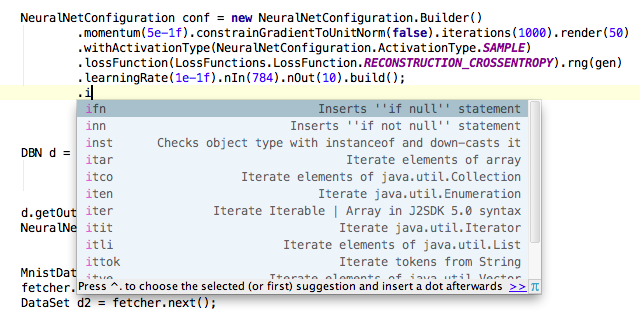
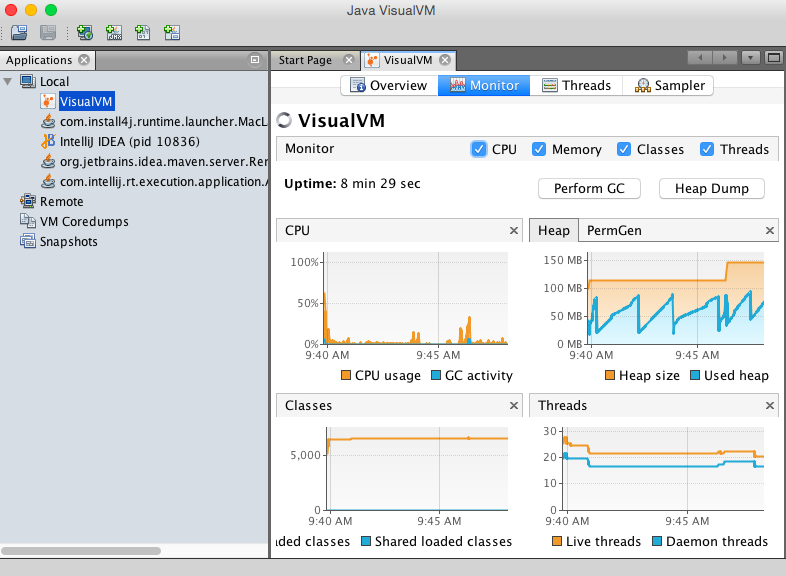

---
title:完全安装Deeplearning4j
layout: default
redirect_from: /zh-gettingstarted
---

# DL4J完全安装指南

本页在[快速入门指南](zh-quickstart)的基础上介绍更多细节和一些问题解决步骤。建议您在查看本页内容之前先阅读快速入门指南，如此上手DL4J会比较容易。

完全安装包括多个步骤。如果您希望提问或反馈，我们强烈建议您加入我们的[Gitter线上交流群](https://gitter.im/deeplearning4j/deeplearning4j)，便于我们引导您进行安装。若您不乐意在群里发言，或要力求无师自通，也欢迎加入交流群默默潜水学习。此外，如果您是初次接触深度学习，我们还准备了一份[初学者学习计划](../deeplearningforbeginners)。

在完成[快速入门指南](zh-quickstart)中的步骤之后，请阅读以下内容：

1.加速CPU定型：安装原生BLAS库
    * <a href="#linux">Linux</a>
    * <a href="#osx">OSX</a>
    * <a href="#windows">Windows</a>
2.[GitHub](http://nd4j.org/getstarted.html#github)
3.<a href="#eclipse">Eclipse</a>
4.<a href="#cli">命令行界面</a>
5.<a href="#trouble">疑难解答</a>
6.<a href="#results">可复现结果</a>
7.<a href="#next">后续步骤</a>

##  原生BLAS库

对应各类操作系统的详细指南参见

 [libnd4j自述文件](https://github.com/deeplearning4j/libnd4j)。

但是，除非尚未安装CUDA，否则应当不需要进行任何安装。

## <a name="walk">DL4J示例：详细过程说明</a>

本节提供比[快速入门指南](zh-quickstart)更详尽的安装步骤介绍。

* 如果已有Git，可在命令行中输入：

		git --version

* 如果您没有Git，请[点此安装](https://git-scm.herokuapp.com/book/en/v2/Getting-Started-Installing-Git)。
* 随后，请注册[Github账户](https://github.com/join)并下载GitHub的[Mac](https://mac.github.com/)或[Windows](https://windows.github.com/)版本。
* 如您使用Windows，请在开始菜单中找到“Git Bash”并打开。Git Bash终端的外观应与cmd.exe相似。
* 用`cd`命令进入想要存放DL4J示例的文件夹。您可以建立名为`mkdir dl4j-examples`的新文件夹，再`cd`进入该文件夹。接着运行：

    `git clone https://github.com/deeplearning4j/dl4j-examples`
* 输入`ls`，确认文件已下载。
* 打开IntelliJ。
* 选择“文件”菜单，点击“导入项目”或“从已有来源新建项目”，显示本地文件菜单。
* 选择包含DL4J示例的文件夹。
* 下一个窗口中将显示可供选择的构建工具。选中Maven。
* 勾选“以递归方式搜索项目”和“自动导入Maven项目”两项，随后点击“下一步”。
* 确保JDK/SDK已安装，如尚未安装，请点击SDK窗口底部的加号添加。
* 随后继续点击确认，直至为项目命名的一步。使用默认的项目名称即可，所以请点击“完成”。

## <a name="eclipse">在Eclipse中使用DL4J示例</a>

在IntelliJ中，导入示例只需按快速入门指南中的说明操作。若要在Eclipse中使用这些示例，则需要增加一个步骤。

运行了`git clone`之后，输入以下命令：

      mvn eclipse:eclipse

该命令将创建一个可用于导入的Eclipse项目。

根据多年使用Eclipse的经验，我们推荐具有相似界面的IntelliJ。Eclipse单一、庞大的架构常使我们和其他开发人员的代码产生奇怪错误。

如果使用Eclipse，则需要安装Maven插件：[eclipse.org/m2e/](https://eclipse.org/m2e/)。

Michael Depies撰写了[在Eclipse上安装Deeplearning4j](https://depiesml.wordpress.com/2015/08/26/dl4j-gettingstarted/)的指南。

## <a name="cli">命令行界面</a>

目前可以通过以下三种方式安装`deeplearning4j-cli`：

在Centos/Redhat中，可以这样操作：

		# install
		sudo yum install https://s3-us-west-2.amazonaws.com/skymind/bin/deeplearning4j-cli.rpm
		# run
		dl4j

在装有Homebrew的OS X中：

		# install
		brew install homebrew/science/deeplearning4j-cli
		# run
		dl4j

在无rpm的系统中：

		# download
		curl -O https://s3-us-west-2.amazonaws.com/skymind/bin/deeplearning4j-cli.tar.gz
		# untar
		tar -zxvf deeplearning4j-cli.tar.gz
		# run
		cd deeplearning4j-cli-0.4-rc3.9-SNAPSHOT ; ./bin/dl4j

## <a name="trouble">疑难解答</a>

* 您可以随时在我们的[Gitter线上交流群](https://gitter.im/deeplearning4j/deeplearning4j)提出有关错误信息的问题。请您在提问时准备好以下信息（这样可以明显加快我们的处理速度！）：

      * 操作系统（Windows、OSX、Linux）及版本
      * Java版本（7、8）：在您的终端/CMD中输入“java -version”
      * Maven版本：在您的终端/CMD中输入“mvn --version”
      * Stacktrace：请在Gist上发布错误代码，并将链接分享给我们：https://gist.github.com/
* 如果您曾安装过DL4J，但现在示例产生错误，则请对相关库进行升级。使用Maven进行升级时，仅需升级POM.xml文件中的版本，使之与[Maven Central](https://search.maven.org/#search%7Cga%7C1%7Cdeeplearning4j)中的最新版本相符。使用源进行升级时，可以在[ND4J](http://nd4j.org/getstarted.html)、Canova和DL4J上运行`git clone`，并以此顺序在所有三个目录内运行`mvn clean install -DskipTests=true -Dmaven.javadoc.skip=true`。
* 在运行示例时，可能会得到较低的[f1分数](../glossary.html#f1)。这一分数评估的，是网络分类准确的可能性。在这一情况下，f1分数分数低并不表明表现不佳，因为示例是通过小数据组进行定型的。之所以数据组较小，是为了加快运行速度。因为小数据组相比大数据组较不具有代表性，所以其生成的结果也会有很大差异。比如说，在示例数据量微小的情况下，我们的深度置信网络f1分数目前为从0.32到1.0不等。
* Deeplearning4j包括**自动完成功能**。如果您不确定哪些命令可用，可任意按下某一字母键，将出现如下所示的下拉式菜单：

* 此处为包含所有[Deeplearning4j课程及方法](http://deeplearning4j.org/doc/)的**Javadoc**。
* 随着代码数量的增加，使用源进行安装将需要更多内存。如果在DL4J构建过程中发生`Permgen error`，则需要添加更多**堆空间**，方法是找到并更改隐藏的`.bash_profile`文件。这一文件在bash中添加环境变量。要了解具体有哪些变量，请在命令行中输入`env`。要添加更多堆空间，请在控制台输入下列命令：
      echo "export MAVEN_OPTS="-Xmx512m -XX:MaxPermSize=512m"" > ~/.bash_profile
* 如3.0.4等较早的Maven版本可能会产生NoSuchMethodError等异常情况。解决办法是将Maven升级到最新版本（当前为3.3.x）。您可以在命令行中输入`mvn -v`，检查Maven版本。
* 在安装Maven之后，您还将收到如下信息：`mvn is not recognised as an internal or external command, operable program or batch file.`（无法识别mvn为任何内部或外部命令、可执行文件或批处理文件。）此时，你需要在[PATH变量](https://www.java.com/en/download/help/path.xml)中添加Maven，修改方法同对其他环境变量的修改。  
* 如果出现`Invalid JDK version in profile 'java8-and-higher': Unbounded range: [1.8, for project com.github.jai-imageio:jai-imageio-core com.github.jai-imageio:jai-imageio-core:jar:1.3.0`错误信息，则说明Maven出现问题。请升级至3.3.x版本。
* 欲对部分ND4J依赖项进行编译，请安装C和C++所用的**开发工具**。[请参见我们的ND4J指南](http://nd4j.org/getstarted.html#devtools)。
* [Java CPP](https://github.com/bytedeco/javacpp)的包含路径可能在**Windows**环境下发生问题。解决办法之一，是将Visual Studio包含目录中的标头文件放入Java运行时环境（JRE）的包含路径中（亦即Java的安装路径）。如此将对standardio.h等文件产生影响。更多信息请访问[此页面](http://nd4j.org/getstarted.html#windows)。
* 监测GPU的说明请见[此处](http://nd4j.org/getstarted.html#gpu)。
* 使用Java的重要理由之一是**[JVisualVM](https://docs.oracle.com/javase/8/docs/technotes/tools/unix/jvisualvm.html)**中预装的诊断工具。如果已安装Java，在命令行中输入`jvisualvm`，即可获得关于CPU、Heap、PermGen、Classes和Threads的图像信息。有用的视图：点击右上角`Sampler`标签，然后点击CPU或内存按钮以获得相关视图。

* 在使用DL4J过程中出现的部分问题可能与对机器学习概念和技术的不了解有关。我们强烈推荐所有Deeplearning4j用户使用本网站以外的资源，来了解机器学习的基本要点。我们在[这一页面](../deeplearningpapers)上列出了机器和深度学习的一些学习资源。虽然我们已对DL4J编写部分文档，但其中有些代码基本上仍属于原始且领域专用的深度学习语言。
* 在通过**Clojure**使用`deeplearning4j-nlp`、通过Leiningen生成uberjar时，需要在`project.clj`中指定以下内容，以使akka `reference.conf`资源文件得到正确合并：`:uberjar-merge-with {#"\.properties$" [slurp str spit] "reference.conf" [slurp str spit]}`。请注意，.properties文件映射图中的首个条目通常为缺省项。如果未能完成上述步骤，在运行相关uberjar时将出现以下异常信息：`Exception in thread "main" com.typesafe.config.ConfigException$Missing:No configuration setting found for key 'akka.version'`.
* OSX环境下，浮动支持有很多问题。如果在运行我们的示例时，在应出现数字的地方出现NaN，则请将数据类型改为`double`。
* Java 7的分叉联接存在问题。解决方法是升级至Java 8。如果出现如下OutofMemory错误，则分叉联接是问题所在：`java.util.concurrent.ExecutionException: java.lang.OutOfMemoryError`
....`java.util.concurrent.ForkJoinTask.getThrowableException(ForkJoinTask.java:536)`

### <a name="results">可复现结果</a>

神经网络权重开始时随机生成，也就是说，模型开始时每次会在权重空间中习得一个不同位置。这可能会导致不同的局部最佳值。寻求可复现结果的用户需要使用相同的随机权重，必须在模型创建之前即进行初始化。可以通过以下命令行重新初始化相同的随机权重：

      Nd4j.getRandom().setSeed(123);

## Scala

[Scala版本的示例见此处](https://github.com/kogecoo/dl4j-examples-scala)。

### 托管环境

在Databricks、Domino或Sense.io等托管环境下运行时，需要增加一个步骤。按上述步骤进行本地安装后，进入示例所在的文件夹，在命令行中输入

		mvn clean package

 随后即可将JAR文件上传至所选的托管环境。

## 高级内容：在AWS上使用命令行

如果在采用Linux操作系统的AWS服务器上安装了Deeplearning4j，则可能需要用命令行来运行最初的示例，而非依靠IDE运行。在这种情况下，请按上文的说明运行*git clone*和*mvn clean install*。安装完成后，即可在命令行中输入一行代码，运行一个实际的示例。输入代码取决于存储库版本和所选的具体示例。

模板如下：

    java -cp target/nameofjar.jar fully.qualified.class.name

需要输入的命令应当与以下示例相类似：

    java -cp target/dl4j-examples.jar org.deeplearning4j.MLPBackpropIrisExample

在版本更新后，或使用不同的示例时，有两个项目会发生改变：

    java -cp target/*.jar org.deeplearning4j.*

您可以用命令行变更示例并运行变更后的文件，例如可以调整*src/main/java/org/deeplearning4j/multilayer*中的*MLPBackpropIrisExample*，随后对示例运行maven-build。

### <a name="next">后续步骤：鸢尾花示例与神经网络构建</a>

欲开始创建神经网络，请参阅[神经网络简介](zh-neuralnet-overview)获得更多信息。

请参阅[MNIST教程](zh-mnist-tutorial)，学习如何加速运行，也可阅读[受限玻尔兹曼机介绍](zh-restrictedboltzmannmachine)，了解*深度置信网络*的基本机制。

请根据[ND4J入门指南](http://nd4j.org/getstarted.html)上的说明创建新项目，并将必要的[POM依赖项](http://nd4j.org/dependencies.html)包括在内。
